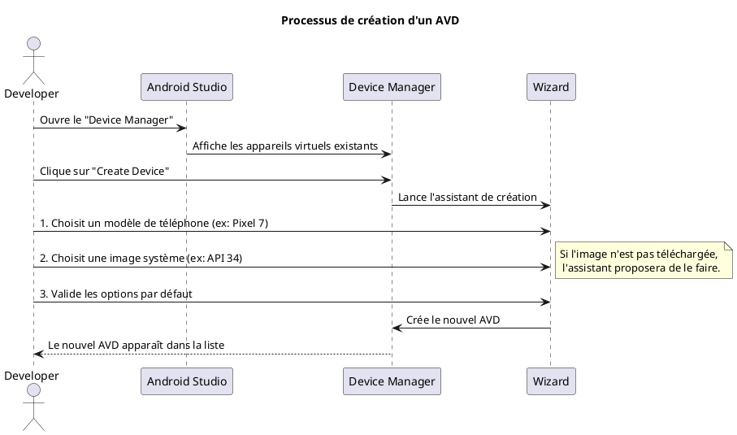

# Module 1 : Mise en Place de l'Environnement

### Objectifs pédagogiques

À la fin de ce module, vous serez capable de :

* Comprendre les concepts clés de l'écosystème Android (OS, versions, API).
* Installer et configurer l'environnement de développement officiel : Android Studio.
* Utiliser le SDK Manager pour télécharger les plateformes et outils nécessaires.
* Créer, configurer et lancer un émulateur Android (AVD).
* (Optionnel) Configurer votre propre téléphone pour le développement.

### Introduction

Pourquoi ce module est-il si important ? Imaginez un chef cuisinier de renommée mondiale. Avant même de penser à sa
recette, il s'assure que sa cuisine est parfaitement préparée : ses couteaux sont aiguisés, son plan de travail est
propre, ses ingrédients sont à portée de main. C'est ce qu'on appelle la "mise en place". Ce module est votre mise en
place. Nous allons préparer notre "cuisine" de développement pour être efficaces, organisés et prêts à créer de superbes
applications. Un environnement bien configuré est la clé pour un développement fluide et sans frustration.

### Notions abordées

* L'écosystème Android
* Installation d'Android Studio
* Configuration du SDK Manager
* Création d'un AVD (Android Virtual Device)
* Configuration d'un appareil physique

---

### L'écosystème Android

#### Introduction à la notion

Pensez à Android non pas comme un seul produit, mais comme une immense ville en constante évolution. Chaque nouvelle
version majeure d'Android (comme Android 12, 13, 14) est comme un nouveau quartier qui se construit, avec des
architectures plus modernes et de nouvelles règles. Votre application, tel un service de livraison, doit savoir dans
quels quartiers elle peut opérer.

#### Explication de la notion

Android est un système d'exploitation mobile basé sur le noyau Linux, principalement développé par Google. Il est open
source, ce qui signifie que n'importe quel fabricant (Samsung, Xiaomi, etc.) peut le modifier pour ses propres
appareils.

Le point le plus important pour nous, développeurs, est le **niveau d'API (API Level)**. C'est un simple numéro entier
qui identifie de manière unique une version du framework Android.

* **`minSdkVersion`** : Le niveau d'API minimum requis pour que votre application puisse s'installer. C'est le plus
  vieux quartier de la ville dans lequel vous acceptez de livrer.
* **`targetSdkVersion`** : Le niveau d'API pour lequel votre application a été testée et optimisée. C'est le quartier le
  plus moderne que vous connaissez parfaitement. Vous devez toujours viser la dernière version stable.

Voici un tableau pour vous donner une idée :

| Nom de code | Version | Niveau d'API |
|-------------|---------|--------------|
| Oreo        | 8.0     | 26           |
| Pie         | 9.0     | 28           |
| Android 10  | 10      | 29           |
| Android 11  | 11      | 30           |
| Android 12  | 12      | 31           |
| Android 13  | 13      | 33           |
| Android 14  | 14      | 34           |

<note>
Choisir un `minSdkVersion` est un compromis. Un niveau bas (ex: API 26) vous permet de toucher plus d'appareils, mais vous oblige à gérer plus de cas de compatibilité. Un niveau haut simplifie le développement mais exclut les utilisateurs de téléphones plus anciens.
</note>

---

### Installation d'Android Studio

#### Introduction à la notion {id="introduction-la-notion_1"}

Android Studio est votre poste de pilotage. C'est un environnement de développement intégré (IDE) qui rassemble tous les
outils dont vous avez besoin en un seul endroit : éditeur de code, concepteur d'interface, débogueur, gestionnaire
d'émulateurs, et bien plus encore. C'est le centre de contrôle de toutes vos opérations.

#### Explication de la notion {id="explication-de-la-notion_1"}

Basé sur le puissant IntelliJ IDEA, Android Studio est l'outil officiel et incontournable pour le développement Android.
Il intègre le système de build Gradle, qui gère la compilation de votre code et de vos ressources, ainsi que les
dépendances (bibliothèques externes).

<procedure title="Installer Android Studio">

1. **Téléchargement :** Rendez-vous sur la page
   officielle : [developer.android.com/studio](https://developer.android.com/studio).
2. **Lancement de l'installeur :** Exécutez le fichier téléchargé et suivez les instructions de l'assistant.
3. **Type d'installation :** Choisissez l'installation "Standard". Elle est parfaite pour commencer et installe les
   composants les plus courants.
4. **Thème :** Choisissez un thème d'interface (clair ou sombre).
5. **Vérification des composants :** L'assistant vous montrera ce qu'il va télécharger (Android SDK, outils, etc.).
   Validez.
6. **Premier lancement :** Une fois l'installation terminée, lancez Android Studio. Vous serez accueilli par un écran de
   bienvenue.

</procedure>

---

### Configuration du SDK Manager

#### Introduction à la notion {id="introduction-la-notion_2"}

Si Android Studio est votre poste de pilotage, le SDK Manager est votre hangar à outils. C'est ici que vous allez
chercher les "kits d'outils" spécifiques à chaque version d'Android. Vous voulez travailler sur la dernière version ?
Vous venez ici chercher le kit correspondant. Besoin d'outils de construction plus récents ? C'est aussi ici que ça se
passe.

#### Explication de la notion {id="explication-de-la-notion_2"}

Le SDK (Software Development Kit) contient toutes les bibliothèques et les outils nécessaires pour développer pour une
plateforme spécifique. Le SDK Manager est l'interface graphique qui vous permet de gérer ces composants.

Il se divise en deux onglets principaux :

* **SDK Platforms :** Contient les frameworks des différentes versions d'Android (API Levels). Vous devez en installer
  au moins un (le dernier est recommandé) pour pouvoir compiler votre application.
* **SDK Tools :** Contient les outils indépendants de la plateforme, comme les outils de build (`Build-Tools`),
  l'émulateur (`Android Emulator`) et le débogueur (`Platform-Tools`).

<procedure title="Utiliser le SDK Manager">

1. **Ouvrir le SDK Manager :** Depuis l'écran de bienvenue, allez dans `Customize > All settings...` puis recherchez "
   SDK" ou, si un projet est ouvert, cliquez sur
   l'icône  dans la barre d'outils.
2. **Installer une plateforme :** Dans l'onglet "SDK Platforms", cochez la dernière version stable d'Android (par
   exemple, "Android 14.0 - Upside Down Cake").
3. **Vérifier les outils :** Allez dans l'onglet "SDK Tools". Assurez-vous que les éléments suivants sont cochés et à
   jour :
    * Android SDK Build-Tools
    * Android Emulator
    * Android SDK Platform-Tools
4. **Appliquer les changements :** Cliquez sur "Apply" ou "OK". Android Studio téléchargera et installera les composants
   manquants.

</procedure>

---

### Création d'un AVD (Android Virtual Device)

#### Introduction à la notion {id="introduction-la-notion_3"}

Un AVD est votre "crash test dummy". C'est un téléphone virtuel qui fonctionne entièrement sur votre ordinateur. Au lieu
d'acheter des dizaines de téléphones pour tester votre application sur différentes tailles d'écran et versions
d'Android, vous pouvez créer autant de "dummies" virtuels que vous le souhaitez. C'est plus rapide, plus pratique et
beaucoup moins cher !

#### Explication de la notion {id="explication-de-la-notion_3"}

Un AVD, ou émulateur, vous permet de simuler un appareil Android. Vous pouvez choisir le matériel (la taille de l'écran,
la mémoire RAM) et la version du système d'exploitation. C'est indispensable pour tester rapidement votre application
pendant le développement.

#### Exercice 1 : Créer son premier émulateur

**Énoncé :**
Créez un nouvel AVD avec les caractéristiques suivantes :

* **Appareil :** Pixel 6
* **Système d'exploitation :** Android 13 (Tiramisu - API 33)

**Correction exercice 1** {collapsible='true'}
<procedure title="Correction">
1.  Dans Android Studio, ouvrez le **Device Manager** (via le menu `Tools > Device Manager` ou l'icône dans la barre d'outils).
2.  Cliquez sur le bouton **"Create Device"**.
3.  Dans la liste "Phone", sélectionnez **"Pixel 6"** et cliquez sur "Next".
4.  Dans la liste des images système, trouvez la ligne correspondant à "Tiramisu" avec un niveau d'API de 33. S'il y a un lien "Download" à côté, cliquez dessus pour télécharger l'image.
5.  Une fois l'image disponible, sélectionnez-la et cliquez sur "Next".
6.  Vous pouvez laisser le nom par défaut. Cliquez sur **"Finish"**.
7.  Votre nouvel AVD "Pixel 6 API 33" devrait maintenant apparaître dans la liste du Device Manager. Vous pouvez le lancer en cliquant sur l'icône de lecture (▶️).
</procedure>
---

### (Optionnel) Configuration d'un appareil physique

#### Introduction à la notion {id="introduction-la-notion_4"}

L'émulateur est fantastique, mais rien ne remplace le "moment de vérité" : tester sur un vrai téléphone. C'est comme un
chef qui goûte enfin le plat qu'il a préparé. Vous ressentez la vraie performance, vous voyez comment les couleurs
s'affichent sur un écran réel, et vous pouvez tester des fonctionnalités comme l'appareil photo ou le GPS qui sont
difficiles à simuler.

#### Explication de la notion {id="explication-de-la-notion_4"}

Pour qu'Android Studio puisse reconnaître votre téléphone et y installer votre application, vous devez activer deux
choses : les options pour les développeurs et le débogage USB.

<warning>
Les options pour les développeurs donnent accès à des réglages avancés. Ne modifiez que ce que vous connaissez.
</warning>

<procedure title="Activer le débogage USB">

1. **Activer les options pour les développeurs :**
    * Allez dans les **Paramètres** de votre téléphone.
    * Allez dans **"À propos du téléphone"**.
    * Trouvez la ligne **"Numéro de build"**.
    * Tapotez cette ligne **7 fois** de suite. Un message "Vous êtes maintenant un développeur !" devrait apparaître.

2. **Activer le débogage USB :**
    * Retournez à l'écran principal des Paramètres.
    * Allez dans **"Système" > "Options pour les développeurs"**.
    * Activez l'option **"Débogage USB"**.

3. **Connecter le téléphone :**
    * Branchez votre téléphone à votre ordinateur avec un câble USB.
    * Une fenêtre pop-up "Autoriser le débogage USB ?" apparaîtra sur votre téléphone. Cochez "Toujours autoriser" et
      validez.

</procedure>

<tip>
Si votre appareil n'est pas reconnu par Android Studio (surtout sur Windows), vous pourriez avoir besoin d'installer des pilotes USB spécifiques fournis par le fabricant de votre téléphone.
</tip>

---

### TP 1 : Préparation de votre station de combat

**Objectif :** Valider que votre environnement est complètement opérationnel.

<procedure>

1. **Vérifier l'installation :** Lancez Android Studio et assurez-vous de voir l'écran de bienvenue.
2. **Vérifier le SDK :** Ouvrez le SDK Manager et confirmez que la dernière plateforme Android (API 34) et les outils
   essentiels (Build-Tools, Platform-Tools, Emulator) sont installés.
3. **Créer un AVD :** Suivez les étapes de l'exercice 1 pour créer un émulateur Pixel 6 avec l'API 33.
4. **Lancer l'AVD :** Depuis le Device Manager, lancez l'émulateur que vous venez de créer. Attendez qu'il démarre
   complètement et que l'écran d'accueil Android s'affiche. Bravo, votre appareil virtuel est fonctionnel !
5. **(Bonus)** **Connecter un appareil réel :** Si vous avez un téléphone Android, suivez les étapes pour activer le
   débogage USB et connectez-le. Vérifiez qu'il apparaît dans la liste des appareils disponibles en haut de la fenêtre
   d'Android Studio (il peut y avoir un menu déroulant affichant votre AVD et, si la connexion est réussie, votre
   téléphone).

</procedure>

---

### Auto-évaluation

Testez vos connaissances avec ces quelques questions.

**1. Qu'est-ce qu'un niveau d'API (API Level) ? (QCM)**

* A) Le numéro de version commercial d'Android (ex: 8.0, 9.0).
* B) Un numéro entier qui identifie de manière unique la version du framework Android.
* C) Le niveau de difficulté pour développer sur une version d'Android.
* D) La version d'Android Studio.

**2. Quel est le rôle de l'AVD Manager (ou Device Manager) ? (QCM)**

* A) Gérer les versions du SDK Android.
* B) Gérer les téléphones virtuels (émulateurs).
* C) Gérer les bibliothèques de votre projet.
* D) Gérer les thèmes de l'éditeur de code.

**3. Si vous souhaitez prendre en charge des téléphones très anciens, quelle propriété de votre projet devez-vous
ajuster ? (QCM)**

* A) `targetSdkVersion`
* B) `compileSdkVersion`
* C) `minSdkVersion`
* D) `applicationId`

**4. Pourquoi est-il quand même important de tester son application sur un appareil physique ? (Question ouverte)**

**5. Citez les deux étapes principales à réaliser sur un téléphone Android pour permettre à Android Studio de s'y
connecter. (Question ouverte)**

### Correction de l'auto-évaluation {collapsible="true"}

**1. Qu'est-ce qu'un niveau d'API (API Level) ?**

* **Réponse : B) Un numéro entier qui identifie de manière unique la version du framework Android.**
* **Justification :** Chaque version d'Android (Oreo, Pie, etc.) correspond à un numéro d'API unique (26, 28, etc.).
  C'est cette référence numérique que nous utilisons dans la configuration de nos projets.

**2. Quel est le rôle de l'AVD Manager (ou Device Manager) ?**

* **Réponse : B) Gérer les téléphones virtuels (émulateurs).**
* **Justification :** L'AVD Manager est l'outil spécifique pour créer, modifier, supprimer et lancer des Android Virtual
  Devices. Le SDK Manager gère les versions du SDK.

**3. Si vous souhaitez prendre en charge des téléphones très anciens, quelle propriété de votre projet devez-vous
ajuster ?**

* **Réponse : C) `minSdkVersion`**
* **Justification :** `minSdkVersion` définit la version minimale d'Android requise pour installer votre application.
  Abaisser cette valeur permet à des appareils plus anciens de l'utiliser.

**4. Pourquoi est-il quand même important de tester son application sur un appareil physique ?**

* **Réponse type :** Il est important de tester sur un appareil physique car un émulateur ne peut pas simuler
  parfaitement les conditions réelles. Cela permet de vérifier les performances réelles de l'application, le rendu des
  couleurs et des polices sur un écran spécifique, le comportement des capteurs (GPS, accéléromètre, appareil photo), et
  l'impact sur la batterie. C'est l'épreuve finale pour garantir une bonne expérience utilisateur.

**5. Citez les deux étapes principales à réaliser sur un téléphone Android pour permettre à Android Studio de s'y
connecter.**

* **Réponse type :**
    1. Activer les "Options pour les développeurs" en tapotant 7 fois sur le "Numéro de build" dans les paramètres.
    2. Dans ces "Options pour les développeurs", activer le "Débogage USB".

---

### Conclusion du module

Félicitations ! Votre atelier de développement est maintenant entièrement équipé et prêt à l'emploi. Vous avez installé
l'IDE, vous savez comment gérer les différents kits d'outils Android avec le SDK Manager et, surtout, vous pouvez lancer
un appareil (virtuel ou physique) pour tester votre travail.

Ce sont des compétences fondamentales que vous utiliserez quotidiennement. Avoir un environnement stable et bien compris
vous fera gagner un temps précieux.

Maintenant que la "mise en place" est terminée, il est temps de commencer à cuisiner ! Dans le prochain module, nous
allons retrousser nos manches, créer notre tout premier projet Android, et enfin écrire nos premières lignes de code.
Préparez-vous à dire "Bonjour, le monde !" à votre nouvelle application.