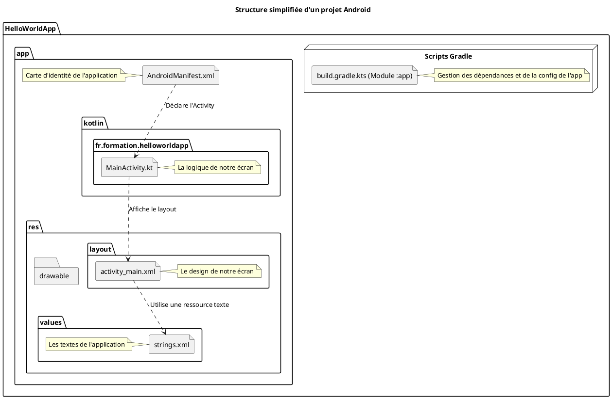
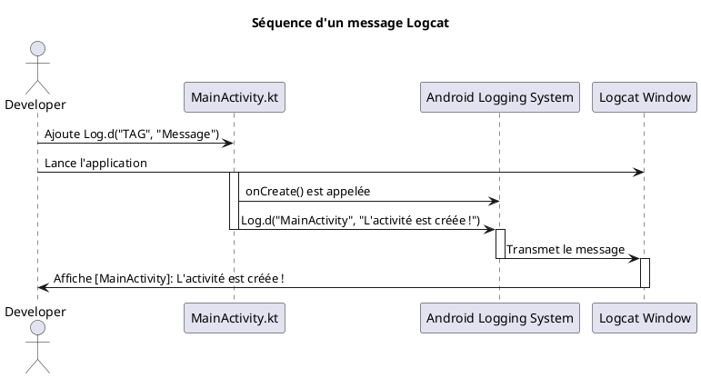

Parfait, continuons sur notre lancée ! Maintenant que notre atelier est prêt, il est temps de dessiner les premiers
plans et de poser la toute première brique de notre édifice.

Voici le deuxième module.

---

# Module 2 : Votre Première Application Android

### Objectifs pédagogiques

À la fin de ce module, vous serez capable de :

* Créer un nouveau projet Android avec Android Studio.
* Identifier le rôle de chaque fichier et dossier majeur dans un projet.
* Comprendre le lien fondamental entre le code Kotlin (`.kt`) et les fichiers de mise en page XML (`.xml`).
* Lancer votre application sur un émulateur ou un appareil physique.
* Utiliser l'outil de débogage essentiel : le Logcat.

### Introduction

Vous souvenez-vous de la première fois que vous avez allumé un ordinateur et affiché "Hello, World!" à l'écran ? C'était
un moment magique, la preuve que vous pouviez communiquer avec la machine. Ce module a le même objectif. Créer une
application "Hello, World!" sur Android n'est pas juste une tradition. C'est le test ultime pour s'assurer que toute la
chaîne de production fonctionne : votre IDE, le compilateur, l'émulateur et le système d'exploitation Android lui-même.
C'est l'étincelle qui donne vie à votre projet. Nous allons décortiquer cette première application pour comprendre ses
plans, ses fondations et sa structure. Préparez-vous à ce premier moment magique !

### Notions abordées

* Création d'un projet "Hello World!"
* Anatomie d'un projet Android
* Lancement de l'application
* Le Logcat : votre premier outil de débogage

---

### Création d'un projet "Hello World!"

#### Introduction à la notion

Imaginez que vous demandez à un assistant de vous préparer un kit de démarrage pour construire une petite cabane. Vous
lui donnez quelques informations de base (le nom du projet, l'endroit où le stocker) et il vous fournit un ensemble de
plans et de matériaux pré-assemblés. L'assistant de création de projet d'Android Studio joue exactement ce rôle : il
vous évite de commencer avec une feuille blanche et vous donne une structure saine et fonctionnelle.

#### Explication de la notion

Android Studio propose des modèles (*templates*) pour accélérer la création de projets. Pour nos débuts, le modèle **"
Empty Views Activity"** (ou "Activité Vide avec Vues") est parfait. Il crée une application minimale avec un seul écran,
ce qui est idéal pour comprendre les bases.

<procedure title="Créer un nouveau projet">

1. Depuis l'écran de bienvenue d'Android Studio, cliquez sur **"New Project"**.
2. Dans la section "Phone and Tablet", sélectionnez **"Empty Views Activity"** et cliquez sur "Next".
3. Vous arrivez sur l'écran de configuration. Remplissez les champs suivants :
    * **Name:** `HelloWorldApp`. C'est le nom de votre application tel qu'il apparaîtra à l'utilisateur.
    * **Package name:** `fr.formation.helloworldapp`. C'est l'identifiant unique de votre application sur le Google Play
      Store. Il est conventionnellement en format de nom de domaine inversé.
    * **Save location:** Choisissez un dossier sur votre ordinateur où enregistrer le projet.
    * **Language:** Assurez-vous que **Kotlin** est sélectionné. C'est le langage moderne que nous utiliserons.
    * **Minimum SDK:** Sélectionnez un niveau d'API, par exemple **API 26: Android 8.0 (Oreo)**. Cela définit la version
      minimale d'Android requise.
4. Cliquez sur **"Finish"**. Android Studio va maintenant préparer votre projet. Cela peut prendre un peu de temps la
   première fois, car il télécharge des outils (comme Gradle).

</procedure>

<tip>
La première synchronisation Gradle peut être longue. Surveillez la barre d'état en bas de la fenêtre d'Android Studio. Attendez qu'elle indique "Gradle sync finished" avant de continuer.
</tip>

---

### Anatomie d'un projet Android

#### Introduction à la notion {id="introduction-la-notion_1"}

Votre projet fraîchement créé est comme une boîte à outils parfaitement organisée. Chaque tiroir et chaque compartiment
a un but précis. Il y a un tiroir pour les plans (`AndroidManifest.xml`), un pour les instructions (`kotlin`), un pour
les matériaux de construction (`res`), et un pour la liste des fournisseurs (`build.gradle`). Comprendre cette
organisation est la clé pour ne jamais se perdre et travailler efficacement.

#### Explication de la notion {id="explication-de-la-notion_1"}

Dans le volet de gauche d'Android Studio (la vue "Project"), assurez-vous que le menu déroulant est bien sur **"Android"
**. Cela vous donne une vue simplifiée et logique des fichiers importants.



**1. `AndroidManifest.xml` : La carte d'identité**

Ce fichier est la première chose que le système Android lit. Il décrit les informations essentielles de votre
application :

* Son nom et son icône.
* Ses composants (écrans, services en arrière-plan...).
* Les permissions dont elle a besoin (accès à internet, à la caméra, etc.).

```xml
<!-- Fichier : app/src/main/AndroidManifest.xml -->

<manifest xmlns:android="http://schemas.android.com/apk/res/android"
          xmlns:tools="http://schemas.android.com/tools">

    <application
            android:allowBackup="true"
            android:icon="@mipmap/ic_launcher"
            android:label="@string/app_name"
            android:roundIcon="@mipmap/ic_launcher_round"
            android:supportsRtl="true"
            android:theme="@style/Theme.HelloWorldApp"
            tools:targetApi="31">

        <!-- Déclaration de notre unique écran (Activity) -->
        <activity
                android:name=".MainActivity"
                android:exported="true">
            <intent-filter>
                <!-- Indique que c'est l'activité principale... -->
                <action android:name="android.intent.action.MAIN"/>
                <!-- ...et qu'elle doit apparaître dans le lanceur d'apps. -->
                <category android:name="android.intent.category.LAUNCHER"/>
            </intent-filter>
        </activity>
    </application>

</manifest>
```

**2. Dossier `kotlin` : Le cerveau**

C'est ici que vit votre code logique. Par défaut, vous y trouverez `MainActivity.kt`. Une **Activity** représente un
seul écran de votre application. Ce fichier contrôle le comportement de cet écran.

```kotlin
// Fichier : app/src/main/java/fr/formation/helloworldapp/MainActivity.kt

package fr.formation.helloworldapp // Déclaration du package

// Imports des classes nécessaires du framework Android
import androidx.appcompat.app.AppCompatActivity
import android.os.Bundle

// Notre classe MainActivity hérite de AppCompatActivity, la classe de base
// pour les activités qui veulent utiliser les fonctionnalités modernes.
class MainActivity : AppCompatActivity() {

    // Cette méthode est appelée lorsque l'activité est créée.
    // C'est ici que l'on fait la configuration initiale.
    override fun onCreate(savedInstanceState: Bundle?) {
        super.onCreate(savedInstanceState) // Appel à la méthode parente

        // C'est la ligne la plus importante !
        // Elle dit à l'activité d'afficher l'interface utilisateur
        // définie dans le fichier res/layout/activity_main.xml
        setContentView(R.layout.activity_main)
    }
}
```

**3. Dossier `res` (Ressources) : Le coffre à matériaux**

Ce dossier contient tout ce qui n'est pas du code Kotlin :

* `res/layout/activity_main.xml` : La description **visuelle** de votre écran. C'est du XML qui définit les boutons,
  textes, images, etc.
* `res/values/strings.xml` : Le fichier pour centraliser tous les textes de votre application. C'est une **bonne
  pratique** pour faciliter la traduction et la maintenance.
* `res/values/colors.xml` : Pour définir les couleurs de votre application.
* `res/drawable` : Pour stocker vos images et icônes.

```xml
<!-- Fichier : app/src/main/res/layout/activity_main.xml -->

<androidx.constraintlayout.widget.ConstraintLayout
        xmlns:android="http://schemas.android.com/apk/res/android"
        xmlns:app="http://schemas.android.com/apk/res-auto"
        xmlns:tools="http://schemas.android.com/tools"
        android:layout_width="match_parent"
        android:layout_height="match_parent"
        tools:context=".MainActivity">

    <TextView
            android:layout_width="wrap_content"
            android:layout_height="wrap_content"
            android:text="Hello World!" <!-- Le texte affiché -->
    app:layout_constraintBottom_toBottomOf="parent"
    app:layout_constraintEnd_toEndOf="parent"
    app:layout_constraintStart_toStartOf="parent"
    app:layout_constraintTop_toTopOf="parent" />

</androidx.constraintlayout.widget.ConstraintLayout>
```

**4. Scripts Gradle (`build.gradle.kts`) : Le gestionnaire de construction**

Ces fichiers définissent comment votre application est construite. Le plus important est
`build.gradle.kts (Module :app)`. Il contient :

* Le `minSdkVersion` et le `targetSdkVersion`.
* La liste des **dépendances** : les bibliothèques externes que votre projet utilise.

#### Exercice 1 : Modifier le message d'accueil

**Énoncé :**
Votre mission est de changer le texte "Hello World!" par "Bonjour le monde !". Attention, vous ne devez **pas** modifier
le fichier `activity_main.xml` directement. Vous devez utiliser le système de ressources.

**Correction exercice 1** {collapsible='true'}
<procedure title="Correction">
1.  Dans l'explorateur de projet, ouvrez le dossier `res > values`.
2.  Double-cliquez sur le fichier `strings.xml` pour l'ouvrir.
3.  Vous verrez une ligne comme celle-ci :
    ```xml
    <resources>
        <string name="app_name">HelloWorldApp</string>
    </resources>
    ```
4.  Dans le fichier `activity_main.xml`, le `TextView` a son texte écrit en dur : `android:text="Hello World!"`. Nous allons changer cela.
5.  D'abord, ajoutez une nouvelle chaîne de caractères dans `strings.xml` :
    ```xml
    <resources>
        <string name="app_name">HelloWorldApp</string>
        <string name="welcome_message">Bonjour le monde !</string>
    </resources>
    ```
6.  Ensuite, retournez dans `activity_main.xml`. Remplacez l'attribut `android:text` du `TextView` par une référence à votre nouvelle ressource :

```xml
    <TextView
        android:layout_width="wrap_content"
        android:layout_height="wrap_content"
        android:text="@string/welcome_message" <!-- On utilise la ressource -->
        app:layout_constraintBottom_toBottomOf="parent"
        app:layout_constraintEnd_toEndOf="parent"
        app:layout_constraintStart_toStartOf="parent"
        app:layout_constraintTop_toTopOf="parent" />
```

8. En faisant cela, vous avez respecté la bonne pratique de séparation des textes et de l'interface.
</procedure>

---

### Lancement de l'application

#### Introduction à la notion {id="introduction-la-notion_2"}

Maintenant que les plans sont prêts et les matériaux en place, il est temps de lancer la construction et de livrer le
produit fini sur le terrain (votre émulateur ou téléphone). Lancer l'application, c'est appuyer sur le "gros bouton
vert" qui dit à Android Studio : "Compile tout ça et montre-moi le résultat !".

#### Explication de la notion {id="explication-de-la-notion_2"}

En haut de la fenêtre d'Android Studio, vous trouverez une barre d'outils avec les contrôles principaux :

1. **Le sélecteur d'appareil :** Un menu déroulant qui liste tous vos AVD et appareils physiques connectés.
2. **Le bouton Run (▶️) :** Compile et installe l'application sur l'appareil sélectionné.
3. **Le bouton Debug (🐞) :** Fait la même chose, mais attache le débogueur pour vous permettre de mettre des points
   d'arrêt et d'inspecter votre code pas à pas.

<procedure title="Lancer l'application">

1. Assurez-vous que l'émulateur que vous avez créé au module 1 est en cours d'exécution, ou que votre téléphone est bien
   connecté.
2. Sélectionnez votre appareil cible dans le menu déroulant.
3. Cliquez sur le bouton vert **"Run 'app'"** (▶️).
4. Android Studio va compiler votre projet. Vous pouvez voir la progression dans la barre d'état en bas.
5. Une fois terminé, l'application se lancera automatiquement sur votre appareil et vous devriez voir votre message "
   Bonjour le monde !".

</procedure>

---

### Le Logcat

#### Introduction à la notion {id="introduction-la-notion_3"}

Le Logcat est votre talkie-walkie branché sur les communications internes de votre application. Quand vous lancez votre
app, elle commence à "parler". Elle dit "Je me lance", "Je crée cet écran", etc. Le système Android parle aussi. Le
Logcat vous permet d'écouter toutes ces conversations en temps réel et, surtout, d'envoyer vos propres messages pour
suivre ce que fait votre code. C'est l'outil de débogage le plus simple et le plus indispensable.

#### Explication de la notion {id="explication-de-la-notion_3"}

La fenêtre Logcat est accessible via l'onglet en bas d'Android Studio. Elle affiche un flux de messages provenant de
votre appareil. Pour ne pas être submergé, vous pouvez filtrer les messages pour n'afficher que ceux de votre
application.

Pour écrire dans le Logcat depuis votre code, vous utilisez la classe `Log`. Elle propose plusieurs niveaux de
messages :

* `Log.v()` (Verbose)
* `Log.d()` (Debug)
* `Log.i()` (Info)
* `Log.w()` (Warning)
* `Log.e()` (Error)

En développement, on utilise très souvent `Log.d()` pour tracer le déroulement du code.



#### Exercice 2 : Laisser une trace dans le Logcat

**Énoncé :**
Modifiez le fichier `MainActivity.kt` pour ajouter un message de debug dans la méthode `onCreate`. Le message doit
être "L'application HelloWorldApp a démarré !".

**Correction exercice 2** {collapsible='true'}
<procedure title="Correction">

1.  Ouvrez le fichier `MainActivity.kt`.

2. Importez la classe `Log` en ajoutant cette ligne en haut du fichier, avec les autres imports :
    
```kotlin
    import android.util.Log
```

3. Dans la méthode `onCreate`, après l'appel à `super.onCreate(savedInstanceState)`, ajoutez la ligne suivante :
    ```kotlin
    Log.d("MainActivity", "L'application HelloWorldApp a démarré !")
    ```
    Le premier paramètre, `"MainActivity"`, est un "TAG". Il sert à filtrer et identifier facilement l'origine du message.

4. Votre méthode `onCreate` devrait maintenant ressembler à ça :
    ```kotlin
    override fun onCreate(savedInstanceState: Bundle?) {
        super.onCreate(savedInstanceState)

        // Notre message de log personnalisé
        Log.d("MainActivity", "L'application HelloWorldApp a démarré !")

        setContentView(R.layout.activity_main)
    }
    ```

5. Lancez à nouveau l'application (▶️).
6. Ouvrez l'onglet **Logcat** en bas d'Android Studio.
7. Dans la barre de recherche du Logcat, tapez `MainActivity` pour filtrer par TAG.
8. Vous devriez voir votre message s'afficher clairement.

</procedure>

---

### TP 2 : Du "Hello World" à une application personnalisée

**Objectif :** Utiliser toutes les notions vues pour personnaliser entièrement votre première application.

<procedure>

1. **Créez un nouveau projet** nommé `MonAppDeBienvenue`.
2. **Modifiez le nom de l'application :** Allez dans `res/values/strings.xml` et changez la valeur de `app_name` pour "
   Ma Super App".
3. **Créez une nouvelle ressource de texte :** Dans ce même fichier, ajoutez une nouvelle string nommée `welcome_text`
   avec la valeur "Bienvenue dans ma première application, [Votre Nom]". Remplacez `[Votre Nom]` par votre prénom.
4. **Liez ce texte à l'interface :** Ouvrez `res/layout/activity_main.xml`. Modifiez le `TextView` pour qu'il utilise
   votre nouvelle ressource de texte `@string/welcome_text`.
5. **Ajoutez un message de log :** Ouvrez `MainActivity.kt`. Dans la méthode `onCreate`, ajoutez un `Log.d` avec le
   TAG "MonApp" et le message "L'écran principal s'est chargé.".
6. **Lancez l'application :**
    * Vérifiez que le titre de l'application (dans la barre en haut) est bien "Ma Super App".
    * Vérifiez que le texte affiché à l'écran contient bien votre nom.
    * Ouvrez le Logcat, filtrez par le TAG "MonApp", et confirmez que votre message est bien présent.

</procedure>

---

### Auto-évaluation

**1. Quel est le rôle principal du fichier `AndroidManifest.xml` ? (QCM)**

* A) Définir l'apparence visuelle de l'application.
* B) Contenir la logique de programmation en Kotlin.
* C) Décrire les informations essentielles de l'application pour le système Android.
* D) Lister les bibliothèques externes utilisées par le projet.

**2. Comment lie-t-on un fichier de layout XML à une Activity en Kotlin ? (QCM)**

* A) En utilisant la fonction `showLayout(R.id.my_layout)`.
* B) En ajoutant un attribut `android:activity=".MainActivity"` dans le XML.
* C) En utilisant la fonction `setContentView(R.layout.activity_main)`.
* D) En important simplement le fichier XML dans le fichier Kotlin.

**3. Où est le meilleur endroit pour définir une couleur qui sera utilisée à plusieurs endroits dans votre
application ? (QCM)**

* A) Directement dans le fichier `activity_main.xml`.
* B) Dans une variable globale dans `MainActivity.kt`.
* C) Dans le fichier `res/values/colors.xml`.
* D) Dans le fichier `build.gradle.kts`.

**4. Expliquez avec vos mots l'intérêt de mettre les textes (comme "Bonjour le monde !") dans `strings.xml` plutôt que
directement dans le fichier de layout. (Question ouverte)**

**5. Quel est le but du Logcat et quelle ligne de code utiliseriez-vous pour afficher un message de débogage simple avec
le tag "MyScreen" ? (Question ouverte)**

### Correction de l'auto-évaluation {collapsible="true"}

**1. Quel est le rôle principal du fichier `AndroidManifest.xml` ?**

* **Réponse : C) Décrire les informations essentielles de l'application pour le système Android.**
* **Justification :** Le manifest est la "carte d'identité" de l'application. Il déclare ses composants, ses
  permissions, etc., pour que le système d'exploitation sache comment l'exécuter.

**2. Comment lie-t-on un fichier de layout XML à une Activity en Kotlin ?**

* **Réponse : C) En utilisant la fonction `setContentView(R.layout.activity_main)`.**
* **Justification :** C'est la fonction appelée dans `onCreate` qui "gonfle" (inflate) le layout XML et l'affiche à l'
  écran, le liant ainsi à l'Activity. `R` est une classe générée automatiquement qui contient les identifiants de toutes
  vos ressources.

**3. Où est le meilleur endroit pour définir une couleur qui sera utilisée à plusieurs endroits dans votre application ?
**

* **Réponse : C) Dans le fichier `res/values/colors.xml`.**
* **Justification :** Le dossier `res/values` est fait pour centraliser les ressources. Définir une couleur dans
  `colors.xml` vous permet de la réutiliser partout et de la changer en un seul endroit.

**4. Expliquez avec vos mots l'intérêt de mettre les textes (comme "Bonjour le monde !") dans `strings.xml` plutôt que
directement dans le fichier de layout.**

* **Réponse type :** Centraliser les textes dans `strings.xml` a deux avantages majeurs. Premièrement, cela facilite la
  **traduction** (internationalisation) : il suffit de fournir un fichier `strings.xml` différent pour chaque langue.
  Deuxièmement, cela améliore la **maintenance** : si un texte doit être modifié, on le change à un seul endroit, même
  s'il est utilisé sur plusieurs écrans.

**5. Quel est le but du Logcat et quelle ligne de code utiliseriez-vous pour afficher un message de débogage simple avec
le tag "MyScreen" ?**

* **Réponse type :** Le Logcat est un outil qui affiche en temps réel les messages système et les messages que nous
  émettons depuis notre application. Son but principal est le **débogage** : suivre le déroulement du code, afficher des
  valeurs de variables, et repérer les erreurs. La ligne de code serait :
  `Log.d("MyScreen", "Mon message de débogage ici")`.

---

### Conclusion du module

Bravo ! Vous avez franchi une étape majeure. Vous n'avez pas seulement créé une application, vous en avez disséqué la
structure. Vous savez maintenant où se trouvent les plans, la logique, et les matériaux de construction. Vous savez
comment lancer le projet et, plus important encore, comment l'écouter parler grâce au Logcat.

Cette structure de projet est la base de **toutes** les applications Android que vous construirez. La maîtriser dès
maintenant vous rendra incroyablement plus efficace pour la suite.

Maintenant que nous avons les fondations, il est temps d'apprendre le langage des bâtisseurs : le Kotlin. Dans le
prochain module, nous allons nous plonger dans la syntaxe et les concepts clés de Kotlin qui feront de vous un
développeur Android moderne et efficace.