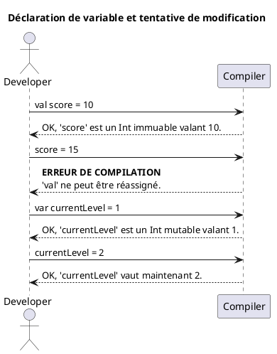
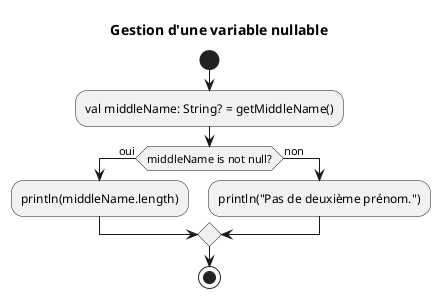
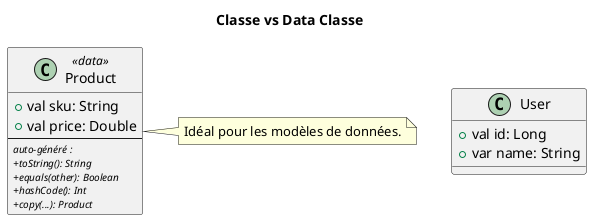

# Module 3 : Les Bases de Kotlin pour Android

### Objectifs pédagogiques

À la fin de ce module, vous serez capable de :

* Différencier et utiliser correctement les variables mutables (`var`) et immuables (`val`).
* Comprendre et mettre en pratique le principe de "null-safety" pour écrire du code plus sûr.
* Utiliser les opérateurs de gestion du null (`?.`, `?:`, `!!`).
* Définir et utiliser des classes, et notamment les très pratiques `data class`.
* Étendre les fonctionnalités de classes existantes avec les fonctions d'extension.

### Introduction

Imaginez que pendant des années, les architectes ont utilisé un ensemble d'outils lourds, parfois imprécis, qui
pouvaient causer des accidents (une poutre qui tombe, une mesure incorrecte). Et soudain, on leur fournit une nouvelle
trousse à outils : plus légère, plus précise, avec des sécurités intégrées qui empêchent les erreurs les plus courantes.
Le passage de Java à Kotlin pour le développement Android, c'est exactement ça.

Kotlin n'est pas juste un nouveau langage ; c'est un meilleur outil. Il a été conçu pour être plus sûr, plus concis et
plus agréable à écrire que son prédécesseur. Apprendre ces quelques concepts de base, ce n'est pas juste apprendre une
nouvelle syntaxe, c'est adopter une nouvelle façon de penser qui vous fera gagner un temps fou et vous évitera d'
innombrables bugs, notamment le fameux `NullPointerException`, le cauchemar de tout développeur Android.

### Notions abordées

* Variables et Types : `val` vs `var`
* La Sécurité Anti-Null (Null-Safety)
* Structures de base : classes et `data class`
* Fonctions d'extension

---

### Variables et Types : `val` vs `var`

#### Introduction à la notion

Pensez à la manière dont vous stockez des informations. Certaines sont gravées dans la pierre, comme votre date de
naissance. D'autres sont écrites sur un tableau blanc, comme le score d'un match en cours. En Kotlin, `val` est votre
burin pour graver dans la pierre, et `var` est votre feutre pour écrire sur le tableau blanc.

#### Explication de la notion

En Kotlin, toute variable doit être déclarée avec l'un de ces deux mots-clés :

* **`val`** (pour *value*) : déclare une variable **immuable** (lecture seule). Une fois que vous lui avez assigné une
  valeur, vous ne pouvez plus la changer. C'est l'équivalent du `final` en Java.
* **`var`** (pour *variable*) : déclare une variable **mutable**. Vous pouvez changer sa valeur autant de fois que vous
  le souhaitez.

**Bonne pratique :** Privilégiez toujours `val` par défaut. N'utilisez `var` que si vous savez que la valeur de la
variable doit absolument changer au cours du temps. Cela rend votre code plus prévisible et moins sujet aux erreurs.

Kotlin dispose également de **l'inférence de type** : si vous assignez une valeur directement, vous n'avez pas besoin de
préciser le type de la variable, le compilateur le devine pour vous.



#### Exemple de code

```kotlin
package fr.formation.kotlinbases

fun main() {
    // Déclaration d'une variable immuable (lecture seule)
    // Le type String est inféré par le compilateur.
    val appName = "Ma Super App"
    println("Nom de l'app : $appName")

    // La ligne suivante produirait une erreur de compilation si on la décommentait
    // appName = "Une autre App" // Erreur: Val cannot be reassigned

    // Déclaration d'une variable mutable
    // Le type Int est inféré.
    var userScore = 0
    println("Score initial : $userScore")

    // On peut modifier la valeur d'une 'var'
    userScore = 100
    println("Score après la partie : $userScore")

    // Déclaration explicite du type (parfois nécessaire)
    val appVersion: Double = 1.0
    println("Version de l'app : $appVersion")
}
```

#### Exercice 1 : Gestion de profil utilisateur

**Énoncé :**
Déclarez les variables nécessaires pour stocker les informations d'un utilisateur : son identifiant unique (qui ne
change jamais), son nom d'utilisateur (qui peut changer), et son nombre de connexions (qui va augmenter). Choisissez
judicieusement entre `val` et `var`.

##### **Correction exercice 1** {collapsible='true'}

```kotlin
package fr.formation.kotlinbases

fun main() {
    // L'ID utilisateur est unique et ne changera jamais. On utilise 'val'.
    val userId = "ID-12345-XYZ"

    // Le nom d'utilisateur peut être modifié par l'utilisateur. On utilise 'var'.
    var username = "PlayerOne"

    // Le nombre de connexions va augmenter à chaque nouvelle session.
    // On utilise donc 'var'.
    var loginCount = 0

    println("Utilisateur $username (ID: $userId) s'est connecté.")
    loginCount = loginCount + 1 // ou loginCount++

    println("Changement de pseudo...")
    username = "SuperPlayer"

    println("Utilisateur $username s'est reconnecté.")
    loginCount++

    println("Nombre total de connexions : $loginCount")
}
```

---

### La Sécurité Anti-Null (Null-Safety)

#### Introduction à la notion {id="introduction-la-notion_1"}

Imaginez que vous commandez un colis. Parfois, vous êtes certain qu'il y a quelque chose dedans. D'autres fois, il y a
une chance que la boîte soit vide. En Java, vous deviez toujours ouvrir le colis en espérant qu'il ne soit pas vide. Si
c'était le cas, "CRASH" ! (`NullPointerException`).

Kotlin agit comme un service de livraison intelligent. Si un colis *peut* être vide, il y colle une grosse étiquette "?"
et vous **oblige** à vérifier son contenu avant de l'ouvrir. C'est ça, la null-safety.

#### Explication de la notion {id="explication-de-la-notion_1"}

En Kotlin, par défaut, une variable ne peut pas être `null`. Le compilateur l'interdit.

```kotlin
var name: String = "Toto"
name = null // ERREUR DE COMPILATION !
```

Pour autoriser une variable à être `null`, vous devez le déclarer explicitement en ajoutant un `?` au type.

```kotlin
var nullableName: String? = "Toto"
nullableName = null // C'est autorisé !
```

Maintenant, comment utiliser cette variable `nullableName` en toute sécurité ?

1. **L'opérateur d'appel sécurisé `?.` (Safe Call)**
   Il exécute l'action uniquement si la variable n'est pas `null`. Sinon, il ne fait rien et renvoie `null`.

   `nullableName?.length` // Renvoie la longueur si non-null, sinon renvoie null.

2. **L'opérateur Elvis `?:`**
   Il vous permet de fournir une valeur par défaut si la variable est `null`.

   `val nameLength = nullableName?.length ?: 0` // Si nullableName est null, length est 0.

3. **Le bloc `let`**
   Exécute un bloc de code uniquement si la variable n'est pas `null`.

   `nullableName?.let { name -> println("Le nom est $name") }`

4. **L'opérateur d'assertion non-nulle `!!` (À ÉVITER)**
   Il dit au compilateur : "Je te promets que cette variable n'est pas nulle". Si vous vous trompez, votre application
   plantera avec un `NullPointerException`. Utilisez-le uniquement si vous êtes absolument certain.



#### Exemple de code {id="exemple-de-code_1"}

```kotlin
package fr.formation.kotlinbases

// Fonction qui peut retourner un nom ou rien du tout (null)
fun findUserById(id: Int): String? {
    return if (id == 1) "Alice" else null
}

fun main() {
    val user1 = findUserById(1)
    val user2 = findUserById(2)

    // --- Utilisation avec l'opérateur Safe Call ?. ---
    println("Longueur du nom de user1 : ${user1?.length}") // Affiche 5
    println("Longueur du nom de user2 : ${user2?.length}") // Affiche null

    // --- Utilisation avec l'opérateur Elvis ?: ---
    val length1 = user1?.length ?: 0
    val length2 = user2?.length ?: 0
    println("Longueur (sécurisée) de user1 : $length1") // Affiche 5
    println("Longueur (sécurisée) de user2 : $length2") // Affiche 0

    // --- Utilisation avec le bloc let ---
    // Ce bloc ne s'exécute que pour user1 car il n'est pas null
    user1?.let { name ->
        println("Bienvenue, $name !")
    }

    user2?.let { name ->
        // Cette ligne ne sera jamais affichée
        println("Bienvenue, $name !")
    }
}
```

#### Exercice 2 : Afficher un profil optionnel

**Énoncé :**
Écrivez une fonction `displayProfile(username: String, bio: String?)` qui affiche le nom d'utilisateur et sa biographie.
Si la biographie est `null`, la fonction doit afficher "Cet utilisateur n'a pas de biographie.".

##### **Correction exercice 2** {collapsible='true'}

```kotlin
package fr.formation.kotlinbases

fun displayProfile(username: String, bio: String?) {
    println("Profil de : $username")

    // On utilise l'opérateur Elvis pour fournir une valeur par défaut.
    val bioToDisplay = bio ?: "Cet utilisateur n'a pas de biographie."

    println("Bio : $bioToDisplay")
    println("--------------------")
}

fun main() {
    val userWithBio = "Alice"
    val bioContent = "Développeuse Android et fan de Kotlin."
    displayProfile(userWithBio, bioContent)

    val userWithoutBio = "Bob"
    displayProfile(userWithoutBio, null)
}
```

---

### Structures de base : classes et `data class`

#### Introduction à la notion {id="introduction-la-notion_2"}

Une `class` est le plan de fabrication d'un objet complexe, comme une voiture. Elle définit ce que la voiture *a* (des
roues, une couleur) et ce qu'elle *fait* (accélérer, freiner).
Une `data class` est un type de plan spécialisé. C'est le plan d'un conteneur dont le seul but est de **transporter des
données**, comme une boîte de déménagement. Kotlin vous offre ce plan "spécial conteneur" avec plein de fonctionnalités
pratiques déjà incluses, pour que vous n'ayez pas à les réinventer.

#### Explication de la notion {id="explication-de-la-notion_2"}

Une **classe** classique en Kotlin se déclare simplement :

```kotlin
class Car(val brand: String, var speed: Int) {
    fun accelerate() {
        speed += 10
    }
}
```

Une **`data class`** est optimisée pour les classes qui ne servent qu'à contenir des données. Elle génère
automatiquement pour vous :

* `equals()` / `hashCode()` : pour comparer deux instances.
* `toString()` : pour un affichage lisible des propriétés.
* `copy()` : pour créer une copie d'un objet en modifiant certaines de ses propriétés.

C'est extrêmement utile en Android pour représenter les objets que vous recevez d'une API ou que vous stockez en base de
données.



#### Exemple de code {id="exemple-de-code_2"}

```kotlin
package fr.formation.kotlinbases

// Déclaration d'une data class pour représenter un livre
data class Book(
    val title: String,
    val author: String,
    val publicationYear: Int
)

fun main() {
    val book1 = Book(
        "Dune",
        "Frank Herbert",
        1965
    )

    val book2 = Book(
        "Dune",
        "Frank Herbert",
        1965
    )

    // 1. Affichage lisible grâce au toString() auto-généré
    println(book1)
    // Affiche: Book(title=Dune, author=Frank Herbert, publicationYear=1965)

    // 2. Comparaison intelligente grâce au equals() auto-généré
    println("Les livres sont-ils identiques ? ${book1 == book2}") // Affiche: true

    // 3. Copie facile avec modification grâce à copy()
    val updatedBook = book1.copy(publicationYear = 2021) // Copie du livre 1 avec une nouvelle date
    println(updatedBook)
    // Affiche: Book(title=Dune, author=Frank Herbert, publicationYear=2021)
}
```

#### Exercice 3 : Modèle de données pour une application musicale

**Énoncé :**
Créez une `data class` nommée `Song` pour représenter une chanson avec un titre, un artiste et une durée en secondes (un
entier). Ensuite, créez une instance de cette classe et une copie de cette instance représentant un "remix" par un autre
artiste.

##### **Correction exercice 3** {collapsible='true'}

```kotlin
package fr.formation.kotlinbases

data class Song(
    val title: String,
    val artist: String,
    val durationInSeconds: Int
)

fun main() {
    // Création de l'instance originale
    val originalSong = Song(
        "Strobe",
        "deadmau5",
        635
    )

    println("Chanson originale : $originalSong")

    // Création d'une copie pour le remix
    // On change le titre et l'artiste, mais on garde la durée.
    val remixSong = originalSong.copy(
        title = "Strobe (Remix)",
        artist = "Special Guest"
    )

    println("Remix : $remixSong")
}
```

---

### Fonctions d'extension

#### Introduction à la notion {id="introduction-la-notion_3"}

Imaginez que vous achetez un couteau suisse (`String`), mais il vous manque une fonctionnalité, par exemple un
décapsuleur. Avec les fonctions d'extension, vous n'avez pas besoin de racheter un nouveau couteau ou de démonter l'
ancien. Vous pouvez simplement "greffer" un décapsuleur sur celui que vous possédez déjà. La fonction d'extension vous
permet d'ajouter de nouvelles fonctions à n'importe quelle classe, même celles que vous n'avez pas écrites vous-même.

#### Explication de la notion {id="explication-de-la-notion_3"}

Une fonction d'extension permet d'étendre une classe avec de nouvelles fonctionnalités sans avoir à en hériter. La
syntaxe est simple : vous préfixez le nom de votre fonction par le nom de la classe que vous voulez étendre.

```kotlin
// fun [ClasseÀÉtendre].[nomDeLaNouvelleFonction](paramètres): TypeDeRetour
fun String.addExclamation(): String {
    return this + "!" // 'this' fait référence à l'instance de String elle-même
}
```

Ceci est extrêmement puissant pour créer des API lisibles et du code plus propre, en évitant les classes "Utils"
remplies de méthodes statiques.

#### Exemple de code {id="exemple-de-code_3"}

```kotlin
package fr.formation.kotlinbases

// On ajoute une fonction "slugify" à la classe String.
// Un "slug" est une version d'une chaîne de caractères
// adaptée pour les URLs (minuscules, sans espaces ni accents).
fun String.slugify(): String {
    val withoutAccents = this.lowercase()
        .replace(Regex("[àáâãäå]"), "a")
        .replace(Regex("[èéêë]"), "e")
    // ... (on pourrait ajouter d'autres remplacements)

    return withoutAccents.replace(Regex("\\s+"), "-") // Remplace les espaces
}

fun main() {
    val articleTitle = "Mon Super Article à propos de Kotlin"

    // On peut maintenant appeler notre nouvelle fonction
    // directement sur la variable String !
    val articleSlug = articleTitle.slugify()

    println("Titre : $articleTitle")
    println("URL slug : $articleSlug") // Affiche: mon-super-article-a-propos-de-kotlin
}
```

#### Exercice 4 : Valider une adresse e-mail

**Énoncé :**
Créez une fonction d'extension pour la classe `String` nommée `isValidEmail()` qui renvoie `true` si la chaîne contient
un "@" et `false` sinon. (Ceci est une validation très simpliste, juste pour l'exercice).

##### **Correction exercice 4** {collapsible='true'}

```kotlin
package fr.formation.kotlinbases

// On déclare une fonction d'extension sur le type String.
fun String.isValidEmail(): Boolean {
    // 'this' fait référence à la chaîne sur laquelle la fonction est appelée.
    // La méthode 'contains' existe déjà sur les String.
    return this.contains("@")
}

fun main() {
    val email1 = "contact@android.com"
    val email2 = "ceci-n-est-pas-un-email"

    println("'$email1' est un email valide ? ${email1.isValidEmail()}") // Affiche: true
    println("'$email2' est un email valide ? ${email2.isValidEmail()}") // Affiche: false
}
```

---

## TP 3 : Petit gestionnaire de tâches

**Objectif :** Combiner toutes les notions de Kotlin vues dans ce module pour créer un petit système de gestion de
tâches.

<procedure>

1. **Créez la `data class` :**
    * Créez une `data class` nommée `Task`.
    * Elle doit contenir `id` (Int, immuable), `title` (String, immuable) et `isCompleted` (Boolean, mutable).

2. **Créez une fonction d'extension :**
    * Créez une fonction d'extension sur `Task` nommée `display()`.
    * Cette fonction affichera le statut de la tâche de manière lisible, par exemple : `[X] Acheter du lait` si
      `isCompleted` est `true`, et `[ ] Payer les factures` si `false`.

3. **Gérez une liste de tâches (avec null-safety) :**
    * Dans votre fonction `main`, créez une liste mutable qui peut contenir des `Task` ou des `null` :
      `val tasks: MutableList<Task?> = mutableListOf()`.
    * Ajoutez quelques tâches et un `null` à la liste pour simuler une donnée corrompue.
    * Parcourez la liste et, pour chaque élément, utilisez la null-safety (`?.let`) pour n'appeler la méthode
      `display()` que si l'élément n'est pas `null`.

4. **Simulez la complétion d'une tâche :**
    * Affichez toutes les tâches une première fois.
    * Modifiez l'une des tâches pour la marquer comme complétée.
    * Affichez à nouveau toutes les tâches pour voir le changement.

</procedure>

## Correction du TP3 {collapsible="true"}


### Code complet

```kotlin
// 1. Créez la data class
/**
 * Représente une tâche avec un identifiant, un titre et un statut de complétion.
 * - id: Identifiant unique, immuable (val).
 * - title: Description de la tâche, immuable (val).
 * - isCompleted: Indique si la tâche est terminée, mutable (var) pour pouvoir la modifier.
 */
data class Task(val id: Int, val title: String, var isCompleted: Boolean)

// 2. Créez une fonction d'extension
/**
 * Fonction d'extension sur la classe Task.
 * Elle permet d'afficher la tâche dans un format lisible.
 * Le préfixe "[X]" ou "[ ]" est déterminé par la valeur de isCompleted.
 */
fun Task.display() {
    val status = if (isCompleted) "[X]" else "[ ]"
    println("$status $title")
}

fun main() {
    // 3. Gérez une liste de tâches (avec null-safety)
    // On déclare une liste mutable pouvant contenir des objets Task ou des valeurs null.
    // Le '?' après Task (Task?) est crucial pour cela.
    val tasks: MutableList<Task?> = mutableListOf(
        Task(1, "Acheter du lait", false),
        Task(2, "Payer les factures", false),
        null, // Simule une donnée corrompue ou manquante
        Task(3, "Appeler le plombier", false),
        Task(4, "Faire le TP Kotlin", true)
    )

    println("--- État initial des tâches ---")
    // On parcourt la liste. 'task' peut être une Task ou null.
    for (task in tasks) {
        // On utilise l'opérateur d'appel sécurisé (safe call) '?.'
        // La méthode display() ne sera appelée que si 'task' n'est PAS null.
        // Si 'task' est null, toute l'expression est ignorée, évitant un NullPointerException.
        task?.display()

        // Alternative avec .let comme demandé dans l'énoncé :
        // task?.let { it.display() } // 'it' représente la tâche non-nulle
    }

    println("\n" + "=".repeat(30) + "\n")

    // 4. Simulez la complétion d'une tâche
    println("--- On marque la tâche 'Payer les factures' comme complétée ---")
    // On accède à l'élément à l'index 1 et on modifie sa propriété isCompleted.
    // L'opérateur '?.' est aussi utilisé ici pour la sécurité : si tasks[1] était null,
    // l'assignation ne se ferait pas et aucune erreur ne serait levée.
    val taskToComplete = tasks[1]
    taskToComplete?.isCompleted = true

    println("\n--- Nouvel état des tâches ---")
    for (task in tasks) {
        task?.display()
    }
}
```

### Explications détaillées par étape

#### 1. La `data class` `Task`

```kotlin
data class Task(val id: Int, val title: String, var isCompleted: Boolean)
```

* **`data class`** : Ce mot-clé est une spécificité de Kotlin. Il génère automatiquement des méthodes utiles comme
  `toString()`, `equals()`, `hashCode()` et `copy()`, ce qui est très pratique pour les classes qui ne servent qu'à
  contenir des données.
* **`val`** : `id` et `title` sont déclarés avec `val`, ce qui les rend **immuables** (read-only). Une fois qu'une tâche
  est créée, on ne peut plus changer son ID ou son titre.
* **`var`** : `isCompleted` est déclaré avec `var`, ce qui le rend **mutable**. On peut donc changer sa valeur après la
  création de l'objet (par exemple, `myTask.isCompleted = true`).

#### 2. La fonction d'extension `display()`

```kotlin
fun Task.display() {
    val status = if (isCompleted) "[X]" else "[ ]"
    println("$status $title")
}
```

* **`fun Task.display()`** : Cette syntaxe définit une fonction d'extension. C'est comme si on ajoutait la méthode
  `display()` directement à la classe `Task`, mais sans modifier son code source original.
* **`if (isCompleted) "[X]" else "[ ]"`** : C'est une expression `if/else` en Kotlin. Elle retourne une valeur (`"[X]"`
  ou `"[ ]"`) qui est directement stockée dans la variable `status`. C'est plus concis qu'une instruction `if`
  classique.
* **`println("$status $title")`** : On utilise l'interpolation de chaînes (template strings) avec le `$` pour construire
  le message final de manière lisible.

#### 3. Gestion de la liste et null-safety

```kotlin
val tasks: MutableList<Task?> = mutableListOf(...)

for (task in tasks) {
    task?.display()
}
```

* **`MutableList<Task?>`** : C'est la partie la plus importante pour la gestion des `null`. Le `?` après `Task` signifie
  que la liste peut contenir des objets de type `Task` **OU** des valeurs `null`.
* **`task?.display()`** : C'est l'**opérateur d'appel sécurisé (safe call)**.
    * Si `task` n'est pas `null`, la méthode `display()` est appelée normalement.
    * Si `task` est `null`, l'appel à `display()` est simplement ignoré. Le programme continue sans planter avec une
      `NullPointerException`. C'est le cœur de la null-safety en Kotlin.
* **Alternative avec `let`** : `task?.let { it.display() }` fait la même chose. `?.let` exécute le bloc de code entre
  accolades `{...}` uniquement si l'objet n'est pas `null`. À l'intérieur du bloc, l'objet non-nul est accessible via
  `it`. C'est utile si vous devez faire plusieurs opérations sur l'objet, mais pour un simple appel de fonction, `?.`
  est plus direct.

#### 4. Complétion d'une tâche

```kotlin
val taskToComplete = tasks[1]
taskToComplete?.isCompleted = true
```

* On récupère la tâche à l'index `1` de la liste (la deuxième, "Payer les factures").
* Encore une fois, on utilise l'opérateur `?.` pour modifier la propriété. Si `tasks[1]` avait été `null` par hasard,
  l'assignation `isCompleted = true` n'aurait pas eu lieu, prévenant une erreur.

### Résultat de l'exécution

Si vous exécutez ce code, voici ce que vous obtiendrez dans la console :

```
--- État initial des tâches ---
[ ] Acheter du lait
[ ] Payer les factures
[ ] Appeler le plombier
[X] Faire le TP Kotlin

==============================

--- On marque la tâche 'Payer les factures' comme complétée ---

--- Nouvel état des tâches ---
[ ] Acheter du lait
[X] Payer les factures
[ ] Appeler le plombier
[X] Faire le TP Kotlin
```

On voit bien que l'élément `null` de la liste est ignoré lors de l'affichage et que le statut de la tâche "Payer les
factures" a été correctement mis à jour.

---

## Auto-évaluation

**1. Laquelle de ces déclarations est incorrecte en Kotlin ? (QCM)**

* A) `val name = "Android"`
* B) `var score: Int = 0`
* C) `val version: String = null`
* D) `var description: String? = null`

**2. Que va afficher le code suivant ? `val name: String? = null; println(name?.length ?: "Inconnu")` (QCM)**

* A) `null`
* B) Le programme va planter.
* C) `0`
* D) `Inconnu`

**3. Quel est le principal avantage d'une `data class` par rapport à une `class` classique ? (QCM)**

* A) Elle peut contenir plus de propriétés.
* B) Elle génère automatiquement des méthodes utiles comme `toString()`, `equals()` et `copy()`.
* C) Elle est plus performante.
* D) Elle est la seule à pouvoir être utilisée dans une liste.

**4. Expliquez avec vos propres mots le concept de "null-safety" et pourquoi il est important en développement
Android. (Question ouverte)**

**5. Donnez un exemple de cas où une fonction d'extension serait plus élégante qu'une méthode statique dans une classe "
Utils". (Question ouverte)**

### Correction de l'auto-évaluation {collapsible="true"}

**1. Laquelle de ces déclarations est incorrecte en Kotlin ?**

* **Réponse : C) `val version: String = null`**
* **Justification :** En Kotlin, un type non-nullable comme `String` ne peut pas recevoir la valeur `null`. Pour que
  cette ligne soit correcte, il aurait fallu déclarer le type comme nullable : `val version: String? = null`.

**2. Que va afficher le code suivant ? `val name: String? = null; println(name?.length ?: "Inconnu")`**

* **Réponse : D) `Inconnu`**
* **Justification :** `name?.length` est évalué en premier. Comme `name` est `null`, cette expression renvoie `null`.
  Ensuite, l'opérateur Elvis `?:` entre en jeu : comme la partie gauche est `null`, il renvoie la valeur de droite, qui
  est `"Inconnu"`.

**3. Quel est le principal avantage d'une `data class` par rapport à une `class` classique ?**

* **Réponse : B) Elle génère automatiquement des méthodes utiles comme `toString()`, `equals()` et `copy()`.**
* **Justification :** C'est la raison d'être des `data class`. Elles réduisent considérablement le code passe-partout (
  `boilerplate`) pour les classes dont le but est de contenir des données.

**4. Expliquez avec vos propres mots le concept de "null-safety" et pourquoi il est important en développement Android.
**

* **Réponse type :** La "null-safety" est un mécanisme du langage Kotlin qui force le développeur à gérer explicitement
  les cas où une variable peut être `null`. Par défaut, une variable ne peut pas être `null`, ce qui élimine une grande
  partie des erreurs à la source. Si une variable doit pouvoir être `null`, on doit l'indiquer avec un `?` et le
  compilateur nous oblige alors à vérifier sa nullité avant de l'utiliser. C'est crucial en Android car cela permet d'
  éviter l'erreur la plus fréquente qui fait planter les applications : la `NullPointerException`. Cela rend les
  applications beaucoup plus stables et fiables.

**5. Donnez un exemple de cas où une fonction d'extension serait plus élégante qu'une méthode statique dans une classe "
Utils".**

* **Réponse type :** Imaginons que nous devions souvent convertir une chaîne de caractères formatée en `dd-MM-yyyy` en
  un objet `Date`. L'approche "Utils" serait `DateUtils.parseMyFormat("24-12-2023")`. Avec une fonction d'extension, on
  pourrait écrire `fun String.toDate(): Date { ... }`. Le code d'appel devient alors `"24-12-2023".toDate()`. C'est plus
  lisible, plus orienté objet, et on a l'impression que cette fonctionnalité fait partie intégrante de la classe
  `String`.

---

## Conclusion du module

Félicitations ! Vous venez d'acquérir les super-pouvoirs que Kotlin offre aux développeurs Android. Vous savez
maintenant comment déclarer des variables de manière sûre (`val` > `var`), comment vous protéger contre les redoutables
`NullPointerException`, comment structurer vos données proprement avec les `data class`, et comment enrichir le langage
avec les fonctions d'extension.

Ces concepts sont le socle de tout le code que vous écrirez sur Android. Les maîtriser, c'est s'assurer d'écrire un code
plus propre, plus sûr et plus agréable à lire et à maintenir.

Maintenant que nous parlons couramment le langage des bâtisseurs, nous sommes prêts à nous attaquer à la structure
portante de tout écran Android : l'Activity et son cycle de vie. C'est ce que nous verrons dans le prochain module 