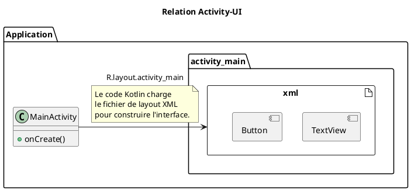
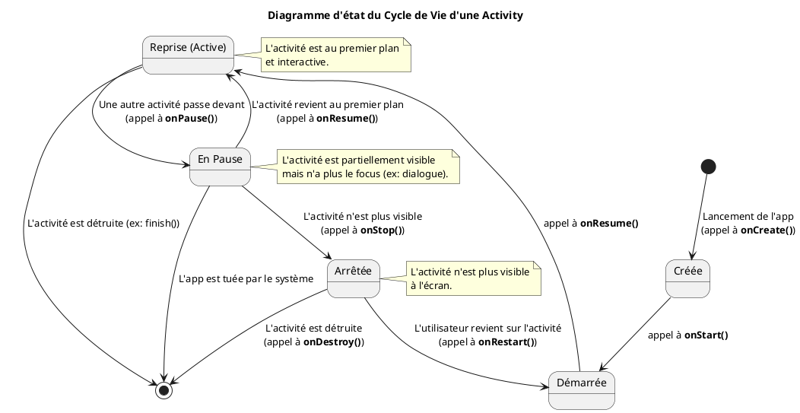

# Module 4 : Le Cœur d'un Écran : L'Activity et son Cycle de Vie

### Objectifs pédagogiques

À la fin de ce module, vous serez capable de :

* Définir le rôle et la responsabilité d'une `Activity`.
* Décrire les états principaux du cycle de vie d'une `Activity` (`onCreate`, `onStart`, `onResume`, `onPause`, `onStop`,
  `onDestroy`).
* Utiliser le Logcat pour visualiser les transitions du cycle de vie en temps réel.
* Comprendre et constater le problème de la recréation d'une `Activity` lors d'un changement de configuration (comme la
  rotation de l'écran).

### Introduction

Imaginez un acteur de théâtre. Il ne joue pas en permanence. Il entre en scène (`onStart`), il est sous les feux des
projecteurs et interagit avec le public (`onResume`), il se met parfois en retrait lorsqu'un autre acteur prend la
parole (`onPause`), il quitte la scène (`onStop`), et à la fin de la pièce, il rentre chez lui (`onDestroy`). Sa vie sur
scène est dictée par une série d'événements.

Une `Activity` Android, c'est exactement cet acteur. Elle est le "visage" de votre application pour un écran donné, mais
elle ne contrôle pas sa propre existence. C'est le système d'exploitation Android, le "metteur en scène", qui décide
quand elle doit apparaître, disparaître, ou même être détruite pour économiser des ressources. Comprendre ce "cycle de
vie" est absolument **fondamental**. C'est la clé pour savoir **à quel moment** charger des données, démarrer des
animations, sauvegarder le travail de l'utilisateur, et éviter des crashs ou des comportements inattendus.

### Notions abordées

* Le concept de l'Activity
* Le Cycle de Vie Détaillé
* Visualisation Pratique avec les Logs
* Le Problème de la Recréation d'Activity

---

### Le concept de l'Activity

#### Introduction à la notion

Pensez à votre application comme à un livre. Chaque page que l'utilisateur peut voir et avec laquelle il peut interagir
est une `Activity`. La page de couverture, la table des matières, un chapitre spécifique... chacune est une `Activity`
distincte. C'est le point d'entrée unique pour un écran donné, le conteneur principal de votre interface utilisateur.

#### Explication de la notion

Une `Activity` (plus précisément, `androidx.appcompat.app.AppCompatActivity` dont nous héritons) est l'un des quatre
composants applicatifs majeurs d'Android. Son rôle principal est de fournir une "fenêtre" dans laquelle l'application
peut dessiner son interface utilisateur.

Une application est généralement composée de plusieurs activités qui sont liées entre elles. Par exemple, une
application d'e-mails pourrait avoir :

* Une `Activity` pour afficher la liste des e-mails.
* Une `Activity` pour lire un e-mail spécifique.
* Une `Activity` pour composer un nouvel e-mail.

Chaque `Activity` est une classe Kotlin qui hérite de `AppCompatActivity` et doit être déclarée dans le fichier
`AndroidManifest.xml`. C'est dans ce fichier que vous déclarez laquelle de vos activités est la "porte d'entrée" de
l'application (celle qui se lance quand on clique sur l'icône).



---

### Le Cycle de Vie Détaillé

#### Introduction à la notion {id="introduction-la-notion_1"}

Revenons à notre acteur. Le metteur en scène lui donne des instructions claires : "Entre en scène !", "Prends la
lumière !", "Passe en arrière-plan.", "Sors de scène.". Le cycle de vie d'une `Activity` est la liste de ces
instructions. Le système Android appelle des méthodes spécifiques sur votre `Activity` pour l'informer des changements
d'état, vous donnant ainsi l'opportunité de réagir.

#### Explication de la notion {id="explication-de-la-notion_1"}

Le cycle de vie d'une activité est défini par une série de méthodes que le système appelle dans un ordre précis. Voici
les plus importantes :

* **`onCreate()`** : Appelée **une seule fois** lorsque l'activité est créée pour la première fois. C'est ici que vous
  devez faire toute la configuration statique : créer les vues (avec `setContentView()`), lier les données à des listes,
  etc.
* **`onStart()`** : Appelée lorsque l'activité devient visible pour l'utilisateur.
* **`onResume()`** : Appelée lorsque l'activité est au premier plan et que l'utilisateur peut interagir avec elle. C'est
  l'état "actif".
* **`onPause()`** : Appelée lorsque l'activité est sur le point de passer en arrière-plan. Elle est encore visible (par
  exemple, si une boîte de dialogue apparaît par-dessus), mais n'a plus le focus. C'est le meilleur endroit pour
  sauvegarder des données non enregistrées ou stopper des animations.
* **`onStop()`** : Appelée lorsque l'activité n'est plus visible pour l'utilisateur.
* **`onDestroy()`** : Appelée juste avant que l'activité ne soit détruite. Cela peut arriver parce que l'utilisateur a
  terminé l'activité (avec le bouton "retour") ou parce que le système a besoin de récupérer de la mémoire.




<tip>
La paire la plus importante est `onResume()` / `onPause()`. C'est entre ces deux appels que votre application est activement utilisée.
</tip>

---

### Visualisation Pratique avec les Logs

#### Introduction à la notion {id="introduction-la-notion_2"}

Lire la théorie, c'est bien. Mais voir l'acteur bouger sur scène en temps réel, c'est beaucoup mieux ! Nous allons
maintenant utiliser notre outil de débogage préféré, le Logcat, pour espionner le metteur en scène (le système Android)
et voir exactement quand il donne ses instructions à notre `Activity`.

#### Explication de la notion {id="explication-de-la-notion_2"}

Pour visualiser le cycle de vie, nous allons "surcharger" (*override*) chacune des méthodes du cycle de vie dans notre
`MainActivity` et y placer un simple `Log.d()`. Cela nous permettra de tracer chaque étape dans le Logcat.

#### Exercice 1 : Mettre le cycle de vie sous surveillance

**Énoncé :**
Modifiez votre classe `MainActivity` pour logger un message à chaque étape clé du cycle de vie (`onCreate`, `onStart`,
`onResume`, `onPause`, `onStop`, `onDestroy`).

##### **Correction exercice 1** {collapsible='true'}

<procedure title="Correction">

1. Ouvrez votre fichier `MainActivity.kt`.
2. Ajoutez une constante pour le TAG afin d'éviter les répétitions.
   ```kotlin
   private const val TAG = "MainActivityLifecycle"
   ```
3. Surchargez les méthodes du cycle de vie. Dans Android Studio, vous pouvez utiliser le raccourci `Ctrl+O` (sur
   Windows/Linux) ou `Cmd+O` (sur Mac) pour ouvrir la boîte de dialogue "Override Methods" et les sélectionner
   facilement.
4. Votre code complet devrait ressembler à ceci :

```kotlin
package fr.formation.lifecycleapp

import androidx.appcompat.app.AppCompatActivity
import android.os.Bundle
import android.util.Log

class MainActivity : AppCompatActivity() {

    // On définit une constante pour notre TAG Logcat.
    // C'est une bonne pratique pour éviter les fautes de frappe.
    private val TAG = "MainActivityLifecycle"

    override fun onCreate(savedInstanceState: Bundle?) {
        super.onCreate(savedInstanceState)
        setContentView(R.layout.activity_main)
        Log.d(TAG, "onCreate() a été appelée.")
    }

    override fun onStart() {
        super.onStart()
        Log.d(TAG, "onStart() a été appelée.")
    }

    override fun onResume() {
        super.onResume()
        Log.d(TAG, "onResume() a été appelée.")
    }

    override fun onPause() {
        super.onPause()
        Log.d(TAG, "onPause() a été appelée.")
    }

    override fun onStop() {
        super.onStop()
        Log.d(TAG, "onStop() a été appelée.")
    }

    override fun onDestroy() {
        super.onDestroy()
        Log.d(TAG, "onDestroy() a été appelée.")
    }
}
```

5. **Testez !**
    * Lancez l'application. Dans Logcat (filtré avec votre TAG), vous devriez voir `onCreate`, `onStart`, `onResume`.
    * Appuyez sur le bouton "Home" de l'appareil. Vous devriez voir `onPause`, `onStop`.
    * Rouvrez l'application depuis la liste des applications récentes. Vous devriez voir `onStart`, `onResume`.
    * Appuyez sur le bouton "Retour". Vous devriez voir `onPause`, `onStop`, `onDestroy`. L'activité est détruite.

</procedure>

---

### Le Problème de la Recréation d'Activity

#### Introduction à la notion {id="introduction-la-notion_3"}

Imaginez que notre acteur, en plein milieu d'une scène, change de costume. Le metteur en scène, au lieu de le laisser
continuer, le fait sortir, puis le fait revenir avec son nouveau costume, en lui faisant **oublier tout ce qu'il a fait
avant**. C'est un comportement étrange, mais c'est exactement ce que fait Android lors d'un "changement de
configuration", comme la rotation de l'écran.

#### Explication de la notion {id="explication-de-la-notion_3"}

Un changement de configuration se produit lorsque l'état de l'appareil change de manière significative, par exemple :

* L'utilisateur fait pivoter l'appareil (passage du mode portrait au paysage).
* L'utilisateur change la langue du système.
* L'utilisateur active le mode sombre.

Lorsque cela se produit, Android détruit (`onDestroy`) votre `Activity` actuelle et en crée une **nouvelle instance** (
`onCreate`). Pourquoi ? Pour lui permettre de recharger des ressources alternatives qui pourraient être optimisées pour
la nouvelle configuration (par exemple, un layout différent pour le mode paysage).

<warning>

**Le problème :** Puisqu'une nouvelle instance est créée, toutes les données stockées dans les propriétés de l'ancienne
`Activity` sont **perdues** !

</warning>

C'est l'un des problèmes les plus fondamentaux du développement Android. Ne pas le comprendre mène à des applications
qui perdent l'état de l'utilisateur, ce qui est très frustrant.

La solution moderne à ce problème est l'utilisation des **ViewModel**, que nous verrons dans la partie sur
l'architecture. Pour l'instant, notre objectif est de **constater** et de **comprendre** le problème.

---

## TP 4 : L'application "Compteur"

**Objectif :** Mettre en évidence la perte de données lors de la rotation de l'écran.

<procedure>

1. **Créez un nouveau projet** "Empty Views Activity" nommé `CompteurApp`.
2. **Modifiez le layout `activity_main.xml` :**
    * Ajoutez un `TextView` pour afficher un chiffre. Donnez-lui l'ID `@+id/counterTextView`. Centrez-le à l'écran.
    * Ajoutez un `Button` en dessous. Donnez-lui l'ID `@+id/incrementButton` et le texte "Incrémenter".
    * Pour la simplicité, vous pouvez utiliser un `LinearLayout` vertical.

   ```xml
   <!-- res/layout/activity_main.xml -->
   <LinearLayout
       xmlns:android="http://schemas.android.com/apk/res/android"
       xmlns:tools="http://schemas.android.com/tools"
       android:layout_width="match_parent"
       android:layout_height="match_parent"
       android:orientation="vertical"
       android:gravity="center"
       tools:context=".MainActivity">

       <TextView
           android:id="@+id/counterTextView"
           android:layout_width="wrap_content"
           android:layout_height="wrap_content"
           android:textSize="48sp"
           android:text="0" />

       <Button
           android:id="@+id/incrementButton"
           android:layout_width="wrap_content"
           android:layout_height="wrap_content"
           android:layout_marginTop="16dp"
           android:text="Incrémenter" />
   </LinearLayout>
   ```

<note>

Android utilise plusieurs unités de dimension, mais deux sont essentielles au quotidien. Les voici, classées de la plus
importante à la moins utilisée.

**1. `dp` ou `dip` (Density-Independent Pixel) - Le Standard Absolu**

C'est l'unité que vous devez utiliser **pour tout ce qui n'est pas du texte** : dimensions d'un bouton, marges, padding,
taille d'une image, etc.

* **Nom Complet :** Pixel Indépendant de la Densité.
* **Concept :** C'est une unité de mesure abstraite. Son but est de garantir qu'un élément d'interface ait la **même
  taille physique** (en centimètres ou en pouces) quel que soit l'écran du téléphone.
* **Comment ça marche ?** Android convertit les `dp` en pixels (`px`) réels en fonction de la densité de l'écran (le
  nombre de pixels par pouce, ou DPI - Dots Per Inch).
    * Sur un écran de basse densité (ex: 160 dpi), `1 dp` = `1 px`.
    * Sur un écran de haute densité (ex: 320 dpi), `1 dp` = `2 px`.
    * Sur un écran de très haute densité (ex: 480 dpi), `1 dp` = `3 px`.

**En résumé : Utilisez `dp` pour la taille de vos vues, les marges (`margin`) et les espacements intérieurs (`padding`).
**

*Exemple en XML :*

```xml

<Button
        android:layout_width="200dp"
        android:layout_height="50dp"
        android:layout_margin="16dp"/>
```

**2. `sp` (Scale-Independent Pixel) - Pour le Texte Uniquement**

C'est l'unité que vous devez utiliser **exclusivement pour la taille du texte (`textSize`)**.

* **Nom Complet :** Pixel Indépendant de l'Échelle.
* **Concept :** Il fonctionne de la même manière que le `dp` (il s'adapte à la densité de l'écran), mais il prend **en
  plus** en compte la **préférence de taille de police de l'utilisateur** dans les paramètres d'accessibilité du
  téléphone.
* **Pourquoi est-ce crucial ?** Si un utilisateur malvoyant augmente la taille de la police sur son téléphone, votre
  application doit respecter ce choix. En utilisant `sp`, le texte de votre application grossira automatiquement, la
  rendant accessible. Si vous utilisiez `dp` pour du texte, il ignorerait ce réglage.

**En résumé : Utilisez `sp` uniquement pour définir la taille des polices de caractères.**

*Exemple en XML :*

```xml

<TextView
        android:layout_width="wrap_content"
        android:layout_height="wrap_content"
        android:text="Bonjour le monde !"
        android:textSize="22sp"/>
```

---

**3. Les Autres Unités (À Éviter ou pour des cas très spécifiques)**

Ces unités existent mais ne devraient quasiment jamais être utilisées pour la création d'interfaces utilisateur
standards.

**`px` (Pixel)**

* **Nom Complet :** Pixel.
* **Concept :** Représente un pixel physique sur l'écran.
* **Le Problème :** C'est une unité absolue. Un bouton de `100px` de large paraîtra grand sur un écran de faible densité
  et minuscule sur un écran moderne à très haute densité (4K). **C'est précisément le problème que `dp` résout.**
* **Quand l'utiliser ?** Très rarement. Parfois en code (Kotlin/Java) pour des calculs graphiques très précis où vous
  avez besoin de manipuler des pixels, par exemple en dessinant sur un `Canvas`. **Ne jamais l'utiliser dans vos
  fichiers de layout XML.**

**`pt` (Point), `in` (Inch/Pouce), `mm` (Millimeter/Millimètre)**

* **Concept :** Ce sont des unités de mesure physiques réelles.
    * `pt` : 1/72 de pouce, une unité issue du monde de l'imprimerie.
    * `in` : Pouce.
    * `mm` : Millimètre.
* **Le Problème :** Bien qu'elles s'adaptent à la taille physique de l'écran, elles ne sont pas idéales pour le design
  d'interface qui doit être fluide et flexible. Le `dp` est une bien meilleure abstraction pour le design sur écran.

---

**Tableau Récapitulatif**

| Unité        | Nom Complet               | Utilisation Principale                                               | Recommandation               |
|:-------------|:--------------------------|:---------------------------------------------------------------------|:-----------------------------|
| **`dp`**     | Density-Independent Pixel | **Layouts** : `width`, `height`, `margin`, `padding`, `elevation`... | **À utiliser partout**       |
| **`sp`**     | Scale-Independent Pixel   | **Texte** : `textSize`                                               | **Uniquement pour le texte** |
| `px`         | Pixel                     | Calculs graphiques en code, manipulation de bitmaps.                 | **À éviter en XML**          |
| `pt, in, mm` | Point, Inch, Millimeter   | Cas d'usage très rares, souvent liés à l'impression.                 | **À éviter**                 |

**Bonne Pratique : Le fichier `dimens.xml`**

Pour une meilleure organisation et maintenance, il est recommandé de définir vos dimensions dans un fichier de
ressources dédié, comme `res/values/dimens.xml`.

**Fichier `res/values/dimens.xml` :**

```xml

<resources>
    <dimen name="margin_standard">16dp</dimen>
    <dimen name="text_size_large">22sp</dimen>
    <dimen name="button_height">48dp</dimen>
</resources>
```

*Utilisation dans votre layout :*

```xml

<Button
        android:layout_width="match_parent"
        android:layout_height="@dimen/button_height"
        android:layout_margin="@dimen/margin_standard"
        android:textSize="@dimen/text_size_large"/>
```

Cela permet de réutiliser les mêmes valeurs partout et de les modifier facilement à un seul endroit. C'est aussi la base
pour créer des interfaces adaptées aux tablettes (en créant un fichier `dimens.xml` spécifique pour les grands écrans).

</note>

3. **Modifiez la classe `MainActivity.kt` :**
    * Utilisez **View Binding** pour accéder aux vues (nous le verrons en détail plus tard, pour l'instant, suivez le
      code).
    * Créez une variable de type `var` pour stocker le compteur : `private var counter = 0`.
    * Dans `onCreate`, configurez un `onClickListener` sur le bouton pour incrémenter le compteur et mettre à jour le
      `TextView`.
    * (Optionnel) Ajoutez les logs du cycle de vie de l'exercice 1 pour mieux observer.

   ```kotlin
   package fr.formation.compteurapp

   import androidx.appcompat.app.AppCompatActivity
   import android.os.Bundle
   import android.util.Log
   import fr.formation.compteurapp.databinding.ActivityMainBinding

   class MainActivity : AppCompatActivity() {

       private val TAG = "MainActivityLifecycle"
       
       // Étape 1: Activer View Binding dans build.gradle.kts (Module: app)
       // android {
       //   ...
       //   buildFeatures {
       //     viewBinding = true
       //   }
       // }
       // Puis synchroniser Gradle.

       // Étape 2: Déclarer la variable pour le binding
       private lateinit var binding: ActivityMainBinding

       // Notre variable qui stocke l'état
       private var counter = 0

       override fun onCreate(savedInstanceState: Bundle?) {
           super.onCreate(savedInstanceState)

           // Étape 3: Initialiser le binding
           binding = ActivityMainBinding.inflate(layoutInflater)
           setContentView(binding.root)

           Log.d(TAG, "onCreate ! Compteur est à $counter")

           // On met à jour le TextView avec la valeur actuelle
           updateCounterText()

           // On configure le clic sur le bouton
           binding.incrementButton.setOnClickListener {
               counter++
               updateCounterText()
               Log.d(TAG, "Clic ! Le compteur est maintenant à $counter")
           }
       }

       private fun updateCounterText() {
           binding.counterTextView.text = counter.toString()
       }

       // Ajoutez les autres méthodes du cycle de vie (onStart, etc.) ici...
       override fun onDestroy() {
           super.onDestroy()
           Log.d(TAG, "onDestroy ! La valeur finale du compteur était $counter")
       }
   }
   ```

4. **Lancez et testez :**
    * Lancez l'application.
    * Cliquez plusieurs fois sur le bouton. Le compteur s'incrémente.
    * **Faites pivoter votre émulateur ou votre téléphone.**
    * **Observez le résultat :** Le compteur est revenu à 0 !
    * **Regardez le Logcat :** Vous verrez que l'activité a été détruite (`onDestroy`) et recréée (`onCreate`). La
      variable `counter` a été réinitialisée à sa valeur par défaut.

</procedure>

---

## Auto-évaluation

**1. Dans quelle méthode du cycle de vie est-il préférable d'appeler `setContentView()` ? (QCM)**

* A) `onStart()`
* B) `onResume()`
* C) `onCreate()`
* D) `onPause()`

**2. Votre application joue de la musique. Dans quelle méthode du cycle de vie devriez-vous mettre en pause la musique
si l'utilisateur reçoit un appel téléphonique ? (QCM)**

* A) `onStop()`
* B) `onDestroy()`
* C) `onPause()`
* D) `onCreate()`

**3. Que se passe-t-il lorsqu'un utilisateur fait pivoter l'écran de son téléphone ? (QCM)**

* A) La méthode `onPause()` est appelée, puis `onResume()`.
* B) L'Activity est détruite et une nouvelle instance est créée.
* C) Seul le layout est redessiné, l'instance de l'Activity reste la même.
* D) Rien, le système gère tout automatiquement sans impacter l'Activity.

**4. Expliquez la différence entre les états "Paused" (en pause) et "Stopped" (arrêté) pour une Activity. (Question
ouverte)**

**5. Pourquoi le compteur de notre TP revient-il à zéro après une rotation ? Expliquez le processus technique derrière
ce phénomène. (Question ouverte)**

### Correction de l'auto-évaluation {collapsible="true"}

**1. Dans quelle méthode du cycle de vie est-il préférable d'appeler `setContentView()` ?**

* **Réponse : C) `onCreate()`**
* **Justification :** `onCreate()` n'est appelée qu'une seule fois lors de la création initiale de l'activité. C'est l'
  endroit idéal pour effectuer toutes les initialisations qui ne doivent se produire qu'une seule fois, comme la
  définition du layout.

**2. Votre application joue de la musique. Dans quelle méthode du cycle de vie devriez-vous mettre en pause la musique
si l'utilisateur reçoit un appel téléphonique ?**

* **Réponse : C) `onPause()`**
* **Justification :** Un appel téléphonique fait passer votre activité en arrière-plan, mais elle reste partiellement
  visible. La méthode `onPause()` est la première à être appelée lorsque l'activité perd le focus. C'est le moment idéal
  pour stopper les processus qui ne devraient pas continuer en arrière-plan (lecture audio/vidéo, animations, etc.).

**3. Que se passe-t-il lorsqu'un utilisateur fait pivoter l'écran de son téléphone ?**

* **Réponse : B) L'Activity est détruite et une nouvelle instance est créée.**
* **Justification :** C'est le comportement par défaut d'Android pour gérer les changements de configuration. Il détruit
  l'ancienne instance et en crée une nouvelle pour charger les ressources appropriées.

**4. Expliquez la différence entre les états "Paused" (en pause) et "Stopped" (arrêté) pour une Activity.**

* **Réponse type :** Une activité est en état "Paused" lorsqu'elle a perdu le focus mais est toujours au moins
  partiellement visible pour l'utilisateur (par exemple, si une boîte de dialogue transparente ou une notification "
  pop-up" apparaît). Une activité est en état "Stopped" lorsqu'elle n'est plus du tout visible (par exemple,
  l'utilisateur a appuyé sur le bouton "Home" ou a navigué vers une autre activité qui recouvre entièrement l'écran).

**5. Pourquoi le compteur de notre TP revient-il à zéro après une rotation ? Expliquez le processus technique derrière
ce phénomène.**

* **Réponse type :** Le compteur revient à zéro car la variable `counter` est une propriété de l'instance de
  `MainActivity`. Lors de la rotation, le système Android considère qu'il s'agit d'un changement de configuration
  majeur. Il **détruit** complètement l'instance existante de `MainActivity` (ce qui efface la valeur de `counter` de la
  mémoire). Ensuite, il crée une **nouvelle instance** de `MainActivity` pour le nouveau mode (paysage ou portrait).
  Dans cette nouvelle instance, la variable `counter` est réinitialisée à sa valeur initiale, qui est 0. C'est le cycle
  `onDestroy()` -> `onCreate()` qui est la cause de cette perte de données.

---

## Conclusion du module

Vous avez maintenant touché au cœur du fonctionnement d'une application Android. Vous comprenez que vos écrans ne sont
pas des entités statiques, mais des composants dynamiques avec un cycle de vie bien défini, géré par le système.

Vous avez appris à écouter les événements de ce cycle de vie et, surtout, vous avez mis le doigt sur un des problèmes
les plus courants et les plus importants : la **perte d'état lors des changements de configuration**.

Cette compréhension est le "pourquoi" qui justifiera l'utilisation de composants d'architecture plus avancés comme le
`ViewModel`. Considérez ce que vous venez d'apprendre comme une pièce maîtresse de votre puzzle de connaissances
Android.

Dans la prochaine partie, nous allons nous concentrer sur la construction de l'interface utilisateur elle-même.
Maintenant que nous savons comment fonctionne le conteneur (`Activity`), nous allons apprendre à le remplir avec des
vues et à le rendre interactif.