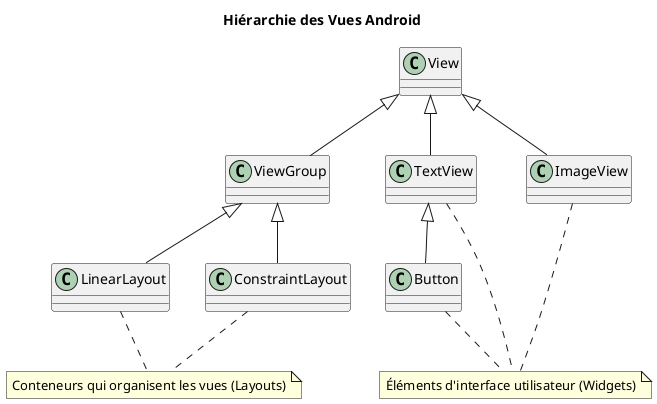
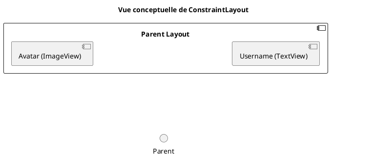

# Module 5 : Construire des Interfaces Utilisateur Statiques (XML)

### Objectifs pédagogiques

À la fin de ce module, vous serez capable de :

* Distinguer une `View` d'un `ViewGroup`.
* Utiliser les widgets les plus courants pour construire une interface.
* Positionner des éléments de manière précise avec `LinearLayout` et `ConstraintLayout`.
* Appliquer les bonnes pratiques en externalisant les ressources (textes, couleurs, dimensions).

### Introduction

Imaginez que vous jouez avec des LEGO®. Vous avez des briques de toutes les formes et de toutes les couleurs : des
petites briques rouges, des fenêtres, des personnages... Ce sont vos **`View`s**. Mais pour construire quelque chose de
cohérent, vous avez besoin d'une grande plaque verte sur laquelle fixer vos briques. Cette plaque, c'est votre *
*`ViewGroup`**. Ce module va vous apprendre à choisir les bonnes briques (`TextView`, `Button`) et à les assembler sur
votre plaque de construction (`ConstraintLayout`) pour créer des interfaces solides et bien organisées.

### Notions abordées

* Fondamentaux : La différence entre `View` et `ViewGroup`
* Widgets Courants : `TextView`, `EditText`, `Button`, `ImageView`
* Layouts de Positionnement : `LinearLayout`, `ConstraintLayout`
* Bonnes Pratiques des Ressources : `strings.xml`, `colors.xml`, `dimens.xml`

---

### Fondamentaux : View vs ViewGroup

#### Introduction à la notion

Comme nous l'avons vu avec l'analogie des LEGO®, tout ce que vous voyez à l'écran est une brique ou un assemblage de
briques. La distinction entre la brique unique et la plaque qui les contient est la première chose à maîtriser pour
comprendre la structure d'une interface Android.

#### Explication de la notion

Dans le framework Android, l'interface utilisateur est construite comme une hiérarchie d'objets.

* **`View`** : C'est la classe de base pour tout ce qui est dessinable à l'écran et qui peut réagir à l'interaction de
  l'utilisateur. Un `Button` est une `View`. Un `TextView` est une `View`. Une `ImageView` est une `View`. C'est l'
  élément de base, la "brique".

* **`ViewGroup`** : C'est une sous-classe de `View`. Son rôle est spécial : il est un **conteneur invisible** dont le
  seul but est d'organiser les `View`s enfants qu'il contient. Un `LinearLayout` qui aligne des boutons est un
  `ViewGroup`. Le `ConstraintLayout` qui positionne des éléments les uns par rapport aux autres est un `ViewGroup`.
  C'est la "plaque de construction".

Cette structure forme un arbre, où le `ViewGroup` racine est la base, et chaque branche est soit un autre `ViewGroup`,
soit une `View` finale (une "feuille" de l'arbre).



---

### Widgets Courants

#### Introduction à la notion {id="introduction-la-notion_1"}

Ce sont les briques LEGO® les plus communes et les plus utiles de votre boîte. Savoir quand utiliser un `TextView` (une
brique avec du texte imprimé), un `EditText` (une brique sur laquelle on peut écrire) ou un `Button` (une brique qui
déclenche une action quand on appuie dessus) est essentiel.

#### Explication de la notion {id="explication-de-la-notion_1"}

Voici les widgets que vous utiliserez dans 90% de vos interfaces :

* **`TextView`** : Affiche du texte statique.
* **`EditText`** : Permet à l'utilisateur de saisir du texte (un champ de formulaire).
* **`Button`** : Un bouton cliquable pour déclencher une action.
* **`ImageView`** : Affiche une image (depuis vos ressources ou une URL).
* **`ProgressBar`** : Affiche une barre ou un cercle de chargement.

Chaque widget possède des **attributs** XML qui permettent de le configurer. Les plus importants sont :

* `android:id="@+id/mon_id"` : Un identifiant unique pour pouvoir le manipuler en Kotlin.
* `android:layout_width` et `android:layout_height` : Définissent la taille. Les valeurs les plus courantes sont
  `match_parent` (prend toute la place du parent) et `wrap_content` (s'adapte à la taille de son contenu).
* `android:text` : Le texte à afficher pour un `TextView` ou un `Button`.
* `android:hint` : Le texte placeholder pour un `EditText`.
* `android:src` : La source pour une `ImageView` (ex: `@drawable/mon_icone`).

#### Exemple de code : Un formulaire de connexion simple

```xml
<!-- Fichier : res/layout/activity_login.xml -->
<LinearLayout
        xmlns:android="http://schemas.android.com/apk/res/android"
        android:layout_width="match_parent"
        android:layout_height="match_parent"
        android:orientation="vertical"
        android:padding="16dp">

    <!-- Champ pour l'email -->
    <EditText
            android:id="@+id/emailEditText"
            android:layout_width="match_parent"
            android:layout_height="wrap_content"
            android:hint="Adresse e-mail"
            android:inputType="textEmailAddress"/>

    <!-- Champ pour le mot de passe -->
    <EditText
            android:id="@+id/passwordEditText"
            android:layout_width="match_parent"
            android:layout_height="wrap_content"
            android:layout_marginTop="8dp"
            android:hint="Mot de passe"
            android:inputType="textPassword"/>

    <!-- Bouton de connexion -->
    <Button
            android:id="@+id/loginButton"
            android:layout_width="wrap_content"
            android:layout_height="wrap_content"
            android:layout_gravity="center_horizontal"
            android:layout_marginTop="16dp"
            android:text="Connexion"/>
</LinearLayout>
```

#### Exercice 1 : Créer un écran d'inscription

**Énoncé :**
En utilisant un `LinearLayout` vertical, créez un fichier XML `activity_register.xml` qui contient les champs suivants :
un champ pour le nom d'utilisateur (`EditText`), un champ pour l'e-mail (`EditText`), un champ pour le mot de passe (
`EditText`), et un bouton "S'inscrire" (`Button`). N'oubliez pas les attributs `hint` et `id`.

##### **Correction exercice 1** {collapsible='true'}

```xml
<!-- Fichier : res/layout/activity_register.xml -->
<LinearLayout
        xmlns:android="http://schemas.android.com/apk/res/android"
        android:layout_width="match_parent"
        android:layout_height="match_parent"
        android:orientation="vertical"
        android:gravity="center"
        android:padding="16dp">

    <!-- Champ pour le nom d'utilisateur -->
    <EditText
            android:id="@+id/usernameEditText"
            android:layout_width="match_parent"
            android:layout_height="wrap_content"
            android:hint="Nom d'utilisateur"
            android:inputType="textPersonName"/>

    <!-- Champ pour l'e-mail -->
    <EditText
            android:id="@+id/emailEditText"
            android:layout_width="match_parent"
            android:layout_height="wrap_content"
            android:layout_marginTop="8dp"
            android:hint="Adresse e-mail"
            android:inputType="textEmailAddress"/>

    <!-- Champ pour le mot de passe -->
    <EditText
            android:id="@+id/passwordEditText"
            android:layout_width="match_parent"
            android:layout_height="wrap_content"
            android:layout_marginTop="8dp"
            android:hint="Mot de passe"
            android:inputType="textPassword"/>

    <!-- Bouton d'inscription -->
    <Button
            android:id="@+id/registerButton"
            android:layout_width="match_parent"
            android:layout_height="wrap_content"
            android:layout_marginTop="24dp"
            android:text="S'inscrire"/>
</LinearLayout>
```

---

### Layouts de Positionnement

#### Introduction à la notion {id="introduction-la-notion_2"}

Si les widgets sont les briques, les layouts sont les différentes techniques d'assemblage. `LinearLayout` est la
technique la plus simple : empiler les briques les unes sur les autres. `ConstraintLayout` est une technique
d'ingénieur : chaque brique est placée précisément en fonction de sa relation avec les autres briques et les bords de la
plaque de construction.

#### Explication de la notion {id="explication-de-la-notion_2"}

* **`LinearLayout`** : Le plus simple. Il aligne ses enfants les uns à la suite des autres, soit horizontalement (
  `orientation="horizontal"`), soit verticalement (`orientation="vertical"`). C'est rapide et efficace pour les listes
  simples.

* **`FrameLayout`** : Le plus basique. Il empile ses enfants les uns sur les autres. Utile pour superposer des éléments,
  comme un bouton de lecture sur une miniature de vidéo.

* **`ConstraintLayout`** : Le plus puissant et le plus flexible. C'est le layout recommandé par Google pour la plupart
  des cas. Il permet de créer des interfaces complexes et "plates" (avec moins de `ViewGroup`s imbriqués, ce qui est
  meilleur pour les performances). Le principe est de définir des **contraintes** pour chaque vue, la reliant à d'autres
  vues ou au conteneur parent.

Une contrainte est un lien : "Le côté gauche de ce `TextView` doit être collé au côté droit de cette `ImageView`". "Le
bas de ce `Button` doit être collé au bas de l'écran".



#### Exemple de code : Profil utilisateur avec `ConstraintLayout`

```xml
<!-- Fichier : res/layout/activity_profile.xml -->
<androidx.constraintlayout.widget.ConstraintLayout
        xmlns:android="http://schemas.android.com/apk/res/android"
        xmlns:app="http://schemas.android.com/apk/res-auto"
        android:layout_width="match_parent"
        android:layout_height="match_parent">

    <ImageView
            android:id="@+id/avatarImageView"
            android:layout_width="100dp"
            android:layout_height="100dp"
            android:layout_marginStart="16dp"
            android:layout_marginTop="16dp"
            app:srcCompat="@drawable/ic_launcher_background"
            app:layout_constraintStart_toStartOf="parent"
            app:layout_constraintTop_toTopOf="parent"/>

    <TextView
            android:id="@+id/usernameTextView"
            android:layout_width="0dp"
            android:layout_height="wrap_content"
            android:layout_marginStart="16dp"
            android:layout_marginEnd="16dp"
            android:text="Nom Utilisateur"
            android:textSize="24sp"
            app:layout_constraintEnd_toEndOf="parent"
            app:layout_constraintStart_toEndOf="@+id/avatarImageView"
            app:layout_constraintTop_toTopOf="@+id/avatarImageView"/>

</androidx.constraintlayout.widget.ConstraintLayout>
```

#### Exercice 2 : Reproduire une carte de produit

**Énoncé :**
Utilisez `ConstraintLayout` pour créer une carte simple. Elle doit contenir : une `ImageView` à gauche, un `TextView`
pour le nom du produit à droite de l'image, et un autre `TextView` pour le prix sous le nom du produit.

##### **Correction exercice 2** {collapsible='true'}

```xml

<androidx.constraintlayout.widget.ConstraintLayout
        xmlns:android="http://schemas.android.com/apk/res/android"
        xmlns:app="http://schemas.android.com/apk/res-auto"
        android:layout_width="match_parent"
        android:layout_height="wrap_content"
        android:padding="16dp">

    <!-- L'image du produit, contrainte à gauche du parent -->
    <ImageView
            android:id="@+id/productImageView"
            android:layout_width="80dp"
            android:layout_height="80dp"
            app:layout_constraintStart_toStartOf="parent"
            app:layout_constraintTop_toTopOf="parent"
            app:srcCompat="@drawable/ic_launcher_background"/>

    <!-- Le nom du produit, contraint à droite de l'image -->
    <TextView
            android:id="@+id/productNameTextView"
            android:layout_width="0dp"
            android:layout_height="wrap_content"
            android:layout_marginStart="16dp"
            android:text="Smartphone Android"
            android:textSize="18sp"
            android:textStyle="bold"
            app:layout_constraintEnd_toEndOf="parent"
            app:layout_constraintStart_toEndOf="@id/productImageView"
            app:layout_constraintTop_toTopOf="@id/productImageView"/>

    <!-- Le prix, contraint sous le nom du produit -->
    <TextView
            android:id="@+id/productPriceTextView"
            android:layout_width="wrap_content"
            android:layout_height="wrap_content"
            android:layout_marginTop="8dp"
            android:text="299,99 €"
            android:textColor="@android:color/holo_green_dark"
            app:layout_constraintStart_toStartOf="@id/productNameTextView"
            app:layout_constraintTop_toBottomOf="@id/productNameTextView"/>

</androidx.constraintlayout.widget.ConstraintLayout>
```

---

### Bonnes Pratiques des Ressources

#### Introduction à la notion {id="introduction-la-notion_3"}

Un bon artisan ne laisse pas ses outils et ses matériaux en désordre. Il les range dans des boîtes étiquetées. Pour le
développeur Android, ces boîtes sont les fichiers de ressources `strings.xml`, `colors.xml` et `dimens.xml`. Utiliser
ces boîtes rend votre atelier plus propre, plus facile à maintenir, et prêt à être partagé avec des collaborateurs qui
parlent d'autres langues.

#### Explication de la notion {id="explication-de-la-notion_3"}

Plutôt que d'écrire les valeurs directement dans vos fichiers de layout (ce qu'on appelle "hardcoder"), il est crucial
de les externaliser dans des fichiers de ressources dédiés.

* **`res/values/strings.xml`** : Pour tous les textes affichés à l'utilisateur.
    * **Pourquoi ?** Pour la traduction (internationalisation) et la maintenance.

* **`res/values/colors.xml`** : Pour toutes les couleurs de votre application.
    * **Pourquoi ?** Pour maintenir une charte graphique cohérente et faciliter le changement de thème (ex: mode
      sombre).

* **`res/values/dimens.xml`** : Pour toutes les dimensions (marges, tailles de police).
    * **Pourquoi ?** Pour assurer une consistance dans les espacements et pour adapter plus facilement l'interface à
      différentes tailles d'écran (ex: tablettes).

#### Exemple de code : Avant vs Après

**Avant (mauvaise pratique)**

```xml

<TextView
        android:layout_width="wrap_content"
        android:layout_height="wrap_content"
        android:text="Welcome!"
        android:textSize="24sp"
        android:textColor="#FF3700B3"
        android:layout_margin="16dp"/>
```

**Après (bonne pratique)**

`res/values/strings.xml`

```xml

<resources>
    <string name="welcome_message">Welcome!</string>
</resources>
```

`res/values/colors.xml`

```xml

<resources>
    <color name="primary_text">#FF3700B3</color>
</resources>
```

`res/values/dimens.xml`

```xml

<resources>
    <dimen name="standard_margin">16dp</dimen>
    <dimen name="title_text_size">24sp</dimen>
</resources>
```

`Layout.xml`

```xml

<TextView
        android:layout_width="wrap_content"
        android:layout_height="wrap_content"
        android:text="@string/welcome_message"
        android:textSize="@dimen/title_text_size"
        android:textColor="@color/primary_text"
        android:layout_margin="@dimen/standard_margin"/>
```

#### Exercice 3 : Refactoriser un layout

**Énoncé :**
Prenez le code de la correction de l'exercice 1 et refactorisez-le. Extrayez toutes les chaînes de caractères ("Nom
d'utilisateur", "S'inscrire", etc.) dans `strings.xml` et toutes les dimensions de marges dans `dimens.xml`.

##### **Correction exercice 3** {collapsible='true'}

**1. Fichier `res/values/strings.xml`**

```xml

<resources>
    <string name="app_name">MonApp</string>
    <string name="hint_username">Nom d\'utilisateur</string>
    <string name="hint_email">Adresse e-mail</string>
    <string name="hint_password">Mot de passe</string>
    <string name="button_register">S\'inscrire</string>
</resources>
```

**2. Fichier `res/values/dimens.xml`**

```xml

<resources>
    <dimen name="layout_padding">16dp</dimen>
    <dimen name="margin_small">8dp</dimen>
    <dimen name="margin_large">24dp</dimen>
</resources>
```

**3. Fichier `res/layout/activity_register.xml` refactorisé**

```xml

<LinearLayout
        xmlns:android="http://schemas.android.com/apk/res/android"
        android:layout_width="match_parent"
        android:layout_height="match_parent"
        android:orientation="vertical"
        android:gravity="center"
        android:padding="@dimen/layout_padding">

    <EditText
            android:id="@+id/usernameEditText"
            android:layout_width="match_parent"
            android:layout_height="wrap_content"
            android:hint="@string/hint_username"
            android:inputType="textPersonName"/>

    <EditText
            android:id="@+id/emailEditText"
            android:layout_width="match_parent"
            android:layout_height="wrap_content"
            android:layout_marginTop="@dimen/margin_small"
            android:hint="@string/hint_email"
            android:inputType="textEmailAddress"/>

    <EditText
            android:id="@+id/passwordEditText"
            android:layout_width="match_parent"
            android:layout_height="wrap_content"
            android:layout_marginTop="@dimen/margin_small"
            android:hint="@string/hint_password"
            android:inputType="textPassword"/>

    <Button
            android:id="@+id/registerButton"
            android:layout_width="match_parent"
            android:layout_height="wrap_content"
            android:layout_marginTop="@dimen/margin_large"
            android:text="@string/button_register"/>
</LinearLayout>
```

---

## TP 5 : Construction d'un écran de profil statique

**Objectif :** Mettre en pratique toutes les notions du module pour construire un écran de profil utilisateur propre et
bien structuré.

<procedure>

1. **Préparer les ressources :**
    * Dans `strings.xml`, ajoutez des chaînes pour un nom (`user_name`), une bio (`user_bio`), et le texte d'un
      bouton ("Modifier le profil", `button_edit_profile`).
    * Dans `dimens.xml`, définissez des marges standard (`margin_16dp`), une marge plus petite (`margin_8dp`), et une
      taille pour l'avatar (`avatar_size`, ex: 120dp).
    * (Optionnel) Dans `colors.xml`, définissez une couleur pour le nom d'utilisateur.

2. **Construire le layout `activity_profile.xml` avec `ConstraintLayout` :**
    * Placez une `ImageView` (pour l'avatar) en haut et au centre de l'écran. Utilisez
      `app:layout_constraintTop_toTopOf="parent"`, `app:layout_constraintStart_toStartOf="parent"`,
      `app:layout_constraintEnd_toEndOf="parent"`. Donnez-lui l'ID `@+id/profileAvatar`.
    * Placez un `TextView` pour le nom d'utilisateur sous l'avatar. Contrainez son haut (`top`) au bas (`bottom`) de
      l'avatar. Centrez-le horizontalement par rapport au parent. Donnez-lui l'ID `@+id/profileName`.
    * Placez un `TextView` pour la bio sous le nom. Contrainez son haut au bas du nom. Contrainez ses côtés (`start` et
      `end`) à ceux du parent. Donnez-lui l'ID `@+id/profileBio`.
    * Placez un `Button` en bas de l'écran. Contrainez son bas au bas du parent. Centrez-le horizontalement. Donnez-lui
      l'ID `@+id/profileEditButton`.

3. **Lier les ressources :**
    * Appliquez les ressources (`@string`, `@dimen`, `@color`) que vous avez créées à chaque vue appropriée dans votre
      layout.

4. **Lancer et admirer :**
    * Modifiez votre `MainActivity.kt` pour qu'elle charge ce nouveau layout (
      `setContentView(R.layout.activity_profile)`).
    * Lancez l'application. Vous devriez voir un écran de profil bien structuré et centré.

</procedure>

## Correction du TP 5 {collapsible="true"}

Absolument ! Voici la correction complète et très détaillée de ce TP. C'est un excellent exercice pour maîtriser les
bases de `ConstraintLayout` et la bonne pratique de gestion des ressources.

---

### Étape 1 : Préparer les ressources

C'est la première étape, cruciale pour avoir un code propre et maintenable. On centralise toutes nos valeurs dans des
fichiers dédiés.

#### `res/values/strings.xml`

```xml

<resources>
    <string name="app_name">ProfileApp</string>

    <!-- Chaînes pour l'écran de profil -->
    <string name="user_name">Jean Dupont</string>
    <string name="user_bio">Développeur Android passionné par Kotlin et Jetpack Compose. Aime le bon café et les
        interfaces épurées.
    </string>
    <string name="button_edit_profile">Modifier le profil</string>
    <string name="user_avatar_description">Avatar de l'utilisateur</string>
</resources>
```

#### `res/values/dimens.xml`

Si ce fichier n'existe pas, vous pouvez le créer en faisant un clic droit sur le dossier `res/values` -> `New` ->
`Values Resource File` et en le nommant `dimens`.

```xml
<?xml version="1.0" encoding="utf-8"?>
<resources>
    <!-- Marges standards -->
    <dimen name="margin_16dp">16dp</dimen>
    <dimen name="margin_8dp">8dp</dimen>

    <!-- Taille de l'avatar -->
    <dimen name="avatar_size">120dp</dimen>
</resources>
```

#### (Optionnel) `res/values/colors.xml`

```xml
<?xml version="1.0" encoding="utf-8"?>
<resources>
    <!-- ... autres couleurs ... -->
    <color name="user_name_color">#212121</color>
</resources>
```

---

### Étape 2 & 3 : Construire le Layout et Lier les Ressources

Voici le fichier `activity_profile.xml` complet, avec les contraintes et les ressources appliquées.

**Fichier : `res/layout/activity_profile.xml`**

```xml
<?xml version="1.0" encoding="utf-8"?>
<androidx.constraintlayout.widget.ConstraintLayout
        xmlns:android="http://schemas.android.com/apk/res/android"
        xmlns:app="http://schemas.android.com/apk/res-auto"
        xmlns:tools="http://schemas.android.com/tools"
        android:layout_width="match_parent"
        android:layout_height="match_parent"
        tools:context=".MainActivity">

    <!-- 1. Avatar de l'utilisateur -->
    <ImageView
            android:id="@+id/profileAvatar"
            android:layout_width="@dimen/avatar_size"
            android:layout_height="@dimen/avatar_size"
            android:layout_marginTop="@dimen/margin_16dp"
            android:contentDescription="@string/user_avatar_description"
            app:layout_constraintEnd_toEndOf="parent"
            app:layout_constraintStart_toStartOf="parent"
            app:layout_constraintTop_toTopOf="parent"
            tools:src="@tools:sample/avatars"/>

    <!-- 2. Nom de l'utilisateur -->
    <TextView
            android:id="@+id/profileName"
            android:layout_width="wrap_content"
            android:layout_height="wrap_content"
            android:layout_marginTop="@dimen/margin_16dp"
            android:text="@string/user_name"
            android:textColor="@color/user_name_color"
            android:textSize="24sp"
            android:textStyle="bold"
            app:layout_constraintEnd_toEndOf="parent"
            app:layout_constraintStart_toStartOf="parent"
            app:layout_constraintTop_toBottomOf="@+id/profileAvatar"/>

    <!-- 3. Biographie de l'utilisateur -->
    <TextView
            android:id="@+id/profileBio"
            android:layout_width="0dp"
            android:layout_height="wrap_content"
            android:layout_marginStart="@dimen/margin_16dp"
            android:layout_marginTop="@dimen/margin_8dp"
            android:layout_marginEnd="@dimen/margin_16dp"
            android:gravity="center_horizontal"
            android:text="@string/user_bio"
            android:textSize="16sp"
            app:layout_constraintEnd_toEndOf="parent"
            app:layout_constraintStart_toStartOf="parent"
            app:layout_constraintTop_toBottomOf="@+id/profileName"/>

    <!-- 4. Bouton d'édition -->
    <Button
            android:id="@+id/profileEditButton"
            android:layout_width="wrap_content"
            android:layout_height="wrap_content"
            android:layout_marginBottom="@dimen/margin_16dp"
            android:text="@string/button_edit_profile"
            app:layout_constraintBottom_toBottomOf="parent"
            app:layout_constraintEnd_toEndOf="parent"
            app:layout_constraintStart_toStartOf="parent"/>

</androidx.constraintlayout.widget.ConstraintLayout>
```

#### Explications des points clés du layout :

* **`tools:src="@tools:sample/avatars"`** : Une astuce très utile ! `tools:` est un namespace qui n'affecte que la
  prévisualisation dans Android Studio. Cette ligne affiche une image d'avatar par défaut dans l'éditeur, ce qui vous
  aide à visualiser le design sans avoir à ajouter une vraie image à votre projet.
* **Centrage horizontal** : Pour centrer un élément horizontalement, on contraint ses côtés `constraintStart` et
  `constraintEnd` à ceux de son parent (`parent`).
* **Chaînage vertical** : Chaque élément est contraint verticalement à l'élément au-dessus de lui (
  `app:layout_constraintTop_toBottomOf="@+id/..."`). Cela crée une chaîne verticale stable. Le premier élément (
  `profileAvatar`) est ancré en haut du parent, et le dernier (`profileEditButton`) est ancré en bas.
* **`android:layout_width="0dp"`** : Pour la biographie, cette valeur est cruciale. Lorsqu'un élément est contraint des
  deux côtés (ici, `start` et `end`), `0dp` (aussi appelé `match_constraint`) lui dit de prendre toute la place
  disponible entre ses contraintes, en respectant les marges. C'est la bonne façon de faire un "match_parent" dans
  `ConstraintLayout`.
* **`android:contentDescription`** : Important pour l'accessibilité. Il décrit l'image pour les lecteurs d'écran.

---

### Étape 4 : Lancer et Admirer

Il ne reste plus qu'à dire à notre `MainActivity` d'utiliser ce nouveau layout.

**Fichier : `MainActivity.kt`**

```kotlin
package com.example.yourapplication // Adaptez votre package

import androidx.appcompat.app.AppCompatActivity
import android.os.Bundle

class MainActivity : AppCompatActivity() {
    override fun onCreate(savedInstanceState: Bundle?) {
        super.onCreate(savedInstanceState)

        // On charge notre layout de profil au lieu du layout par défaut
        setContentView(R.layout.activity_profile)
    }
}
```

#### Résultat Attendu

Lorsque vous lancez l'application, vous devriez voir un écran parfaitement agencé :

* L'avatar est en haut, centré.
* Le nom d'utilisateur est juste en dessous, centré.
* La biographie est en dessous du nom, occupant la largeur de l'écran (avec des marges).
* Le bouton "Modifier le profil" est en bas, centré.


L'avantage de
`ConstraintLayout` est que cet agencement restera cohérent sur des écrans de tailles et de densités différentes.

---

## Auto-évaluation

**1. Quel est le rôle principal d'un `ViewGroup` ? (QCM)**

* A) Afficher une image à l'écran.
* B) Contenir et organiser d'autres vues.
* C) Réagir à un clic de l'utilisateur.
* D) Stocker du texte pour l'afficher.

**2. Que signifie la valeur `wrap_content` pour un attribut `layout_width` ? (QCM)**

* A) La vue prendra toute la largeur disponible dans son parent.
* B) La vue aura une largeur de 0.
* C) La largeur de la vue s'adaptera à la largeur de son contenu (texte, image, etc.).
* D) La vue sera invisible.

**3. Quel est le principal avantage de `ConstraintLayout` par rapport à des `LinearLayout` imbriqués ? (QCM)**

* A) Il est plus simple à écrire à la main.
* B) Il permet de créer des hiérarchies de vues plus "plates", ce qui est meilleur pour les performances.
* C) Il ne peut agencer les vues que verticalement.
* D) Il est plus ancien et donc plus stable.

**4. Pourquoi est-ce une mauvaise pratique d'écrire `android:text="Valider"` directement dans le layout d'un bouton ?
Donnez au moins deux raisons. (Question ouverte)**

**5. Décrivez dans vos propres mots ce qu'est une "contrainte" dans `ConstraintLayout`. (Question ouverte)**

### Correction de l'auto-évaluation {collapsible="true"}

**1. Quel est le rôle principal d'un `ViewGroup` ?**

* **Réponse : B) Contenir et organiser d'autres vues.**
* **Justification :** Un `ViewGroup` est un conteneur. Son travail n'est pas d'être vu, mais d'arranger les vues qu'il
  contient selon des règles précises (`LinearLayout`, `ConstraintLayout`, etc.).

**2. Que signifie la valeur `wrap_content` pour un attribut `layout_width` ?**

* **Réponse : C) La largeur de la vue s'adaptera à la largeur de son contenu (texte, image, etc.).**
* **Justification :** `wrap_content` demande à la vue de n'être que aussi grande que nécessaire pour contenir ce qu'elle
  affiche. `match_parent` est l'option pour prendre toute la place disponible.

**3. Quel est le principal avantage de `ConstraintLayout` par rapport à des `LinearLayout` imbriqués ?**

* **Réponse : B) Il permet de créer des hiérarchies de vues plus "plates", ce qui est meilleur pour les performances.**
* **Justification :** Pour créer des interfaces complexes avec `LinearLayout`, on doit souvent en imbriquer plusieurs
  les uns dans les autres, ce qui alourdit l'arbre des vues. `ConstraintLayout` permet d'obtenir le même résultat avec
  un seul niveau de layout, ce qui est plus rapide à dessiner pour le système.

**4. Pourquoi est-ce une mauvaise pratique d'écrire `android:text="Valider"` directement dans le layout d'un bouton ?
Donnez au moins deux raisons.**

* **Réponse type :**
    1. **Traduction (Internationalisation) :** Si l'application doit être traduite en anglais, il faudra modifier chaque
       fichier de layout. En utilisant `@string/submit_button`, il suffit de fournir un fichier `strings.xml` pour
       l'anglais avec la traduction de `submit_button`.
    2. **Maintenance :** Si le texte doit être changé (par exemple, "Valider" devient "Confirmer"), et qu'il est utilisé
       sur 5 écrans différents, il faudra le modifier 5 fois. Avec une ressource, la modification se fait en un seul
       endroit, dans `strings.xml`.

**5. Décrivez dans vos propres mots ce qu'est une "contrainte" dans `ConstraintLayout`.**

* **Réponse type :** Une contrainte est une règle ou un lien qui définit la position d'une vue par rapport à autre
  chose. Cette "autre chose" peut être le bord du layout parent ou le bord d'une autre vue. Par exemple, une contrainte
  peut dire "le haut de ce bouton doit être à 8dp en dessous du bas de ce champ de texte", ce qui les lie verticalement.
  Il faut au moins une contrainte horizontale et une contrainte verticale pour que la position d'une vue soit
  déterminée.

---

## Conclusion du module

Vous avez fait un grand pas ! Vous n'êtes plus seulement un programmeur, vous êtes aussi un architecte d'interfaces.
Vous savez maintenant comment choisir vos matériaux (`View`s), comment les structurer (`ViewGroup`s) et comment le faire
de manière professionnelle en organisant vos ressources.

Nos interfaces sont encore "statiques", comme des maquettes. Elles sont belles, mais elles ne font rien. Dans le
prochain module, nous allons y insuffler la vie. Nous allons apprendre à connecter ces interfaces XML à notre code
Kotlin pour qu'elles réagissent aux actions de l'utilisateur. Préparez-vous à rendre vos applications interactives 