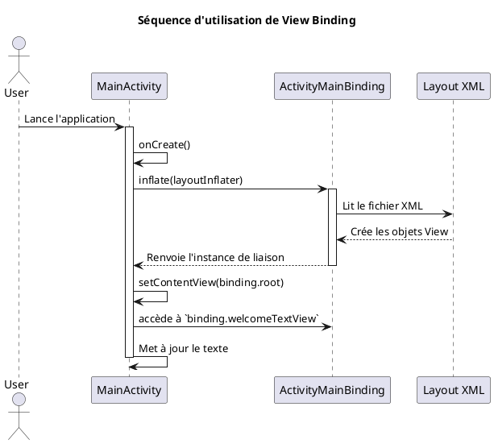

# Module 6 : Rendre l'Interface Interactive

### Objectifs pédagogiques

À la fin de ce module, vous serez capable de :

* Comprendre les limites de l'ancienne méthode `findViewById()` et les avantages de `View Binding`.
* Activer et utiliser `View Binding` pour accéder aux vues de manière sûre et concise.
* Écouter et réagir aux événements de l'utilisateur, en particulier les clics sur les boutons.
* Manipuler les propriétés des widgets depuis le code Kotlin (lire un `EditText`, modifier un `TextView`).

### Introduction

Imaginez que vous venez de construire une magnifique maquette de voiture (notre interface XML). Elle a une carrosserie
rutilante, des roues, un volant... mais elle est statique, posée sur une étagère. Elle est belle, mais inutile. Ce
module est celui où nous allons installer le moteur, brancher la batterie, et connecter le volant aux roues. Nous allons
transformer notre maquette inerte en un véhicule fonctionnel que l'utilisateur peut piloter.

Nous allons apprendre à "lier" les commandes physiques (les vues XML) à la logique de notre application (le code
Kotlin). Quand l'utilisateur appuiera sur la pédale (`Button`), le moteur (`Kotlin`) s'emballera et fera tourner les
roues. C'est le moment où votre application cesse d'être une simple image et devient une véritable expérience
interactive.

### Notions abordées

* Liaison Vue-Code : La méthode moderne `View Binding`
* Gestion des Événements : Les écouteurs d'événements

---

### Liaison Vue-Code : La méthode moderne `View Binding`

#### Introduction à la notion

Imaginez que votre layout XML est une pièce remplie de meubles et que votre code Kotlin est la personne qui doit
interagir avec ces meubles. L'ancienne méthode, `findViewById`, c'était comme entrer dans la pièce les yeux bandés et
chercher à tâtons le "fauteuil rouge" en espérant ne pas tomber ou attraper une chaise à la place.

`View Binding` est beaucoup plus intelligent. C'est comme si, avant d'entrer, on vous donnait un plan détaillé de la
pièce avec un accès direct à chaque meuble. Vous savez exactement où est le "fauteuil rouge", vous savez que c'est bien
un fauteuil, et vous ne risquez pas de vous tromper. C'est plus sûr, plus rapide et beaucoup moins frustrant.

#### Explication de la notion

**Le problème avec `findViewById()`**
Historiquement, pour obtenir une référence à une vue dans le code, on utilisait `findViewById(R.id.mon_id)`. Cette
méthode avait plusieurs inconvénients :

* **Non "Type-Safe" :** Elle renvoyait une `View` générique. Il fallait la "caster" manuellement vers le bon type (
  `Button`, `TextView`...). Une erreur de casting pouvait provoquer un crash.
* **Non "Null-Safe" :** Si vous vous trompiez dans l'ID ou si la vue n'était pas dans le layout actuel, la méthode
  renvoyait `null`, provoquant un `NullPointerException` si vous tentiez de l'utiliser.
* **Verbeux :** Il fallait écrire cette ligne pour chaque vue que l'on voulait manipuler.

**La solution : `View Binding`**
View Binding est une fonctionnalité qui génère une **classe de liaison** (binding class) pour chaque fichier de layout
XML. Cette classe contient des références directes et correctement typées à toutes les vues qui ont un ID.

**Avantages :**

* **Sécurité anti-null (Null-Safety) :** La classe de liaison garantit que si une vue est présente dans le layout, sa
  référence ne sera pas nulle. Fini les crashs dus à des ID incorrects.
* **Sécurité des types (Type-Safety) :** Chaque référence a le bon type (`Button`, `ImageView`...). Fini les erreurs de
  cast.
* **Simplicité :** L'accès aux vues devient trivial : `binding.monBouton`.

<procedure title="Activer et utiliser View Binding">

1. **Activer la fonctionnalité :**
   Ouvrez votre fichier `build.gradle.kts (Module: app)` et ajoutez le bloc `buildFeatures` à l'intérieur du bloc
   `android`.

   ```kotlin
   // Fichier: build.gradle.kts (Module: app)
   android {
       // ... autres configurations
   
       buildFeatures {
           viewBinding = true
       }
   }
   ```
   Cliquez ensuite sur la bannière "Sync Now" qui apparaît en haut de l'éditeur.

2. **Utiliser dans l'Activity :**
   Le processus se fait en trois étapes dans votre fichier `MainActivity.kt`.

   
```kotlin
   package fr.formation.interactiveui
   
   import androidx.appcompat.app.AppCompatActivity
   import android.os.Bundle
   // Le nom de la classe de liaison est généré à partir du nom du layout.
   // activity_main.xml -> ActivityMainBinding
   import fr.formation.interactiveui.databinding.ActivityMainBinding
   
   class MainActivity : AppCompatActivity() {
   
       // 1. Déclarer une variable pour la classe de liaison.
       // 'lateinit' signifie qu'on promet de l'initialiser avant de l'utiliser.
       private lateinit var binding: ActivityMainBinding
   
       override fun onCreate(savedInstanceState: Bundle?) {
           super.onCreate(savedInstanceState)
   
           // 2. "Gonfler" (inflate) le layout et initialiser la variable de liaison.
           binding = ActivityMainBinding.inflate(layoutInflater)
           
           // 3. Définir la vue racine du layout lié comme contenu de l'activité.
           setContentView(binding.root)
   
           // Maintenant, on peut accéder à n'importe quelle vue ayant un ID.
           // Le nom de la variable est l'ID en camelCase.
           // Ex: android:id="@+id/welcome_text_view" -> binding.welcomeTextView
           binding.welcomeTextView.text = "Le View Binding, c'est magique !"
       }
   }
```

</procedure>



---

### Gestion des Événements

#### Introduction à la notion {id="introduction-la-notion_1"}

Notre interface est maintenant connectée, mais elle ne sait pas comment réagir. Un `Button` est comme une sonnette. Par
défaut, quand on appuie dessus, il ne se passe rien. Un **écouteur d'événements** (`EventListener`) est la personne qui
attend près de la porte. Quand elle entend la sonnette, elle exécute une action : ouvrir la porte. La méthode
`setOnClickListener` est la façon de dire à cette personne : "Quand tu entends cette sonnette précise, exécute cette
action précise".

#### Explication de la notion {id="explication-de-la-notion_1"}

Le modèle d'événements d'Android est basé sur des "écouteurs". Un écouteur est un objet qui attend qu'un événement
spécifique se produise. L'écouteur le plus courant est le `OnClickListener`.

Pour l'utiliser, on appelle la méthode `setOnClickListener()` sur une instance de vue (comme un `Button`). On lui passe
en argument un bloc de code (une **lambda** en Kotlin) qui sera exécuté à chaque fois que l'utilisateur cliquera sur
cette vue.

`maVue.setOnClickListener { // code à exécuter lors du clic }`

#### Exemple de code : Un convertisseur simple

Cet exemple prend une valeur dans un `EditText`, et lorsqu'on clique sur un `Button`, il affiche un message dans un
`TextView`.

**1. Le layout `activity_main.xml`**

```xml

<LinearLayout
        xmlns:android="http://schemas.android.com/apk/res/android"
        android:layout_width="match_parent"
        android:layout_height="match_parent"
        android:orientation="vertical"
        android:padding="16dp"
        android:gravity="center">

    <EditText
            android:id="@+id/nameEditText"
            android:layout_width="match_parent"
            android:layout_height="wrap_content"
            android:hint="Entrez votre nom"/>

    <Button
            android:id="@+id/validateButton"
            android:layout_width="wrap_content"
            android:layout_height="wrap_content"
            android:layout_marginTop="16dp"
            android:text="Valider"/>

    <TextView
            android:id="@+id/greetingTextView"
            android:layout_width="wrap_content"
            android:layout_height="wrap_content"
            android:layout_marginTop="16dp"
            android:textSize="20sp"/>
</LinearLayout>
```

**2. Le code `MainActivity.kt`**

```kotlin
package fr.formation.interactiveui

import androidx.appcompat.app.AppCompatActivity
import android.os.Bundle
import fr.formation.interactiveui.databinding.ActivityMainBinding

class MainActivity : AppCompatActivity() {

    private lateinit var binding: ActivityMainBinding

    override fun onCreate(savedInstanceState: Bundle?) {
        super.onCreate(savedInstanceState)
        binding = ActivityMainBinding.inflate(layoutInflater)
        setContentView(binding.root)

        // On configure l'écouteur de clic sur notre bouton
        binding.validateButton.setOnClickListener {
            // Ce bloc de code est exécuté à chaque clic

            // 1. Récupérer le texte depuis l'EditText
            // .text renvoie un objet Editable, on le convertit en String
            val name = binding.nameEditText.text.toString()

            // 2. Créer le message d'accueil
            val greetingMessage = "Bonjour, $name !"

            // 3. Afficher le message dans le TextView
            binding.greetingTextView.text = greetingMessage
        }
    }
}
```

#### Exercice 1 : Mini calculatrice

**Énononcé :**
Créez une interface avec deux `EditText` (pour des nombres), un `Button` ("Additionner") et un `TextView` (pour le
résultat). Quand l'utilisateur clique sur le bouton, le programme doit additionner les deux nombres et afficher le
résultat dans le `TextView`.

**Correction exercice 1** {collapsible='true'}
**1. Le layout `activity_calculator.xml`**

```xml

<LinearLayout
        xmlns:android="http://schemas.android.com/apk/res/android"
        android:layout_width="match_parent"
        android:layout_height="match_parent"
        android:orientation="vertical"
        android:padding="16dp">

    <EditText
            android:id="@+id/numberOneEditText"
            android:layout_width="match_parent"
            android:layout_height="wrap_content"
            android:hint="Premier nombre"
            android:inputType="number"/>

    <EditText
            android:id="@+id/numberTwoEditText"
            android:layout_width="match_parent"
            android:layout_height="wrap_content"
            android:hint="Second nombre"
            android:inputType="number"/>

    <Button
            android:id="@+id/addButton"
            android:layout_width="wrap_content"
            android:layout_height="wrap_content"
            android:layout_gravity="center"
            android:text="Additionner"/>

    <TextView
            android:id="@+id/resultTextView"
            android:layout_width="wrap_content"
            android:layout_height="wrap_content"
            android:layout_gravity="center"
            android:layout_marginTop="20dp"
            android:text="Résultat :"
            android:textSize="24sp"/>
</LinearLayout>
```

**2. Le code `CalculatorActivity.kt`**

```kotlin
package fr.formation.interactiveui

import androidx.appcompat.app.AppCompatActivity
import android.os.Bundle
import fr.formation.interactiveui.databinding.ActivityCalculatorBinding

class CalculatorActivity : AppCompatActivity() {

    private lateinit var binding: ActivityCalculatorBinding

    override fun onCreate(savedInstanceState: Bundle?) {
        super.onCreate(savedInstanceState)
        binding = ActivityCalculatorBinding.inflate(layoutInflater)
        setContentView(binding.root)

        binding.addButton.setOnClickListener {
            // Récupérer les textes des EditText
            val numberOneStr = binding.numberOneEditText.text.toString()
            val numberTwoStr = binding.numberTwoEditText.text.toString()

            // Convertir les textes en nombres.
            // toIntOrNull() renvoie null si le texte n'est pas un nombre valide.
            // L'opérateur Elvis ?: fournit une valeur par défaut de 0.
            val numberOne = numberOneStr.toIntOrNull() ?: 0
            val numberTwo = numberTwoStr.toIntOrNull() ?: 0

            // Calculer la somme
            val sum = numberOne + numberTwo

            // Afficher le résultat dans le TextView
            binding.resultTextView.text = "Résultat : $sum"
        }
    }
}
```

---

### TP 6 : Formulaire de feedback simple

**Objectif :** Combiner View Binding et la gestion d'événements pour créer un formulaire interactif.

<procedure>

1. **Créer le layout (`activity_feedback.xml`) :**
    * Un `EditText` pour le nom de l'utilisateur (`feedbackNameEditText`).
    * Un `EditText` multiligne pour le commentaire (`feedbackCommentEditText`). Pour le rendre multiligne, utilisez
      `android:inputType="textMultiLine"`.
    * Un `Button` "Envoyer" (`submitButton`).
    * Un `TextView` en bas pour afficher un message de confirmation (`confirmationTextView`).

2. **Activer View Binding** (si ce n'est pas déjà fait dans `build.gradle.kts`).

3. **Créer `FeedbackActivity.kt` :**
    * Mettez en place la liaison avec `activity_feedback.xml`.
    * Ajoutez un `setOnClickListener` sur le `submitButton`.

4. **Implémenter la logique du clic :**
    * À l'intérieur du listener, récupérez le nom et le commentaire depuis les `EditText`.
    * Vérifiez si les champs ne sont pas vides (avec `isNotEmpty()`).
    * Si les champs sont remplis, construisez un message de confirmation, par exemple : "Merci, [Nom] ! Votre
      commentaire a bien été reçu.".
    * Affichez ce message dans le `confirmationTextView`.
    * (Bonus) Videz les `EditText` après l'envoi en utilisant `binding.feedbackNameEditText.text.clear()`.

</procedure>

---

### Auto-évaluation

**1. Quel est le principal avantage de View Binding par rapport à `findViewById` ? (QCM)**

* A) Il est compatible avec plus de versions d'Android.
* B) Il garantit la sécurité des types et la sécurité anti-null.
* C) Il permet de créer des animations plus fluides.
* D) Il est écrit en XML, ce qui le rend plus facile à lire.

**2. Quelle ligne de code est correcte pour réagir à un clic sur un bouton référencé par `binding.myButton` ? (QCM)**

* A) `binding.myButton.onClick { ... }`
* B) `binding.myButton.setOnClickListener { ... }`
* C) `new OnClickListener(binding.myButton) { ... }`
* D) `binding.myButton.listenForClick { ... }`

**3. Comment récupère-t-on le contenu textuel d'un `EditText` référencé par `binding.emailInput` ? (QCM)**

* A) `binding.emailInput.text()`
* B) `binding.emailInput.getText`
* C) `binding.emailInput.content`
* D) `binding.emailInput.text.toString()`

**4. Expliquez dans vos propres mots ce qu'est un "écouteur d'événement" (event listener). (Question ouverte)**

**5. Quel est le rôle de la méthode `inflate` dans `ActivityMainBinding.inflate(layoutInflater)` ? (Question ouverte)**

### Correction de l'auto-évaluation {collapsible="true"}

**1. Quel est le principal avantage de View Binding par rapport à `findViewById` ?**

* **Réponse : B) Il garantit la sécurité des types et la sécurité anti-null.**
* **Justification :** View Binding élimine les deux plus grandes sources de bugs de `findViewById` : les crashs dus à
  des casts de type incorrects et les `NullPointerException` dus à des ID erronés.

**2. Quelle ligne de code est correcte pour réagir à un clic sur un bouton référencé par `binding.myButton` ?**

* **Réponse : B) `binding.myButton.setOnClickListener { ... }`**
* **Justification :** C'est la syntaxe standard en Kotlin pour définir un écouteur de clic. La méthode prend une
  fonction lambda qui contient le code à exécuter.

**3. Comment récupère-t-on le contenu textuel d'un `EditText` référencé par `binding.emailInput` ?**

* **Réponse : D) `binding.emailInput.text.toString()`**
* **Justification :** La propriété `.text` d'un `EditText` renvoie un objet de type `Editable`. Pour l'utiliser comme
  une simple chaîne de caractères, il faut explicitement appeler `.toString()`.

**4. Expliquez dans vos propres mots ce qu'est un "écouteur d'événement" (event listener).**

* **Réponse type :** Un écouteur d'événement est un morceau de code qui "attend" qu'une action spécifique se produise
  sur un composant de l'interface (comme un clic sur un bouton, un glissement sur un écran, etc.). Quand l'action se
  produit, l'écouteur se "déclenche" et exécute le code qui lui a été associé. C'est le mécanisme de base pour rendre
  une application interactive.

**5. Quel est le rôle de la méthode `inflate` dans `ActivityMainBinding.inflate(layoutInflater)` ?**

* **Réponse type :** Le verbe "to inflate" (gonfler) en développement UI signifie prendre un fichier de description (
  notre XML) et le transformer en une hiérarchie d'objets `View` réels en mémoire. La méthode `inflate` lit donc le
  fichier `activity_main.xml`, crée une instance de chaque `TextView`, `Button`, etc., les assemble, et nous donne accès
  à eux via l'objet `ActivityMainBinding`.

---

### Conclusion du module

Félicitations ! Vous avez donné vie à votre application. Elle n'est plus une simple maquette statique, mais une
interface qui écoute et qui réagit. Vous maîtrisez maintenant la boucle fondamentale de toute application interactive :

1. **Présenter une interface** à l'utilisateur (XML).
2. **Attendre une action** de sa part (via un `OnClickListener`).
3. **Récupérer des données** et **exécuter une logique** (Kotlin).
4. **Mettre à jour l'interface** pour montrer le résultat.

C'est un jalon immense. Cependant, nos interfaces ne savent pour l'instant afficher que des éléments uniques. Comment
faire pour afficher une liste de contacts, un fil d'actualité, une galerie de photos ? Des données qui peuvent contenir
10, 100, ou 10 000 éléments ? C'est le défi que nous relèverons dans le prochain module avec le `RecyclerView`, le
composant le plus important pour afficher des listes de données.