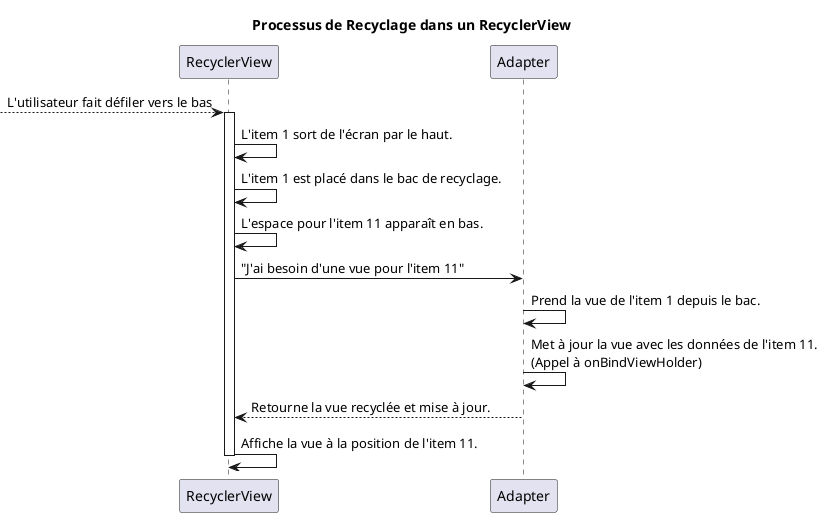

# Module 7 : Afficher des Listes de Données avec `RecyclerView`

### Objectifs pédagogiques

À la fin de ce module, vous serez capable de :

* Expliquer pourquoi le `RecyclerView` est indispensable pour afficher de longues listes.
* Comprendre le principe fondamental du recyclage des vues.
* Identifier et implémenter les trois piliers du `RecyclerView` : `Adapter`, `ViewHolder` et `LayoutManager`.
* Lier une liste de données (objets Kotlin) à une interface utilisateur.
* Mettre à jour dynamiquement le contenu du `RecyclerView` (ajout d'éléments).

### Introduction

Imaginez que vous êtes le gérant d'un restaurant gastronomique avec un menu de 10 000 plats. Si vous deviez imprimer le
menu complet pour chaque client, ce serait un livre énorme, lourd, et incroyablement coûteux à produire. De plus, chaque
client ne regarde qu'une petite portion du menu à la fois.

Quelle serait la solution intelligente ? Vous n'imprimez qu'une dizaine de pages sur un beau porte-menu. Quand le client
fait défiler, au lieu de lui donner de nouvelles pages, vous effacez très rapidement le contenu des pages qu'il ne voit
plus et vous y écrivez les nouveaux plats. Vous "recyclez" constamment le même petit nombre de pages pour afficher une
quantité virtuellement infinie d'informations.

Le `RecyclerView` est ce porte-menu intelligent. Il vous permet d'afficher des milliers d'éléments de manière
incroyablement fluide et performante, en ne créant que le strict minimum de "vues" nécessaires pour remplir l'écran, et
en les réutilisant à l'infini. Maîtriser le `RecyclerView`, c'est maîtriser l'affichage de données sur Android.

### Notions abordées

* Le Concept Clé : Le recyclage des vues pour la performance.
* Les 3 Piliers du RecyclerView : `Adapter`, `ViewHolder`, `LayoutManager`.
* Mise à jour des données.

---

### Le Concept Clé : Le recyclage des vues

#### Introduction à la notion

Comme pour notre menu de restaurant, le secret de la performance n'est pas de tout créer d'un coup, mais de réutiliser
intelligemment un petit nombre d'éléments. C'est le principe fondamental qui différencie un `RecyclerView` d'une simple
liste dans un `ScrollView`, et c'est ce qui le rend capable de gérer des listes immenses sans jamais ralentir.

#### Explication de la notion

Si vous placiez 1000 `TextView` dans un `LinearLayout` à l'intérieur d'un `ScrollView`, Android créerait 1000 objets
`TextView` en mémoire, même si seulement 10 sont visibles à l'écran. C'est un gaspillage énorme de mémoire et de
puissance de calcul, ce qui provoquerait des ralentissements ("lag") lors du défilement.

Le `RecyclerView` résout ce problème de manière brillante :

1. Il ne crée que le nombre de vues d'item nécessaires pour remplir l'écran (disons 10), plus quelques-unes en réserve.
2. Quand l'utilisateur fait défiler et qu'un item sort de l'écran (item 1), le `RecyclerView` ne le détruit pas. Il le
   met de côté, dans un "bac de recyclage".
3. Quand un nouvel item doit apparaître à l'écran (item 11), le `RecyclerView` prend la vue de l'item 1 dans le bac, et
   au lieu de la recréer, il se contente de mettre à jour son contenu avec les données de l'item 11.

Ce processus est extrêmement rapide et efficace.



---

### Les 3 Piliers du RecyclerView

#### Introduction à la notion {id="introduction-la-notion_2"}

Pour que cette magie du recyclage opère, le `RecyclerView` a besoin de trois assistants, chacun avec un rôle très
précis. C'est une équipe parfaitement coordonnée :

1. Le **`ViewHolder`** est l'**acteur**. Il connaît son costume (`item_layout.xml`) et sait où se trouvent ses
   accessoires (`TextView`, `ImageView`...). Il ne sait pas quel rôle il joue.
2. L'**`Adapter`** est le **metteur en scène**. Il a le script complet (la liste de données). Il prend un acteur (
   `ViewHolder`), lui assigne un rôle (les données d'un item précis) et lui dit "Joue cette scène !".
3. Le **`LayoutManager`** est le **régisseur du plateau**. Il décide de la disposition de la scène : est-ce que les
   acteurs se présentent en une seule file indienne (`LinearLayoutManager`) ou en grille (`GridLayoutManager`) ?

#### Explication de la notion {id="explication-de-la-notion_1"}

Pour faire fonctionner un `RecyclerView`, vous devez toujours fournir ces trois composants.

**1. Le `ViewHolder` : Le moule d'un item**

C'est une simple classe qui hérite de `RecyclerView.ViewHolder`. Son unique responsabilité est de **contenir les
références** aux vues à l'intérieur d'un seul item de la liste. Grâce à View Binding, c'est très simple.

```kotlin
// On lie le ViewHolder au layout d'un item : item_user.xml -> ItemUserBinding
class UserViewHolder(val binding: ItemUserBinding) :
    RecyclerView.ViewHolder(binding.root)
```

**2. L'`Adapter` : Le chef d'orchestre**

C'est la pièce maîtresse. Il hérite de `RecyclerView.Adapter` et doit implémenter trois méthodes cruciales :

* `onCreateViewHolder()` : Appelée par le `RecyclerView` quand il a besoin de créer un **nouveau** `ViewHolder` (quand
  le bac de recyclage est vide). C'est ici qu'on "gonfle" le layout XML de l'item.
* `onBindViewHolder()` : Appelée quand le `RecyclerView` veut **réutiliser** un `ViewHolder` existant pour afficher les
  données d'un nouvel item. C'est ici qu'on lie les données à la vue.
* `getItemCount()` : Doit simplement renvoyer le nombre total d'éléments dans votre liste de données.

**3. Le `LayoutManager` : Le metteur en page**

C'est l'objet qui dit au `RecyclerView` comment positionner les items. Vous n'avez généralement pas besoin de le créer
vous-même, il suffit d'utiliser les implémentations fournies par Android :

* `LinearLayoutManager` : Pour une liste verticale ou horizontale.
* `GridLayoutManager` : Pour une grille.

#### Exemple de code : Afficher une liste de tâches

**Étape 1 : Le modèle de données (`Todo.kt`)**

```kotlin
package fr.formation.recyclerview

data class Todo(
    val title: String,
    var isDone: Boolean = false
)
```

**Étape 2 : Le layout pour un seul item (`item_todo.xml`)**

```xml
<!-- res/layout/item_todo.xml -->
<LinearLayout
        xmlns:android="http://schemas.android.com/apk/res/android"
        android:layout_width="match_parent"
        android:layout_height="wrap_content"
        android:padding="16dp">

    <TextView
            android:id="@+id/todoTitleTextView"
            android:layout_width="match_parent"
            android:layout_height="wrap_content"
            android:textSize="18sp"/>

</LinearLayout>
```

**Étape 3 : L'Adapter (`TodoAdapter.kt`)**

```kotlin
package fr.formation.recyclerview

import android.view.LayoutInflater
import android.view.ViewGroup
import androidx.recyclerview.widget.RecyclerView
import fr.formation.recyclerview.databinding.ItemTodoBinding

// L'Adapter a besoin de la liste de données pour travailler
class TodoAdapter(private val todos: List<Todo>) :
    RecyclerView.Adapter<TodoAdapter.TodoViewHolder>() {

    // Le ViewHolder interne, il contient la référence au binding de l'item
    inner class TodoViewHolder(val binding: ItemTodoBinding) :
        RecyclerView.ViewHolder(binding.root)

    // Appelé pour CRÉER une nouvelle vue d'item (quand le bac est vide)
    override fun onCreateViewHolder(parent: ViewGroup, viewType: Int): TodoViewHolder {
        // On "gonfle" le layout XML de notre item
        val binding = ItemTodoBinding
            .inflate(LayoutInflater.from(parent.context), parent, false)
        return TodoViewHolder(binding)
    }

    // Appelé pour METTRE À JOUR une vue d'item avec de nouvelles données
    override fun onBindViewHolder(holder: TodoViewHolder, position: Int) {
        // On récupère la tâche à la position donnée
        val todo = todos[position]
        // On utilise le holder pour accéder aux vues et les mettre à jour
        holder.binding.todoTitleTextView.text = todo.title
    }

    // Doit renvoyer le nombre total d'items dans la liste
    override fun getItemCount(): Int {
        return todos.size
    }
}
```

**Étape 4 : Le layout de l'Activity (`activity_main.xml`)**

```xml

<androidx.recyclerview.widget.RecyclerView
        xmlns:android="http://schemas.android.com/apk/res/android"
        xmlns:app="http://schemas.android.com/apk/res-auto"
        android:id="@+id/recyclerView"
        android:layout_width="match_parent"
        android:layout_height="match_parent"
        app:layoutManager="androidx.recyclerview.widget.LinearLayoutManager"/>
```

**Étape 5 : L'Activity qui assemble tout (`MainActivity.kt`)**

```kotlin
package fr.formation.recyclerview

import androidx.appcompat.app.AppCompatActivity
import android.os.Bundle
import androidx.recyclerview.widget.LinearLayoutManager
import fr.formation.recyclerview.databinding.ActivityMainBinding

class MainActivity : AppCompatActivity() {
    private lateinit var binding: ActivityMainBinding

    override fun onCreate(savedInstanceState: Bundle?) {
        super.onCreate(savedInstanceState)
        binding = ActivityMainBinding.inflate(layoutInflater)
        setContentView(binding.root)

        // 1. Créer la liste de données
        val todoList = mutableListOf(
            Todo("Acheter du lait"),
            Todo("Apprendre RecyclerView"),
            Todo("Faire le TP"),
            Todo("Aller courir")
        )

        // 2. Créer une instance de notre Adapter
        val adapter = TodoAdapter(todoList)

        // 3. Lier l'adapter au RecyclerView
        binding.recyclerView.adapter = adapter

        // 4. (Optionnel si déjà dans le XML) Définir le LayoutManager
        binding.recyclerView.layoutManager = LinearLayoutManager(this)
    }
}
```

#### Exercice 1 : Créer une liste de contacts

**Énoncé :**
Créez une application qui affiche une liste de contacts. Chaque contact a un nom et une adresse e-mail.

1. Créez une `data class Contact(val name: String, val email: String)`.
2. Créez un layout d'item `item_contact.xml` avec deux `TextView`.
3. Créez un `ContactAdapter` qui gère la liaison des données.
4. Dans votre `MainActivity`, créez une liste de `Contact` et affichez-la.

##### **Correction exercice 1** {collapsible='true'}

**1. `Contact.kt`**

```kotlin
data class Contact(val name: String, val email: String)
```

**2. `item_contact.xml`**

```xml

<LinearLayout
        xmlns:android="http://schemas.android.com/apk/res/android"
        android:layout_width="match_parent"
        android:layout_height="wrap_content"
        android:orientation="vertical"
        android:padding="16dp">

    <TextView
            android:id="@+id/nameTextView"
            android:layout_width="wrap_content"
            android:layout_height="wrap_content"
            android:textStyle="bold"
            android:textSize="16sp"/>

    <TextView
            android:id="@+id/emailTextView"
            android:layout_width="wrap_content"
            android:layout_height="wrap_content"
            android:textColor="@android:color/darker_gray"/>
</LinearLayout>
```

**3. `ContactAdapter.kt`**

```kotlin
import android.view.LayoutInflater
import android.view.ViewGroup
import androidx.recyclerview.widget.RecyclerView
import fr.formation.recyclerview.databinding.ItemContactBinding

class ContactAdapter(private val contacts: List<Contact>) :
    RecyclerView.Adapter<ContactAdapter.ContactViewHolder>() {

    inner class ContactViewHolder(val binding: ItemContactBinding) :
        RecyclerView.ViewHolder(binding.root)

    override fun onCreateViewHolder(parent: ViewGroup, viewType: Int): ContactViewHolder {
        // Ici ItemContactBinding fait référence au layout item_contact.xml 
        // transformé en classe par le processus de View Binding
        // L'inflation consiste à stocker en mémoire des instances correspondants
        // aux objets du layout (TextView, ButtonView...)
        val binding = ItemContactBinding
            .inflate(LayoutInflater.from(parent.context), parent, false)
        return ContactViewHolder(binding)
    }

    override fun onBindViewHolder(holder: ContactViewHolder, position: Int) {
        val contact = contacts[position]
        holder.binding.nameTextView.text = contact.name
        holder.binding.emailTextView.text = contact.email
    }

    override fun getItemCount() = contacts.size
}
```

**4. `MainActivity.kt` (la partie `onCreate`)**

```kotlin
override fun onCreate(savedInstanceState: Bundle?) {
    // ... code du binding ...

    val contactList = listOf(
        Contact("Alice", "alice@email.com"),
        Contact("Bob", "bob@email.com"),
        Contact("Charlie", "charlie@email.com")
    )
    val adapter = ContactAdapter(contactList)
    binding.recyclerView.adapter = adapter
    binding.recyclerView.layoutManager = LinearLayoutManager(this)
}
```

---

### Mise à jour des données

#### Introduction à la notion {id="introduction-la-notion_1"}

Notre liste est belle, mais statique. Que se passe-t-il si l'utilisateur veut ajouter un élément ? Nous ne pouvons pas
simplement modifier notre liste de données, il faut aussi **notifier l'adapter** du changement pour qu'il puisse mettre
à jour l'affichage.

#### Explication de la notion {id="explication-de-la-notion_2"}

L'adapter possède des méthodes pour être notifié des changements :

* `notifyDataSetChanged()` : La méthode "brutale". Elle dit à l'adapter que "tout a changé" et le force à redessiner
  toute la liste. C'est simple mais **inefficace** et annule toutes les animations. À éviter si possible.
* `notifyItemInserted(position)` : Notifie l'adapter qu'un nouvel item a été ajouté à une position précise. C'est
  beaucoup plus efficace et permet de jolies animations.
* `notifyItemRemoved(position)` : Notifie qu'un item a été retiré.
* `notifyItemChanged(position)` : Notifie qu'un item a été mis à jour.

<tip>

Pour des mises à jour complexes, Google recommande `ListAdapter` avec `DiffUtil`, une solution plus avancée qui calcule automatiquement les différences entre deux listes et applique les bonnes notifications. Nous nous concentrerons ici sur les notifications manuelles pour bien comprendre le principe.
</tip>

---

## TP 7 : La "Todo List" interactive

**Objectif :** Créer une application de liste de tâches où l'utilisateur peut ajouter de nouvelles tâches qui
apparaissent dynamiquement dans le `RecyclerView`.

<procedure>

1. **Reprenez le code de l'exemple "Afficher une liste de tâches"** (les 5 étapes). Assurez-vous qu'il fonctionne et
   affiche la liste statique.

2. **Modifiez `activity_main.xml` :**
    * Enveloppez votre `RecyclerView` dans un `ConstraintLayout` (ou `LinearLayout`).
    * Ajoutez un `EditText` (`taskEditText`) et un `Button` (`addButton`) en bas de l'écran pour permettre à l'
      utilisateur d'ajouter une tâche.

3. **Modifiez `MainActivity.kt` :**
    * Changez votre liste de `todoList` de `listOf` (immuable) à `mutableListOf` (mutable) pour pouvoir y ajouter des
      éléments.
    * Passez cette liste mutable à votre `TodoAdapter`.
    * Ajoutez un `setOnClickListener` sur votre `addButton`.

4. **Implémentez la logique du clic :**
    * Dans le listener, récupérez le texte de `taskEditText`.
    * Si le texte n'est pas vide :
        * Créez une nouvelle instance de `Todo`.
        * Ajoutez ce nouvel objet à votre `todoList`.
        * **Notifiez l'adapter** qu'un nouvel élément a été inséré à la fin de la liste :
          `adapter.notifyItemInserted(todoList.size - 1)`.
        * Videz l'`EditText`.
        * (Bonus) Faites défiler la liste jusqu'au nouvel élément :
          `binding.recyclerView.scrollToPosition(todoList.size - 1)`.

</procedure>

## Correction du TP 7 {collapsible="true"}


### Prérequis : Le Code de Départ (Étape 1)

Avant de commencer les modifications, voici le code de base fonctionnel pour afficher une liste statique.

### `Todo.kt` (La `data class`)
```kotlin
data class Todo(
    val title: String,
    var isChecked: Boolean = false
)
```

### `item_todo.xml` (Le layout pour une seule tâche)
```xml
<?xml version="1.0" encoding="utf-8"?>
<LinearLayout xmlns:android="http://schemas.android.com/apk/res/android"
    xmlns:tools="http://schemas.android.com/tools"
    android:layout_width="match_parent"
    android:layout_height="wrap_content"
    android:orientation="horizontal"
    android:padding="16dp"
    android:gravity="center_vertical">

    <CheckBox
        android:id="@+id/todoCheckBox"
        android:layout_width="wrap_content"
        android:layout_height="wrap_content" />

    <TextView
        android:id="@+id/todoTitleTextView"
        android:layout_width="0dp"
        android:layout_height="wrap_content"
        android:layout_weight="1"
        android:layout_marginStart="16dp"
        android:textSize="18sp"
        tools:text="Titre de la tâche" />
</LinearLayout>
```

### `TodoAdapter.kt` (L'adaptateur)
```kotlin
import android.view.LayoutInflater
import android.view.ViewGroup
import androidx.recyclerview.widget.RecyclerView
import com.example.yourapplication.databinding.ItemTodoBinding // Adaptez le package

class TodoAdapter(private val todos: List<Todo>) : RecyclerView.Adapter<TodoAdapter.TodoViewHolder>() {

    inner class TodoViewHolder(val binding: ItemTodoBinding) : RecyclerView.ViewHolder(binding.root)

    override fun onCreateViewHolder(parent: ViewGroup, viewType: Int): TodoViewHolder {
        val binding = ItemTodoBinding.inflate(LayoutInflater.from(parent.context), parent, false)
        return TodoViewHolder(binding)
    }

    override fun getItemCount(): Int = todos.size

    override fun onBindViewHolder(holder: TodoViewHolder, position: Int) {
        val todo = todos[position]
        holder.binding.todoTitleTextView.text = todo.title
        holder.binding.todoCheckBox.isChecked = todo.isChecked

        // Gérer le changement d'état de la checkbox
        holder.binding.todoCheckBox.setOnCheckedChangeListener { _, isChecked ->
            todo.isChecked = isChecked
        }
    }
}
```

---

### Correction du TP

#### Étape 2 : Modification du Layout (`activity_main.xml`)

Nous utilisons un `ConstraintLayout` pour positionner facilement les éléments : le `RecyclerView` prend tout l'espace disponible, et les champs d'ajout sont "collés" en bas.

**Fichier : `res/layout/activity_main.xml`**
```xml
<?xml version="1.0" encoding="utf-8"?>
<androidx.constraintlayout.widget.ConstraintLayout
    xmlns:android="http://schemas.android.com/apk/res/android"
    xmlns:app="http://schemas.android.com/apk/res-auto"
    xmlns:tools="http://schemas.android.com/tools"
    android:layout_width="match_parent"
    android:layout_height="match_parent"
    tools:context=".MainActivity">

    <!-- La liste qui affiche les tâches -->
    <androidx.recyclerview.widget.RecyclerView
        android:id="@+id/recyclerView"
        android:layout_width="0dp"
        android:layout_height="0dp"
        app:layout_constraintTop_toTopOf="parent"
        app:layout_constraintStart_toStartOf="parent"
        app:layout_constraintEnd_toEndOf="parent"
        app:layout_constraintBottom_toTopOf="@id/taskEditText"
        android:layout_marginBottom="8dp"/>

    <!-- Champ de saisie pour une nouvelle tâche -->
    <EditText
        android:id="@+id/taskEditText"
        android:layout_width="0dp"
        android:layout_height="wrap_content"
        android:hint="Entrez une nouvelle tâche"
        android:inputType="text"
        app:layout_constraintStart_toStartOf="parent"
        app:layout_constraintBottom_toBottomOf="parent"
        app:layout_constraintEnd_toStartOf="@id/addButton"
        android:layout_margin="16dp" />

    <!-- Bouton pour ajouter la tâche -->
    <Button
        android:id="@+id/addButton"
        android:layout_width="wrap_content"
        android:layout_height="wrap_content"
        android:text="Ajouter"
        app:layout_constraintEnd_toEndOf="parent"
        app:layout_constraintBottom_toBottomOf="@id/taskEditText"
        app:layout_constraintTop_toTopOf="@id/taskEditText"
        android:layout_marginEnd="16dp"/>

</androidx.constraintlayout.widget.ConstraintLayout>
```

#### Étape 3 & 4 : Modification de `MainActivity.kt` et Logique du Clic

Voici le code final de l'activité, intégrant toutes les modifications demandées.

**Fichier : `MainActivity.kt`**
```kotlin
package com.example.yourapplication // Adaptez le package

import androidx.appcompat.app.AppCompatActivity
import android.os.Bundle
import androidx.recyclerview.widget.LinearLayoutManager
import com.example.yourapplication.databinding.ActivityMainBinding // Adaptez le package

class MainActivity : AppCompatActivity() {

    private lateinit var binding: ActivityMainBinding
    private lateinit var todoAdapter: TodoAdapter // On déclare l'adapter en tant que propriété de la classe

    override fun onCreate(savedInstanceState: Bundle?) {
        super.onCreate(savedInstanceState)
        binding = ActivityMainBinding.inflate(layoutInflater)
        setContentView(binding.root)

        // 1. Changer la liste de listOf à mutableListOf
        val todoList = mutableListOf(
            Todo("Faire les courses", true),
            Todo("Apprendre RecyclerView", false),
            Todo("Promener le chien", false)
        )

        // Initialiser l'adapter avec la liste mutable
        todoAdapter = TodoAdapter(todoList)

        // Configuration du RecyclerView
        binding.recyclerView.adapter = todoAdapter
        binding.recyclerView.layoutManager = LinearLayoutManager(this)

        // 2. Ajouter un setOnClickListener sur le bouton
        binding.addButton.setOnClickListener {
            // 3. Récupérer le texte de l'EditText
            val taskTitle = binding.taskEditText.text.toString().trim()

            // 4. Vérifier que le texte n'est pas vide
            if (taskTitle.isNotEmpty()) {
                // Créer une nouvelle tâche
                val newTodo = Todo(taskTitle)

                // Ajouter la tâche à la liste de données
                todoList.add(newTodo)

                // 5. Notifier l'adapter qu'un nouvel élément a été inséré
                // C'est beaucoup plus efficace que notifyDataSetChanged() !
                // Il ne met à jour que la vue concernée et permet une animation.
                val newPosition = todoList.size - 1
                todoAdapter.notifyItemInserted(newPosition)

                // 6. Vider l'EditText pour la prochaine saisie
                binding.taskEditText.text.clear()

                // 7. (Bonus) Faire défiler la liste pour voir le nouvel élément
                binding.recyclerView.scrollToPosition(newPosition)
            }
        }
    }
}
```

### Explications Détaillées du Code

1.  **`mutableListOf(...)`** : Contrairement à `listOf` qui crée une liste en lecture seule (immuable), `mutableListOf` crée une liste que l'on peut modifier après sa création, notamment avec la méthode `.add()`. C'est essentiel pour notre fonctionnalité.

2.  **`lateinit var todoAdapter`** : On a besoin d'accéder à l'adaptateur depuis le listener du bouton. En le déclarant comme une propriété de la classe, il devient accessible partout dans `MainActivity`.

3.  **`binding.addButton.setOnClickListener`** : On attache la logique à exécuter lorsque l'utilisateur clique sur le bouton "Ajouter".

4.  **`val taskTitle = ... .trim()`** : On récupère le texte et on utilise `.trim()` par bonne pratique pour supprimer les espaces superflus au début et à la fin.

5.  **`if (taskTitle.isNotEmpty())`** : Une simple vérification pour s'assurer qu'on n'ajoute pas de tâches vides à la liste.

6.  **`todoList.add(newTodo)`** : On ajoute notre nouvel objet `Todo` à la liste. À ce moment, la liste de données est à jour, mais le `RecyclerView` ne le sait pas encore.

7.  **`todoAdapter.notifyItemInserted(newPosition)`** : C'est **LA ligne la plus importante**. Elle informe l'adaptateur (et donc le `RecyclerView`) qu'une nouvelle donnée a été insérée à une position spécifique (`newPosition`, qui est la fin de la liste). Le `RecyclerView` va alors animer l'apparition de ce nouvel élément. C'est bien plus performant que `notifyDataSetChanged()`, qui force une reconstruction complète de la liste.

8.  **`binding.recyclerView.scrollToPosition(newPosition)`** : Cette ligne améliore l'expérience utilisateur. Si la liste est déjà longue, elle fait défiler automatiquement le `RecyclerView` pour que l'élément qui vient d'être ajouté soit visible à l'écran.

---

## Auto-évaluation

**1. Pourquoi le `RecyclerView` est-il plus performant qu'un `LinearLayout` dans un `ScrollView` pour les longues
listes ? (QCM)**

* A) Il charge toutes les données en avance pour un accès plus rapide.
* B) Il réutilise un petit nombre de vues au lieu d'en créer une pour chaque élément de données.
* C) Il utilise le langage Kotlin qui est nativement plus rapide.
* D) Il compresse les images pour qu'elles prennent moins de place.

**2. Quel est le rôle de la méthode `onBindViewHolder` dans l'Adapter ? (QCM)**

* A) Créer une nouvelle instance de la vue d'un item.
* B) Renvoyer le nombre total d'items.
* C) Mettre à jour le contenu d'une vue d'item existante avec les données d'une position spécifique.
* D) Décider si la liste doit être verticale ou en grille.

**3. Lequel de ces trois composants est responsable de la disposition visuelle des items (en liste verticale, par
exemple) ? (QCM)**

* A) L'Adapter
* B) Le ViewHolder
* C) Le LayoutManager
* D) L'Activity

**4. Quelle est la différence fondamentale entre `onCreateViewHolder` et `onBindViewHolder` ? (Question ouverte)**

**5. Si vous ajoutez un élément à votre liste de données, que devez-vous faire impérativement pour que le changement
soit visible à l'écran ? (Question ouverte)**

### Correction de l'auto-évaluation {collapsible="true"}

**1. Pourquoi le `RecyclerView` est-il plus performant ?**

* **Réponse : B) Il réutilise un petit nombre de vues au lieu d'en créer une pour chaque élément de données.**
* **Justification :** C'est le principe même du recyclage. En évitant de créer des milliers d'objets en mémoire, il
  économise les ressources du système et garantit un défilement fluide.

**2. Quel est le rôle de la méthode `onBindViewHolder` ?**

* **Réponse : C) Mettre à jour le contenu d'une vue d'item existante avec les données d'une position spécifique.**
* **Justification :** `onBindViewHolder` est le cœur du processus de recyclage. C'est là qu'une vue (potentiellement
  recyclée) est "liée" (`bind`) à de nouvelles données.

**3. Lequel de ces trois composants est responsable de la disposition visuelle ?**

* **Réponse : C) Le LayoutManager.**
* **Justification :** Le `LayoutManager` est le "régisseur du plateau". C'est lui qui positionne les items.
  `LinearLayoutManager` les aligne, `GridLayoutManager` les met en grille.

**4. Quelle est la différence fondamentale entre `onCreateViewHolder` et `onBindViewHolder` ?**

* **Réponse type :** `onCreateViewHolder` est appelée lorsque le `RecyclerView` a besoin de **créer une nouvelle vue
  d'item à partir de zéro**, car il n'y en a pas de disponible dans son bac de recyclage. C'est une opération "coûteuse"
  qui n'est effectuée que quelques fois au début. `onBindViewHolder`, en revanche, est appelée pour **prendre une vue
  existante** (qu'elle soit nouvelle ou recyclée) et la **remplir avec les données** d'un item spécifique. C'est une
  opération "légère" qui est appelée constamment pendant le défilement.

**5. Si vous ajoutez un élément à votre liste de données, que devez-vous faire impérativement ?**

* **Réponse type :** Après avoir modifié la liste de données (par exemple, avec `myList.add(newItem)`), il faut
  impérativement **notifier l'adapter du changement**. La meilleure façon de le faire pour un ajout est d'appeler
  `adapter.notifyItemInserted(position)`, où `position` est l'index du nouvel élément. Sans cette notification, la liste
  de données et l'affichage seraient désynchronisés et le nouvel élément n'apparaîtrait pas.

---

## Conclusion du module

Vous venez de maîtriser le composant UI le plus important et le plus polyvalent d'Android. Le `RecyclerView` est
partout, et savoir l'implémenter est une compétence non négociable pour un développeur Android. Vous comprenez
maintenant la logique de performance qui le sous-tend et vous savez comment assembler ses trois piliers pour afficher
n'importe quelle sorte de liste.

Nous avons maintenant des applications qui peuvent avoir un ou plusieurs écrans (même si nous n'avons pas encore vu
comment passer de l'un à l'autre) et afficher des listes de données complexes. C'est une base solide.

La prochaine grande étape est de structurer nos applications pour qu'elles puissent grandir. Comment gérer la navigation
entre plusieurs écrans de manière propre ? Comment découper nos interfaces en composants réutilisables ? C'est ce que
nous allons découvrir dans la prochaine partie sur la Navigation et l'Architecture Multi-Écrans.