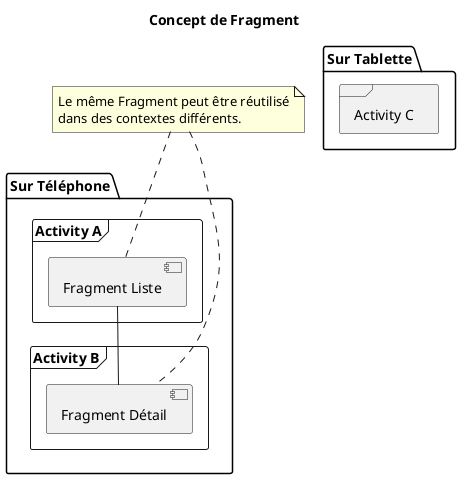
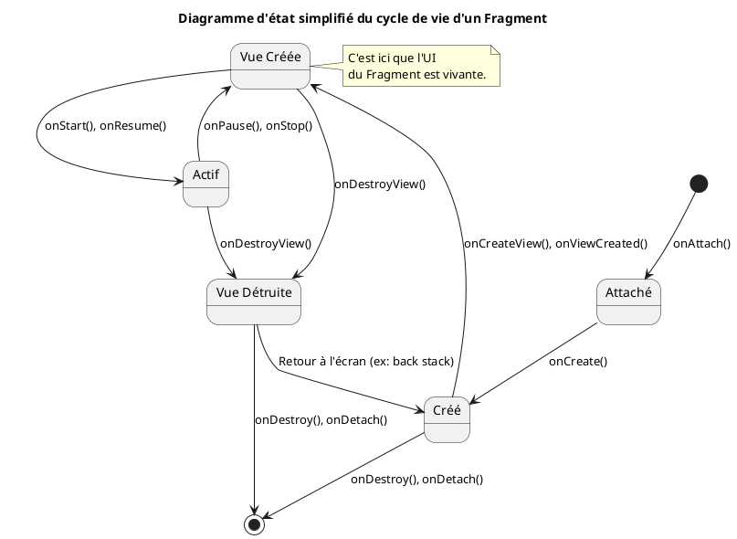

# Module 8 : Modulariser l'UI avec les Fragments

### Objectifs pédagogiques

À la fin de ce module, vous serez capable de :

* Définir ce qu'est un `Fragment` et expliquer son intérêt par rapport à une `Activity`.
* Décrire le cycle de vie d'un Fragment et ses différences clés avec celui d'une Activity.
* Créer une classe `Fragment` avec son propre fichier de layout XML.
* Mettre en place `View Binding` de manière sécurisée dans un Fragment.
* Intégrer statiquement un ou plusieurs Fragments dans une `Activity`.

### Introduction

Si une `Activity` est une maison, un `Fragment` est une pièce préfabriquée que vous pouvez concevoir indépendamment et
ensuite installer où vous le souhaitez. Imaginez que vous construisez une cuisine (`Fragment`) : vous pouvez la placer
dans un petit studio (`Activity` sur téléphone) où elle occupera la majeure partie de l'espace, ou la placer dans une
grande villa (`Activity` sur tablette) à côté d'une salle à manger (`un autre Fragment`). La cuisine elle-même ne change
pas, seule sa place dans la maison change.

Les Fragments sont cette idée puissante de modularité appliquée à l'interface utilisateur. Ils sont plus légers, plus
flexibles et sont devenus la pierre angulaire de l'architecture d'interface recommandée par Google. Comprendre comment
les construire et les utiliser vous ouvrira les portes de la création d'applications complexes et adaptatives.

### Notions abordées

* Pourquoi les Fragments ?
* Le Cycle de Vie d'un Fragment
* Créer et Intégrer un Fragment

---

### Pourquoi les Fragments ?

#### Introduction à la notion

Imaginez que vous devez construire deux maisons : une petite et une grande. Dans la petite, la cuisine et le salon
doivent être séparés. Dans la grande, vous voulez une cuisine ouverte sur le salon. Si vous avez construit votre cuisine
et votre salon comme des blocs inséparables de la structure de la maison (`Activity`), vous devrez redessiner deux plans
complets. Si vous les avez conçus comme des modules indépendants (`Fragment`), vous pouvez simplement les arranger
différemment selon la taille de la maison.

#### Explication de la notion

Un `Fragment` représente une portion modulaire de l'interface utilisateur au sein d'une `Activity`. Ses avantages sont
multiples :

* **Modularité :** Vous pouvez découper votre UI en blocs logiques (un Fragment pour une liste, un autre pour un détail,
  un autre pour un formulaire...). Cela rend le code plus facile à gérer et à tester.
* **Réutilisabilité :** Le même Fragment peut être utilisé dans plusieurs Activités différentes.
* **Adaptabilité :** C'est la clé pour gérer efficacement les différences entre téléphones et tablettes. Sur un
  téléphone, un Fragment peut occuper tout l'écran. Sur une tablette, vous pourriez afficher deux Fragments côte à côte
  dans la même `Activity`.

L'architecture moderne "Single-Activity App" pousse ce concept à son maximum : l'application n'a qu'une seule `Activity`
qui sert de cadre, et tous les écrans sont des `Fragment`s qui sont échangés à l'intérieur de ce cadre.



---

### Le Cycle de Vie d'un Fragment

#### Introduction à la notion {id="introduction-la-notion_1"}

Puisqu'un Fragment vit *à l'intérieur* d'une Activity, son cycle de vie est étroitement lié à celui de son hôte. C'est
comme un locataire dans un immeuble : sa vie est rythmée par sa propre routine, mais aussi par les règles et l'existence
de l'immeuble. Le Fragment a donc ses propres événements de cycle de vie, notamment pour gérer la création et la
destruction de son interface, qui peut se produire plusieurs fois pendant que le Fragment lui-même reste en vie.

#### Explication de la notion {id="explication-de-la-notion_1"}

Le cycle de vie d'un Fragment est plus complexe que celui d'une Activity. Voici les étapes les plus importantes :

* `onAttach()`: Le Fragment est attaché à son Activity hôte.
* `onCreate()`: Le Fragment est en cours de création (initialisations non graphiques).
* **`onCreateView()`**: C'est ici que le Fragment doit "gonfler" (inflate) son fichier de layout XML pour créer sa
  hiérarchie de vues. C'est la méthode la plus importante.
* **`onViewCreated()`**: Appelée juste après `onCreateView()`. La vue a été créée et n'est pas nulle. C'est **le
  meilleur endroit** pour configurer les vues (définir des listeners, initialiser un RecyclerView, etc.).
* `onStart()` / `onResume()`: Le cycle de vie du Fragment suit celui de son Activity.
* `onPause()` / `onStop()`: Idem.
* **`onDestroyView()`**: La hiérarchie de vues associée au Fragment est détruite et retirée de l'écran. C'est ici qu'il
  faut nettoyer toute référence aux vues pour éviter les fuites de mémoire.
* `onDestroy()`: Le Fragment est en cours de destruction finale.
* `onDetach()`: Le Fragment est détaché de son Activity hôte.



---

### Créer et Intégrer un Fragment

#### Introduction à la notion {id="introduction-la-notion_2"}

Nous allons maintenant construire notre première "pièce préfabriquée". Nous allons d'abord dessiner les plans de la
pièce (le XML), puis construire la structure de la pièce elle-même (la classe Kotlin), et enfin dire à notre maison (
`Activity`) à quel endroit précis nous voulons l'installer.

#### Explication de la notion {id="explication-de-la-notion_2"}

La création d'un Fragment se fait en deux temps :

1. **Le Layout XML :** Un fichier XML classique qui définit l'apparence du Fragment.
2. **La Classe Kotlin :** Une classe qui hérite de `androidx.fragment.app.Fragment` et qui lie la logique au layout.

L'intégration la plus simple est **statique** : on utilise la balise `<androidx.fragment.app.FragmentContainerView>`
dans le layout de l'Activity pour désigner un emplacement permanent pour un Fragment.

#### Exemple de code : Un Fragment de carte de profil

**1. Le layout du Fragment (`fragment_profile_card.xml`)**

```xml
<!-- res/layout/fragment_profile_card.xml -->
<LinearLayout xmlns:android="http://schemas.android.com/apk/res/android"
              android:layout_width="match_parent"
              android:layout_height="wrap_content"
              android:orientation="vertical"
              android:gravity="center"
              android:padding="16dp"
              android:background="#EEE">

    <ImageView
            android:id="@+id/avatarImageView"
            android:layout_width="80dp"
            android:layout_height="80dp"
            android:src="@android:drawable/sym_def_app_icon"/>

    <TextView
            android:id="@+id/nameTextView"
            android:layout_width="wrap_content"
            android:layout_height="wrap_content"
            android:layout_marginTop="8dp"
            android:text="Nom de l'utilisateur"
            android:textStyle="bold"/>

</LinearLayout>
```

**2. La classe du Fragment (`ProfileCardFragment.kt`)**

```kotlin
package fr.formation.fragments

import android.os.Bundle
import android.view.LayoutInflater
import android.view.View
import android.view.ViewGroup
import androidx.fragment.app.Fragment
import fr.formation.fragments.databinding.FragmentProfileCardBinding

class ProfileCardFragment : Fragment() {

    // Le View Binding doit être nullable dans un Fragment
    private var _binding: FragmentProfileCardBinding? = null

    // Cette propriété non-nulle est une astuce pour un accès facile et sûr
    private val binding get() = _binding!!

    override fun onCreateView(
        inflater: LayoutInflater,
        container: ViewGroup?,
        savedInstanceState: Bundle?
    ): View {
        // Gonfler le layout et initialiser le binding
        _binding = FragmentProfileCardBinding.inflate(inflater, container, false)
        // Renvoyer la vue racine du layout
        return binding.root
    }

    override fun onViewCreated(view: View, savedInstanceState: Bundle?) {
        super.onViewCreated(view, savedInstanceState)

        // C'est ici qu'on manipule les vues en toute sécurité
        binding.nameTextView.text = "Alice Dubois"
    }

    override fun onDestroyView() {
        super.onDestroyView()
        // Nettoyer la référence au binding pour éviter les fuites de mémoire
        _binding = null
    }
}
```

**3. L'intégration dans l'Activity (`activity_main.xml`)**

```xml
<!-- res/layout/activity_main.xml -->
<LinearLayout xmlns:android="http://schemas.android.com/apk/res/android"
              android:layout_width="match_parent"
              android:layout_height="match_parent"
              android:orientation="vertical"
              android:gravity="center">

    <TextView
            android:layout_width="wrap_content"
            android:layout_height="wrap_content"
            android:text="Ceci est dans l'Activity"
            android:layout_marginBottom="20dp"/>

    <!-- Conteneur pour notre Fragment -->
    <androidx.fragment.app.FragmentContainerView
            android:id="@+id/profile_card_container"
            android:layout_width="match_parent"
            android:layout_height="wrap_content"
            android:name="fr.formation.fragments.ProfileCardFragment"/>

</LinearLayout>
```

#### Exercice 1 : Créer et ajouter un Header

**Énoncé :**
Votre mission est de créer un deuxième Fragment, un `HeaderFragment`, qui affiche un titre et un sous-titre. Ensuite,
modifiez le layout de la `MainActivity` pour afficher ce nouveau `HeaderFragment` au-dessus du `ProfileCardFragment`
existant.

##### **Correction exercice 1** {collapsible='true'}

**1. Créez le layout du header (`fragment_header.xml`)**

```xml
<!-- res/layout/fragment_header.xml -->
<LinearLayout xmlns:android="http://schemas.android.com/apk/res/android"
              android:layout_width="match_parent"
              android:layout_height="wrap_content"
              android:orientation="vertical"
              android:padding="16dp"
              android:background="#B2DFDB">

    <TextView
            android:id="@+id/headerTitle"
            android:layout_width="wrap_content"
            android:layout_height="wrap_content"
            android:text="Titre de l'application"
            android:textSize="22sp"
            android:textStyle="bold"/>

    <TextView
            android:id="@+id/headerSubtitle"
            android:layout_width="wrap_content"
            android:layout_height="wrap_content"
            android:text="Un sous-titre descriptif"/>
</LinearLayout>
```

**2. Créez la classe du Fragment (`HeaderFragment.kt`)**

```kotlin
package fr.formation.fragments

import android.os.Bundle
import android.view.LayoutInflater
import android.view.View
import android.view.ViewGroup
import androidx.fragment.app.Fragment
import fr.formation.fragments.databinding.FragmentHeaderBinding

class HeaderFragment : Fragment() {

    private var _binding: FragmentHeaderBinding? = null
    private val binding get() = _binding!!

    override fun onCreateView(
        inflater: LayoutInflater, container: ViewGroup?, savedInstanceState: Bundle?
    ): View {
        _binding = FragmentHeaderBinding.inflate(inflater, container, false)
        return binding.root
    }

    override fun onViewCreated(view: View, savedInstanceState: Bundle?) {
        super.onViewCreated(view, savedInstanceState)
        // On pourrait personnaliser le titre ici si besoin
        binding.headerTitle.text = "Mon Application Modulaire"
    }

    override fun onDestroyView() {
        super.onDestroyView()
        _binding = null
    }
}
```

**3. Modifiez `activity_main.xml` pour inclure les deux Fragments**

```xml
<!-- res/layout/activity_main.xml -->
<LinearLayout xmlns:android="http://schemas.android.com/apk/res/android"
              android:layout_width="match_parent"
              android:layout_height="match_parent"
              android:orientation="vertical">

    <!-- Conteneur pour le Header Fragment -->
    <androidx.fragment.app.FragmentContainerView
            android:id="@+id/header_container"
            android:layout_width="match_parent"
            android:layout_height="wrap_content"
            android:name="fr.formation.fragments.HeaderFragment"/>

    <!-- Conteneur pour le Profile Card Fragment -->
    <androidx.fragment.app.FragmentContainerView
            android:id="@+id/profile_card_container"
            android:layout_width="match_parent"
            android:layout_height="wrap_content"
            android:layout_marginTop="20dp"
            android:layout_marginHorizontal="16dp"
            android:name="fr.formation.fragments.ProfileCardFragment"/>

</LinearLayout>
```

En lançant l'application, vous verrez maintenant les deux modules d'UI s'afficher l'un après l'autre, chacun géré par sa
propre classe `Fragment`.

---

## Auto-évaluation

**1. Dans quelle méthode du cycle de vie d'un Fragment doit-on "gonfler" le layout XML ? (QCM)**

* A) `onCreate()`
* B) `onAttach()`
* C) `onCreateView()`
* D) `onViewCreated()`

**2. Comment ajoute-t-on un Fragment de manière statique dans le layout d'une Activity ? (QCM)**

* A) En utilisant une balise `<Fragment>` et l'attribut `android:class`.
* B) En utilisant une balise `<androidx.fragment.app.FragmentContainerView>` et l'attribut `android:name`.
* C) En appelant `setContentView` plusieurs fois.
* D) Cela n'est pas possible, on doit le faire dynamiquement en Kotlin.

**3. Pourquoi est-il crucial de mettre `_binding = null` dans `onDestroyView()` ? (QCM)**

* A) Pour que la vue se redessine correctement la prochaine fois.
* B) Pour libérer les ressources et éviter les fuites de mémoire.
* C) Pour déclencher la méthode `onCreateView()` à nouveau.
* D) C'est une convention de style, cela n'a pas d'impact technique.

**4. Expliquez avec vos mots l'avantage principal des Fragments pour la gestion des écrans de tablette par rapport aux
téléphones. (Question ouverte)**

**5. Dans quelle méthode du cycle de vie d'un Fragment est-il le plus sûr de configurer des `setOnClickListener` sur des
boutons, et pourquoi ? (Question ouverte)**

### Correction de l'auto-évaluation {collapsible="true"}

**1. Dans quelle méthode du cycle de vie d'un Fragment doit-on "gonfler" le layout XML ?**

* **Réponse : C) `onCreateView()`**
* **Justification :** Le but de `onCreateView` est spécifiquement de créer et de retourner la hiérarchie de vues du
  Fragment. C'est sa responsabilité unique.

**2. Comment ajoute-t-on un Fragment de manière statique ?**

* **Réponse : B) En utilisant une balise `<androidx.fragment.app.FragmentContainerView>` et l'attribut `android:name`.**
* **Justification :** `FragmentContainerView` est le conteneur moderne et recommandé pour héberger des Fragments.
  L'attribut `android:name` permet de spécifier le chemin complet de la classe du Fragment à instancier.

**3. Pourquoi est-il crucial de mettre `_binding = null` dans `onDestroyView()` ?**

* **Réponse : B) Pour libérer les ressources et éviter les fuites de mémoire.**
* **Justification :** Quand la vue est détruite, l'instance du Fragment peut rester en mémoire (par exemple, dans la
  pile de retour). Si on ne supprime pas la référence à la vue via le binding, le Fragment garderait en mémoire toute la
  hiérarchie de vues détruites, ce qui constitue une fuite de mémoire importante.

**4. Expliquez avec vos mots l'avantage principal des Fragments pour la gestion des écrans de tablette.**

* **Réponse type :** Sur un téléphone, on a souvent un flux d'écrans où l'un remplace l'autre (ex: une liste, puis un
  clic mène à un écran de détail). Sur une tablette, l'espace d'écran plus grand permet d'afficher ces deux éléments en
  même temps. En concevant la liste et le détail comme deux `Fragment`s distincts, on peut les afficher l'un après l'
  autre sur téléphone, et côte à côte dans la même `Activity` sur tablette, maximisant ainsi l'utilisation de l'espace
  sans dupliquer de code.

**5. Dans quelle méthode est-il le plus sûr de configurer des `setOnClickListener` ?**

* **Réponse type :** Il est plus sûr de le faire dans `onViewCreated()`. La raison est que cette méthode est appelée
  juste après `onCreateView()`, à un moment où l'on a la garantie que la vue a été créée avec succès et n'est pas
  `null`. Tenter de le faire dans `onCreate()` par exemple, planterait l'application car la vue n'existe pas encore.

---

## Conclusion du module

Vous avez maintenant ajouté un outil architectural essentiel à votre boîte à outils. Vous savez comment découper une
interface complexe en morceaux logiques et réutilisables. Cette compétence est la base de toute application Android
moderne et bien conçue.

Nous avons vu comment intégrer nos "pièces préfabriquées" de manière statique. Mais que se passe-t-il si nous voulons
naviguer entre elles ? Remplacer une pièce par une autre ? C'est comme vouloir passer du salon à la chambre. Il nous
faut des portes et des couloirs. C'est exactement ce que nous allons construire dans le prochain module avec le *
*Navigation Component**, qui va orchestrer tous ces Fragments pour créer un flux de navigation fluide et centralisé.