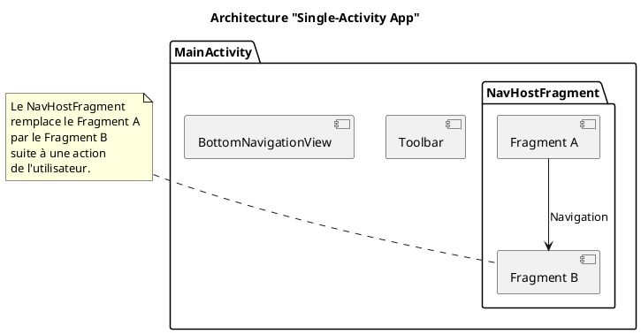

# Module 9 : Navigation Moderne avec le Navigation Component

### Objectifs pédagogiques

À la fin de ce module, vous serez capable de :

* Comprendre et appliquer le principe de l'architecture "Single-Activity".
* Mettre en place et configurer le Navigation Component dans un projet.
* Créer un graphe de navigation visuel pour définir les écrans et les transitions.
* Utiliser un `NavHostFragment` comme conteneur principal de l'UI.
* Déclencher des navigations entre Fragments à l'aide du `NavController`.
* Passer des arguments entre les écrans de manière sécurisée et "type-safe" avec Safe Args.

### Introduction

Imaginez que vous construisez une ville. L'ancienne méthode de navigation Android, c'était comme construire des routes
au fur et à mesure, sans plan d'urbanisme. Chaque carrefour était une décision complexe, et il était facile de créer des
impasses ou de se perdre. C'était chaotique et difficile à maintenir.

Le **Navigation Component** est votre plan d'urbanisme centralisé. C'est un GPS intelligent pour votre application. Vous
lui donnez une carte complète de tous les lieux (`Fragments`) et de toutes les routes possibles (`Actions`). Ensuite,
pour aller d'un point A à un point B, il vous suffit de dire au GPS "Emmène-moi à cette destination". Il s'occupe de
tout le trajet, y compris le chemin du retour. C'est une approche qui rend la navigation visuelle, prévisible et
beaucoup plus simple à gérer.

### Notions abordées

* Le principe de la "Single-Activity App"
* Les 3 Piliers du Navigation Component : Graph, NavHost, NavController
* Passer des Données de manière Sécurisée avec `Safe Args`

---

### Le principe de la "Single-Activity App"

#### Introduction à la notion

Pensez à votre application comme à un cadre photo numérique (`Activity`). Au lieu de changer de cadre à chaque fois que
vous voulez montrer une nouvelle photo, vous gardez le même cadre et vous changez simplement la photo (`Fragment`) qui
est affichée à l'intérieur. C'est plus simple, plus économique en ressources et plus fluide pour les transitions.

#### Explication de la notion

C'est l'architecture recommandée par Google aujourd'hui. L'application entière est contenue dans une seule et unique
`MainActivity`. Le layout de cette Activity est très simple : il contient principalement un conteneur spécial, le
`NavHostFragment`, qui occupe tout l'espace disponible. C'est ce conteneur qui va "héberger" et échanger les Fragments
en fonction de la navigation de l'utilisateur.

L'Activity gère le cadre global (comme une barre d'outils ou un menu de navigation en bas), et le `NavHostFragment` gère
le contenu de l'écran qui change.



---

### Les 3 Piliers du Navigation Component

#### Introduction à la notion {id="introduction-la-notion_1"}

Pour que notre GPS fonctionne, il lui faut trois choses essentielles et indissociables :

1. Une **Carte** (`Navigation Graph`) : Le plan de toutes les destinations et de toutes les routes.
2. Un **Écran d'affichage** (`NavHostFragment`) : La partie de l'interface qui montre où nous sommes actuellement.
3. Un **Conducteur** (`NavController`) : L'entité qui reçoit l'ordre "Aller à..." et qui exécute le trajet.

#### Explication de la notion {id="explication-de-la-notion_1"}

**1. `Navigation Graph` (`nav_graph.xml`)**
C'est une ressource XML qui est la source de vérité pour votre navigation. Elle contient :

* Les **Destinations** : Chaque écran de votre application (généralement un `Fragment`).
* Les **Actions** : Les "flèches" qui représentent les chemins possibles d'une destination à une autre.
* Les **Arguments** : Les données que vous pouvez passer d'une destination à l'autre.
  Android Studio fournit un éditeur visuel puissant pour concevoir ce graphe.

**2. `NavHostFragment`**
C'est un `Fragment` spécial que vous placez dans le layout de votre `MainActivity`. Son seul rôle est d'agir comme une
fenêtre qui affiche la destination actuelle du graphe de navigation.

**3. `NavController`**
C'est l'objet Kotlin que vous utilisez dans votre code pour piloter la navigation. Vous le récupérez depuis n'importe
quel Fragment hébergé par le `NavHost` et vous lui donnez des ordres, comme `navController.navigate(...)`.

<procedure title="Mise en place du Navigation Component">

1. **Ajouter les dépendances** dans `build.gradle.kts (Module: app)` :
   ```kotlin
   dependencies {
       // Assurez-vous d'utiliser les dernières versions
       val nav_version = "2.7.7" 
   
       // Dépendances fondamentales pour la navigation avec les Fragments
       implementation("androidx.navigation:navigation-fragment-ktx:$nav_version")
       implementation("androidx.navigation:navigation-ui-ktx:$nav_version")
   }
   ```
   N'oubliez pas de synchroniser Gradle.

2. **Créer le graphe de navigation** :
    * Clic droit sur le dossier `res` -> New -> Android Resource File.
    * **File name:** `nav_graph`
    * **Resource type:** `Navigation`
    * Cliquez sur OK.

3. **Ajouter le `NavHostFragment` à `activity_main.xml`** :
   ```xml
   <androidx.constraintlayout.widget.ConstraintLayout 
       xmlns:android="http://schemas.android.com/apk/res/android"
       xmlns:app="http://schemas.android.com/apk/res-auto"
       android:layout_width="match_parent"
       android:layout_height="match_parent">
   
       <androidx.fragment.app.FragmentContainerView
           android:id="@+id/nav_host_fragment"
           android:name="androidx.navigation.fragment.NavHostFragment"
           android:layout_width="0dp"
           android:layout_height="0dp"
           app:defaultNavHost="true"
           app:navGraph="@navigation/nav_graph"
           app:layout_constraintTop_toTopOf="parent"
           app:layout_constraintBottom_toBottomOf="parent"
           app:layout_constraintStart_toStartOf="parent"
           app:layout_constraintEnd_toEndOf="parent"/>
   
   </androidx.constraintlayout.widget.ConstraintLayout>
   ```

</procedure>

#### Exercice 1 : Navigation entre deux Fragments

**Énoncé :**
Créez une application avec un `HomeFragment` et un `SettingsFragment`. Le `HomeFragment` contient un bouton qui,
lorsqu'on clique dessus, navigue vers le `SettingsFragment`.

**Correction exercice 1** {collapsible='true'}

1. **Créez les deux fragments** (`HomeFragment`, `SettingsFragment`) et leurs layouts. Le layout de `HomeFragment` doit
   contenir un `Button` avec l'id `settingsButton`.
2. **Ouvrez `res/navigation/nav_graph.xml`** dans l'éditeur visuel (Design).
3. **Ajoutez les destinations :** Cliquez sur l'icône "New Destination" (un téléphone avec un `+`) et ajoutez
   `HomeFragment` et `SettingsFragment`.
4. **Définissez le point de départ :** Sélectionnez `HomeFragment` et cliquez sur l'icône "Assign start destination" (
   une petite maison).
5. **Créez une action :** Cliquez sur le cercle à droite de `HomeFragment` et faites-le glisser jusqu'à
   `SettingsFragment`. Une flèche (une action) est créée.
6. **Ajoutez le code de navigation dans `HomeFragment.kt` :**
   ```kotlin
   // Dans HomeFragment.kt
   override fun onViewCreated(view: View, savedInstanceState: Bundle?) {
       super.onViewCreated(view, savedInstanceState)
   
       // On utilise la navigation pour trouver le NavController
       binding.settingsButton.setOnClickListener {
           // R.id.action_homeFragment_to_settingsFragment est l'ID de la flèche
           // que vous avez créée dans le graphe.
           findNavController().navigate(R.id.action_homeFragment_to_settingsFragment)
       }
   }
   ```
   (N'oubliez pas d'importer `androidx.navigation.fragment.findNavController`)

---

### Passer des Données de manière Sécurisée avec `Safe Args`

#### Introduction à la notion {id="introduction-la-notion_2"}

Imaginez que vous envoyez un colis. L'ancienne méthode (`Bundle`) revenait à prendre une boîte en carton générique, y
mettre votre objet, et écrire l'adresse et le contenu à la main sur une étiquette. Vous pouviez faire des fautes de
frappe, envoyer un objet fragile dans une mauvaise boîte, ou vous tromper d'adresse.

`Safe Args` est un service d'expédition premium. Vous lui dites "Je veux envoyer un livre à cette adresse". Il vous
fournit la boîte parfaite pour un livre, avec une étiquette pré-imprimée, impossible à falsifier. Il garantit que le bon
type d'objet arrive à la bonne destination.

#### Explication de la notion {id="explication-de-la-notion_2"}

`Safe Args` est un plugin Gradle qui lit votre graphe de navigation et génère des classes Kotlin simples et sécurisées
pour passer des données entre les destinations.

**Avantages :**

* **Sécurité des types :** Vous ne pouvez pas passer un `Int` si la destination attend un `String`. Le compilateur vous
  arrêtera.
* **Sécurité anti-null :** Gère correctement les arguments nullables et non-nullables.
* **Code concis :** Fini les "clés magiques" (`"user_id_key"`) et la manipulation manuelle du `Bundle`.

<procedure title="Mettre en place Safe Args">

1. **Ajouter le plugin Gradle :**
   Dans le fichier `build.gradle.kts` **au niveau du projet** (le premier) :
   ```kotlin
   plugins {
       // ...
       id("androidx.navigation.safeargs.kotlin") version "2.7.7" apply false
   }
   ```
   Dans le fichier `build.gradle.kts` **au niveau du module** (`:app`) :
   ```kotlin
   plugins {
       // ...
       id("androidx.navigation.safeargs.kotlin")
   }
   ```
   Synchronisez Gradle.

2. **Définir un argument dans le graphe de navigation :**
    * Ouvrez `nav_graph.xml` en mode Design.
    * Sélectionnez la destination qui doit **recevoir** l'argument (ex: `DetailFragment`).
    * Dans le panneau "Attributes" à droite, trouvez la section "Arguments" et cliquez sur le `+`.
    * Donnez un nom à l'argument (ex: `itemId`), choisissez son type (`String`, `Integer`, etc.) et une valeur par
      défaut si besoin.

3. **Utiliser les classes générées :**
    * **Pour envoyer :** Safe Args génère une classe `[NomDuFragmentOrigine]Directions` avec une méthode pour chaque
      action.
    * **Pour recevoir :** Safe Args génère une classe `[NomDuFragmentDestination]Args`.

</procedure>

#### Exemple de code : Passer un ID

**1. Dans `nav_graph.xml`, on ajoute un argument `itemId` de type `String` à `DetailFragment`.**

**2. Dans `HomeFragment.kt` (pour envoyer) :**

```kotlin
// Dans HomeFragment.kt
binding.someButton.setOnClickListener {
    val idToSend = "product-123"

    // 1. On utilise la classe Directions générée pour créer l'action
    val action = HomeFragmentDirections.actionHomeFragmentToDetailFragment(
        itemId = idToSend
    )

    // 2. On navigue avec l'objet action
    findNavController().navigate(action)
}
```

**3. Dans `DetailFragment.kt` (pour recevoir) :**

```kotlin
// Dans la classe DetailFragment.kt
import androidx.navigation.fragment.navArgs

class DetailFragment : Fragment() {

    // ... code du binding ...

    // On récupère les arguments en utilisant le délégué de propriété navArgs()
    private val args: DetailFragmentArgs by navArgs()

    override fun onViewCreated(view: View, savedInstanceState: Bundle?) {
        super.onViewCreated(view, savedInstanceState)

        // On peut maintenant accéder à l'argument de manière sûre et typée
        val receivedId = args.itemId
        binding.detailTextView.text = "Détails pour l'item ID : $receivedId"
    }
}
```

#### Exercice 2 : Personnaliser l'écran de bienvenue

**Énoncé :**
Créez un `LoginFragment` avec un `EditText` pour le nom et un `Button`. Créez un `WelcomeFragment` avec un `TextView`.
Lorsque l'utilisateur entre son nom et clique sur le bouton, l'application doit naviguer vers `WelcomeFragment` et
afficher "Bienvenue, [Nom entré] !". Utilisez Safe Args.

**Correction exercice 2** {collapsible='true'}

1. **Configurez `nav_graph.xml` :**
    * Ajoutez `LoginFragment` et `WelcomeFragment`.
    * Définissez `LoginFragment` comme destination de départ.
    * Créez une action de `LoginFragment` vers `WelcomeFragment`.
    * Sélectionnez `WelcomeFragment` et ajoutez-lui un argument `username` de type `String`.
2. **Code dans `LoginFragment.kt` :**
   ```kotlin
   // Dans LoginFragment.kt
   binding.loginButton.setOnClickListener {
       val enteredName = binding.nameEditText.text.toString()
       if (enteredName.isNotEmpty()) {
           val action = LoginFragmentDirections
               .actionLoginFragmentToWelcomeFragment(username = enteredName)
           findNavController().navigate(action)
       }
   }
   ```
3. **Code dans `WelcomeFragment.kt` :**
   ```kotlin
   // Dans WelcomeFragment.kt
   private val args: WelcomeFragmentArgs by navArgs()

   override fun onViewCreated(view: View, savedInstanceState: Bundle?) {
       super.onViewCreated(view, savedInstanceState)
       val name = args.username
       binding.welcomeTextView.text = "Bienvenue, $name !"
   }
   ```

---

### TP 9 : Mini Application de Tâches

**Objectif :** Créer une application simple avec une liste de tâches (`ListFragment`) et un écran pour ajouter une
nouvelle tâche (`AddFragment`). La nouvelle tâche doit être passée en retour au `ListFragment`.

<procedure>

1. **Créez un projet Single-Activity** et configurez le Navigation Component et Safe Args.
2. **Créez deux Fragments :** `TaskListFragment` et `AddTaskFragment`.
3. **Dans `nav_graph.xml` :**
    * Mettez `TaskListFragment` comme destination de départ.
    * Créez une action de `TaskListFragment` vers `AddTaskFragment`.
    * Créez une action de `AddTaskFragment` vers `TaskListFragment` (pour revenir après l'ajout).
4. **`TaskListFragment` :**
    * Affichez une liste de tâches (pour commencer, une liste statique) dans un `RecyclerView`.
    * Ajoutez un bouton flottant (Floating Action Button) qui déclenche la navigation vers `AddTaskFragment`.
5. **`AddTaskFragment` :**
    * Contient un `EditText` pour le titre de la tâche et un `Button` "Ajouter".
    * Quand on clique sur "Ajouter", on ne navigue pas simplement en arrière. Il faut **retourner le résultat**. Pour
      cela, on utilise le `previousBackStackEntry` :
   ```kotlin
   binding.addButton.setOnClickListener {
       val taskTitle = binding.taskEditText.text.toString()
       // On place le résultat dans un "SavedStateHandle"
       findNavController().previousBackStackEntry?.savedStateHandle?.set(
           "new_task_key", 
           taskTitle
       )
       // On revient en arrière
       findNavController().popBackStack()
   }
   ```
6. **De retour dans `TaskListFragment` :**
    * Dans `onViewCreated`, observez le résultat de la pile de retour :
   ```kotlin
   val navBackStackEntry = findNavController().currentBackStackEntry!!
   val observer = LifecycleEventObserver { _, event ->
       if (event == Lifecycle.Event.ON_RESUME
           && navBackStackEntry.savedStateHandle.contains("new_task_key")) {
           val taskTitle = navBackStackEntry.savedStateHandle
               .get<String>("new_task_key")
           // Faites quelque chose avec la nouvelle tâche...
           // Ajoutez-la à votre liste et notifiez l'adapter.
           // N'oubliez pas de retirer la clé pour ne pas la traiter à nouveau
           navBackStackEntry.savedStateHandle.remove<String>("new_task_key")
       }
   }
   navBackStackEntry.lifecycle.addObserver(observer)
   // Assurez-vous de retirer l'observer dans onDestroyView
   viewLifecycleOwner.lifecycle.addObserver(LifecycleEventObserver { _, event ->
       if (event == Lifecycle.Event.ON_DESTROY) {
           navBackStackEntry.lifecycle.removeObserver(observer)
       }
   })
   ```
   <note>
   Passer des résultats en retour est un cas d'usage plus avancé, mais fondamental. C'est la manière moderne de faire ce qui était autrefois géré par `onActivityResult`.
   </note>

</procedure>

---

### Auto-évaluation

**1. Dans le graphe de navigation, qu'est-ce qu'une "action" ? (QCM)**

* A) Un écran de l'application, représenté par un Fragment.
* B) Un lien logique entre deux destinations, qui représente un chemin de navigation possible.
* C) Une fonction Kotlin qui est exécutée lors d'un clic.
* D) Un argument passé entre deux fragments.

**2. Quel est l'avantage principal de Safe Args ? (QCM)**

* A) Il accélère la vitesse de navigation entre les fragments.
* B) Il permet de passer des arguments sans écrire de code Kotlin.
* C) Il génère du code qui garantit la sécurité des types et évite les erreurs de clés.
* D) Il compresse les données pour qu'elles prennent moins de place.

**3. Dans une architecture "Single-Activity", où place-t-on le `NavHostFragment` ? (QCM)**

* A) Dans le fichier `build.gradle.kts`.
* B) Dans le layout XML de chaque Fragment.
* C) Dans le fichier `AndroidManifest.xml`.
* D) Dans le layout XML de la `MainActivity`.

**4. Expliquez le rôle de chacun des trois piliers du Navigation Component (Graph, NavHost, NavController) en utilisant
une analogie de votre choix. (Question ouverte)**

**5. Quel problème Safe Args résout-il par rapport à la méthode traditionnelle qui utilise un `Bundle` ? (Question
ouverte)**

### Correction de l'auto-évaluation {collapsible="true"}

**1. Dans le graphe de navigation, qu'est-ce qu'une "action" ?**

* **Réponse : B) Un lien logique entre deux destinations, qui représente un chemin de navigation possible.**
* **Justification :** Une action est la "flèche" dans l'éditeur visuel. Elle a un ID unique et représente la transition
  d'un point A à un point B. C'est cet ID que l'on utilise dans la méthode `navigate()`.

**2. Quel est l'avantage principal de Safe Args ?**

* **Réponse : C) Il génère du code qui garantit la sécurité des types et évite les erreurs de clés.**
* **Justification :** Safe Args élimine les "magic strings" (clés écrites en dur) et les casts manuels, qui sont des
  sources courantes de bugs et de crashs. Le compilateur vérifie pour nous que les types de données sont corrects.

**3. Où place-t-on le `NavHostFragment` ?**

* **Réponse : D) Dans le layout XML de la `MainActivity`.**
* **Justification :** Le `NavHostFragment` est le conteneur central qui vit dans l'Activity et qui est responsable d'
  afficher tous les autres fragments de l'application.

**4. Expliquez le rôle des trois piliers avec une analogie.**

* **Réponse type (analogie du voyage en train) :**
    * **`Navigation Graph` :** C'est la carte complète du réseau ferroviaire. Elle montre toutes les gares (
      destinations) et toutes les voies ferrées qui les relient (actions).
    * **`NavHostFragment` :** C'est le panneau d'affichage principal dans la gare centrale. Il n'affiche qu'une seule
      information à la fois : le train actuellement à quai (le fragment courant).
    * **`NavController` :** C'est l'aiguilleur. Quand on lui dit "faites partir le train pour la gare B", il actionne
      les bons leviers pour que le train (la navigation) s'engage sur la bonne voie (l'action) définie sur la carte.

**5. Quel problème Safe Args résout-il par rapport à la méthode traditionnelle qui utilise un `Bundle` ?**

* **Réponse type :** La méthode traditionnelle avec un `Bundle` oblige le développeur à manipuler des paires clé-valeur.
  Le problème est que la clé est une simple chaîne de caractères (`String`). Si le fragment qui envoie utilise la clé
  `"user_id"` et le fragment qui reçoit s'attend à `"userId"`, le programme ne trouvera pas la valeur et cela créera un
  bug (potentiellement un crash) qui n'est détecté qu'à l'exécution. De plus, il n'y a aucune garantie de type ; il faut
  manuellement extraire la valeur et la caster, ce qui peut aussi causer un crash. Safe Args résout ces deux problèmes
  en générant du code qui est vérifié **à la compilation**.

---

### Conclusion du module

Vous avez maintenant ajouté une compétence architecturale majeure à votre arsenal. Vous savez comment structurer une
application multi-écrans de manière propre, visuelle et robuste. Vous pouvez non seulement faire passer l'utilisateur d'
un écran à l'autre, mais aussi échanger des informations entre eux de manière sécurisée.

Votre application est maintenant bien structurée, mais ses données sont encore éphémères. Elles n'existent qu'en
mémoire. Dans la prochaine grande partie, nous allons nous attaquer à la **Gestion des Données**. Nous allons apprendre
à sauvegarder des informations de manière permanente sur l'appareil et à communiquer avec des serveurs distants pour
récupérer des données depuis Internet. C'est l'étape qui rendra votre application vraiment dynamique et utile.