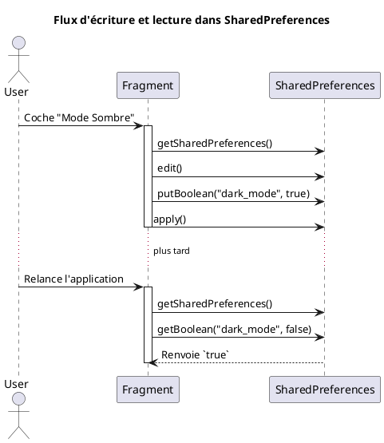

# Module 10 : Persistance des Données Simples (`SharedPreferences`)

### Objectifs pédagogiques

À la fin de ce module, vous serez capable de :

* Identifier les cas d'usage appropriés pour les `SharedPreferences`.
* Lire et écrire des données simples (clé-valeur) de manière synchrone.
* Comprendre la différence entre `commit()` et `apply()`.

### Introduction

Imaginez que vous voulez noter une information très simple, comme le score le plus élevé d'un joueur ou si l'utilisateur
préfère le mode sombre. Vous n'allez pas créer une base de données complexe pour ça. Vous allez simplement prendre un
post-it et l'écrire dessus.

Les `SharedPreferences` sont exactement cela : le "post-it" numérique de votre application. C'est un mécanisme simple et
efficace pour stocker de petites quantités de données primitives (booléens, chaînes de caractères, nombres) sous forme
de paires clé-valeur. C'est la solution parfaite pour les préférences utilisateur, les réglages, ou de petites données
d'état.

### Notions abordées

* Cas d'usage des SharedPreferences
* Lecture et Écriture

---

### Cas d'usage des SharedPreferences

#### Introduction à la notion

Savoir quand utiliser le bon outil est essentiel. Vous n'utilisez pas un marteau-piqueur pour planter un clou. De la
même manière, `SharedPreferences` est un outil léger pour des besoins légers.

#### Explication de la notion

Les `SharedPreferences` sont idéales pour stocker :

* **Des réglages utilisateur :** Mode sombre (Boolean), langue préférée (String), notifications activées (Boolean).
* **Des données d'état simples :** Le score le plus élevé (Int), le nom du dernier utilisateur connecté (String), si le
  tutoriel a déjà été montré (Boolean).
* **Des jetons d'authentification simples.**

Elles ne sont **PAS** faites pour :

* Stocker des données complexes ou structurées (listes d'objets, etc.).
* Stocker de grandes quantités de données.
* Stocker des données relationnelles.

Pour ces cas, nous utiliserons la base de données `Room` (Module 11).

---

### Lecture et Écriture

#### Introduction à la notion {id="introduction-la-notion_1"}

Interagir avec le "post-it" (`SharedPreferences`) se fait en deux étapes très simples : pour écrire, on demande la
permission d'éditer, on écrit nos paires clé-valeur, et on valide. Pour lire, on demande simplement à voir le post-it et
on lit la valeur associée à une clé, en prévoyant une valeur par défaut au cas où rien n'est écrit.

#### Explication de la notion {id="explication-de-la-notion_1"}

Le système gère un fichier XML pour votre application où ces données sont stockées. L'accès se fait via l'objet
`Context`.

**1. Obtenir une instance de SharedPreferences**

```kotlin
// Dans une Activity ou un Fragment, `this` ou `requireContext()` est un Context
val sharedPref = activity?.getSharedPreferences(
    "fr.formation.myapp.PREFERENCE_FILE_KEY", // Nom unique pour votre fichier de prefs
    Context.MODE_PRIVATE // Mode privé: seul votre app peut y accéder
)
```

**2. Écrire des données**
L'écriture se fait via un `Editor`.

```kotlin
val editor = sharedPref.edit()
editor.putString("username_key", "Alice")
editor.putInt("highscore_key", 1000)
editor.putBoolean("dark_mode_enabled_key", true)

// Pour valider les changements
editor.apply() // Asynchrone, recommandé
// ou
// editor.commit() // Synchrone, plus rare, renvoie un boolean
```

* **`apply()`** : Modifie les SharedPreferences en mémoire immédiatement mais écrit sur le disque de manière *
  *asynchrone**. Ne renvoie pas de confirmation. C'est la méthode à privilégier dans 99% des cas car elle ne bloque pas
  le thread principal.
* **`commit()`** : Écrit les données sur le disque de manière **synchrone**. Bloque le thread principal jusqu'à ce que
  l'écriture soit terminée. Renvoie `true` si l'écriture a réussi. À n'utiliser que si vous avez besoin de savoir
  immédiatement si l'écriture a fonctionné.

**3. Lire des données**
La lecture est directe. Il faut toujours fournir une **valeur par défaut** au cas où la clé n'existe pas.

```kotlin
val username = sharedPref.getString("username_key", "Guest") // "Guest" si la clé n'existe pas
val highscore = sharedPref.getInt("highscore_key", 0)
val isDarkMode = sharedPref.getBoolean("dark_mode_enabled_key", false)
```



#### Exercice 1 : Sauvegarder et restaurer le nom de l'utilisateur

**Énoncé :**
Créez une interface simple avec un `EditText`, un bouton "Sauvegarder", et un `TextView`.

1. Quand l'utilisateur clique sur "Sauvegarder", sauvegardez le nom entré dans les `SharedPreferences`.
2. Au démarrage de l'application (`onCreate`), lisez le nom depuis les `SharedPreferences` et, s'il existe, affichez-le
   dans le `TextView` avec un message de bienvenue.

**Correction exercice 1** {collapsible='true'}

**1. `activity_main.xml`**

```xml

<LinearLayout
        xmlns:android="http://schemas.android.com/apk/res/android"
        android:layout_width="match_parent"
        android:layout_height="match_parent"
        android:orientation="vertical"
        android:padding="16dp">

    <EditText
            android:id="@+id/nameEditText"
            android:layout_width="match_parent"
            android:layout_height="wrap_content"
            android:hint="Entrez votre nom"/>

    <Button
            android:id="@+id/saveButton"
            android:layout_width="wrap_content"
            android:layout_height="wrap_content"
            android:text="Sauvegarder"/>

    <TextView
            android:id="@+id/welcomeTextView"
            android:layout_width="wrap_content"
            android:layout_height="wrap_content"
            android:layout_marginTop="20dp"
            android:text="Bienvenue !"/>
</LinearLayout>
```

**2. `MainActivity.kt`**

```kotlin
package fr.formation.sharedprefs

import android.content.Context
import androidx.appcompat.app.AppCompatActivity
import android.os.Bundle
import fr.formation.sharedprefs.databinding.ActivityMainBinding

// On définit nos clés comme des constantes pour éviter les fautes de frappe
private const val PREFS_NAME = "fr.formation.sharedprefs.user_prefs"
private const val KEY_USERNAME = "username"

class MainActivity : AppCompatActivity() {
    private lateinit var binding: ActivityMainBinding

    override fun onCreate(savedInstanceState: Bundle?) {
        super.onCreate(savedInstanceState)
        binding = ActivityMainBinding.inflate(layoutInflater)
        setContentView(binding.root)

        // On charge les préférences au démarrage
        loadData()

        binding.saveButton.setOnClickListener {
            saveData()
        }
    }

    private fun saveData() {
        // 1. Obtenir une instance de SharedPreferences
        val sharedPref = getSharedPreferences(PREFS_NAME, Context.MODE_PRIVATE)

        // 2. Écrire les données
        with(sharedPref.edit()) {
            putString(KEY_USERNAME, binding.nameEditText.text.toString())
            apply() // On utilise apply()
        }
    }

    private fun loadData() {
        // 1. Obtenir une instance de SharedPreferences
        val sharedPref = getSharedPreferences(PREFS_NAME, Context.MODE_PRIVATE)

        // 2. Lire la donnée avec une valeur par défaut
        val savedUsername = sharedPref.getString(KEY_USERNAME, null)

        // 3. Mettre à jour l'UI si une valeur a été trouvée
        if (savedUsername != null) {
            binding.welcomeTextView.text = "Bienvenue, $savedUsername !"
            binding.nameEditText.setText(savedUsername)
        }
    }
}
```

---

### TP 10 : Un interrupteur de réglages persistants

**Objectif :** Créer un écran de réglages simple avec un interrupteur (Switch) pour activer/désactiver une
fonctionnalité (par exemple, les notifications). L'état de l'interrupteur doit être sauvegardé et restauré à chaque
lancement de l'application.

<procedure>

1. **Créez le layout :**
    * Utilisez un `androidx.appcompat.widget.SwitchCompat` dans votre layout.
    * Ajoutez un `TextView` à côté pour décrire le réglage ("Activer les notifications").
2. **Dans `onCreate` :**
    * Appelez une fonction `loadSettings()` qui va lire la valeur booléenne associée à l'état des notifications depuis
      les `SharedPreferences`. La valeur par défaut doit être `true` (activé).
    * Utilisez cette valeur pour définir l'état initial de votre `SwitchCompat` (`mySwitch.isChecked = savedValue`).
3. **Gérez l'interaction :**
    * Ajoutez un écouteur sur le `SwitchCompat` avec `setOnCheckedChangeListener`.
    * À l'intérieur de cet écouteur, appelez une fonction `saveSettings(isChecked: Boolean)` qui sauvegarde le nouvel
      état de l'interrupteur dans les `SharedPreferences`.
4. **Testez :**
    * Lancez l'application. L'interrupteur est activé.
    * Désactivez-le.
    * Fermez complètement l'application (en la "swipant" depuis les applications récentes).
    * Relancez l'application. L'interrupteur doit être resté dans l'état désactivé.

</procedure>

---

### Auto-évaluation

**1. Dans quel cas est-il préférable d'utiliser `SharedPreferences` plutôt qu'une base de données `Room` ? (QCM)**

* A) Pour stocker une liste de 10 000 produits.
* B) Pour stocker la préférence de l'utilisateur pour le mode sombre.
* C) Pour stocker les messages d'une conversation de chat.
* D) Pour stocker des données qui ont des relations entre elles.

**2. Quelle est la principale différence entre `editor.commit()` et `editor.apply()` ? (QCM)**

* A) `commit()` est asynchrone, `apply()` est synchrone.
* B) `commit()` est la méthode moderne, `apply()` est obsolète.
* C) `commit()` bloque le thread principal, `apply()` ne le bloque pas.
* D) `commit()` ne peut sauvegarder que des `String`, `apply()` peut tout sauvegarder.

**3. Qu'est-ce que le deuxième argument de la méthode `sharedPref.getString("ma_cle", "valeur_par_defaut")` ? (QCM)**

* A) La valeur à sauvegarder.
* B) Le nom du fichier de préférences.
* C) La valeur à retourner si la clé "ma_cle" n'est pas trouvée.
* D) Un message d'erreur à afficher.

**4. Pourquoi est-il considéré comme une bonne pratique de définir les clés des SharedPreferences (`"username_key"`)
comme des constantes ? (Question ouverte)**

**5. Si vous deviez sauvegarder la date et l'heure de la dernière ouverture de l'application, quel type de donnée
utiliseriez-vous et comment le stockeriez-vous dans les SharedPreferences ? (Question ouverte)**

### Correction de l'auto-évaluation {collapsible="true"}

**1. Quand utiliser `SharedPreferences` ?**

* **Réponse : B) Pour stocker la préférence de l'utilisateur pour le mode sombre.**
* **Justification :** C'est une donnée simple, une paire clé-valeur (ex: "dark_mode_enabled": true), ce qui est le cas
  d'usage parfait pour les `SharedPreferences`. Les autres options impliquent des données complexes ou volumineuses, qui
  nécessitent une base de données.

**2. Différence entre `commit()` et `apply()` ?**

* **Réponse : C) `commit()` bloque le thread principal, `apply()` ne le bloque pas.**
* **Justification :** `commit()` est synchrone et effectue l'écriture sur le disque sur le même thread, ce qui peut
  causer des freezes de l'UI. `apply()` est asynchrone, l'écriture se fait en arrière-plan, ce qui est beaucoup plus sûr
  pour les performances de l'application.

**3. Que représente le deuxième argument de `getString()` ?**

* **Réponse : C) La valeur à retourner si la clé "ma_cle" n'est pas trouvée.**
* **Justification :** C'est la valeur par défaut. C'est une mesure de sécurité essentielle pour éviter de recevoir
  `null` et de provoquer un `NullPointerException` si on essaie de lire une préférence qui n'a pas encore été
  sauvegardée.

**4. Pourquoi utiliser des constantes pour les clés ?**

* **Réponse type :** Pour éviter les erreurs de frappe. Si vous écrivez `"username_key"` à un endroit et
  `"user_name_key"` à un autre, le système les traitera comme deux clés différentes. En utilisant une constante (
  `private const val KEY_USERNAME = "username_key"`), vous êtes sûr d'utiliser exactement la même chaîne partout, et si
  vous devez la changer, vous n'avez qu'un seul endroit à modifier.

**5. Comment sauvegarder la date et l'heure ?**

* **Réponse type :** Les `SharedPreferences` ne peuvent pas stocker directement un objet `Date`. La meilleure approche
  est de convertir la date/heure en un type de donnée primitif. Le plus courant est de la stocker sous forme de `Long`
  représentant le nombre de millisecondes depuis l'époque Unix (timestamp). On obtiendrait ce timestamp avec
  `System.currentTimeMillis()`, puis on le sauvegarderait avec `editor.putLong("last_open_timestamp", timestamp)`. Pour
  le relire, on récupérerait le `Long` et on le reconvertirait en objet `Date`.

---

### Conclusion du module

Vous savez maintenant comment donner une mémoire à court terme et pour des données simples à votre application. Les
`SharedPreferences` sont un outil que vous utiliserez constamment pour gérer les petits détails qui rendent une
application personnalisée et agréable à utiliser.

Cependant, le "post-it" a ses limites. Que se passe-t-il lorsque nous devons gérer une collection d'objets structurés,
comme une liste de contacts, de produits ou de notes ? Pour cela, il nous faut une solution plus robuste et organisée :
une base de données. Dans le prochain module, nous allons découvrir `Room`, la bibliothèque recommandée par Google pour
gérer une base de données SQL locale de manière simple et moderne.