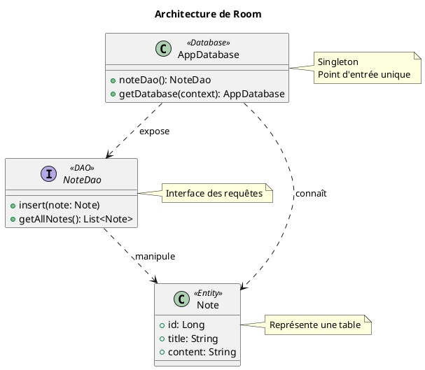

# Module 11 : Gérer une Base de Données Locale avec `Room`

### Objectifs pédagogiques

À la fin de ce module, vous serez capable de :

* Expliquer pourquoi `Room` est la solution recommandée pour la persistance de données structurées sur Android.
* Identifier et implémenter les trois composants architecturaux de `Room` : `@Entity`, `@Dao`, et `@Database`.
* Définir une table de base de données à l'aide d'une `data class` et d'annotations.
* Créer des requêtes SQL (CRUD : Create, Read, Update, Delete) dans une interface DAO.
* Mettre en place et obtenir une instance de la base de données.

### Introduction

Imaginez que votre application ne gère plus seulement quelques réglages, mais une collection entière de livres. Vous
avez des centaines de titres, d'auteurs, de dates de publication... Utiliser des "post-its" (`SharedPreferences`) serait
un chaos total. Vous avez besoin d'une bibliothèque bien organisée, avec des étagères (`Tables`), des fiches pour chaque
livre (`Entités`), et un bibliothécaire (`DAO`) qui sait exactement où trouver un livre, comment en ajouter un nouveau
ou en retirer un ancien.

`Room` est cette bibliothèque moderne et efficace pour votre application. C'est une couche d'abstraction au-dessus de la
base de données SQLite intégrée à Android. `Room` transforme la complexité des requêtes SQL brutes en appels de
fonctions Kotlin simples et sécurisés, tout en vérifiant votre SQL à la compilation pour vous éviter des erreurs à
l'exécution. C'est la solution de référence pour toute persistance de données structurées.

### Notions abordées

* Pourquoi Room ? Une abstraction au-dessus de SQLite.
* Les 3 Piliers de Room : `@Entity`, `@Dao`, `@Database`.

---

### Pourquoi Room ? Une abstraction au-dessus de SQLite

#### Introduction à la notion

SQLite est le moteur de base de données intégré à chaque appareil Android. Il est puissant et fiable, mais son
utilisation directe en Java/Kotlin est verbeuse et risquée. C'est comme parler directement le langage machine d'un
ordinateur. `Room` est un traducteur intelligent qui vous permet de parler un langage de plus haut niveau (Kotlin), et
il se charge de la traduction complexe et sans erreur vers SQLite.

#### Explication de la notion

Utiliser l'API SQLite native (`SQLiteOpenHelper`) implique :

* Écrire des requêtes SQL sous forme de `String`, sans aucune vérification par le compilateur. Une faute de frappe ne
  sera détectée qu'au crash de l'application.
* Convertir manuellement les résultats des requêtes (objet `Cursor`) en objets Kotlin, ce qui est répétitif et source
  d'erreurs.
* Gérer manuellement les migrations de schéma de base de données.

`Room` résout tous ces problèmes :

* **Vérification des requêtes à la compilation :** Room analyse votre SQL pendant que vous compilez votre projet et vous
  signale les erreurs de syntaxe.
* **Moins de code répétitif (`boilerplate`) :** Il mappe automatiquement les résultats des requêtes vers vos objets
  Kotlin.
* **Intégration facile avec d'autres composants Jetpack :** Fonctionne parfaitement avec `LiveData`, `Flow` (pour des
  données réactives) et les Coroutines.

---

### Les 3 Piliers de Room

#### Introduction à la notion {id="introduction-la-notion_1"}

Pour construire notre bibliothèque, nous avons besoin de trois plans de construction distincts mais connectés :

1. Le plan d'une **fiche de livre** (`@Entity`) : Il décrit à quoi ressemble un livre (titre, auteur...).
2. Le plan du **comptoir du bibliothécaire** (`@Dao`) : Il liste toutes les opérations possibles (chercher un livre,
   ajouter un livre...).
3. Le plan de la **bibliothèque elle-même** (`@Database`) : Il définit l'ensemble du bâtiment, quelles étagères il
   contient, et comment y accéder.

#### Explication de la notion {id="explication-de-la-notion_1"}

`Room` s'articule autour de ces trois annotations majeures.

**1. `@Entity` : La Table de Données**

C'est une `data class` Kotlin qui représente une table dans votre base de données.

* L'annotation `@Entity` marque la classe comme une table. Vous pouvez spécifier le nom de la table (`tableName`).
* Chaque propriété de la `data class` représente une colonne dans la table.
* L'une des propriétés doit être la clé primaire, annotée avec `@PrimaryKey`. On peut la faire s'auto-incrémenter.

```kotlin
// Représente une table "notes" dans la BDD
@Entity(tableName = "notes")
data class Note(
    @PrimaryKey(autoGenerate = true)
    val id: Long = 0, // Clé primaire auto-générée

    val title: String, // Colonne "title" de type TEXT

    val content: String // Colonne "content" de type TEXT
)
```

**2. `@Dao` (Data Access Object) : L'Interface des Opérations**

C'est une **interface** Kotlin qui définit comment vous accédez à vos données. Vous y déclarez des méthodes, et `Room`
se charge de générer le code d'implémentation.

* L'annotation `@Dao` marque l'interface.
* Vous utilisez des annotations pour chaque type d'opération :
    * `@Insert` : Pour insérer un ou plusieurs objets.
    * `@Update` : Pour mettre à jour un objet.
    * `@Delete` : Pour supprimer un objet.
    * `@Query` : Pour toute autre requête (lecture, suppression complexe...). Vous écrivez la requête SQL directement
      dans l'annotation.

```kotlin
@Dao
interface NoteDao {
    @Insert
    suspend fun insert(note: Note) // `suspend` pour les coroutines

    @Update
    suspend fun update(note: Note)

    @Delete
    suspend fun delete(note: Note)

    @Query("SELECT * FROM notes ORDER BY id DESC")
    fun getAllNotes(): List<Note> // Pas `suspend` si Room utilise un autre mécanisme

    @Query("SELECT * FROM notes WHERE id = :noteId")
    suspend fun getNoteById(noteId: Long): Note?
}
```

<warning>
Les opérations d'écriture (`@Insert`, `@Update`, `@Delete`) et les requêtes potentiellement longues doivent être exécutées en dehors du thread principal. L'utilisation de `suspend` avec les coroutines est la manière moderne de le faire.
</warning>

**3. `@Database` : Le Point d'Entrée de la Base de Données**

C'est une classe **abstraite** qui hérite de `RoomDatabase`. Elle relie tous les éléments.

* L'annotation `@Database` prend en paramètres :
    * `entities` : Un tableau de toutes vos classes `@Entity`.
    * `version` : La version de votre schéma de base de données. À incrémenter à chaque modification du schéma.
* La classe doit contenir une méthode abstraite qui renvoie chaque `@Dao`.
* Elle contient généralement un `companion object` pour implémenter le pattern **Singleton**, garantissant qu'une seule
  instance de la base de données existe pour toute l'application.

```kotlin
@Database(entities = [Note::class], version = 1)
abstract class AppDatabase : RoomDatabase() {

    abstract fun noteDao(): NoteDao

    companion object {
        // @Volatile garantit que la valeur est toujours à jour pour tous les threads
        @Volatile
        private var INSTANCE: AppDatabase? = null

        fun getDatabase(context: Context): AppDatabase {
            return INSTANCE ?: synchronized(this) {
                val instance = Room.databaseBuilder(
                    context.applicationContext,
                    AppDatabase::class.java,
                    "app_database" // Nom du fichier de la BDD
                ).build()
                INSTANCE = instance
                instance
            }
        }
    }
}
```



#### Exercice 1 : Mettre en place Room pour une entité "User"

**Énoncé :**
Mettez en place les trois piliers de Room pour gérer une entité `User`.

1. Créez une `data class` `User` annotée comme une `@Entity`. Elle doit avoir un `id` (Long, clé primaire auto-générée),
   un `firstName` (String) et un `lastName` (String).
2. Créez une interface `UserDao` avec des méthodes pour insérer un utilisateur et pour récupérer tous les utilisateurs.
3. Créez la classe `AppDatabase` qui inclut l'entité `User`.

##### **Correction exercice 1** {collapsible='true'}

**0. Dépendances (à ajouter dans `build.gradle.kts`)**

```kotlin
dependencies {
    val room_version = "2.6.1"
    implementation("androidx.room:room-runtime:$room_version")
    // Annotation processor pour générer le code
    ksp("androidx.room:room-compiler:$room_version")
    // Support pour les coroutines Kotlin
    implementation("androidx.room:room-ktx:$room_version")
}
// N'oubliez pas d'appliquer le plugin KSP en haut du fichier
// plugins { id("com.google.devtools.ksp") }
```

**1. `User.kt` (@Entity)**

```kotlin
package fr.formation.room.models

import androidx.room.Entity
import androidx.room.PrimaryKey

@Entity(tableName = "users")
data class User(
    @PrimaryKey(autoGenerate = true)
    val id: Long = 0,
    val firstName: String,
    val lastName: String
)
```

**2. `UserDao.kt` (@Dao)**

```kotlin
package fr.formation.room.dao

import androidx.room.Dao
import androidx.room.Insert
import androidx.room.Query
import fr.formation.room.models.User

@Dao
interface UserDao {
    @Insert
    suspend fun insert(user: User)

    @Query("SELECT * FROM users ORDER BY lastName ASC")
    fun getAllUsers(): List<User> // Pour cet exemple, on la laisse synchrone
}
```

**3. `AppDatabase.kt` (@Database)**

```kotlin
package fr.formation.room.database

import android.content.Context
import androidx.room.Database
import androidx.room.Room
import androidx.room.RoomDatabase
import fr.formation.room.dao.UserDao
import fr.formation.room.models.User

@Database(entities = [User::class], version = 1)
abstract class AppDatabase : RoomDatabase() {

    abstract fun userDao(): UserDao

    companion object {
        @Volatile
        private var INSTANCE: AppDatabase? = null

        fun getDatabase(context: Context): AppDatabase {
            return INSTANCE ?: synchronized(this) {
                val instance = Room.databaseBuilder(
                    context.applicationContext,
                    AppDatabase::class.java,
                    "my_app_database"
                )
                    .fallbackToDestructiveMigration() // Pour la simplicité du TP
                    .build()
                INSTANCE = instance
                instance
            }
        }
    }
}
```

---

## TP 11 : Une application de prise de notes simple

**Objectif :** Créer une application qui permet d'ajouter des notes et de les afficher dans une liste. Les notes doivent
persister même après la fermeture de l'application. (Pour ce TP, l'interaction avec la BDD se fera encore sur le thread
principal pour la simplicité, nous introduirons les coroutines au module suivant).

<procedure>

1.  **Mettez en place Room** avec l'entité `Note` et le `NoteDao` vus dans l'exemple ci-dessus. N'oubliez pas les dépendances.
2.  **Créez un layout `activity_main.xml`** qui contient :
    *   Un `EditText` pour le titre de la note.
    *   Un `EditText` pour le contenu de la note.
    *   Un `Button` "Ajouter".
    *   Un `RecyclerView` pour afficher les notes.
3.  **Créez un `NoteAdapter`** pour le `RecyclerView`.
4.  **Dans `MainActivity.kt` :**
    *   Obtenez une instance de votre base de données : `val db = AppDatabase.getDatabase(this)`.
    *   Créez une fonction `loadNotes()` qui :
        *   Récupère toutes les notes via `db.noteDao().getAllNotes()`.
        *   Met à jour l'adapter du RecyclerView avec cette liste.
        *   **Attention :** par défaut, Room interdit les requêtes sur le thread principal. Pour ce TP, lors de la construction de la base de données, ajoutez `.allowMainThreadQueries()` juste avant `.build()`. C'est une **mauvaise pratique** pour une vraie application, mais cela nous permet de nous concentrer sur Room avant d'aborder l'asynchronisme.
    *   Dans `onCreate`, appelez `loadNotes()`.
    *   Dans le `onClickListener` du bouton "Ajouter" :
        *   Créez un nouvel objet `Note` à partir des `EditText`.
        *   Insérez-le dans la base de données : `db.noteDao().insert(newNote)`.
        *   Appelez à nouveau `loadNotes()` pour rafraîchir la liste.
5.  **Testez :** Ajoutez quelques notes. Fermez complètement l'application. Relancez-la. Vos notes doivent toujours être là !

</procedure>

## Correction du TP 11 {collapsible="true"}

#### Étape 1 : Mise en place de Room

C'est la partie la plus dense, car elle nécessite la création de plusieurs classes et la configuration des dépendances.

##### 1a. Dépendances

Ajoutez ceci à votre fichier `build.gradle.kts` (au niveau du module) et synchronisez.

```kotlin
plugins {
    // ...
    id("com.google.devtools.ksp") version "1.9.22-1.0.17"
}

android {
    // ...
}

dependencies {
    // ...
    // Room
    val room_version = "2.6.1"
    implementation("androidx.room:room-runtime:$room_version")
    ksp("androidx.room:room-compiler:$room_version")
    // Kotlin Extensions and Coroutines support for Room (bonne pratique pour plus tard)
    implementation("androidx.room:room-ktx:$room_version")
}
```

##### 1b. Entité `Note`
Créez un nouveau fichier `Note.kt`.

```kotlin
import androidx.room.Entity
import androidx.room.PrimaryKey

@Entity(tableName = "note_table")
data class Note(
    @PrimaryKey(autoGenerate = true)
    val id: Int = 0, // 0 pour que Room génère l'ID
    val title: String,
    val content: String
)
```

##### 1c. DAO `NoteDao`
Créez un nouveau fichier `NoteDao.kt`.

```kotlin
import androidx.room.Dao
import androidx.room.Insert
import androidx.room.Query

@Dao
interface NoteDao {
    // Récupère toutes les notes, ordonnées par ID descendant (les plus récentes en premier)
    @Query("SELECT * FROM note_table ORDER BY id DESC")
    fun getAllNotes(): List<Note>

    // Insère une nouvelle note
    @Insert
    fun insert(note: Note)
}
```

##### 1d. Base de données `AppDatabase`
Créez un nouveau fichier `AppDatabase.kt`.

```kotlin
import android.content.Context
import androidx.room.Database
import androidx.room.Room
import androidx.room.RoomDatabase

@Database(entities = [Note::class], version = 1, exportSchema = false)
abstract class AppDatabase : RoomDatabase() {

    abstract fun noteDao(): NoteDao

    companion object {
        @Volatile
        private var INSTANCE: AppDatabase? = null

        fun getDatabase(context: Context): AppDatabase {
            return INSTANCE ?: synchronized(this) {
                val instance = Room.databaseBuilder(
                    context.applicationContext,
                    AppDatabase::class.java,
                    "note_database"
                )
                // ATTENTION : Uniquement pour ce TP. Ne jamais utiliser en production.
                .allowMainThreadQueries() 
                .build()
                INSTANCE = instance
                instance
            }
        }
    }
}
```
**Note importante :** La ligne `.allowMainThreadQueries()` est une "triche" pour simplifier l'exercice. Dans une vraie application, les opérations de base de données sont longues et doivent être effectuées sur un thread d'arrière-plan (avec des Coroutines, par exemple) pour ne pas geler l'interface utilisateur.

---

#### Étape 2 : Le Layout (`activity_main.xml`)
```xml
<?xml version="1.0" encoding="utf-8"?>
<LinearLayout xmlns:android="http://schemas.android.com/apk/res/android"
    xmlns:app="http://schemas.android.com/apk/res-auto"
    xmlns:tools="http://schemas.android.com/tools"
    android:layout_width="match_parent"
    android:layout_height="match_parent"
    android:orientation="vertical"
    android:padding="16dp"
    tools:context=".MainActivity">

    <EditText
        android:id="@+id/titleEditText"
        android:layout_width="match_parent"
        android:layout_height="wrap_content"
        android:hint="Titre de la note"
        android:inputType="textCapSentences" />

    <EditText
        android:id="@+id/contentEditText"
        android:layout_width="match_parent"
        android:layout_height="wrap_content"
        android:layout_marginTop="8dp"
        android:hint="Contenu..."
        android:inputType="textMultiLine" />

    <Button
        android:id="@+id/addButton"
        android:layout_width="wrap_content"
        android:layout_height="wrap_content"
        android:layout_gravity="end"
        android:layout_marginTop="8dp"
        android:text="Ajouter" />

    <androidx.recyclerview.widget.RecyclerView
        android:id="@+id/notesRecyclerView"
        android:layout_width="match_parent"
        android:layout_height="0dp"
        android:layout_marginTop="16dp"
        android:layout_weight="1"
        tools:listitem="@layout/item_note" />

</LinearLayout>
```

---

#### Étape 3 : Le `NoteAdapter` et son Item Layout

##### `item_note.xml`
Créez ce fichier de layout pour représenter une seule note dans la liste.

```xml
<?xml version="1.0" encoding="utf-8"?>
<LinearLayout xmlns:android="http://schemas.android.com/apk/res/android"
    android:layout_width="match_parent"
    android:layout_height="wrap_content"
    android:orientation="vertical"
    android:padding="12dp"
    android:layout_marginBottom="8dp"
    android:background="@android:drawable/dialog_holo_light_frame">

    <TextView
        android:id="@+id/itemTitleTextView"
        android:layout_width="match_parent"
        android:layout_height="wrap_content"
        android:textSize="18sp"
        android:textStyle="bold"
        android:text="Titre de la note" />

    <TextView
        android:id="@+id/itemContentTextView"
        android:layout_width="match_parent"
        android:layout_height="wrap_content"
        android:layout_marginTop="4dp"
        android:text="Contenu de la note..." />
</LinearLayout>
```

##### `NoteAdapter.kt`
```kotlin
import android.view.LayoutInflater
import android.view.ViewGroup
import androidx.recyclerview.widget.RecyclerView
import com.example.yourapplication.databinding.ItemNoteBinding // Adaptez le package

class NoteAdapter(private var notes: List<Note>) : RecyclerView.Adapter<NoteAdapter.NoteViewHolder>() {

    inner class NoteViewHolder(val binding: ItemNoteBinding) : RecyclerView.ViewHolder(binding.root)

    override fun onCreateViewHolder(parent: ViewGroup, viewType: Int): NoteViewHolder {
        val binding = ItemNoteBinding.inflate(LayoutInflater.from(parent.context), parent, false)
        return NoteViewHolder(binding)
    }

    override fun onBindViewHolder(holder: NoteViewHolder, position: Int) {
        val currentNote = notes[position]
        holder.binding.itemTitleTextView.text = currentNote.title
        holder.binding.itemContentTextView.text = currentNote.content
    }

    override fun getItemCount() = notes.size

    // Fonction pour mettre à jour la liste de notes et rafraîchir l'affichage
    fun updateNotes(newNotes: List<Note>) {
        notes = newNotes
        notifyDataSetChanged() // Rafraîchit tout le RecyclerView
    }
}
```

---

#### Étape 4 : L'Activité (`MainActivity.kt`)

C'est ici que l'on connecte tout : la base de données, l'UI et l'adaptateur.

```kotlin
package com.example.yourapplication // Adaptez le package

import androidx.appcompat.app.AppCompatActivity
import android.os.Bundle
import androidx.recyclerview.widget.LinearLayoutManager
import com.example.yourapplication.databinding.ActivityMainBinding

class MainActivity : AppCompatActivity() {

    private lateinit var binding: ActivityMainBinding
    private lateinit var db: AppDatabase
    private lateinit var noteAdapter: NoteAdapter

    override fun onCreate(savedInstanceState: Bundle?) {
        super.onCreate(savedInstanceState)
        binding = ActivityMainBinding.inflate(layoutInflater)
        setContentView(binding.root)

        // Obtenir une instance de la base de données
        db = AppDatabase.getDatabase(this)

        // Initialiser l'adapter avec une liste vide au départ
        noteAdapter = NoteAdapter(emptyList())

        // Configurer le RecyclerView
        binding.notesRecyclerView.adapter = noteAdapter
        binding.notesRecyclerView.layoutManager = LinearLayoutManager(this)

        // Charger les notes existantes au démarrage
        loadNotes()

        // Gérer le clic sur le bouton "Ajouter"
        binding.addButton.setOnClickListener {
            val title = binding.titleEditText.text.toString().trim()
            val content = binding.contentEditText.text.toString().trim()

            if (title.isNotEmpty() && content.isNotEmpty()) {
                // Créer une nouvelle note
                val newNote = Note(title = title, content = content)
                
                // L'insérer dans la base de données
                db.noteDao().insert(newNote)

                // Rafraîchir la liste affichée
                loadNotes()

                // Vider les champs pour la prochaine saisie
                binding.titleEditText.text.clear()
                binding.contentEditText.text.clear()
            }
        }
    }

    /**
     * Récupère toutes les notes depuis la base de données et met à jour l'adapter.
     */
    private fun loadNotes() {
        val notes = db.noteDao().getAllNotes()
        noteAdapter.updateNotes(notes)
    }
}
```

#### Étape 5 : Test

1.  Lancez l'application. L'écran est vide.
2.  Entrez un titre et un contenu, puis cliquez sur "Ajouter". La note apparaît dans la liste.
3.  Ajoutez une ou deux autres notes. Elles s'ajoutent en haut de la liste (grâce au `ORDER BY id DESC` dans le DAO).
4.  Maintenant, fermez l'application complètement (via le gestionnaire d'applications récentes, faites un "swipe" pour la tuer).
5.  Relancez l'application.
6.  **Résultat attendu :** Toutes vos notes sont toujours là, chargées depuis la base de données Room. La persistance fonctionne
---

## Auto-évaluation

**1. Quelle annotation est utilisée pour marquer une `data class` comme une table de base de données dans Room ? (QCM)**

* A) `@Dao`
* B) `@Table`
* C) `@Entity`
* D) `@Database`

**2. Quel est le rôle principal d'une interface annotée avec `@Dao` ? (QCM)**

* A) Définir la structure de la base de données, y compris la version.
* B) Servir de point d'entrée unique (Singleton) pour accéder à la base de données.
* C) Représenter une ligne de données dans une table.
* D) Définir les méthodes d'accès aux données (requêtes SQL).

**3. Que se passe-t-il si vous écrivez une requête SQL avec une erreur de syntaxe dans une annotation `@Query` ? (QCM)**

* A) L'application plantera au moment où la requête sera exécutée.
* B) Le projet ne compilera pas, et Android Studio signalera une erreur.
* C) La requête sera ignorée silencieusement.
* D) Room essaiera de corriger l'erreur automatiquement.

**4. Qu'est-ce que le pattern "Singleton" et pourquoi est-il important pour la classe `@Database` ? (Question ouverte)**

**5. Pourquoi Room interdit-il par défaut l'exécution des requêtes sur le thread principal ? (Question ouverte)**

### Correction de l'auto-évaluation {collapsible="true"}

**1. Quelle annotation marque une `data class` comme une table ?**

* **Réponse : C) `@Entity`**
* **Justification :** L'annotation `@Entity` indique à Room que cette classe doit être transformée en une table dans la
  base de données SQLite.

**2. Quel est le rôle principal d'une interface `@Dao` ?**

* **Réponse : D) Définir les méthodes d'accès aux données (requêtes SQL).**
* **Justification :** Le DAO (Data Access Object) est le contrat qui définit toutes les opérations possibles sur les
  données, comme l'insertion, la sélection, la mise à jour et la suppression.

**3. Que se passe-t-il en cas d'erreur de syntaxe SQL ?**

* **Réponse : B) Le projet ne compilera pas, et Android Studio signalera une erreur.**
* **Justification :** C'est l'un des plus grands avantages de Room. Il vérifie la validité de vos requêtes SQL au moment
  de la compilation, ce qui vous permet de corriger les erreurs avant même de lancer l'application.

**4. Qu'est-ce que le pattern "Singleton" et pourquoi est-il important pour la classe `@Database` ?**

* **Réponse type :** Un Singleton est un design pattern qui garantit qu'il n'existe qu'une seule instance d'une classe
  pour toute l'application. C'est important pour la classe `@Database` car la création d'une connexion à une base de
  données est une opération "coûteuse" en termes de ressources. En utilisant un Singleton, on s'assure de ne créer cette
  connexion qu'une seule fois et de réutiliser la même instance partout, ce qui est beaucoup plus performant et évite
  les conflits d'accès.

**5. Pourquoi Room interdit-il les requêtes sur le thread principal ?**

* **Réponse type :** Les opérations sur une base de données impliquent des lectures/écritures sur le disque de
  l'appareil, ce qui peut être lent (de quelques millisecondes à plusieurs secondes pour de grosses requêtes). Si une
  telle opération était effectuée sur le thread principal (UI Thread), elle bloquerait toute l'interface utilisateur
  pendant sa durée, rendant l'application non réactive ("freeze"). L'utilisateur aurait une très mauvaise expérience et
  le système Android pourrait même fermer l'application (erreur "Application Not Responding" - ANR). Room nous force
  donc à adopter de bonnes pratiques en exécutant ces tâches longues sur un thread d'arrière-plan.

---

## Conclusion du module

Vous avez construit votre première base de données locale ! Vous savez maintenant comment modéliser vos données, définir
des opérations pour les manipuler et les structurer dans une base de données robuste avec `Room`. C'est une compétence
fondamentale pour toute application qui doit gérer des données structurées.

Cependant, nous avons dû "tricher" en autorisant les requêtes sur le thread principal. C'est une dette technique que
nous devons maintenant rembourser. Comment exécuter ces opérations de base de données (et bientôt, de réseau) de manière
asynchrone, sans jamais geler notre interface ? La réponse se trouve dans le prochain module, avec l'un des outils les
plus puissants de Kotlin : les **Coroutines**.