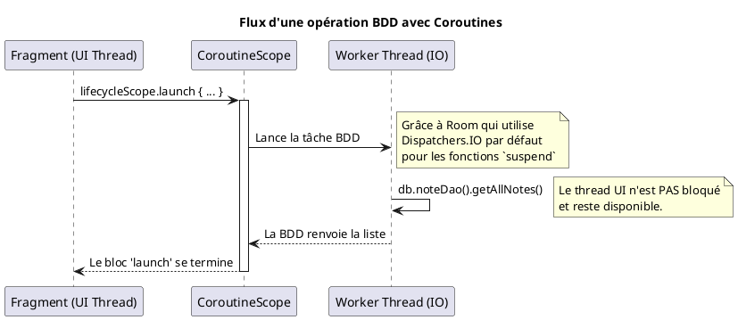

# Module 12 : Introduction aux Opérations Asynchrones (Coroutines Kotlin)

### Objectifs pédagogiques

À la fin de ce module, vous serez capable de :

* Expliquer pourquoi les tâches longues doivent être exécutées en dehors du thread principal.
* Définir ce qu'est une coroutine et ses avantages par rapport aux threads traditionnels.
* Utiliser les concepts clés : `CoroutineScope`, `launch`, `suspend function`.
* Comprendre le rôle des `Dispatchers` pour choisir sur quel thread exécuter une tâche.
* Appliquer les coroutines pour effectuer des opérations de base de données `Room` de manière asynchrone.

### Introduction

Imaginez que vous êtes un chef cuisinier dans un restaurant très fréquenté. Un client commande un plat qui nécessite une
cuisson lente de 30 minutes. Que faites-vous ? Est-ce que vous vous tenez debout devant le four, à ne rien faire d'autre
pendant 30 minutes, en ignorant toutes les autres commandes ? Bien sûr que non ! Ce serait l'équivalent de bloquer le
thread principal.

La bonne approche est de lancer la cuisson lente (une tâche de fond), puis de vous libérer immédiatement pour préparer
d'autres plats plus rapides. Vous gardez un œil sur votre cuisson, mais vous ne restez pas bloqué à l'attendre. Les *
*coroutines** sont votre super-pouvoir de chef multitâche. Elles vous permettent de lancer des opérations longues (comme
une requête en base de données ou un appel réseau) et de continuer à travailler sur autre chose (comme garder
l'interface utilisateur fluide) en attendant qu'elles se terminent. C'est la clé pour des applications réactives et
sans "freeze".

### Notions abordées

* Le Problème : Le Thread Principal (UI Thread) et l'erreur ANR.
* La Solution : Les Coroutines Kotlin.
* Concepts Clés : `suspend function`, `CoroutineScope`, `launch`.
* Changer de Contexte avec les `Dispatchers`.

---

### Le Problème : Le Thread Principal et l'erreur ANR

#### Introduction à la notion

Le thread principal de votre application est comme le guichet unique d'une administration très fréquentée. C'est le seul
employé qui peut interagir avec le public (mettre à jour l'UI). Si vous lui donnez une tâche qui prend 10 secondes (
comme aller chercher un dossier dans les archives), pendant ces 10 secondes, le guichet est fermé, la file d'attente s'
allonge, et les gens deviennent très mécontents.

#### Explication de la notion

Sur Android, toutes les interactions avec l'interface utilisateur (dessiner les vues, gérer les clics, etc.) doivent se
faire sur un seul et unique thread : le **thread principal** (ou UI Thread).

Si vous exécutez une opération longue (plus de quelques millisecondes) sur ce thread, vous le bloquez. L'application
devient incapable de réagir aux actions de l'utilisateur ou même de se redessiner. Elle semble "gelée".

Si ce blocage dure plus de 5 secondes, le système Android intervient et affiche la redoutable boîte de dialogue **"
Application Not Responding" (ANR)**, proposant à l'utilisateur de fermer l'application. C'est l'une des pires
expériences utilisateur possibles.

**Opérations qui ne doivent JAMAIS être sur le thread principal :**

* Les appels réseau.
* Les lectures/écritures en base de données.
* La lecture/écriture de gros fichiers sur le disque.
* Le traitement complexe d'images ou de données.

---

### La Solution : Les Coroutines Kotlin

#### Introduction à la notion {id="introduction-la-notion_1"}

Si les threads traditionnels sont des "travailleurs" lourds et coûteux à embaucher, les coroutines sont des "tâches"
extrêmement légères. Vous pouvez en lancer des milliers sans ralentir votre système. Elles ont la capacité magique de
se "suspendre" en attendant qu'une opération longue se termine, libérant ainsi le "travailleur" (le thread) pour qu'il
puisse faire autre chose en attendant.

#### Explication de la notion {id="explication-de-la-notion_1"}

Une coroutine est un bloc de code qui peut être suspendu et repris plus tard. Elles permettent d'écrire du code
asynchrone de manière **séquentielle**, comme si c'était du code synchrone.

**Avant (avec des callbacks - "l'enfer des callbacks") :**

```kotlin
// Code difficile à lire et à maintenir
networkRequest(
    "url",
    onSuccess = { data ->
        databaseSave(
            data,
            onSuccess = {
                updateUi("Succès")
            },
            onError = { ... }
        )
    },
    onError = { ... }
)
```

**Après (avec des coroutines) :**

```kotlin
// Code lisible, séquentiel et avec une gestion d'erreur simple
try {
    val data = networkRequest("url")
    databaseSave(data)
    updateUi("Succès")
} catch (e: Exception) {
    // Gérer l'erreur
}
```

Les coroutines sont la solution recommandée par Google pour la gestion de l'asynchronisme sur Android.

---

### Concepts Clés

#### Introduction à la notion {id="introduction-la-notion_2"}

Pour devenir un bon chef multitâche, vous devez maîtriser trois outils :

1. **La recette "spéciale cuisson lente" (`suspend function`) :** Une recette qui signale qu'elle peut être mise en
   pause.
2. **La cuisine (`CoroutineScope`) :** L'environnement de travail où vous gérez toutes vos cuissons en cours.
3. **L'ordre "Lancer la cuisson" (`launch`) :** L'action de démarrer une recette sans attendre à côté.

#### Explication de la notion {id="explication-de-la-notion_2"}

**1. `suspend fun` : la fonction qui peut faire une pause**
Une fonction marquée avec le mot-clé `suspend` peut être suspendue sans bloquer le thread. C'est une indication au
compilateur : "Attention, cette fonction peut prendre du temps".
Une fonction `suspend` ne peut être appelée que depuis une autre fonction `suspend` ou depuis une coroutine.
Room et Retrofit (que nous verrons plus tard) proposent des versions `suspend` de leurs fonctions.

```kotlin
// Room sait que cette opération doit être asynchrone
@Insert
suspend fun insert(note: Note)
```

**2. `CoroutineScope` : le contexte de vie des coroutines**
Une coroutine doit toujours être lancée dans un `CoroutineScope`. Ce "scope" (portée) définit le cycle de vie de la
coroutine. Si le scope est annulé, toutes les coroutines lancées à l'intérieur sont automatiquement annulées. C'est
crucial pour éviter les fuites de mémoire.

Android Jetpack fournit des scopes prédéfinis et conscients du cycle de vie :

* `lifecycleScope` (dans une Activity ou un Fragment) : Lié au cycle de vie de l'Activity/Fragment. Annulé
  automatiquement quand le composant est détruit.
* `viewModelScope` (dans un ViewModel) : Lié au cycle de vie du ViewModel. Annulé automatiquement quand le ViewModel est
  détruit.

**3. `launch` : lancer une coroutine "fire-and-forget"**
C'est le constructeur de coroutine le plus courant. Il lance une nouvelle coroutine en arrière-plan sans attendre son
résultat. Parfait pour les opérations d'écriture (insertion en BDD, mise à jour sur un serveur...).

```kotlin
// Dans une Activity ou un Fragment
lifecycleScope.launch {
    // Ce code s'exécute dans une coroutine
    db.noteDao().insert(newNote)
    // On ne peut pas appeler une fonction suspendue en dehors d'une coroutine
}
```

---

### Changer de Contexte avec les `Dispatchers`

#### Introduction à la notion {id="introduction-la-notion_3"}

Notre chef a plusieurs postes de travail dans sa cuisine : un pour la découpe (`Dispatchers.Main`), un pour la cuisson (
`Dispatchers.IO`), et un pour les calculs complexes de recettes (`Dispatchers.Default`). Les `Dispatchers` permettent de
dire à une tâche sur quel poste de travail elle doit s'exécuter.

#### Explication de la notion {id="explication-de-la-notion_3"}

Un `Dispatcher` détermine sur quel thread (ou pool de threads) la coroutine va s'exécuter.

* `Dispatchers.Main` : Le thread principal d'Android. **Uniquement** pour les opérations d'UI.
* `Dispatchers.IO` (Input/Output) : Optimisé pour les opérations de disque et de réseau (base de données, appels API,
  fichiers).
* `Dispatchers.Default` : Optimisé pour les tâches gourmandes en CPU (trier une grande liste, parser un gros JSON...).

On utilise `withContext(Dispatcher)` pour changer de contexte à l'intérieur d'une coroutine.



<tip>
Heureusement, les bibliothèques modernes comme `Room` et `Retrofit` gèrent les `Dispatchers` pour vous ! Quand vous appelez une fonction `suspend` de Room, elle s'exécute automatiquement sur `Dispatchers.IO` sans que vous ayez besoin de le spécifier.
</tip>

#### Exercice 1 : Intégrer les coroutines avec Room

**Énoncé :**
Reprenez le TP du module 11 (l'application de prise de notes). Supprimez l'appel à `.allowMainThreadQueries()` (la
mauvaise pratique) et utilisez les coroutines pour effectuer les opérations de base de données en arrière-plan.

#### **Correction exercice 1** {collapsible='true'}

**1. Assurez-vous que vos méthodes DAO sont `suspend` (pour l'écriture)**

```kotlin
// Dans NoteDao.kt
@Dao
interface NoteDao {
    @Insert
    suspend fun insert(note: Note) // Doit être suspend

    @Query("SELECT * FROM notes")
    fun getAllNotes(): List<Note> // La lecture peut rester synchrone pour cet exemple
}
```

**2. Modifiez `MainActivity.kt`**

```kotlin
// ... imports ...
import androidx.lifecycle.lifecycleScope
import kotlinx.coroutines.Dispatchers
import kotlinx.coroutines.launch
import kotlinx.coroutines.withContext

class MainActivity : AppCompatActivity() {
    // ... binding et autres ...

    override fun onCreate(savedInstanceState: Bundle?) {
        super.onCreate(savedInstanceState)
        // ...

        // IMPORTANT : retirez .allowMainThreadQueries() de votre AppDatabase.kt
        val db = AppDatabase.getDatabase(this)

        // On charge les données au démarrage
        loadNotes(db)

        binding.addButton.setOnClickListener {
            val title = binding.titleEditText.text.toString()
            val content = binding.contentEditText.text.toString()
            if (title.isNotEmpty()) {
                val newNote = Note(title = title, content = content)
                // On appelle la nouvelle fonction d'insertion
                insertNote(db, newNote)
            }
        }
    }

    // Fonction pour insérer une note en arrière-plan
    private fun insertNote(db: AppDatabase, note: Note) {
        // On lance une coroutine dans le scope du cycle de vie de l'activité
        lifecycleScope.launch {
            // Room exécute automatiquement insert() sur un thread IO
            db.noteDao().insert(note)

            // Après l'insertion, on rafraîchit la liste
            // en revenant sur le thread principal pour mettre à jour l'UI
            loadNotes(db)
        }
    }

    // Fonction pour charger les notes (qui implique aussi une lecture BDD)
    private fun loadNotes(db: AppDatabase) {
        lifecycleScope.launch {
            // On se déplace explicitement sur un thread IO pour la lecture BDD
            val notes = withContext(Dispatchers.IO) {
                db.noteDao().getAllNotes()
            }
            // On a maintenant la liste de notes
            // L'UI doit être mise à jour sur le thread Main
            // Pas besoin de withContext(Dispatchers.Main) ici car
            // le contexte du lifecycleScope est déjà le thread Main.
            updateRecyclerView(notes)
        }
    }

    private fun updateRecyclerView(notes: List<Note>) {
        // Mettez à jour votre adapter ici
        // (le code de l'adapter reste le même)
    }
}
```

---

## TP 12 : Simulateur de Tâche Lente

**Objectif :** Créer une application qui simule une tâche longue (comme un téléchargement) sans geler l'interface.

<procedure>

1. **Créez un layout** avec un `Button` ("Lancer la tâche"), un `ProgressBar` (initialement invisible) et un
   `TextView` ("Prêt").
2. **Dans `MainActivity.kt` :**
    * Dans le `onClickListener` du bouton, lancez une coroutine avec `lifecycleScope.launch`.
3. **À l'intérieur de la coroutine :**
    * **Avant la tâche longue :** Mettez à jour l'UI. Rendez le `ProgressBar` visible et changez le texte du `TextView`
      en "Téléchargement en cours...".
      ```kotlin
      binding.progressBar.visibility = View.VISIBLE
      binding.statusTextView.text = "Téléchargement en cours..."
      ```
    * **Simulez la tâche longue :** Créez une fonction `suspend` qui simule le travail.
      ```kotlin
      private suspend fun performLongTask(): String {
          // On se déplace sur un autre thread pour ne pas bloquer
          withContext(Dispatchers.Default) {
              delay(3000) // Attend 3 secondes
          }
          return "Téléchargement terminé !"
      }
      ```
      (Vous devrez importer `kotlinx.coroutines.delay`).
    * Appelez cette fonction `suspend` depuis votre coroutine `launch`.
    * **Après la tâche longue :** Mettez à jour l'UI à nouveau. Cachez le `ProgressBar` et affichez le message de
      résultat dans le `TextView`.
4. **Testez :** Lancez l'application. Cliquez sur le bouton. L'UI doit se mettre à jour immédiatement, et pendant les 3
   secondes d'attente, l'application doit rester parfaitement réactive (vous pouvez essayer de cliquer partout). Après 3
   secondes, l'UI se met à jour à nouveau avec le message final.

</procedure>

## Correction du TP 12 {collapsible="true"}

#### Étape 1 : Mise en place de Room

C'est la partie la plus dense, car elle nécessite la création de plusieurs classes et la configuration des dépendances.

##### 1a. Dépendances

Ajoutez ceci à votre fichier `build.gradle.kts` (au niveau du module) et synchronisez.

```kotlin
plugins {
    // ...
    id("com.google.devtools.ksp") version "1.9.22-1.0.17"
}

android {
    // ...
}

dependencies {
    // ...
    // Room
    val room_version = "2.6.1"
    implementation("androidx.room:room-runtime:$room_version")
    ksp("androidx.room:room-compiler:$room_version")
    // Kotlin Extensions and Coroutines support for Room (bonne pratique pour plus tard)
    implementation("androidx.room:room-ktx:$room_version")
}
```

##### 1b. Entité `Note`
Créez un nouveau fichier `Note.kt`.

```kotlin
import androidx.room.Entity
import androidx.room.PrimaryKey

@Entity(tableName = "note_table")
data class Note(
    @PrimaryKey(autoGenerate = true)
    val id: Int = 0, // 0 pour que Room génère l'ID
    val title: String,
    val content: String
)
```

##### 1c. DAO `NoteDao`
Créez un nouveau fichier `NoteDao.kt`.

```kotlin
import androidx.room.Dao
import androidx.room.Insert
import androidx.room.Query

@Dao
interface NoteDao {
    // Récupère toutes les notes, ordonnées par ID descendant (les plus récentes en premier)
    @Query("SELECT * FROM note_table ORDER BY id DESC")
    fun getAllNotes(): List<Note>

    // Insère une nouvelle note
    @Insert
    fun insert(note: Note)
}
```

##### 1d. Base de données `AppDatabase`
Créez un nouveau fichier `AppDatabase.kt`.

```kotlin
import android.content.Context
import androidx.room.Database
import androidx.room.Room
import androidx.room.RoomDatabase

@Database(entities = [Note::class], version = 1, exportSchema = false)
abstract class AppDatabase : RoomDatabase() {

    abstract fun noteDao(): NoteDao

    companion object {
        @Volatile
        private var INSTANCE: AppDatabase? = null

        fun getDatabase(context: Context): AppDatabase {
            return INSTANCE ?: synchronized(this) {
                val instance = Room.databaseBuilder(
                    context.applicationContext,
                    AppDatabase::class.java,
                    "note_database"
                )
                // ATTENTION : Uniquement pour ce TP. Ne jamais utiliser en production.
                .allowMainThreadQueries() 
                .build()
                INSTANCE = instance
                instance
            }
        }
    }
}
```
**Note importante :** La ligne `.allowMainThreadQueries()` est une "triche" pour simplifier l'exercice. Dans une vraie application, les opérations de base de données sont longues et doivent être effectuées sur un thread d'arrière-plan (avec des Coroutines, par exemple) pour ne pas geler l'interface utilisateur.

---

#### Étape 2 : Le Layout (`activity_main.xml`)
```xml
<?xml version="1.0" encoding="utf-8"?>
<LinearLayout xmlns:android="http://schemas.android.com/apk/res/android"
    xmlns:app="http://schemas.android.com/apk/res-auto"
    xmlns:tools="http://schemas.android.com/tools"
    android:layout_width="match_parent"
    android:layout_height="match_parent"
    android:orientation="vertical"
    android:padding="16dp"
    tools:context=".MainActivity">

    <EditText
        android:id="@+id/titleEditText"
        android:layout_width="match_parent"
        android:layout_height="wrap_content"
        android:hint="Titre de la note"
        android:inputType="textCapSentences" />

    <EditText
        android:id="@+id/contentEditText"
        android:layout_width="match_parent"
        android:layout_height="wrap_content"
        android:layout_marginTop="8dp"
        android:hint="Contenu..."
        android:inputType="textMultiLine" />

    <Button
        android:id="@+id/addButton"
        android:layout_width="wrap_content"
        android:layout_height="wrap_content"
        android:layout_gravity="end"
        android:layout_marginTop="8dp"
        android:text="Ajouter" />

    <androidx.recyclerview.widget.RecyclerView
        android:id="@+id/notesRecyclerView"
        android:layout_width="match_parent"
        android:layout_height="0dp"
        android:layout_marginTop="16dp"
        android:layout_weight="1"
        tools:listitem="@layout/item_note" />

</LinearLayout>
```

---

#### Étape 3 : Le `NoteAdapter` et son Item Layout

##### `item_note.xml`
Créez ce fichier de layout pour représenter une seule note dans la liste.

```xml
<?xml version="1.0" encoding="utf-8"?>
<LinearLayout xmlns:android="http://schemas.android.com/apk/res/android"
    android:layout_width="match_parent"
    android:layout_height="wrap_content"
    android:orientation="vertical"
    android:padding="12dp"
    android:layout_marginBottom="8dp"
    android:background="@android:drawable/dialog_holo_light_frame">

    <TextView
        android:id="@+id/itemTitleTextView"
        android:layout_width="match_parent"
        android:layout_height="wrap_content"
        android:textSize="18sp"
        android:textStyle="bold"
        android:text="Titre de la note" />

    <TextView
        android:id="@+id/itemContentTextView"
        android:layout_width="match_parent"
        android:layout_height="wrap_content"
        android:layout_marginTop="4dp"
        android:text="Contenu de la note..." />
</LinearLayout>
```

##### `NoteAdapter.kt`
```kotlin
import android.view.LayoutInflater
import android.view.ViewGroup
import androidx.recyclerview.widget.RecyclerView
import com.example.yourapplication.databinding.ItemNoteBinding // Adaptez le package

class NoteAdapter(private var notes: List<Note>) : RecyclerView.Adapter<NoteAdapter.NoteViewHolder>() {

    inner class NoteViewHolder(val binding: ItemNoteBinding) : RecyclerView.ViewHolder(binding.root)

    override fun onCreateViewHolder(parent: ViewGroup, viewType: Int): NoteViewHolder {
        val binding = ItemNoteBinding.inflate(LayoutInflater.from(parent.context), parent, false)
        return NoteViewHolder(binding)
    }

    override fun onBindViewHolder(holder: NoteViewHolder, position: Int) {
        val currentNote = notes[position]
        holder.binding.itemTitleTextView.text = currentNote.title
        holder.binding.itemContentTextView.text = currentNote.content
    }

    override fun getItemCount() = notes.size

    // Fonction pour mettre à jour la liste de notes et rafraîchir l'affichage
    fun updateNotes(newNotes: List<Note>) {
        notes = newNotes
        notifyDataSetChanged() // Rafraîchit tout le RecyclerView
    }
}
```

---

#### Étape 4 : L'Activité (`MainActivity.kt`)

C'est ici que l'on connecte tout : la base de données, l'UI et l'adaptateur.

```kotlin
package com.example.yourapplication // Adaptez le package

import androidx.appcompat.app.AppCompatActivity
import android.os.Bundle
import androidx.recyclerview.widget.LinearLayoutManager
import com.example.yourapplication.databinding.ActivityMainBinding

class MainActivity : AppCompatActivity() {

    private lateinit var binding: ActivityMainBinding
    private lateinit var db: AppDatabase
    private lateinit var noteAdapter: NoteAdapter

    override fun onCreate(savedInstanceState: Bundle?) {
        super.onCreate(savedInstanceState)
        binding = ActivityMainBinding.inflate(layoutInflater)
        setContentView(binding.root)

        // Obtenir une instance de la base de données
        db = AppDatabase.getDatabase(this)

        // Initialiser l'adapter avec une liste vide au départ
        noteAdapter = NoteAdapter(emptyList())

        // Configurer le RecyclerView
        binding.notesRecyclerView.adapter = noteAdapter
        binding.notesRecyclerView.layoutManager = LinearLayoutManager(this)

        // Charger les notes existantes au démarrage
        loadNotes()

        // Gérer le clic sur le bouton "Ajouter"
        binding.addButton.setOnClickListener {
            val title = binding.titleEditText.text.toString().trim()
            val content = binding.contentEditText.text.toString().trim()

            if (title.isNotEmpty() && content.isNotEmpty()) {
                // Créer une nouvelle note
                val newNote = Note(title = title, content = content)
                
                // L'insérer dans la base de données
                db.noteDao().insert(newNote)

                // Rafraîchir la liste affichée
                loadNotes()

                // Vider les champs pour la prochaine saisie
                binding.titleEditText.text.clear()
                binding.contentEditText.text.clear()
            }
        }
    }

    /**
     * Récupère toutes les notes depuis la base de données et met à jour l'adapter.
     */
    private fun loadNotes() {
        val notes = db.noteDao().getAllNotes()
        noteAdapter.updateNotes(notes)
    }
}
```

#### Étape 5 : Test

1.  Lancez l'application. L'écran est vide.
2.  Entrez un titre et un contenu, puis cliquez sur "Ajouter". La note apparaît dans la liste.
3.  Ajoutez une ou deux autres notes. Elles s'ajoutent en haut de la liste (grâce au `ORDER BY id DESC` dans le DAO).
4.  Maintenant, fermez l'application complètement (via le gestionnaire d'applications récentes, faites un "swipe" pour la tuer).
5.  Relancez l'application.
6.  **Résultat attendu :** Toutes vos notes sont toujours là, chargées depuis la base de données Room. La persistance fonctionne

---

## Auto-évaluation

**1. Qu'est-ce qu'une erreur ANR (Application Not Responding) ? (QCM)**

* A) Une erreur de compilation due à une syntaxe incorrecte.
* B) Une erreur qui se produit quand l'application n'a pas la permission d'accéder à Internet.
* C) Une erreur affichée par le système quand le thread principal est bloqué trop longtemps.
* D) Une erreur de logique dans la gestion des données.

**2. Quel est le rôle du `Dispatcher.IO` ? (QCM)**

* A) Exécuter des tâches sur le thread principal pour mettre à jour l'UI.
* B) Exécuter des tâches optimisées pour les opérations de disque et de réseau.
* C) Exécuter des tâches qui nécessitent beaucoup de calcul CPU.
* D) Annuler toutes les coroutines en cours.

**3. Le mot-clé `suspend` devant une fonction indique que... (QCM)**

* A) La fonction est obsolète et ne doit plus être utilisée.
* B) La fonction s'exécutera toujours très rapidement.
* C) La fonction ne peut être appelée que depuis le thread principal.
* D) La fonction peut être mise en pause et reprise, et doit être appelée depuis une coroutine.

**4. Expliquez avec une analogie la différence entre `launch` et `withContext`. (Question ouverte)**

**5. Pourquoi le `lifecycleScope` est-il plus sûr à utiliser dans un Fragment qu'un `GlobalScope` ? (Question ouverte)**

### Correction de l'auto-évaluation {collapsible="true"}

**1. Qu'est-ce qu'une erreur ANR ?**

* **Réponse : C) Une erreur affichée par le système quand le thread principal est bloqué trop longtemps.**
* **Justification :** L'ANR est le mécanisme de défense d'Android contre les applications qui gèlent l'interface
  utilisateur, offrant à l'utilisateur un moyen de les fermer.

**2. Quel est le rôle du `Dispatcher.IO` ?**

* **Réponse : B) Exécuter des tâches optimisées pour les opérations de disque et de réseau.**
* **Justification :** Le `Dispatcher.IO` utilise un pool de threads spécialement conçu pour gérer les opérations
  d'entrée/sortie (Input/Output) qui sont souvent en état d'attente (attente du réseau, attente du disque...).

**3. Le mot-clé `suspend` indique que...**

* **Réponse : D) La fonction peut être mise en pause et reprise, et doit être appelée depuis une coroutine.**
* **Justification :** C'est la définition même d'une fonction de suspension. Elle signale sa nature asynchrone et
  s'intègre dans le système des coroutines.

**4. Différence entre `launch` et `withContext` (analogie).**

* **Réponse type (analogie de la cuisine) :**
    * `launch` c'est comme dire à un commis de cuisine : "Va me préparer cette sauce". Vous lui donnez l'ordre et vous
      passez immédiatement à autre chose. Vous ne vous souciez pas de quand il finit, vous savez juste que la tâche a
      été démarrée ("fire-and-forget").
    * `withContext` c'est comme dire : "Pour cette étape précise, je dois aller au poste de pâtisserie". Vous vous
      déplacez vous-même au bon poste de travail, vous faites la tâche, et vous ne continuez pas le reste de votre
      recette tant que cette étape n'est pas finie. Cela change temporairement votre "contexte" de travail pour une
      tâche spécifique.

**5. Pourquoi `lifecycleScope` est-il plus sûr que `GlobalScope` ?**

* **Réponse type :** `lifecycleScope` est lié au cycle de vie du composant (Activity/Fragment). Si le Fragment est
  détruit (par exemple, l'utilisateur quitte l'écran), toutes les coroutines lancées dans son `lifecycleScope` sont *
  *automatiquement annulées**. Cela empêche les coroutines de continuer à travailler inutilement en arrière-plan et de
  potentiellement essayer de mettre à jour une UI qui n'existe plus (ce qui causerait un crash). `GlobalScope`, au
  contraire, est lié à la vie de toute l'application. Une coroutine lancée dans `GlobalScope` continuera de s'exécuter
  même si le Fragment qui l'a lancée est détruit, créant ainsi des fuites de mémoire et des risques de crash.

---

## Conclusion du module

Vous avez maintenant ajouté une compétence fondamentale à votre arc : la gestion de l'asynchronisme. Vous comprenez
pourquoi il est vital de ne pas bloquer le thread principal et vous avez les outils pour exécuter des tâches longues en
arrière-plan de manière propre et lisible avec les coroutines Kotlin.

Nous avons appliqué ce savoir à notre base de données locale. Il est temps de regarder vers l'extérieur. Dans le
prochain module, nous allons utiliser nos nouvelles compétences en coroutines pour communiquer avec des serveurs
distants, récupérer des données depuis des API REST avec la bibliothèque `Retrofit`, et ainsi rendre nos applications
véritablement connectées au monde.