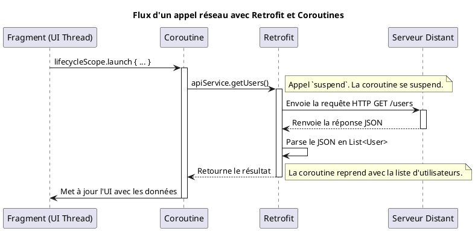

# Module 13 : Communiquer avec le Monde Extérieur (API REST & `Retrofit`)

### Objectifs pédagogiques

À la fin de ce module, vous serez capable de :

* Comprendre les principes de base d'une API REST et du format JSON.
* Définir ce qu'est `Retrofit` et pourquoi c'est la bibliothèque de référence pour le networking sur Android.
* Créer une interface de service `Retrofit` avec des annotations (`@GET`, `@Path`, `@Query`).
* Configurer une instance de `Retrofit` avec un convertisseur JSON (Moshi/Gson).
* Intégrer `Retrofit` avec les coroutines Kotlin pour effectuer des appels réseau asynchrones.

### Introduction

Imaginez que votre application est un restaurant. Jusqu'à présent, vous avez cuisiné uniquement avec les ingrédients que
vous aviez dans votre propre cellier (`Room`). C'est bien, mais limité. Et si vous pouviez commander des produits frais
et exotiques du monde entier, livrés directement dans votre cuisine chaque jour ? Votre menu deviendrait infiniment plus
intéressant !

Communiquer avec une **API REST**, c'est exactement ça. Votre application passe une commande (`Requête HTTP`) à un
serveur distant, qui est comme un immense marché en ligne. Le serveur prépare les produits demandés et vous les renvoie
dans un format standardisé et facile à déballer (`JSON`). La bibliothèque **`Retrofit`** est votre service de livraison
ultra-efficace. Vous lui donnez simplement votre liste de courses (une interface Kotlin), et il s'occupe de toute la
logistique complexe pour passer la commande et vous livrer les produits prêts à l'emploi.

### Notions abordées

* Principes d'une API REST et du format JSON.
* `Retrofit` : Le client HTTP de référence.
* Intégration avec les Coroutines Kotlin.

---

### Principes d'une API REST

#### Introduction à la notion

Une API REST est comme le menu d'un restaurant en ligne. Il vous dit exactement ce que vous pouvez commander et comment
le faire. "Pour avoir la liste de tous les plats du jour, faites une requête `GET` à l'adresse `/plats-du-jour`". "Pour
ajouter une réservation, faites une requête `POST` à `/reservations` avec les détails du client". Le format JSON, lui,
est la boîte standard dans laquelle on vous livre vos plats, facile à ouvrir et à comprendre.

#### Explication de la notion

**API (Application Programming Interface)** : C'est une interface qui permet à deux applications de communiquer entre
elles. Dans notre cas, notre application Android (le client) et un serveur distant.

**REST (Representational State Transfer)** : C'est un style d'architecture pour la conception d'API. Il est basé sur des
principes simples :

* **Ressources :** Tout est une ressource, identifiée par une URL (ex: `/users`, `/products/123`).
* **Méthodes HTTP (Verbes) :** On utilise les verbes HTTP standards pour interagir avec les ressources.
    * `GET` : Pour récupérer des données (lecture).
    * `POST` : Pour créer une nouvelle ressource.
    * `PUT` / `PATCH` : Pour mettre à jour une ressource existante.
    * `DELETE` : Pour supprimer une ressource.

**JSON (JavaScript Object Notation)** : C'est le format de données le plus utilisé pour les échanges sur le web. Il est
léger, lisible par les humains et facile à parser pour les machines. Il représente les données sous forme de paires
clé-valeur.

**Exemple de réponse JSON pour un utilisateur :**

```json
{
  "id": 1,
  "name": "Leanne Graham",
  "username": "Bret",
  "email": "Sincere@april.biz",
  "address": {
    "street": "Kulas Light",
    "suite": "Apt. 556",
    "city": "Gwenborough",
    "zipcode": "92998-3874"
  }
}
```

Nous allons utiliser des `data class` Kotlin qui correspondent parfaitement à cette structure pour que la conversion
soit automatique.

---

### `Retrofit` : Le client HTTP de référence

#### Introduction à la notion {id="introduction-la-notion_1"}

Retrofit est un traducteur magique. Vous lui donnez une simple interface Kotlin décrivant ce que vous voulez obtenir, et
il écrit pour vous tout le code complexe nécessaire pour créer et envoyer des requêtes HTTP, puis pour parser la réponse
JSON et la transformer en objets Kotlin que vous pouvez utiliser directement.

#### Explication de la notion {id="explication-de-la-notion_1"}

Retrofit est une bibliothèque développée par Square qui transforme votre API REST en une interface Kotlin.

**Les 3 étapes pour utiliser Retrofit :**

1. **Modèles de données (`data class`) :** Créez des `data class` Kotlin qui correspondent exactement à la structure du
   JSON que vous attendez.
2. **Interface de service API :** Définissez une interface Kotlin où chaque méthode représente un "endpoint" (une URL)
   de l'API. Vous utilisez des annotations Retrofit pour décrire la requête.
3. **Instance de Retrofit :** Créez un objet Retrofit en le configurant avec l'URL de base de l'API et un "
   convertisseur" qui saura transformer le JSON en vos `data class`.

#### Exemple : Utiliser une API de test (JSONPlaceholder)

Imaginons que nous voulons récupérer une liste d'utilisateurs depuis l'URL `https://jsonplaceholder.typicode.com/users`.

**Étape 1 : Ajouter les dépendances** dans `build.gradle.kts`

```kotlin
dependencies {
    // Retrofit
    implementation("com.squareup.retrofit2:retrofit:2.9.0")
    // Convertisseur Moshi (moderne, recommandé) ou Gson
    implementation("com.squareup.retrofit2:converter-moshi:2.9.0")
    // Moshi lui-même, avec le support de la génération de code
    implementation("com.squareup.moshi:moshi-kotlin:1.14.0")
    ksp("com.squareup.moshi:moshi-kotlin-codegen:1.14.0")
}
```

**Étape 2 : Créer les `data class`**

```kotlin
package fr.formation.retrofit.models

import com.squareup.moshi.Json

// L'annotation @JsonClass est nécessaire pour que Moshi génère l'adapter
@JsonClass(generateAdapter = true)
data class User(
    @Json(name = "id") // L'annotation @Json est optionnelle si les noms correspondent
    val id: Long,
    @Json(name = "name")
    val name: String,
    @Json(name = "email")
    val email: String
)
```

**Étape 3 : Créer l'interface de service**

```kotlin
package fr.formation.retrofit.api

import fr.formation.retrofit.models.User
import retrofit2.http.GET
import retrofit2.http.Path

interface ApiService {
    // La fonction est `suspend` pour être utilisée avec les coroutines
    @GET("users") // Endpoint relatif à l'URL de base
    suspend fun getUsers(): List<User>

    // Exemple avec un paramètre dans l'URL
    @GET("users/{id}") // ex: "users/1"
    suspend fun getUserById(@Path("id") userId: Long): User
}
```

**Étape 4 : Créer l'instance de Retrofit (souvent dans un objet Singleton)**

```kotlin
package fr.formation.retrofit.api

import com.squareup.moshi.Moshi
import com.squareup.moshi.kotlin.reflect.KotlinJsonAdapterFactory
import retrofit2.Retrofit
import retrofit2.converter.moshi.MoshiConverterFactory

object RetrofitClient {
    private const val BASE_URL = "https://jsonplaceholder.typicode.com/"

    // Configuration de Moshi pour qu'il fonctionne avec Kotlin
    private val moshi = Moshi.Builder()
        .add(KotlinJsonAdapterFactory())
        .build()

    // Création de l'instance de Retrofit
    private val retrofit = Retrofit.Builder()
        .baseUrl(BASE_URL)
        .addConverterFactory(MoshiConverterFactory.create(moshi))
        .build()

    // Création de l'implémentation de notre interface de service
    val apiService: ApiService by lazy {
        retrofit.create(ApiService::class.java)
    }
}
```

---

### Intégration avec les Coroutines Kotlin

#### Introduction à la notion {id="introduction-la-notion_2"}

Comme les opérations de base de données, les appels réseau sont lents et imprévisibles. Ils dépendent de la qualité de
la connexion de l'utilisateur. Les coroutines sont l'outil parfait pour gérer cette attente sans jamais geler l'
application.

#### Explication de la notion {id="explication-de-la-notion_2"}

En déclarant nos méthodes d'API comme `suspend fun`, Retrofit s'intègre nativement avec les coroutines.

* Quand vous appelez une méthode `suspend` de votre service, Retrofit effectue l'appel réseau en arrière-plan (sur
  `Dispatchers.IO`).
* La coroutine est **suspendue** pendant l'appel. Le thread principal est libre.
* Une fois la réponse reçue, la coroutine est **reprise** avec le résultat (ou une exception en cas d'erreur).

Le code d'appel devient incroyablement simple et lisible, et il se place naturellement dans un `lifecycleScope.launch`.



#### Exercice 1 : Récupérer et afficher une liste d'utilisateurs

**Énoncé :**
Mettez en place tout le nécessaire pour récupérer la liste d'utilisateurs de JSONPlaceholder et l'afficher dans un
`RecyclerView`.

1. Suivez les 4 étapes de l'exemple ci-dessus pour configurer Retrofit.
2. Créez une `MainActivity` avec un `RecyclerView`.
3. Créez un `UserAdapter` pour le `RecyclerView`.
4. Dans `MainActivity`, utilisez `lifecycleScope.launch` pour appeler `RetrofitClient.apiService.getUsers()`.
5. Gérez les cas de succès et d'erreur avec un bloc `try-catch`. En cas de succès, mettez à jour votre adapter avec la
   liste reçue.

**Correction exercice 1** {collapsible='true'}

**`MainActivity.kt`**

```kotlin
package fr.formation.retrofit

import androidx.appcompat.app.AppCompatActivity
import android.os.Bundle
import android.util.Log
import android.widget.Toast
import androidx.lifecycle.lifecycleScope
import androidx.recyclerview.widget.LinearLayoutManager
import fr.formation.retrofit.api.RetrofitClient
import fr.formation.retrofit.databinding.ActivityMainBinding
import java.lang.Exception

class MainActivity : AppCompatActivity() {

    private lateinit var binding: ActivityMainBinding
    private lateinit var userAdapter: UserAdapter

    override fun onCreate(savedInstanceState: Bundle?) {
        super.onCreate(savedInstanceState)
        binding = ActivityMainBinding.inflate(layoutInflater)
        setContentView(binding.root)

        setupRecyclerView()
        fetchUsers()
    }

    private fun setupRecyclerView() {
        userAdapter = UserAdapter(emptyList()) // On initialise avec une liste vide
        binding.recyclerView.apply {
            layoutManager = LinearLayoutManager(this@MainActivity)
            adapter = userAdapter
        }
    }

    private fun fetchUsers() {
        lifecycleScope.launch {
            try {
                // L'appel réseau est fait en arrière-plan
                val userList = RetrofitClient.apiService.getUsers()

                // Mise à jour de l'UI sur le thread principal
                userAdapter.updateUsers(userList)

            } catch (e: Exception) {
                // Gestion de l'erreur (ex: pas de connexion)
                Log.e("MainActivity", "Erreur réseau", e)
                Toast.makeText(
                    this@MainActivity,
                    "Erreur: ${e.message}",
                    Toast.LENGTH_LONG
                ).show()
            }
        }
    }
}
```

**(N'oubliez pas d'ajouter la permission Internet dans `AndroidManifest.xml`)**

```xml

<uses-permission android:name="android.permission.INTERNET"/>
```

**(Et l'Adapter `UserAdapter.kt`)**

```kotlin
// ...
class UserAdapter(private var users: List<User>) :
    RecyclerView.Adapter<UserAdapter.UserViewHolder>() {
    // ... implémentation classique de l'adapter ...

    fun updateUsers(newUsers: List<User>) {
        users = newUsers
        notifyDataSetChanged() // Pour la simplicité, sinon utiliser DiffUtil
    }
}
```

---

### TP 13 : Application "Dog Facts"

**Objectif :** Créer une application qui affiche une information aléatoire sur les chiens à chaque clic sur un bouton,
en utilisant une API publique.

Nous allons utiliser l'API [Dog API](https://dog-api.kinduff.com/api/v1/facts). L'endpoint qui nous intéresse est
`https://dog-api.kinduff.com/api/v1/facts?number=1`.
La réponse JSON ressemble à ceci :

```json
{
  "facts": [
    "La race de chien la plus ancienne, le Saluki, est originaire d'Égypte en 329 av. J.-C."
  ],
  "success": true
}
```

<procedure>

1. **Configurez Retrofit** et Moshi, avec l'URL de base `https://dog-api.kinduff.com/`.
2. **Créez la `data class`** `DogFactResponse` qui correspond à la structure JSON. Elle contiendra une `List<String>`
   nommée `facts`.
3. **Créez l'interface `ApiService`** avec une méthode `suspend fun getDogFact(): DogFactResponse`. Utilisez
   l'annotation `@GET("api/v1/facts?number=1")`.
4. **Créez le layout** avec un `TextView` pour afficher le "fact" et un `Button` pour en demander un nouveau.
5. **Dans `MainActivity.kt` :**
    * Créez une fonction `fetchNewFact()`.
    * À l'intérieur, lancez une coroutine avec `lifecycleScope.launch`.
    * Appelez votre service API.
    * Dans un bloc `try-catch`, si l'appel réussit et que la liste `facts` n'est pas vide, affichez le premier élément
      de la liste dans votre `TextView`.
    * Affichez un message d'erreur en cas d'échec.
    * Dans `onCreate`, appelez `fetchNewFact()` une première fois.
    * Dans le `onClickListener` du bouton, appelez à nouveau `fetchNewFact()`.

</procedure>

---

### Auto-évaluation

**1. Quelle méthode HTTP est généralement utilisée pour récupérer des données depuis une API REST ? (QCM)**

* A) `POST`
* B) `GET`
* C) `DELETE`
* D) `UPDATE`

**2. Quel est le rôle principal d'un "Converter" (comme `MoshiConverterFactory`) dans Retrofit ? (QCM)**

* A) Gérer l'authentification des requêtes.
* B) Traduire la réponse JSON du serveur en objets `data class` Kotlin.
* C) Choisir le thread sur lequel l'appel réseau sera exécuté.
* D) Ajouter des en-têtes (headers) à la requête.

**3. Dans l'annotation `@GET("posts/{id}")`, que représente `{id}` ? (QCM)**

* A) Un paramètre de requête (query parameter) qui sera ajouté après un `?`.
* B) Une partie statique de l'URL.
* C) Un placeholder pour une variable qui sera injectée dans le chemin de l'URL.
* D) Le corps (body) de la requête.

**4. Pourquoi est-il indispensable d'utiliser des coroutines (ou une autre forme d'asynchronisme) pour les appels réseau
avec Retrofit ? (Question ouverte)**

**5. Quel est l'intérêt de créer un objet Singleton (comme notre `RetrofitClient`) pour gérer l'instance de Retrofit ? (
Question ouverte)**

### Correction de l'auto-évaluation {collapsible="true"}

**1. Quelle méthode HTTP est utilisée pour récupérer des données ?**

* **Réponse : B) `GET`**
* **Justification :** Le verbe `GET` est la convention standard de l'architecture REST pour demander une représentation
  d'une ressource sans la modifier.

**2. Quel est le rôle principal d'un "Converter" ?**

* **Réponse : B) Traduire la réponse JSON du serveur en objets `data class` Kotlin.**
* **Justification :** Le convertisseur est le pont entre le monde textuel du JSON et le monde typé des objets Kotlin. Il
  automatise la désérialisation.

**3. Que représente `{id}` dans `@GET("posts/{id}")` ?**

* **Réponse : C) Un placeholder pour une variable qui sera injectée dans le chemin de l'URL.**
* **Justification :** C'est ce qu'on appelle un paramètre de chemin (path parameter). Il est remplacé par la valeur d'un
  argument de la méthode annoté avec `@Path("id")`.

**4. Pourquoi les coroutines sont-elles indispensables pour les appels réseau ?**

* **Réponse type :** Les appels réseau sont des opérations potentiellement très longues et imprévisibles (dépendent de
  la connexion, du serveur, etc.). Si on les effectuait sur le thread principal, l'application gèlerait complètement en
  attendant la réponse, conduisant à une mauvaise expérience utilisateur et à une erreur ANR. Les coroutines permettent
  d'exécuter ces appels en arrière-plan de manière asynchrone, suspendant l'exécution sans bloquer le thread principal,
  qui reste libre pour gérer l'interface utilisateur.

**5. Quel est l'intérêt d'un Singleton pour Retrofit ?**

* **Réponse type :** La création d'une instance de Retrofit (et du client HTTP OkHttp qu'il utilise en interne) est une
  opération "coûteuse". Elle configure des pools de threads, des stratégies de cache, des connexions, etc. En utilisant
  un Singleton, on s'assure que cet objet complexe n'est créé qu'une seule fois pour toute la durée de vie de l'
  application. On réutilise ensuite cette même instance pour tous les appels réseau, ce qui est beaucoup plus efficace
  en termes de performance et de consommation de ressources.

---

### Conclusion du module

Vous avez ouvert votre application au monde ! Vous savez maintenant comment définir et consommer une API REST, comment
modéliser des données JSON avec des `data class`, et comment utiliser le duo de choc `Retrofit` + `Coroutines` pour
effectuer des appels réseau de manière propre, sûre et asynchrone.

C'est une compétence cruciale qui vous permet de créer des applications dynamiques dont le contenu peut être mis à jour
sans avoir à redéployer l'application.

Nous avons maintenant toutes les briques techniques : l'UI, la navigation, la persistance locale et l'accès réseau. Mais
comment assembler tout ça de manière professionnelle, maintenable et testable ? C'est le but de notre dernière partie
sur l'Architecture, où nous allons découvrir le pattern MVVM recommandé par Google.