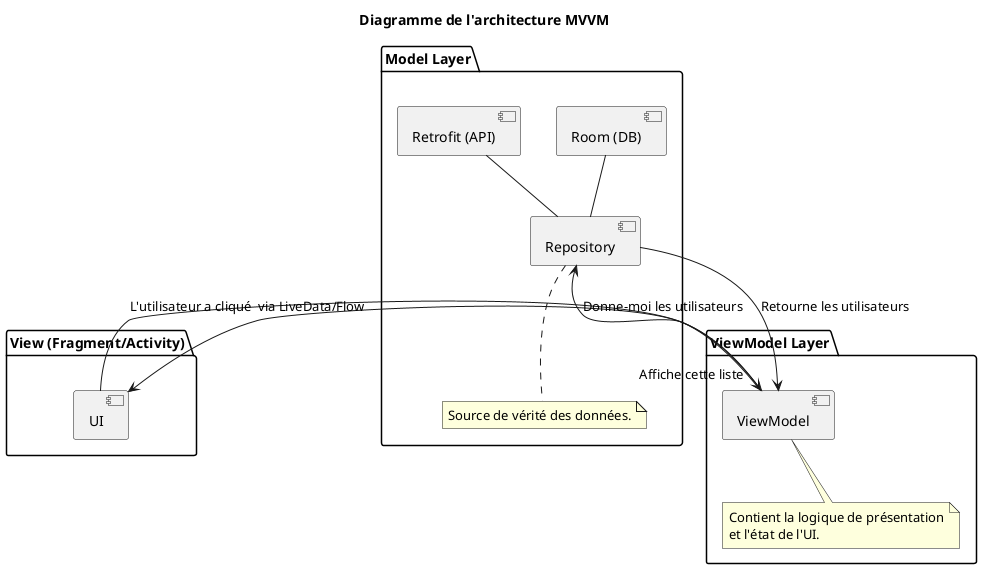

# Module 14 : Architecture d'Application : Le Pattern MVVM

### Objectifs pédagogiques

À la fin de ce module, vous serez capable de :

* Expliquer les problèmes du code "spaghetti" et la nécessité d'une architecture.
* Définir les responsabilités de chaque couche du pattern MVVM : View, ViewModel, et Model (Repository).
* Comprendre le principe de la séparation des préoccupations (Separation of Concerns).
* Mettre en place le composant `ViewModel` d'Android Jetpack et comprendre son cycle de vie distinct.

### Introduction

Vous vous souvenez de notre compteur dans le module 4 ? Quand on tournait l'écran, le compte revenait à zéro. Pourquoi ?
Parce que l'état (la variable `counter`) était stocké dans l'Activity, et que l'Activity était détruite et recréée.
C'était un cauchemar à gérer. De plus, si nous avions ajouté de la logique (sauvegarder le score, le comparer...), tout
aurait été mélangé dans le fichier de l'Activity, créant un plat de "spaghetti" indigeste.

L'architecture **MVVM** est la recette qui nous sauve de ce chaos. C'est un modèle qui sépare notre code en trois
couches distinctes, comme un gâteau à trois étages. Chaque étage a un rôle précis et ne communique qu'avec l'étage
directement adjacent. C'est cette séparation stricte qui résout nos problèmes de perte d'état et rend notre code propre,
testable et maintenable.

### Notions abordées

* Pourquoi une Architecture ? Le problème du code "spaghetti".
* Les Rôles du MVVM (Model-View-ViewModel).
* Le composant `ViewModel` d'Android Jetpack.

---

### Pourquoi une Architecture ?

#### Introduction à la notion

Avez-vous déjà essayé de démêler un énorme nœud d'écouteurs ? C'est frustrant, long, et on risque de tout casser. Le
code sans architecture, c'est exactement ça. Tout est emmêlé : la logique de l'interface, la logique métier, l'accès aux
données... Une bonne architecture, c'est comme ranger chaque câble dans sa propre boîte étiquetée.

#### Explication de la notion

Dans les premiers jours d'Android, il était courant de tout mettre dans l'Activity ou le Fragment : les clics sur les
boutons, les appels réseau, les requêtes en base de données, la manipulation des données...
Ce qu'on appelle le **code "spaghetti"** a des conséquences désastreuses :

* **Difficile à lire et à maintenir :** Des fichiers de milliers de lignes où tout est mélangé.
* **Difficile à tester :** Comment tester une logique métier si elle est étroitement liée à l'interface Android ?
* **Sujet aux bugs :** La gestion du cycle de vie (comme la rotation d'écran) devient un enfer, provoquant des fuites de
  mémoire et des pertes de données.

Le principe fondamental pour résoudre ce problème est la **Séparation des Préoccupations (Separation of Concerns)**.
Chaque partie de votre application ne doit avoir qu'une seule et unique responsabilité.

---

### Les Rôles du MVVM

#### Introduction à la notion {id="introduction-la-notion_1"}

MVVM est un plan d'organisation qui définit trois rôles clairs, comme dans une équipe :

* La **View** est l'**artiste**. Elle est douée pour dessiner l'interface et écouter le public (événements utilisateur),
  mais elle est "bête" et ne prend aucune décision.
* Le **ViewModel** est le **manager**. Il ne sait pas dessiner, mais il prend les décisions logiques. Il dit à l'artiste
  quoi afficher et réagit quand l'artiste lui rapporte une information du public. Il est le cerveau de l'interface.
* Le **Model** est l'**expert-comptable**. Il gère les sources de données (les livres de comptes, les contacts
  externes...). Le manager lui demande des informations, et il les lui fournit sans savoir à quoi elles serviront.

#### Explication de la notion {id="explication-de-la-notion_1"}

**Model (Modèle)**
C'est la couche de gestion des données. Elle est responsable de fournir les données, qu'elles viennent d'une base de
données `Room`, d'une API `Retrofit`, ou des `SharedPreferences`.

* Elle expose des données brutes.
* Elle ne connaît absolument rien de l'interface utilisateur.
* On y trouve souvent le **Repository Pattern** : une classe (ex: `UserRepository`) qui sert de source de vérité unique
  pour un certain type de données, en cachant la complexité (doit-on aller chercher les données dans le cache ou sur le
  réseau ?).

**View (Vue)**
C'est la couche UI, représentée par votre `Fragment` ou votre `Activity`.

* Sa **seule** responsabilité est d'afficher les données à l'écran et de transmettre les actions de l'utilisateur au
  ViewModel.
* Elle ne contient **AUCUNE** logique métier. Pas de calculs, pas de décisions.
* Elle observe les données exposées par le ViewModel et se met à jour en conséquence.

**ViewModel (Vue-Modèle)**
C'est le pont entre la View et le Model.

* Il contient la logique de présentation et l'**état** de l'UI.
* Il récupère les données brutes du Model et les prépare pour que la View puisse les afficher facilement.
* Il expose des données que la View peut "observer".
* Il ne connaît rien des détails de l'implémentation de la View (il ne sait pas s'il s'agit d'un Fragment, d'une
  Activity, etc.).




---

### Le composant `ViewModel` d'Android Jetpack

#### Introduction à la notion {id="introduction-la-notion_2"}

Le composant `ViewModel` de Google est la clé de voûte de cette architecture. C'est un manager très spécial : il a son
propre bureau, indépendant de la scène. Quand la scène est détruite et reconstruite (rotation d'écran), le manager reste
tranquillement dans son bureau, avec tous ses dossiers intacts. Quand la nouvelle scène est prête, elle vient simplement
se reconnecter au même manager.

#### Explication de la notion {id="explication-de-la-notion_2"}

Un `ViewModel` est une classe qui hérite de `androidx.lifecycle.ViewModel`. Sa caractéristique magique est qu'il est *
*conscient du cycle de vie, mais d'une manière différente** :

* Un `ViewModel` est créé la première fois qu'un `Fragment` ou une `Activity` le demande.
* Il **survit** aux changements de configuration (comme la rotation) qui détruisent et recréent l'Activity/Fragment.
* Il n'est détruit que lorsque le composant UI qui lui est associé est définitivement détruit (ex: l'utilisateur quitte
  l'écran avec le bouton Retour).

Ceci **résout complètement** le problème de la perte d'état. L'état de l'UI est stocké dans le `ViewModel`, pas dans la
View.

#### Mise en place

**1. Ajouter la dépendance** dans `build.gradle.kts`

```kotlin
dependencies {
    // ViewModel
    implementation("androidx.lifecycle:lifecycle-viewmodel-ktx:2.7.0")
    // Pour l'instanciation dans les fragments
    implementation("androidx.fragment:fragment-ktx:1.6.2")
}
```

**2. Créer la classe ViewModel**

```kotlin
package fr.formation.mvvm.counter

import androidx.lifecycle.ViewModel

// Notre ViewModel pour le compteur
class CounterViewModel : ViewModel() {

    // L'état (le compteur) est maintenant ici, à l'abri des rotations
    var count = 0
        private set // On ne peut le modifier que depuis le ViewModel

    fun increment() {
        count++
    }
}
```

**3. Instancier le ViewModel dans la View (Fragment/Activity)**
On utilise le délégué de propriété `by viewModels()` qui vient de la dépendance `fragment-ktx`.

```kotlin
package fr.formation.mvvm.counter

import androidx.appcompat.app.AppCompatActivity
import android.os.Bundle
import androidx.activity.viewModels // Import important

class CounterActivity : AppCompatActivity() {

    // Instanciation magique : le framework gère la création et la conservation
    private val viewModel: CounterViewModel by viewModels()

    override fun onCreate(savedInstanceState: Bundle?) {
        super.onCreate(savedInstanceState)
        // ...

        // On lit l'état depuis le ViewModel
        updateUi()

        binding.incrementButton.setOnClickListener {
            // On délègue l'action au ViewModel
            viewModel.increment()
            // On met à jour l'UI avec le nouvel état
            updateUi()
        }
    }

    private fun updateUi() {
        binding.counterTextView.text = viewModel.count.toString()
    }
}
```

Avec ce code, si vous faites pivoter l'écran, la valeur du compteur sera conservée !

#### Exercice 1 : Refactoriser le compteur en MVVM

**Énoncé :**
Reprenez le code du TP du module 4 (l'application "Compteur" qui perdait son état à la rotation) et refactorisez-le pour
utiliser l'architecture MVVM.

1. Ajoutez la dépendance `lifecycle-viewmodel-ktx`.
2. Créez une classe `CounterViewModel` qui contiendra la variable `count` et la méthode `increment()`.
3. Dans votre `MainActivity`, instanciez le `CounterViewModel` en utilisant `by viewModels()`.
4. Modifiez le code de l'Activity pour qu'elle lise l'état et appelle les méthodes du ViewModel, au lieu de gérer l'état
   elle-même.

### Correction exercice 1 {collapsible='true'}

**1. `build.gradle.kts`**

```kotlin
dependencies {
    implementation("androidx.lifecycle:lifecycle-viewmodel-ktx:2.7.0")
    implementation("androidx.activity:activity-ktx:1.9.0") // pour by viewModels() dans une Activity
    // ...
}
```

**2. `CounterViewModel.kt`**

```kotlin
package fr.formation.compteurapp.viewmodel

import androidx.lifecycle.ViewModel

class CounterViewModel : ViewModel() {

    var count = 0
        private set

    fun incrementCounter() {
        count++
    }
}
```

**3. `MainActivity.kt`**

```kotlin
package fr.formation.compteurapp

import androidx.appcompat.app.AppCompatActivity
import android.os.Bundle
import androidx.activity.viewModels // Important
import fr.formation.compteurapp.databinding.ActivityMainBinding
import fr.formation.compteurapp.viewmodel.CounterViewModel

class MainActivity : AppCompatActivity() {

    private lateinit var binding: ActivityMainBinding

    // Délégation de l'instanciation du ViewModel au framework
    private val viewModel: CounterViewModel by viewModels()

    override fun onCreate(savedInstanceState: Bundle?) {
        super.onCreate(savedInstanceState)
        binding = ActivityMainBinding.inflate(layoutInflater)
        setContentView(binding.root)

        // L'Activity ne fait plus que de l'affichage
        updateCounterText()

        binding.incrementButton.setOnClickListener {
            // L'Activity notifie le ViewModel de l'action de l'utilisateur
            viewModel.incrementCounter()
            // L'Activity met à jour son affichage en fonction du nouvel état
            updateCounterText()
        }
    }

    private fun updateCounterText() {
        // L'Activity lit l'état depuis le ViewModel
        binding.counterTextView.text = viewModel.count.toString()
    }
}
```

Maintenant, l'état du compteur survit à la rotation de l'écran.

---

## TP 14 : Mettre en place la structure MVVM pour notre application de notes

**Objectif :** Préparer l'architecture de notre application de notes en créant les différentes couches du MVVM.

<procedure>

1. **Créez la couche Model (Repository) :**
    * Créez une classe `NoteRepository`.
    * Pour l'instant, elle aura une dépendance vers le `NoteDao`.
    * Créez des méthodes qui encapsulent les appels au DAO (ex: `getAllNotes()`, `insert(note: Note)`).
    * Le but est que le ViewModel ne parle qu'au Repository, jamais directement au DAO.
   ```kotlin
   class NoteRepository(private val noteDao: NoteDao) {
       suspend fun getAllNotes(): List<Note> {
           return noteDao.getAllNotes()
       }

       suspend fun insert(note: Note) {
           noteDao.insert(note)
       }
   }
   ```
2. **Créez la couche ViewModel :**
    * Créez un `NoteViewModel` qui hérite de `ViewModel`.
    * Le `NoteViewModel` aura besoin d'une instance du `NoteRepository`. Nous verrons plus tard comment l'injecter
      proprement, pour l'instant on peut le passer au constructeur.
3. **Réfléchissez à la communication :**
    * Pour l'instant, notre `MainActivity` appelle `viewModel.increment()` puis `updateUi()`. C'est un peu manuel. Ne
      serait-ce pas génial si l'UI se mettait à jour **automatiquement** quand `count` change ?
    * C'est le problème que nous allons résoudre dans le prochain module avec `LiveData` et `StateFlow`.

</procedure>

---

## Correction du TP 14 {collapsible="true"}

### Prérequis : La couche de Données (Room)

Pour que ce TP fonctionne, nous avons besoin des classes `Note`, `NoteDao`, et `AppDatabase` du TP précédent. Assurons-nous que les méthodes du DAO sont des fonctions `suspend`, car c'est la meilleure pratique pour Room avec les coroutines.

#### `Note.kt` (inchangé)
```kotlin
import androidx.room.Entity
import androidx.room.PrimaryKey

@Entity(tableName = "note_table")
data class Note(
    @PrimaryKey(autoGenerate = true)
    val id: Int = 0,
    val title: String,
    val content: String
)
```

#### `NoteDao.kt` (modifié pour utiliser `suspend`)
```kotlin
import androidx.room.*

@Dao
interface NoteDao {
    @Query("SELECT * FROM note_table ORDER BY id DESC")
    suspend fun getAllNotes(): List<Note> // <-- Marqué suspend

    @Insert(onConflict = OnConflictStrategy.IGNORE)
    suspend fun insert(note: Note) // <-- Marqué suspend
}
```
*   **Pourquoi `suspend` ?** En marquant ces fonctions comme `suspend`, on indique à Kotlin que ce sont des opérations potentiellement longues qui doivent être appelées depuis une coroutine. Room est optimisé pour cela et exécutera automatiquement la requête sur un thread d'arrière-plan. Cela nous permet de supprimer le `.allowMainThreadQueries()` de notre base de données, ce qui est une bien meilleure pratique.

#### `AppDatabase.kt` (modifié pour retirer `allowMainThreadQueries`)
```kotlin
import android.content.Context
import androidx.room.*

@Database(entities = [Note::class], version = 1, exportSchema = false)
abstract class AppDatabase : RoomDatabase() {
    abstract fun noteDao(): NoteDao

    companion object {
        @Volatile
        private var INSTANCE: AppDatabase? = null

        fun getDatabase(context: Context): AppDatabase {
            return INSTANCE ?: synchronized(this) {
                val instance = Room.databaseBuilder(
                    context.applicationContext,
                    AppDatabase::class.java,
                    "note_database"
                )
                // On a retiré .allowMainThreadQueries() car on utilise des coroutines !
                .build()
                INSTANCE = instance
                instance
            }
        }
    }
}
```

---

### Correction du TP

### Étape 1 : Créer la couche Model (Repository)

Créez un nouveau fichier `NoteRepository.kt`.

```kotlin
package com.example.yourapplication // Adaptez votre package

/**
 * Le Repository est une couche d'abstraction entre les sources de données (ici, le DAO)
 * et le reste de l'application (le ViewModel).
 * C'est le "Single Source of Truth" (source de vérité unique) pour les données.
 */
class NoteRepository(private val noteDao: NoteDao) {

    /**
     * Récupère toutes les notes via le DAO.
     * La fonction est 'suspend' car elle appelle une fonction 'suspend' du DAO.
     */
    suspend fun getAllNotes(): List<Note> {
        return noteDao.getAllNotes()
    }

    /**
     * Insère une note via le DAO.
     * La fonction est 'suspend' car elle appelle une fonction 'suspend' du DAO.
     */
    suspend fun insert(note: Note) {
        noteDao.insert(note)
    }
}
```
**Rôle du Repository :**
*   Il cache les détails de la provenance des données (base de données, réseau, etc.).
*   Il centralise la logique de données. Si demain vous deviez synchroniser les notes avec un serveur, c'est ici que vous ajouteriez cette logique.
*   Le `ViewModel` ne saura jamais si les données viennent d'une base de données ou d'une API, il demande simplement les données au `Repository`.

---

### Étape 2 : Créer la couche ViewModel

#### 2a. Dépendances
Assurez-vous d'avoir la dépendance pour le ViewModel dans votre fichier `build.gradle.kts`.

```kotlin
dependencies {
    // ...
    implementation("androidx.lifecycle:lifecycle-viewmodel-ktx:2.7.0")
}
```

#### 2b. La classe `NoteViewModel.kt`
Créez un nouveau fichier `NoteViewModel.kt`.

```kotlin
package com.example.yourapplication

import androidx.lifecycle.ViewModel
import androidx.lifecycle.viewModelScope
import kotlinx.coroutines.launch

/**
 * Le ViewModel sert de pont entre le Repository (données) et l'UI (View).
 * Il contient la logique métier et expose l'état de l'UI.
 * Il survit aux changements de configuration (comme la rotation de l'écran).
 */
class NoteViewModel(private val repository: NoteRepository) : ViewModel() {

    // On va stocker la liste des notes ici. Pour l'instant, c'est une simple variable.
    var notes: List<Note> = emptyList()

    /**
     * Charge les notes depuis le repository en utilisant les coroutines.
     * viewModelScope est un CoroutineScope lié au cycle de vie du ViewModel.
     * La coroutine sera automatiquement annulée si le ViewModel est détruit.
     */
    fun loadNotes() {
        viewModelScope.launch {
            notes = repository.getAllNotes()
        }
    }

    /**
     * Insère une nouvelle note via le repository.
     */
    fun addNote(note: Note) {
        viewModelScope.launch {
            repository.insert(note)
        }
    }
}
```
**Rôle du ViewModel :**
*   Il ne doit **jamais** avoir de référence directe à une `Activity` ou un `Fragment` (pas de `Context`).
*   Il utilise `viewModelScope` pour lancer des coroutines qui s'annulent automatiquement.
*   Il détient les données que l'UI doit afficher.

---

### Étape 3 : Réflexion sur la Communication (et exemple de code)

Comme le souligne l'énoncé, la communication est pour l'instant manuelle. Voici à quoi ressemblerait notre `MainActivity` avec cette architecture. Elle montre clairement le problème.

Pour que `MainActivity` puisse créer un `NoteViewModel` qui a besoin d'un `NoteRepository`, nous devons utiliser une **ViewModelFactory**. C'est le mécanisme standard pour injecter des dépendances dans un ViewModel.

#### `NoteViewModelFactory.kt`
```kotlin
import androidx.lifecycle.ViewModel
import androidx.lifecycle.ViewModelProvider

class NoteViewModelFactory(private val repository: NoteRepository) : ViewModelProvider.Factory {
    override fun <T : ViewModel> create(modelClass: Class<T>): T {
        if (modelClass.isAssignableFrom(NoteViewModel::class.java)) {
            @Suppress("UNCHECKED_CAST")
            return NoteViewModel(repository) as T
        }
        throw IllegalArgumentException("Unknown ViewModel class")
    }
}
```

#### `MainActivity.kt` (illustrant le problème)
```kotlin
import androidx.appcompat.app.AppCompatActivity
import android.os.Bundle
import androidx.activity.viewModels
import androidx.lifecycle.lifecycleScope
import com.example.yourapplication.databinding.ActivityMainBinding
import kotlinx.coroutines.launch

class MainActivity : AppCompatActivity() {

    private lateinit var binding: ActivityMainBinding
    private lateinit var noteAdapter: NoteAdapter // On suppose que NoteAdapter existe

    // Injection de dépendances "manuelle" pour cet exemple
    private val database by lazy { AppDatabase.getDatabase(this) }
    private val repository by lazy { NoteRepository(database.noteDao()) }
    
    // Obtention du ViewModel via la factory
    private val noteViewModel: NoteViewModel by viewModels {
        NoteViewModelFactory(repository)
    }

    override fun onCreate(savedInstanceState: Bundle?) {
        super.onCreate(savedInstanceState)
        // ... initialisation du binding et de l'adapter ...

        loadAndDisplayNotes()

        binding.addButton.setOnClickListener {
            val title = binding.titleEditText.text.toString()
            val content = binding.contentEditText.text.toString()
            val newNote = Note(title = title, content = content)
            
            // On dit au ViewModel d'ajouter la note
            noteViewModel.addNote(newNote)
            
            // PROBLÈME : L'UI ne se met pas à jour toute seule.
            // On doit manuellement redemander les données et rafraîchir.
            // C'est inefficace et source d'erreurs.
            loadAndDisplayNotes() 
        }
    }

    private fun loadAndDisplayNotes() {
        // On doit utiliser une coroutine car le ViewModel met du temps à charger
        lifecycleScope.launch {
            noteViewModel.loadNotes() // Le VM charge les données dans sa variable interne
            // Il faut attendre un peu que la coroutine du VM se termine. Pas idéal !
            // (Ceci est une simplification pour l'exemple)
            noteAdapter.updateNotes(noteViewModel.notes) // On met à jour l'UI
        }
    }
}
```

### Conclusion de la réflexion

Le code ci-dessus fonctionne, mais il met en lumière plusieurs problèmes :
1.  **Communication manuelle :** L'`Activity` doit explicitement appeler `loadAndDisplayNotes()` pour rafraîchir l'interface. C'est l'`Activity` qui "tire" (pulls) les données.
2.  **Problèmes de synchronisation :** On lance une coroutine dans le `ViewModel` et une autre dans l'`Activity`. On n'est pas certain que les données seront prêtes quand on mettra à jour l'adapter. C'est fragile.

**La solution**, comme mentionné dans le TP, est de rendre les données **observables**. L'`Activity` ne demandera plus les données. Elle s'**abonnera** aux changements. Quand les données changeront dans le `ViewModel`, celui-ci "poussera" (pushes) automatiquement la nouvelle liste vers l'`Activity`, qui n'aura plus qu'à mettre à jour son `RecyclerView`.

C'est exactement le rôle de `LiveData` et de `StateFlow` que vous verrez par la suite. Ce TP a parfaitement préparé le terrain en montrant la nécessité de ces outils.

## Auto-évaluation

**1. Quelle est la responsabilité principale de la couche "View" dans l'architecture MVVM ? (QCM)**

* A) Effectuer les appels réseau et les requêtes en base de données.
* B) Contenir la logique métier et les décisions complexes.
* C) Afficher l'état de l'UI et transmettre les interactions de l'utilisateur au ViewModel.
* D) Stocker l'état de l'UI de manière persistante.

**2. Quel est l'avantage majeur du composant `ViewModel` de Jetpack ? (QCM)**

* A) Il accélère les requêtes en base de données.
* B) Il survit aux changements de configuration, protégeant ainsi l'état de l'UI.
* C) Il simplifie l'écriture des layouts XML.
* D) Il gère automatiquement la navigation entre les fragments.

**3. Lequel de ces éléments ne devrait JAMAIS se trouver dans un `ViewModel` ? (QCM)**

* A) Une référence à un Repository.
* B) Des données d'état de l'interface (comme une liste d'items à afficher).
* C) Une référence directe à une Activity ou un Fragment (un `Context`).
* D) La logique pour formater une date à afficher.

**4. Expliquez avec vos mots le principe de "Séparation des Préoccupations". (Question ouverte)**

**5. Quel problème fondamental l'architecture MVVM résout-elle concernant le cycle de vie d'Android ? (Question ouverte)
**

### Correction de l'auto-évaluation {collapsible="true"}

**1. Quelle est la responsabilité principale de la couche "View" ?**

* **Réponse : C) Afficher l'état de l'UI et transmettre les interactions de l'utilisateur au ViewModel.**
* **Justification :** La View doit être aussi "bête" que possible. Son rôle est de traduire un état (fourni par le
  ViewModel) en pixels à l'écran, et de traduire les actions de l'utilisateur (clics, etc.) en appels de méthode sur le
  ViewModel.

**2. Quel est l'avantage majeur du composant `ViewModel` ?**

* **Réponse : B) Il survit aux changements de configuration, protégeant ainsi l'état de l'UI.**
* **Justification :** Son cycle de vie est découplé de celui de la View (Activity/Fragment), ce qui lui permet de
  conserver les données en mémoire lors de la recréation de l'UI, comme lors d'une rotation d'écran.

**3. Lequel de ces éléments ne devrait JAMAIS se trouver dans un `ViewModel` ?**

* **Réponse : C) Une référence directe à une Activity ou un Fragment (un `Context`).**
* **Justification :** Détenir une référence à une View dans un ViewModel est une source majeure de fuites de mémoire.
  Comme le ViewModel a une durée de vie plus longue que la View, il l'empêcherait d'être détruite et nettoyée par le "
  garbage collector", même quand l'utilisateur a quitté l'écran.

**4. Expliquez le principe de "Séparation des Préoccupations".**

* **Réponse type :** C'est le principe de conception logicielle qui consiste à découper un programme en parties
  distinctes, où chaque partie s'occupe d'un aspect spécifique du problème. Dans MVVM, la View ne se préoccupe que de
  l'affichage, le ViewModel de la logique de présentation, et le Model de la source des données. Cette séparation rend
  le code plus facile à comprendre, à tester et à faire évoluer, car un changement dans une partie (par exemple, changer
  la base de données) a moins de chances d'impacter les autres.

**5. Quel problème fondamental MVVM résout-il concernant le cycle de vie d'Android ?**

* **Réponse type :** Il résout le problème de la **perte d'état** due à la destruction et recréation des composants UI (
  Activity/Fragment) lors des changements de configuration. En déplaçant la responsabilité de la gestion de l'état de la
  View (qui a un cycle de vie volatile) vers le `ViewModel` (qui a un cycle de vie stable et plus long), l'architecture
  garantit que les données affichées à l'écran sont préservées de manière fiable, améliorant ainsi considérablement
  l'expérience utilisateur.

---

## Conclusion du module

Vous avez posé les fondations de votre architecture ! Vous comprenez maintenant l'importance de structurer votre code et
vous savez comment mettre en place les différentes couches du pattern MVVM. Vous avez résolu le problème de la perte
d'état grâce au `ViewModel` de Jetpack.

Cependant, la communication entre notre View et notre ViewModel est encore un peu "manuelle". La View doit explicitement
demander au ViewModel de mettre à jour l'UI. Dans le prochain et dernier module de contenu, nous allons découvrir
comment rendre cette communication **réactive** avec `LiveData` et `StateFlow`, pour que l'UI se mette à jour *
*automatiquement** comme par magie. C'est la dernière pièce du puzzle pour une architecture MVVM complète et moderne.