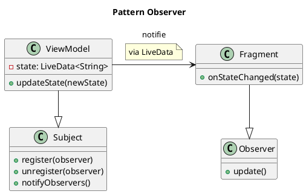

# Module 15 : Communication Réactive avec `LiveData` et `StateFlow`

### Objectifs pédagogiques

À la fin de ce module, vous serez capable de :

* Comprendre le pattern "Observer" et son intérêt dans l'architecture MVVM.
* Utiliser `LiveData` pour exposer des données observables depuis un ViewModel.
* "Observer" un `LiveData` depuis une View (Fragment/Activity) pour mettre à jour l'UI automatiquement.
* Comprendre le concept de `StateFlow` comme alternative moderne issue des Coroutines.
* Appliquer le principe de l'UI réactive pour découpler complètement la View du ViewModel.

### Introduction

Revenons à notre exemple du compteur en MVVM. Chaque fois que nous cliquions sur le bouton, nous devions faire deux
choses :

1. `viewModel.increment()` (Notifier le ViewModel de l'action)
2. `updateUi()` (Demander au ViewModel son nouvel état et mettre à jour l'UI)

C'est un peu comme si, pour savoir si vous avez reçu un nouvel e-mail, vous deviez cliquer manuellement sur le bouton "
Rafraîchir" toutes les 30 secondes. C'est inefficace et fastidieux.

La communication **réactive** change complètement la donne. C'est comme s'abonner à une notification. Vous dites au
service de messagerie : "Prévenez-moi **dès qu'un nouvel e-mail arrive**". Vous n'avez plus besoin de vérifier
constamment. L'information vient à vous automatiquement. `LiveData` et `StateFlow` sont ces systèmes de notification
pour votre application. Le ViewModel expose un état, et la View s'y "abonne". Dès que l'état change dans le ViewModel,
la View est notifiée et se met à jour toute seule.

### Notions abordées

* Le Pattern "Observer"
* `LiveData` : Observable et conscient du cycle de vie
* `StateFlow` : L'alternative moderne de Kotlin Coroutines
* Mise en pratique : Rendre le compteur réactif

---

### Le Pattern "Observer"

#### Introduction à la notion

Le pattern Observer, c'est comme s'abonner à une chaîne YouTube. Vous (l'**Observer**) vous abonnez à la chaîne d'un
créateur (le **Sujet** ou **Observable**). Vous n'allez pas vérifier sa page toutes les heures. Quand le créateur publie
une nouvelle vidéo, YouTube vous envoie une notification. C'est le Sujet qui informe activement ses Observers d'un
changement d'état.

#### Explication de la notion

Ce design pattern définit une relation de dépendance "un-à-plusieurs" entre des objets.

* Le **Sujet (Observable)** maintient une liste de ses dépendants, les **Observers**.
* Quand l'état du Sujet change, il parcourt sa liste d'Observers et appelle une méthode de notification sur chacun d'
  eux.

Dans notre architecture MVVM :

* Le **ViewModel** contient le Sujet (le `LiveData` ou le `StateFlow`).
* La **View** (Fragment/Activity) est l'Observer.

Cette approche permet un **découplage fort** : le ViewModel ne sait pas qui l'observe (il pourrait y avoir un, deux, ou
zéro observers). Il se contente de mettre à jour son état. La View, elle, ne sait pas pourquoi les données ont changé,
elle se contente de réagir à la notification.



---

### `LiveData` : Observable et conscient du cycle de vie

#### Introduction à la notion {id="introduction-la-notion_1"}

`LiveData` est un système de notification intelligent. Il ne vous envoie des notifications que si vous êtes "
disponible". Si vous mettez votre téléphone en mode "Ne pas déranger" (votre application est en arrière-plan),
`LiveData` garde les notifications pour lui et vous les délivre dès que vous désactivez ce mode.

#### Explication de la notion {id="explication-de-la-notion_1"}

`LiveData` est un conteneur de données observable fourni par Android Jetpack. Il a deux caractéristiques magiques :

1. **Observable :** Comme nous l'avons vu, on peut s'y abonner pour être notifié des changements.
2. **Conscient du cycle de vie (Lifecycle-Aware) :** C'est son plus grand avantage. `LiveData` ne notifie les
   observers (votre UI) que s'ils sont dans un état de cycle de vie actif (`STARTED` ou `RESUMED`).
    * Si votre Fragment est en arrière-plan (`STOPPED`), il ne recevra pas la mise à jour, évitant ainsi des crashs
      potentiels.
    * Quand le Fragment revient au premier plan, `LiveData` lui délivre immédiatement la dernière valeur disponible.
    * Quand votre Fragment est détruit (`DESTROYED`), `LiveData` supprime automatiquement l'abonnement pour vous,
      évitant les fuites de mémoire.

**MutableLiveData vs LiveData**
Pour respecter le principe d'encapsulation, la pratique courante est d'utiliser :

* Un `MutableLiveData` **privé** dans le ViewModel. Seul le ViewModel peut modifier sa valeur (`_myState.value = ...` ou
  `_myState.postValue(...)`).
* Un `LiveData` **public** qui expose la version "lecture seule" du `MutableLiveData` à la View.

#### Exemple de code

**Dans le ViewModel :**

```kotlin
import androidx.lifecycle.LiveData
import androidx.lifecycle.MutableLiveData
import androidx.lifecycle.ViewModel

class MyViewModel : ViewModel() {

    // 1. Version privée, modifiable, pour l'intérieur du ViewModel
    private val _username = MutableLiveData<String>()

    // 2. Version publique, lecture seule, pour l'extérieur (la View)
    val username: LiveData<String>
        get() = _username

    fun fetchUser() {
        // Simule un chargement de données
        _username.value = "John Doe"
    }
}
```

**Dans le Fragment (la View) :**

```kotlin
// Dans onViewCreated du Fragment
override fun onViewCreated(view: View, savedInstanceState: Bundle?) {
    super.onViewCreated(view, savedInstanceState)

    // 1. On s'abonne (observe) au LiveData du ViewModel
    viewModel.username.observe(viewLifecycleOwner) { newName ->
        // 2. Ce bloc de code (lambda) est appelé à chaque changement
        // et aussi une fois lors de la création de l'abonnement.
        binding.usernameTextView.text = newName
    }

    // Le bouton demande juste au ViewModel de faire son travail.
    // Il ne se soucie pas de la mise à jour de l'UI.
    binding.loadUserButton.setOnClickListener {
        viewModel.fetchUser()
    }
}
```

<tip>
L'argument `viewLifecycleOwner` est crucial. Il indique à `LiveData` qu'il doit suivre le cycle de vie de la **vue** du Fragment, et non du Fragment lui-même, pour gérer l'abonnement.
</tip>

---

### `StateFlow` : L'alternative moderne de Kotlin Coroutines

#### Introduction à la notion {id="introduction-la-notion_2"}

Si `LiveData` est le service de notification standard, `StateFlow` est une version plus moderne et plus puissante qui
vient du monde des Coroutines. Il fonctionne de manière très similaire mais est 100% Kotlin et s'intègre encore mieux
dans un flux de données asynchrones complexe. C'est un peu comme passer de SMS à une application de messagerie
instantanée.

#### Explication de la notion {id="explication-de-la-notion_2"}

`StateFlow` est un type spécial de `Flow` (un flux de données asynchrones en Kotlin) qui est optimisé pour représenter
un état.

* Il a toujours une valeur initiale.
* Il ne rediffuse sa valeur que si elle a changé (`distinctUntilChanged`).
* Il est "chaud" (`hot`), ce qui signifie qu'il reste actif et maintient sa valeur même si personne ne l'écoute.

L'utilisation est très similaire à `LiveData` :

* `MutableStateFlow` privé dans le ViewModel.
* `StateFlow` public et en lecture seule exposé à la View.

La manière d'observer est un peu différente. On utilise généralement `lifecycleScope.launch` et on "collecte" le flux.

#### Exemple de code {id="exemple-de-code_1"}

**Dans le ViewModel :**

```kotlin
import kotlinx.coroutines.flow.MutableStateFlow
import kotlinx.coroutines.flow.StateFlow
import kotlinx.coroutines.flow.asStateFlow

class MyViewModel : ViewModel() {
    private val _username = MutableStateFlow("Guest") // Doit avoir une valeur initiale
    val username: StateFlow<String> = _username.asStateFlow()

    fun fetchUser() {
        _username.value = "Jane Doe"
    }
}
```

**Dans le Fragment :**

```kotlin
// Dans onViewCreated du Fragment
override fun onViewCreated(view: View, savedInstanceState: Bundle?) {
    super.onViewCreated(view, savedInstanceState)

    // On lance une coroutine qui vivra aussi longtemps que la vue
    viewLifecycleOwner.lifecycleScope.launch {
        // repeatOnLifecycle garantit que la collecte s'arrête
        // quand la vue est en arrière-plan et reprend quand elle revient.
        viewLifecycleOwner.repeatOnLifecycle(Lifecycle.State.STARTED) {
            // On "collecte" les mises à jour du StateFlow
            viewModel.username.collect { newName ->
                binding.usernameTextView.text = newName
            }
        }
    }
}
```

<note>
Aujourd'hui, `StateFlow` est souvent préféré dans les projets 100% Kotlin pour sa meilleure intégration avec les coroutines. `LiveData` reste une solution très simple et robuste, surtout pour les débutants.
</note>

---

### Mise en pratique : Rendre le compteur réactif

#### Exercice 1 : Refactoriser le compteur avec `LiveData`

**Énoncé :**
Reprenez le code de l'exercice du module 14 (le compteur en MVVM). Modifiez-le pour que l'Activity n'ait plus besoin
d'appeler `updateUi()` manuellement. L'UI doit se mettre à jour automatiquement grâce à `LiveData`.

**Correction exercice 1** {collapsible='true'}

**1. `CounterViewModel.kt`**

```kotlin
package fr.formation.compteurapp.viewmodel

import androidx.lifecycle.LiveData
import androidx.lifecycle.MutableLiveData
import androidx.lifecycle.ViewModel

class CounterViewModel : ViewModel() {

    // On expose maintenant l'état via LiveData
    private val _count = MutableLiveData<Int>(0) // Valeur initiale à 0
    val count: LiveData<Int>
        get() = _count

    fun incrementCounter() {
        // On met à jour la valeur du LiveData.
        // Les observers seront notifiés automatiquement.
        _count.value = (_count.value ?: 0) + 1
    }
}
```

**2. `MainActivity.kt`**

```kotlin
package fr.formation.compteurapp

import androidx.appcompat.app.AppCompatActivity
import android.os.Bundle
import androidx.activity.viewModels
import fr.formation.compteurapp.databinding.ActivityMainBinding
import fr.formation.compteurapp.viewmodel.CounterViewModel

class MainActivity : AppCompatActivity() {

    private lateinit var binding: ActivityMainBinding
    private val viewModel: CounterViewModel by viewModels()

    override fun onCreate(savedInstanceState: Bundle?) {
        super.onCreate(savedInstanceState)
        binding = ActivityMainBinding.inflate(layoutInflater)
        setContentView(binding.root)

        // L'Activity ne fait plus que notifier le ViewModel des actions
        binding.incrementButton.setOnClickListener {
            viewModel.incrementCounter()
        }

        // Et s'abonner aux changements d'état
        viewModel.count.observe(this) { newCount ->
            // Ce bloc est appelé automatiquement quand la valeur de 'count' change
            binding.counterTextView.text = newCount.toString()
        }
    }
}
```

L'Activity est maintenant complètement découplée de la logique de mise à jour. Elle ne fait que déclarer "quand cette
donnée change, fais cette action".

---

### TP 15 : Application de Notes réactive

**Objectif :** Finaliser notre application de notes en implémentant une architecture MVVM complète et réactive avec
`LiveData`.

<procedure>

1. **Reprenez le TP du module 14** où nous avions créé `NoteRepository` et `NoteViewModel`.
2. **Modifiez le `NoteRepository` :** Changez la méthode `getAllNotes()` pour qu'elle retourne un `LiveData<List<Note>>`
   directement depuis le DAO. Room a une intégration magique pour ça !
   ```kotlin
   // Dans NoteDao.kt
   @Query("SELECT * FROM notes")
   fun getAllNotes(): LiveData<List<Note>> // Room gère la mise à jour auto !
   
   // Dans NoteRepository.kt
   class NoteRepository(private val noteDao: NoteDao) {
       val allNotes: LiveData<List<Note>> = noteDao.getAllNotes()

       suspend fun insert(note: Note) {
           noteDao.insert(note)
       }
   }
   ```
3. **Modifiez le `NoteViewModel` :**
    * Il doit exposer le `LiveData<List<Note>>` du Repository.
    * Il doit avoir une méthode `insert(note: Note)` qui lance une coroutine (`viewModelScope.launch`) pour appeler la
      méthode `suspend` du Repository.
   ```kotlin
   class NoteViewModel(application: Application) : AndroidViewModel(application) {
       private val repository: NoteRepository
       val allNotes: LiveData<List<Note>>

       init {
           val noteDao = AppDatabase.getDatabase(application).noteDao()
           repository = NoteRepository(noteDao)
           allNotes = repository.allNotes
       }

       fun insert(note: Note) = viewModelScope.launch {
           repository.insert(note)
       }
   }
   ```
   (On utilise `AndroidViewModel` pour avoir accès au `Context` nécessaire pour la base de données).
4. **Modifiez la `MainActivity` (la View) :**
    * Elle ne doit plus contenir de logique de BDD.
    * Dans `onCreate`, observez le `viewModel.allNotes`.
    * Dans le lambda de l'observer, mettez à jour votre `NoteAdapter` avec la nouvelle liste de notes.
    * Le `onClickListener` du bouton "Ajouter" doit simplement créer une `Note` et appeler `viewModel.insert(newNote)`.
5. **Testez :** Quand vous ajoutez une note, elle doit apparaître dans la liste **automatiquement** sans que vous ayez
   besoin de rafraîchir manuellement la liste. C'est la magie de Room + LiveData !

</procedure>

---

### Auto-évaluation

**1. Quel est le principal avantage de `LiveData` par rapport à un simple callback ? (QCM)**

* A) Il ne fonctionne qu'avec des `String`.
* B) Il est "lifecycle-aware" (conscient du cycle de vie), ce qui évite les crashs et les fuites de mémoire.
* C) Il est plus rapide pour les opérations mathématiques.
* D) Il ne peut avoir qu'un seul observer.

**2. Dans le pattern MVVM avec `LiveData`, quelle couche est responsable de la mise à jour de la valeur
du `LiveData` ? (QCM)**

* A) La View (Fragment/Activity)
* B) Le Model (Repository)
* C) Le ViewModel
* D) Le Layout XML

**3. Pour exposer un état modifiable uniquement par le ViewModel mais lisible par la View, quelle est la bonne
pratique ? (QCM)**

* A) Utiliser un `LiveData` public partout.
* B) Utiliser un `MutableLiveData` public partout.
* C) Utiliser un `StateFlow` public dans le ViewModel et un `MutableStateFlow` privé dans la View.
* D) Utiliser un `MutableLiveData` privé dans le ViewModel et l'exposer en tant que `LiveData` public.

**4. Que signifie l'expression "UI réactive" ? (Question ouverte)**

**5. Si vous utilisez `StateFlow`, pourquoi est-il important d'utiliser `repeatOnLifecycle` lors de la collecte dans un
Fragment ? (Question ouverte)**

### Correction de l'auto-évaluation {collapsible="true"}

**1. Quel est le principal avantage de `LiveData` ?**

* **Réponse : B) Il est "lifecycle-aware", ce qui évite les crashs et les fuites de mémoire.**
* **Justification :** Cette conscience du cycle de vie est sa caractéristique principale. Il suspend les mises à jour
  lorsque l'UI n'est pas visible et nettoie automatiquement les abonnements lorsque l'UI est détruite.

**2. Quelle couche met à jour la valeur du `LiveData` ?**

* **Réponse : C) Le ViewModel.**
* **Justification :** Le ViewModel est le propriétaire de l'état de l'UI. La View ne fait que l'observer. C'est le
  ViewModel qui décide quand et comment l'état doit changer, en se basant sur les actions de l'utilisateur ou les
  données du Model.

**3. Quelle est la bonne pratique pour exposer un état ?**

* **Réponse : D) Utiliser un `MutableLiveData` privé dans le ViewModel et l'exposer en tant que `LiveData` public.**
* **Justification :** C'est le principe d'encapsulation. On empêche la View (ou toute autre classe externe) de modifier
  directement l'état. La modification de l'état est une responsabilité qui doit rester à l'intérieur du ViewModel.

**4. Que signifie "UI réactive" ?**

* **Réponse type :** Une UI réactive est une interface utilisateur qui se met à jour **automatiquement** en réaction à
  des changements d'état sous-jacents, sans qu'il y ait besoin d'appels impératifs pour la rafraîchir. Au lieu de dire à
  l'UI "maintenant, redessine-toi avec cette nouvelle donnée", on déclare une relation entre un élément de l'UI et une
  source de données. Quand la source de données change, l'UI "réagit" et se met à jour. C'est un modèle de programmation
  déclaratif plutôt qu'impératif.

**5. Pourquoi utiliser `repeatOnLifecycle` avec `StateFlow` ?**

* **Réponse type :** `StateFlow` n'est pas nativement conscient du cycle de vie d'Android comme `LiveData`. Si on
  lançait simplement la collecte dans `lifecycleScope.launch`, la coroutine continuerait de recevoir des mises à jour
  même si l'application est en arrière-plan (état `STOPPED`), ce qui est un gaspillage de ressources et peut mener à des
  bugs. `repeatOnLifecycle(Lifecycle.State.STARTED)` crée une coroutine qui ne s'exécute que lorsque le cycle de vie est
  au moins à l'état `STARTED`. Elle s'arrête automatiquement quand l'app passe en arrière-plan et redémarre quand elle
  revient au premier plan, imitant ainsi le comportement sûr de `LiveData`.

---

### Conclusion de la partie

Félicitations ! Vous avez atteint le sommet de l'architecture d'application Android moderne. Vous savez non seulement
comment structurer votre application en couches logiques avec MVVM, mais aussi comment les faire communiquer de manière
efficace, sûre et réactive.

Le découplage entre votre logique de présentation (`ViewModel`) et votre affichage (`View`) est maintenant complet.
Votre code est plus propre, plus robuste, plus testable, et beaucoup plus agréable à maintenir. Vous avez les
compétences pour construire des applications complexes qui sont à la fois puissantes et bien conçées.

Il ne nous reste plus qu'une dernière étape : un récapitulatif de tout ce que nous avons appris, et quelques pistes pour
continuer votre voyage dans l'univers passionnant du développement Android.