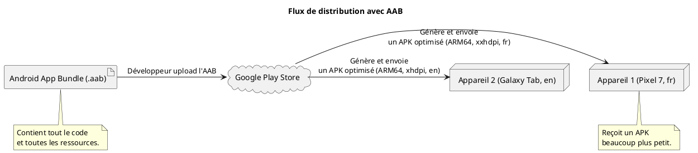

# Module 16 : Déploiement sur le Google Play Store

### Objectifs pédagogiques

À la fin de ce module, vous serez capable de :
*   Comprendre la différence entre un APK et un Android App Bundle (AAB).
*   Générer un AAB signé, prêt pour la publication.
*   Créer un keystore (magasin de clés) et comprendre son importance capitale.
*   Décrire les étapes principales du processus de mise en ligne sur la Google Play Console.

### Introduction

Vous avez construit votre chef-d'œuvre. La dernière étape est de l'exposer dans la plus grande galerie d'art du monde : le Google Play Store. Mais on n'entre pas dans une galerie sans préparer son œuvre. Il faut la mettre dans un emballage officiel, la signer pour en garantir l'authenticité, et remplir la fiche descriptive pour que les visiteurs sachent de quoi il s'agit.

Ce module est le guide de l'artiste pour sa première exposition. Nous allons apprendre à créer l'emballage moderne et optimisé (**AAB**), à apposer notre signature numérique indélébile (**signature**), et à naviguer dans l'interface de la galerie (**Play Console**) pour que votre application soit enfin accessible à des milliards d'utilisateurs potentiels. C'est l'aboutissement de tout votre travail.

### Notions abordées

*   APK vs. Android App Bundle (AAB)
*   La Signature d'Application
*   Le Processus sur la Google Play Console

---

### APK vs. Android App Bundle (AAB)

#### Introduction à la notion

Imaginez que vous vendez des T-shirts. L'**APK** (Android Package Kit), c'est comme mettre toutes les tailles (S, M, L, XL, XXL) et toutes les langues dans un seul et même énorme paquet. Chaque client reçoit tout, même ce dont il n'a pas besoin. L'**AAB** (Android App Bundle), c'est plus intelligent. Vous donnez tout votre stock au gérant du magasin (Google Play), et quand un client de taille M arrive, le gérant lui donne uniquement le T-shirt de taille M.

#### Explication de la notion

*   **APK :** C'est le fichier final que l'on installe sur un appareil. Historiquement, les développeurs généraient un "APK universel" qui contenait le code et les ressources pour toutes les configurations possibles (différentes densités d'écran, architectures de processeur, langues...).
*   **AAB :** C'est un **format de publication**. Ce n'est pas un fichier que vous pouvez installer directement. Vous téléchargez ce bundle sur le Play Store, et c'est Google Play qui se charge de générer et de servir des APK optimisés et plus petits pour chaque configuration d'appareil de l'utilisateur. C'est le format **obligatoire** aujourd'hui.

---

### La Signature d'Application

#### Introduction à la notion {id="introduction-la-notion_1"}

La signature de votre application, c'est son sceau d'authenticité. C'est une preuve cryptographique qui garantit deux choses :
1.  **Authenticité :** L'application vient bien de vous et n'a pas été modifiée par un tiers.
2.  **Mises à jour :** Seule une mise à jour signée avec la **même clé** que la version originale peut être installée.

Cette signature est stockée dans un fichier appelé **keystore** (ou magasin de clés).

#### Explication de la notion {id="explication-de-la-notion_1"}

Le keystore est un fichier (généralement avec l'extension `.jks` ou `.keystore`) qui contient votre clé de signature privée. Ce fichier est protégé par un mot de passe, et la clé elle-même est protégée par un autre mot de passe.

<warning title="Extrêmement important">
**NE PERDEZ JAMAIS VOTRE CLÉ DE SIGNATURE !**
Conservez votre fichier keystore et ses mots de passe dans un endroit sûr (comme un gestionnaire de mots de passe et un cloud sécurisé). Si vous le perdez, vous ne pourrez **PLUS JAMAIS** publier de mise à jour pour votre application. Vous devrez la republier comme une nouvelle application, perdant ainsi tous vos utilisateurs et votre historique. C'est la règle d'or numéro un de la publication.
</warning>

Depuis quelques années, Google propose la **Signature d'application par Play**, qui est la méthode recommandée. Vous signez votre AAB avec votre clé ("clé d'upload"), et Google le re-signe avec une clé de publication qu'il gère pour vous. Cela vous protège en cas de perte de votre clé d'upload (vous pouvez en demander la réinitialisation).

---

### Le Processus sur la Google Play Console

#### Introduction à la notion {id="introduction-la-notion_2"}

La Google Play Console est votre tableau de bord de "vendeur". C'est ici que vous allez créer la "fiche produit" de votre application, télécharger les fichiers, fixer les règles de distribution et analyser vos statistiques de vente et d'utilisation.

#### Explication de la notion {id="explication-de-la-notion_2"}

Les étapes principales sont :
1.  **Créer un compte développeur Google Play :** C'est une étape unique qui coûte 25$ (frais uniques).
2.  **Créer une nouvelle application :** Donnez-lui un nom, une langue par défaut, etc.
3.  **Remplir la fiche Play Store :** C'est une étape cruciale qui demande du temps. Vous devrez fournir :
    *   Titre, description courte et complète.
    *   Captures d'écran, icône de l'application, image promotionnelle.
    *   Catégorie de l'application.
    *   Coordonnées de contact.
    *   Politique de confidentialité (obligatoire).
4.  **Remplir les sections de conformité :** Vous devrez répondre à des questionnaires sur le contenu de votre application (publicité, contenu sensible, audience cible...).
5.  **Créer une version :** Vous allez dans la section "Production" ou "Test interne", vous créez une nouvelle "release", et c'est là que vous **uploadez votre fichier .aab signé**.
6.  **Déployer :** Une fois que tout est prêt, vous soumettez votre version pour examen par Google. Après validation (de quelques heures à plusieurs jours), votre application est en ligne !

---

### TP 16 : Générer votre premier App Bundle signé

**Objectif :** Suivre le processus dans Android Studio pour générer un fichier `.aab` signé, prêt à être uploadé.

<procedure title="Générer un AAB signé">

1.  **Sélectionner la bonne variante de build :**
    *   Allez dans `Build > Select Build Variant...`.
    *   Dans la fenêtre qui s'ouvre, changez-la "Active Build Variant" pour **release**.

2.  **Lancer l'assistant de génération :**
    *   Allez dans `Build > Generate Signed Bundle / APK...`.
    *   Sélectionnez **Android App Bundle** et cliquez sur "Next".

3.  **Configurer le magasin de clés (Keystore) :**
    *   C'est l'étape la plus importante. Comme c'est la première fois, cliquez sur **"Create new..."**.
    *   **Key store path :** Cliquez sur l'icône de dossier et choisissez un emplacement **EN DEHORS** de votre projet d'application pour sauvegarder votre fichier `.jks`. Donnez-lui un nom (ex: `ma-cle-secrete.jks`).
    *   **Password :** Créez un mot de passe **solide** pour protéger le fichier keystore.
    *   **Alias :** Un nom pour votre clé à l'intérieur du keystore (ex: `mon-app-alias`).
    *   **Password (Key) :** Créez un mot de passe **solide** pour la clé elle-même (il peut être différent de celui du keystore).
    *   **Validity (years) :** Laissez la valeur par défaut (25 ans ou plus).
    *   **Certificate :** Remplissez au moins un des champs (votre nom).
    *   Cliquez sur "OK". **Notez précieusement ces mots de passe !**

4.  **Générer le bundle :**
    *   Vous revenez à l'écran précédent, mais les champs sont maintenant remplis. Cochez "Export encrypted key for enrolling in Google Play App Signing".
    *   Cliquez sur "Next".
    *   Choisissez la destination pour votre `.aab` signé (le dossier par défaut `app/release` est très bien).
    *   Cliquez sur **"Finish"**.

5.  **Trouver le résultat :**
    *   Android Studio va compiler votre projet en mode "release". Une fois terminé, une notification apparaîtra en bas à droite avec un lien **"locate"**. Cliquez dessus pour ouvrir le dossier contenant votre fichier `app-release.aab`.
    *   C'est ce fichier que vous uploaderez sur la Google Play Console.

</procedure>

---

### Conclusion du cours

Et voilà. Le voyage est terminé. Vous avez commencé avec une idée, un IDE vide, et vous terminez avec un fichier `.aab` signé, le produit final de votre travail, prêt à être partagé avec le monde.

Vous avez parcouru un chemin immense, des fondations de l'écosystème Android à l'architecture réactive MVVM, en passant par la construction d'interfaces, la gestion des données locales et distantes, et enfin, la publication. Vous n'êtes plus simplement un développeur en apprentissage ; vous êtes un **Concepteur Développeur d'Application** avec un ensemble de compétences solides et modernes.

Le développement est un marathon, pas un sprint. Continuez à apprendre, à explorer, à construire. La communauté est vaste, les ressources sont infinies.

Je vous souhaite le meilleur pour vos futurs projets et votre carrière. Ce fut un plaisir de vous former. Maintenant, à vous de jouer 