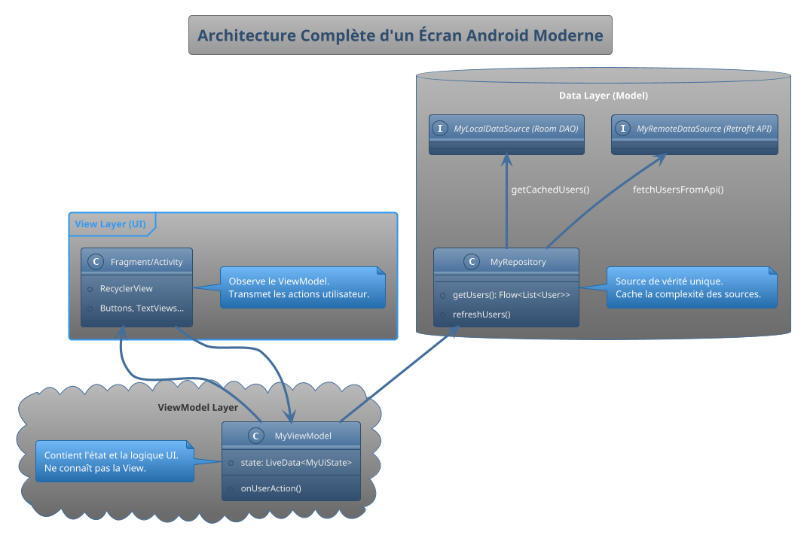

# Conclusion

Félicitations ! Vous êtes arrivé au bout de ce parcours de formation. Repensez au tout début : vous étiez devant un terrain vague avec une ambition, celle de construire des applications. Aujourd'hui, vous n'êtes plus seulement un aspirant, vous êtes un architecte, un ingénieur et un constructeur. Vous avez assemblé une boîte à outils complète et professionnelle pour bâtir des applications Android modernes, robustes et maintenables.

Ce document est votre "mémento", un résumé des concepts clés que vous emporterez avec vous. C'est la carte de référence de votre nouveau savoir-faire.

### Les Idées Fondamentales à Retenir

1.  **L'Écosystème est votre Terrain de Jeu :**
    *   **Android Studio** est votre centre de commandement. Maîtrisez-le.
    *   L'**Émulateur (AVD)** est votre terrain de test principal, mais rien ne remplace un **appareil physique** pour la validation finale.
    *   Le **Logcat** est votre meilleur ami pour le débogage. Apprenez à l'aimer et à l'utiliser constamment.

2.  **Kotlin est votre Langage de Prédilection :**
    *   **`val` > `var` :** Privilégiez l'immuabilité pour un code plus sûr.
    *   **La Sécurité Anti-Null (`Null-Safety`) n'est pas une option, c'est une philosophie.** Le `?`, `?.` et `?:` (Elvis) sont les gardiens qui protègent vos applications des `NullPointerException`.
    *   Les **`data class`** sont parfaites pour modéliser des données (venant d'une API ou d'une BDD).

3.  **L'Architecture "Single-Activity" est la Norme :**
    *   Une seule `Activity` sert de cadre principal à votre application.
    *   Les **`Fragment`s** sont les briques modulaires qui composent vos écrans. Ils sont légers, réutilisables et gérés par le **Navigation Component**.
    *   Le **Navigation Component** est votre GPS. Il centralise et simplifie toute la logique de navigation, y compris le passage de données sécurisé avec **Safe Args**.

4.  **L'Interface Utilisateur est une Danse entre XML et Kotlin :**
    *   **XML** pour la structure **déclarative** (`ConstraintLayout` est votre outil le plus puissant).
    *   **View Binding** pour la liaison **sûre et efficace** entre le XML et le code.
    *   **`RecyclerView`** pour toute liste de données. Maîtriser son trio (`Adapter`, `ViewHolder`, `LayoutManager`) est **non négociable**.

5.  **Les Données sont le Carburant de votre Application :**
    *   **Ne jamais bloquer le Thread Principal.** Toute opération potentiellement longue (BDD, Réseau) doit être asynchrone.
    *   Les **Coroutines Kotlin (`lifecycleScope`, `suspend fun`)** sont la manière moderne et lisible de gérer l'asynchronisme.
    *   Choisissez le bon outil de stockage : **`SharedPreferences`** pour les paires clé-valeur simples, **`Room`** pour les données structurées et relationnelles.
    *   **`Retrofit`** est le standard pour communiquer avec des API REST.

6.  **MVVM est votre Plan d'Architecture :**
    *   **La Séparation des Préoccupations** est la règle d'or.
    *   **View (Fragment) :** Affiche les données et capture les événements. Elle est "bête".
    *   **ViewModel :** Contient l'état de l'UI et la logique de présentation. **Il survit aux rotations d'écran**, résolvant ainsi un problème fondamental d'Android.
    *   **Model (Repository) :** La source de vérité pour les données, qu'elles soient locales (`Room`) ou distantes (`Retrofit`).
    *   **`LiveData` / `StateFlow` :** Le système de communication **réactif** qui permet à l'UI de se mettre à jour automatiquement lorsque l'état dans le ViewModel change.

### Le Plan Complet d'une Application Moderne

Voici un diagramme qui synthétise la manière dont tous ces composants s'articulent dans une application bien architecturée. Considérez-le comme le plan de référence pour vos futurs projets.

Vous avez maintenant en main non seulement les outils, mais aussi le plan pour les assembler de manière professionnelle. Vous avez les compétences pour créer des applications qui ne sont pas seulement fonctionnelles, mais aussi robustes, testables et prêtes à évoluer.

Le voyage a été intense, mais regardez le chemin parcouru. Vous êtes prêt à construire.