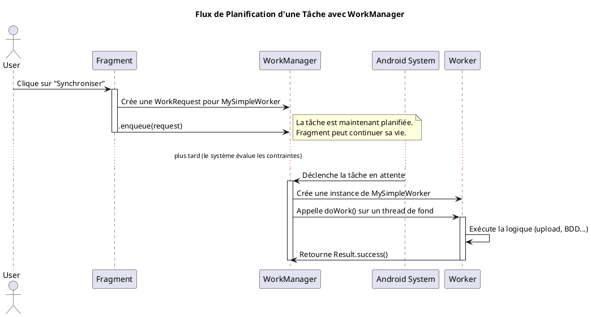

# Module 20 : Gestion Fiable des Tâches en Arrière-plan avec WorkManager

### Objectifs pédagogiques

À la fin de ce module, vous serez capable de :

* Expliquer pourquoi les Coroutines simples ou les Threads ne sont pas suffisants pour des tâches en arrière-plan
  garanties.
* Définir le rôle et les avantages de `WorkManager`.
* Créer une classe `Worker` pour encapsuler la logique d'une tâche.
* Construire et planifier une `WorkRequest` simple (`OneTimeWorkRequest`).
* (Théorie) Comprendre les contraintes (`Constraints`) et les requêtes périodiques (`PeriodicWorkRequest`).

### Introduction

Imaginez que votre application doit envoyer un rapport de logs au serveur, ou synchroniser des photos, tous les soirs à
minuit. Que se passe-t-il si, à ce moment-là, l'application est fermée ? Si le téléphone de l'utilisateur n'a pas de
connexion internet ? Ou s'il redémarre juste avant ?

Une simple coroutine lancée dans un `viewModelScope` ne survivrait pas à la fermeture de l'application. Un thread
classique non plus. Ces tâches seraient simplement perdues. Vous avez besoin d'un "coursier" ultra-fiable et
intelligent. Vous lui donnez une mission (le "travail") et des instructions précises ("Ne pars que s'il y a du Wi-Fi", "
Réessaye si tu échoues", "Fais-le même si je ne suis pas là pour te surveiller").

**`WorkManager`** est ce coursier. C'est la solution recommandée par Google pour toute tâche qui doit être exécutée de
manière **garantie**, que l'application soit ouverte ou non. Il gère intelligemment les contraintes de l'appareil (
batterie, réseau) et la survie aux redémarrages pour s'assurer que le travail sera fait, quoi qu'il arrive.

### Notions abordées

* Les Limites des Tâches en Avant-plan
* Les 3 Piliers de WorkManager : `Worker`, `WorkRequest`, `WorkManager` (le service)
* Planifier une Tâche Simple
* Contraintes et Tâches Périodiques

---

### Les Limites des Tâches en Avant-plan

#### Introduction à la notion

Une coroutine dans un `lifecycleScope` est comme un employé qui ne travaille que lorsque vous êtes dans la pièce. Dès
que vous quittez la pièce (le `Fragment` est détruit), il arrête de travailler. C'est parfait pour les tâches liées à l'
UI, mais totalement inadapté pour un travail qui doit se terminer de manière indépendante.

#### Explication de la notion

Depuis les versions récentes d'Android, le système est devenu très agressif pour limiter l'utilisation des ressources (
batterie, CPU) par les applications en arrière-plan. Lancer un service de fond qui tourne indéfiniment n'est plus une
option viable.

**WorkManager** a été conçu pour répondre à ce problème. Ce n'est pas un simple lanceur de threads. C'est un *
*planificateur de tâches intelligent** qui négocie avec le système d'exploitation Android. Il garantit que votre tâche
s'exécutera, mais il choisit le meilleur moment pour le faire afin d'optimiser les ressources de l'appareil.

**WorkManager est idéal pour les tâches :**

* **Différables :** Des tâches qui n'ont pas besoin d'être exécutées *immédiatement*.
* **Garanties :** Des tâches qui doivent s'exécuter *même si l'utilisateur quitte l'application ou redémarre son
  téléphone*.

**Exemples :**

* Uploader des photos sur un serveur.
* Appliquer un filtre sur une vidéo.
* Synchroniser périodiquement les données de l'application avec un serveur.
* Nettoyer le cache de la base de données une fois par jour.

---

### Les 3 Piliers de WorkManager

#### Introduction à la notion {id="introduction-la-notion_1"}

Pour utiliser notre service de coursier, nous avons besoin de trois éléments :

1. **Le Colis et les Instructions (`Worker`) :** C'est la description de la mission elle-même. "Prends ce colis (les
   données), et voici comment le livrer (la logique à exécuter)".
2. **Le Bon de Commande (`WorkRequest`) :** C'est le formulaire que vous remplissez pour demander une livraison. "Je
   veux une livraison unique", "Je veux une livraison tous les lundis", "Ne livrer que si la batterie est en charge".
3. **L'Agence de Livraison (`WorkManager`) :** C'est le service central à qui vous remettez votre bon de commande. C'est
   lui qui gère toute la logistique.

#### Explication de la notion {id="explication-de-la-notion_1"}

**1. `Worker` : La Tâche à Effectuer**
C'est une classe qui hérite de `CoroutineWorker` (la version moderne pour utiliser les coroutines). Vous y placez la
logique de votre tâche dans la méthode `doWork()`.

* `doWork()` est une fonction `suspend`, vous pouvez donc y appeler d'autres fonctions `suspend` (comme des requêtes
  Room ou Retrofit).
* Elle doit retourner un `Result` :
    * `Result.success()` : La tâche a réussi.
    * `Result.failure()` : La tâche a échoué.
    * `Result.retry()` : La tâche a échoué mais WorkManager doit réessayer plus tard.

```kotlin
package fr.formation.workmanager

import android.content.Context
import android.util.Log
import androidx.work.CoroutineWorker
import androidx.work.WorkerParameters
import kotlinx.coroutines.delay

class MySimpleWorker(
    appContext: Context,
    workerParams: WorkerParameters
) : CoroutineWorker(appContext, workerParams) {

    override suspend fun doWork(): Result {
        Log.d("MySimpleWorker", "Le travail en arrière-plan commence...")

        try {
            // Simule une tâche longue, comme un upload
            delay(5000) // Travail pendant 5 secondes

            Log.d("MySimpleWorker", "Le travail est terminé avec succès !")
            return Result.success()
        } catch (e: Exception) {
            Log.e("MySimpleWorker", "Le travail a échoué", e)
            return Result.failure()
        }
    }
}
```

**2. `WorkRequest` : La Définition de la Planification**
C'est un objet qui définit comment et quand le `Worker` doit être exécuté.

* **`OneTimeWorkRequest` :** Pour une tâche qui ne doit s'exécuter qu'une seule fois.
* **`PeriodicWorkRequest` :** Pour une tâche qui doit se répéter (ex: toutes les 24 heures).

**3. `WorkManager` : Le Service de Planification**
C'est le singleton qui vous permet de mettre en file d'attente (`enqueue`) votre `WorkRequest`.




---

### Planifier une Tâche Simple

#### Introduction à la notion {id="introduction-la-notion_2"}

Nous allons remplir notre premier "bon de commande" et le donner à l'agence de livraison. C'est une action simple qui va
déclencher tout le mécanisme en coulisses.

#### Explication de la notion {id="explication-de-la-notion_2"}

**Étape 1 : Ajouter la dépendance** dans `build.gradle.kts`

```kotlin
dependencies {
    // WorkManager avec le support des coroutines Kotlin
    implementation("androidx.work:work-runtime-ktx:2.9.0")
}
```

**Étape 2 : Créer le `Worker`** (voir l'exemple ci-dessus)

**Étape 3 : Créer et mettre en file d'attente la `WorkRequest` depuis l'UI**

```kotlin
// Dans une Activity ou un Fragment
private fun startBackgroundTask() {
    // 1. On crée le "bon de commande" pour notre Worker
    val myWorkRequest = OneTimeWorkRequestBuilder<MySimpleWorker>().build()

    // 2. On le soumet à l'agence de livraison
    WorkManager.getInstance(requireContext()).enqueue(myWorkRequest)

    Toast.makeText(context, "Tâche de fond planifiée !", Toast.LENGTH_SHORT).show()
}
```

#### Exercice 1 : Lancer un nettoyage de cache

**Énoncé :**
Créez une application avec un bouton "Nettoyer le cache". Au clic, planifiez un `Worker` qui simule un nettoyage (en
affichant un log) après un délai de 3 secondes.

**Correction exercice 1** {collapsible='true'}

**1. `CacheCleanupWorker.kt`**

```kotlin
package fr.formation.workmanager.workers

import android.content.Context
import android.util.Log
import androidx.work.CoroutineWorker
import androidx.work.WorkerParameters
import kotlinx.coroutines.delay

class CacheCleanupWorker(
    appContext: Context,
    params: WorkerParameters
) : CoroutineWorker(appContext, params) {

    companion object {
        const val TAG = "CacheCleanupWorker"
    }

    override suspend fun doWork(): Result {
        Log.d(TAG, "Début du nettoyage du cache...")

        return try {
            // Simule une opération qui prend du temps
            delay(3000)
            Log.d(TAG, "Nettoyage du cache terminé avec succès.")
            Result.success()
        } catch (e: Exception) {
            Log.e(TAG, "Erreur lors du nettoyage du cache.", e)
            Result.failure()
        }
    }
}
```

**2. `MainActivity.kt`**

```kotlin
package fr.formation.workmanager

import androidx.appcompat.app.AppCompatActivity
import android.os.Bundle
import androidx.work.OneTimeWorkRequestBuilder
import androidx.work.WorkManager
import fr.formation.workmanager.databinding.ActivityMainBinding
import fr.formation.workmanager.workers.CacheCleanupWorker

class MainActivity : AppCompatActivity() {

    private lateinit var binding: ActivityMainBinding

    override fun onCreate(savedInstanceState: Bundle?) {
        super.onCreate(savedInstanceState)
        binding = ActivityMainBinding.inflate(layoutInflater)
        setContentView(binding.root)

        binding.cleanupButton.setOnClickListener {
            startCleanupWork()
        }
    }

    private fun startCleanupWork() {
        // Créer la requête pour une exécution unique
        val cleanupRequest = OneTimeWorkRequestBuilder<CacheCleanupWorker>().build()

        // Soumettre la requête à WorkManager
        WorkManager.getInstance(this).enqueue(cleanupRequest)
    }
}
```

**Test :** Cliquez sur le bouton, puis fermez immédiatement l'application. Ouvrez Logcat et filtrez par "
CacheCleanupWorker". Vous verrez les logs apparaître quelques secondes plus tard, prouvant que le travail a été effectué
même si l'application n'était plus au premier plan.

---

### Contraintes et Tâches Périodiques (Théorie)

* **Contraintes (`Constraints`) :** Vous pouvez spécifier des conditions pour l'exécution de votre `Worker`. La tâche ne
  démarrera que lorsque toutes les contraintes seront satisfaites.
  ```kotlin
  val constraints = Constraints.Builder()
      .setRequiredNetworkType(NetworkType.UNMETERED) // Wi-Fi uniquement
      .setRequiresCharging(true) // Uniquement si l'appareil est en charge
      .build()

  val myWorkRequest = OneTimeWorkRequestBuilder<MyUploaderWorker>()
      .setConstraints(constraints)
      .build()
  ```

* **Tâches Périodiques (`PeriodicWorkRequest`) :** Pour les tâches qui doivent se répéter.
  <warning>
  L'intervalle minimum de répétition est de 15 minutes. WorkManager n'est pas fait pour des tâches en temps réel.
  </warning>

  ```kotlin
  val syncRequest = PeriodicWorkRequestBuilder<SyncWorker>(
      repeatInterval = 1, // La valeur
      repeatIntervalTimeUnit = TimeUnit.DAYS // L'unité
  ).build() // Se synchronise environ une fois par jour

  WorkManager.getInstance(context).enqueueUniquePeriodicWork(
      "daily-sync", // Un nom unique pour ne pas la planifier plusieurs fois
      ExistingPeriodicWorkPolicy.KEEP, // Garde l'ancienne si elle existe
      syncRequest
  )
  ```

---

## TP 20 : Planifier une synchronisation "intelligente"

**Objectif :** Créer un `Worker` qui simule une synchronisation de données avec un serveur, mais uniquement lorsque
l'appareil est connecté à un réseau Wi-Fi.

<procedure>

1. **Créez un `SyncWorker`** similaire au `CacheCleanupWorker`. Il doit simplement afficher des logs indiquant le début
   et la fin de la synchronisation.
2. **Dans `MainActivity`, au clic sur un bouton :**
    * Créez un objet `Constraints` qui exige un type de réseau `NetworkType.UNMETERED` (ce qui correspond généralement
      au Wi-Fi).
    * Créez une `OneTimeWorkRequest` pour votre `SyncWorker`.
    * Appliquez les contraintes à votre requête en utilisant la méthode `.setConstraints()`.
    * Mettez la requête en file d'attente.
3. **Testez :**
    * **Cas 1 :** Assurez-vous que votre émulateur/téléphone est en Wi-Fi. Cliquez sur le bouton. La tâche doit
      s'exécuter après quelques secondes.
    * **Cas 2 :** Désactivez le Wi-Fi (passez en données mobiles ou en mode avion). Cliquez sur le bouton. Observez le
      Logcat : la tâche **ne s'exécute pas**.
    * **Cas 3 :** Réactivez le Wi-Fi. La tâche que vous aviez planifiée précédemment devrait maintenant se lancer
      automatiquement !

</procedure>

## Correction du TP 20

### Étape 0 : Configuration du Projet

Si ce n'est pas déjà fait, ajoutez la dépendance `WorkManager` à votre fichier `build.gradle.kts` (module) et
synchronisez.

```kotlin
dependencies {
    // ... autres dépendances

    // WorkManager (version la plus récente recommandée)
    implementation("androidx.work:work-runtime-ktx:2.9.0")
}
```

---

### Étape 1 : Créer le `SyncWorker`

Créez un nouveau fichier Kotlin nommé `SyncWorker.kt`. Ce worker est très simple : il simule un travail en affichant des
logs.

```kotlin
package com.example.yourapplication // Adaptez votre package

import android.content.Context
import android.util.Log
import androidx.work.CoroutineWorker
import androidx.work.WorkerParameters
import kotlinx.coroutines.delay

class SyncWorker(
    appContext: Context,
    workerParams: WorkerParameters
) : CoroutineWorker(appContext, workerParams) {

    // Le tag pour les logs, facile à retrouver dans Logcat
    companion object {
        const val TAG = "SyncWorker"
    }

    /**
     * C'est ici que le travail de fond est effectué.
     * Cette fonction est appelée par WorkManager sur un thread d'arrière-plan.
     */
    override suspend fun doWork(): Result {
        Log.d(TAG, "Début de la synchronisation...")

        try {
            // Simuler un travail qui prend du temps, comme un appel réseau
            delay(3000) // Attend 3 secondes

            // Ici, vous mettriez votre vraie logique de synchronisation
            Log.d(TAG, "Synchronisation terminée avec succès !")

            // Indiquer à WorkManager que le travail a réussi
            return Result.success()

        } catch (e: Exception) {
            Log.e(TAG, "Erreur pendant la synchronisation", e)

            // Indiquer à WorkManager que le travail a échoué et doit être retenté
            // selon la politique de réessai définie (par défaut, exponentielle).
            return Result.retry()
        }
    }
}
```

**Points clés :**

* Il hérite de `CoroutineWorker`, ce qui permet d'utiliser des fonctions `suspend` comme `delay`. C'est la pratique
  moderne recommandée.
* `doWork()` est la méthode principale où la logique s'exécute.
* Le retour de `doWork()` est crucial :
    * `Result.success()` : Le travail est terminé.
    * `Result.failure()` : Le travail a échoué et ne doit pas être retenté.
    * `Result.retry()` : Le travail a échoué mais WorkManager devrait essayer de le relancer plus tard.

---

### Étape 2 : Mettre à jour l'UI (`activity_main.xml`) et la `MainActivity.kt`

#### Le Layout

Un layout simple avec un bouton pour lancer la synchronisation et un TextView pour donner un retour à l'utilisateur.

**Fichier : `activity_main.xml`**

```xml
<?xml version="1.0" encoding="utf-8"?>
<LinearLayout xmlns:android="http=" schemas.android.com/apk/res/android"
        xmlns:tools="http="schemas.android.com/tools"
        android:layout_width="match_parent"
        android:layout_height="match_parent"
        android:gravity="center"
        android:orientation="vertical"
        android:padding="16dp"
        tools:context=".MainActivity">

<TextView
android:id="@+id/statusTextView"
android:layout_width="wrap_content"
android:layout_height="wrap_content"
android:text="Prêt à synchroniser."
android:textSize="18sp"
android:gravity="center"
android:layout_marginBottom="24dp"/>

<Button
android:id="@+id/syncButton"
android:layout_width="wrap_content"
android:layout_height="wrap_content"
android:text="Lancer la synchronisation (Wi-Fi requis)"/>

        </LinearLayout>
```

#### La `MainActivity.kt`

C'est ici que l'on va construire et mettre en file d'attente notre requête de travail avec ses contraintes.

```kotlin
package com.example.yourapplication

import androidx.appcompat.app.AppCompatActivity
import android.os.Bundle
import androidx.work.Constraints
import androidx.work.NetworkType
import androidx.work.OneTimeWorkRequestBuilder
import androidx.work.WorkManager
import com.example.yourapplication.databinding.ActivityMainBinding

class MainActivity : AppCompatActivity() {

    private lateinit var binding: ActivityMainBinding

    override fun onCreate(savedInstanceState: Bundle?) {
        super.onCreate(savedInstanceState)
        binding = ActivityMainBinding.inflate(layoutInflater)
        setContentView(binding.root)

        binding.syncButton.setOnClickListener {
            scheduleSyncWorker()
        }
    }

    private fun scheduleSyncWorker() {
        // Étape 2a: Créer un objet Constraints
        val constraints = Constraints.Builder()
            // Exiger une connexion réseau non-mesurée (généralement Wi-Fi ou Ethernet)
            .setRequiredNetworkType(NetworkType.UNMETERED)
            // Vous pouvez ajouter d'autres contraintes ici, par exemple :
            // .setRequiresCharging(true) // Exiger que l'appareil soit en charge
            .build()

        // Étape 2b: Créer une requête de travail unique (OneTimeWorkRequest)
        val syncWorkRequest = OneTimeWorkRequestBuilder<SyncWorker>()
            // Étape 2c: Appliquer les contraintes à la requête
            .setConstraints(constraints)
            .build()

        // Étape 2d: Mettre la requête en file d'attente
        WorkManager.getInstance(this).enqueue(syncWorkRequest)

        // Donner un retour à l'utilisateur
        binding.statusTextView.text =
            "Tâche de synchronisation planifiée.\nElle s'exécutera dès que l'appareil sera connecté au Wi-Fi."
    }
}
```

**Explications :**

* **`Constraints.Builder()`** : C'est l'outil pour définir les conditions d'exécution.
* **`setRequiredNetworkType(NetworkType.UNMETERED)`** : C'est la contrainte clé de ce TP. `UNMETERED` signifie une
  connexion qui n'est pas facturée à l'usage (donc pas les données mobiles).
* **`OneTimeWorkRequestBuilder<SyncWorker>()`** : On crée une requête pour exécuter notre `SyncWorker` une seule fois.
* **`.setConstraints(constraints)`** : On attache nos contraintes à la requête.
* **`WorkManager.getInstance(this).enqueue(...)`** : On soumet notre requête à `WorkManager`. C'est `WorkManager` qui va
  maintenant surveiller les contraintes et décider du meilleur moment pour exécuter la tâche.

---

### Étape 3 : Tester

Pour tester efficacement, vous aurez besoin de la fenêtre **Logcat** dans Android Studio.

1. **Filtrez Logcat** pour ne voir que les messages de notre worker. Dans la barre de recherche de Logcat, tapez
   `tag:SyncWorker`.

2. **Cas 1 : Wi-Fi activé**
    * Assurez-vous que votre téléphone ou émulateur est connecté au Wi-Fi.
    * Lancez l'application et cliquez sur le bouton.
    * Le TextView se met à jour.
    * Dans Logcat, vous devriez voir apparaître après quelques secondes :
      ```
      D/SyncWorker: Début de la synchronisation...
      (3 secondes plus tard)
      D/SyncWorker: Synchronisation terminée avec succès !
      ```
    * **Succès !** La tâche s'est exécutée car les contraintes étaient remplies.

3. **Cas 2 : Wi-Fi désactivé**
    * Désactivez le Wi-Fi sur votre appareil (vous pouvez laisser les données mobiles activées ou passer en mode avion).
    * Cliquez sur le bouton.
    * Le TextView se met à jour, indiquant que la tâche est planifiée.
    * Regardez Logcat : **rien ne se passe**. Aucun log de "Début de la synchronisation..." n'apparaît.
    * **Succès !** La tâche est en attente car la contrainte `UNMETERED` n'est pas remplie.

4. **Cas 3 : Réactivation du Wi-Fi**
    * Sans rien faire d'autre dans l'application, réactivez le Wi-Fi sur votre appareil.
    * Patientez quelques secondes.
    * Regardez Logcat. Magie ! Les logs du worker apparaissent :
      ```
      D/SyncWorker: Début de la synchronisation...
      (3 secondes plus tard)
      D/SyncWorker: Synchronisation terminée avec succès !
      ```
    * **Succès !** Dès que la contrainte a été satisfaite, `WorkManager` a automatiquement lancé la tâche qui était en
      attente.

Ce comportement démontre la puissance et la fiabilité de `WorkManager` pour gérer des tâches différées et contraintes.

---

## Conclusion du module

Vous avez maintenant ajouté à votre arsenal l'outil le plus puissant pour gérer les tâches en arrière-plan de manière
fiable. `WorkManager` est la solution moderne pour garantir que les opérations importantes de votre application (
synchronisation, uploads, traitement de données) seront menées à bien, tout en respectant la batterie et les ressources
de l'utilisateur.

Cette compétence est particulièrement importante pour les applications qui ont besoin de maintenir des données à jour ou
d'effectuer des opérations lourdes sans dépendre de la présence de l'utilisateur.

Vous avez maintenant une vue d'ensemble complète et approfondie des compétences requises pour être un développeur
Android moderne et efficace. Félicitations pour avoir parcouru tout ce chemin 