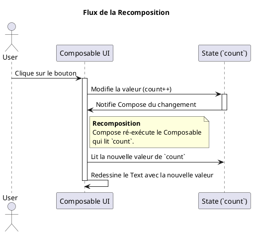

# Module 18 : Jetpack Compose - Le Futur de l'UI sur Android

### Objectifs pédagogiques

À la fin de ce module, vous serez capable de :

* Expliquer la différence fondamentale entre une approche UI **impérative** (XML/Vues) et **déclarative** (Compose).
* Comprendre les trois concepts clés de Compose : Les fonctions `@Composable`, la gestion de l'état (`State`), et la *
  *recomposition**.
* Créer des composants UI simples en utilisant les Composables de base (`Text`, `Button`, `Column`, `Row`).
* Gérer l'état d'un composant pour le rendre interactif.
* Comprendre comment Jetpack Compose s'intègre avec l'architecture MVVM que vous avez apprise.

### Introduction

Imaginez que vous demandez à un artiste de peindre un portrait.
L'approche **impérative** (celle que nous avons utilisée avec XML) consiste à lui donner des instructions pas à pas : "
Prends un pinceau. Trempe-le dans la peinture rouge. Dessine un cercle à ces coordonnées précises. Maintenant, change de
pinceau, prends du bleu, dessine les yeux... Ah, le modèle a souri ! Maintenant, prends une gomme, efface la bouche, et
redessine-la avec un sourire." Vous devez gérer manuellement chaque changement.

L'approche **déclarative** de **Jetpack Compose**, c'est complètement différent. Vous ne donnez plus d'ordres. Vous
décrivez le résultat final que vous souhaitez. Vous dites à l'artiste : "Je veux un portrait d'une personne qui est
actuellement en train de sourire." Si l'état de la personne change (elle cesse de sourire), vous ne lui dites pas
comment effacer et redessiner. Vous lui dites simplement : "Maintenant, je veux un portrait d'une personne qui a une
expression neutre." L'artiste sait comment, de la manière la plus efficace possible, transformer l'ancien portrait en
nouveau.

Jetpack Compose est ce nouvel artiste intelligent. Vous décrivez votre UI en fonction d'un état, et quand l'état change,
Compose se charge de mettre à jour l'interface de la manière la plus optimale possible. C'est un changement de paradigme
qui rend la construction d'UI plus simple, plus rapide et moins sujette aux erreurs.

### Notions abordées

* Paradgime Impératif vs. Déclaratif
* Les Piliers de Compose : `@Composable`, `State`, et Recomposition
* Les Composants de base et les Layouts
* Intégration avec l'Architecture MVVM

---

### Paradigme Impératif vs. Déclaratif

#### Introduction à la notion

C'est le concept le plus fondamental à saisir. C'est la différence entre le "Comment" et le "Quoi". Le système de Vues
XML est focalisé sur le "Comment", Compose est focalisé sur le "Quoi".

#### Explication de la notion

**Approche Impérative (XML + Vues Android)**

* **Principe :** Vous manipulez manuellement les widgets. Vous êtes responsable de leur création, de leur recherche (
  `findViewById`, View Binding) et de leur mise à jour.
* **Exemple :** "Trouve le `TextView` avec l'ID `welcomeText`. Appelle sa méthode `setText()` avec la nouvelle valeur."
* **Flux de travail :**
    1. On définit un layout statique en XML.
    2. On "gonfle" ce layout en objets `View`.
    3. On garde des références à ces objets.
    4. Quand un événement se produit, on appelle des méthodes (`setText`, `setVisibility`, etc.) sur ces objets pour
       muter leur état interne.

**Approche Déclarative (Jetpack Compose)**

* **Principe :** Vous décrivez à quoi votre UI doit ressembler **pour un état donné**. Vous ne manipulez plus les
  widgets directement.
* **Exemple :** "Je déclare qu'il doit y avoir un `Text` dont le contenu est la valeur actuelle de la variable
  `username`."
* **Flux de travail :**
    1. On crée des fonctions qui décrivent des morceaux d'UI.
    2. Ces fonctions prennent un **état** en paramètre.
    3. Quand l'état change, le framework **re-exécute** la fonction avec le nouvel état et met à jour l'UI pour qu'elle
       corresponde à la nouvelle description.

C'est un passage d'un contrôle manuel à une transformation de données en UI.

---

### Les Piliers de Compose

#### Introduction à la notion {id="introduction-la-notion_1"}

Pour que cette magie déclarative opère, Compose repose sur un trio inséparable :

1. **Les fonctions `@Composable` :** Ce sont les briques de construction. Chaque fonction est un plan pour un morceau
   d'UI.
2. **L'État (`State`) :** C'est le carburant. C'est n'importe quelle valeur qui peut changer dans le temps et qui doit
   affecter l'UI.
3. **La Recomposition :** C'est le moteur. C'est le processus par lequel Compose redessine intelligemment les parties de
   l'UI qui ont été affectées par un changement d'état.

#### Explication de la notion {id="explication-de-la-notion_1"}

**1. Fonctions `@Composable`**
Toute fonction qui émet de l'UI dans Compose doit être annotée avec `@Composable`.

* Elles décrivent une partie de l'UI. Elles ne retournent rien.
* Elles peuvent appeler d'autres fonctions `@Composable` pour créer une hiérarchie.
* Elles doivent être rapides et sans "effets de bord" (ne pas modifier de variables globales, par exemple), car elles
  peuvent être appelées très fréquemment (à chaque frame pendant une animation).

```kotlin
@Composable
fun Greeting(name: String) {
    Text(text = "Hello, $name!")
}
```

**2. L'État (`State`) et `remember`**
Pour qu'un changement de valeur déclenche une mise à jour de l'UI, cette valeur doit être "observée" par Compose. On
utilise pour cela `mutableStateOf`.

* `mutableStateOf(valeurInitiale)` crée un objet `State` observable.
* Pour lire sa valeur, on utilise `.value`.

Mais si la fonction `@Composable` est ré-exécutée, comment l'état ne revient-il pas à sa valeur initiale ? C'est le rôle
de `remember`.

* `remember { mutableStateOf(...) }` dit à Compose : "Crée cet état la première fois, mais lors des recompositions
  suivantes, **souviens-toi** de sa dernière valeur."

```kotlin
@Composable
fun Counter() {
    // `count` est l'état. `remember` le préserve lors des recompositions.
    var count by remember { mutableStateOf(0) } // `by` est un délégué qui simplifie l'accès à .value

    Button(onClick = { count++ }) { // La modification de `count` va déclencher la recomposition
        Text("You clicked $count times")
    }
}
```

**3. La Recomposition**
C'est le processus de ré-appeler les fonctions `@Composable` lorsque leur état d'entrée a changé.

* **Intelligente et ciblée :** Compose est très malin. Il ne ré-exécute que les Composables qui lisent l'état qui a
  changé, et pas toute l'interface. C'est ce qui le rend performant.
* **Déclenchée par les lectures d'état :** C'est lorsque vous lisez la valeur d'un `State` (`count` dans l'exemple) que
  Compose sait que ce Composable dépend de cet état et devra être recomposé s'il change.



---

### Les Composants de base et les Layouts

#### Introduction à la notion {id="introduction-la-notion_2"}

Compose fournit un ensemble de briques de construction (`@Composable`) prêtes à l'emploi, tout comme le système de Vues
avait ses widgets. Et tout comme nous avions `LinearLayout` et `ConstraintLayout`, Compose a ses propres Composables
pour agencer les éléments.

#### Explication de la notion {id="explication-de-la-notion_2"}

**Composants de base :**

* `Text(text = "...")` : Affiche du texte.
* `Button(onClick = { ... }) { Text("Click Me") }` : Un bouton. Notez que le contenu du bouton est lui-même un
  Composable.
* `TextField(value = ..., onValueChange = { ... })` : Un champ de saisie.
* `Image(painter = ..., contentDescription = ...)` : Affiche une image.

**Layouts (agencement) :**

* `Column { ... }` : Aligne ses enfants verticalement (équivalent de `LinearLayout` vertical).
* `Row { ... }` : Aligne ses enfants horizontalement (équivalent de `LinearLayout` horizontal).
* `Box { ... }` : Empile ses enfants les uns sur les autres (équivalent de `FrameLayout`).
* `ConstraintLayout { ... }` : Une version Compose du puissant `ConstraintLayout`, pour des agencements complexes.

Les **`Modifiers`** sont des outils extrêmement puissants pour décorer et configurer les Composables. Ils sont passés en
paramètre.

```kotlin
@Composable
fun StyledText() {
    Text(
        text = "Hello, Compose!",
        modifier = Modifier
            .padding(16.dp) // Marge extérieure
            .background(Color.Blue) // Fond
            .clickable { /* Fait quelque chose */ } // Rend le texte cliquable
    )
}
```

#### Exercice 1 : Créer une carte de profil simple

**Énoncé :**
Créez un Composable `@Composable fun ProfileCard()` qui affiche une carte de profil avec une image (utilisez une icône
par défaut), un nom et un statut. Le nom et le statut doivent être alignés verticalement. Le tout doit être aligné
horizontalement.

#### **Correction exercice 1** {collapsible='true'}

```kotlin
import androidx.compose.foundation.Image
import androidx.compose.foundation.layout.*
import androidx.compose.material.icons.Icons
import androidx.compose.material.icons.filled.Person
import androidx.compose.material3.Text
import androidx.compose.runtime.Composable
import androidx.compose.ui.Alignment
import androidx.compose.ui.Modifier
import androidx.compose.ui.graphics.Color
import androidx.compose.ui.text.font.FontWeight
import androidx.compose.ui.unit.dp
import androidx.compose.ui.unit.sp

@Composable
fun ProfileCard() {
    // Row pour aligner les éléments horizontalement
    Row(
        modifier = Modifier
            .padding(16.dp)
            .fillMaxWidth(), // Prend toute la largeur
        verticalAlignment = Alignment.CenterVertically // Centre les enfants verticalement
    ) {
        // Image de profil
        Image(
            painter = Icons.Default.Person, // Icône par défaut
            contentDescription = "Avatar de profil",
            modifier = Modifier.size(64.dp)
        )

        // Espace entre l'image et le texte
        Spacer(modifier = Modifier.width(16.dp))

        // Column pour aligner le nom et le statut verticalement
        Column {
            Text(
                text = "Alice Dubois",
                fontWeight = FontWeight.Bold,
                fontSize = 20.sp
            )
            Text(
                text = "En ligne",
                color = Color.Gray
            )
        }
    }
}
```

---

### Intégration avec l'Architecture MVVM

#### Introduction à la notion {id="introduction-la-notion_3"}

La bonne nouvelle, c'est que tout ce que vous avez appris sur MVVM s'applique **parfaitement** à Jetpack Compose. En
fait, c'est encore plus naturel. L'état qui déclenche la recomposition de votre UI Compose viendra directement de votre
`ViewModel`.

#### Explication de la notion {id="explication-de-la-notion_3"}

Le flux de données reste exactement le même :

1. La **View** (votre Composable) observe un état exposé par le `ViewModel`.
2. La **View** notifie le `ViewModel` des actions de l'utilisateur.
3. Le **ViewModel** traite l'action, demande des données au **Repository** si besoin.
4. Le **ViewModel** met à jour son état.
5. Le changement d'état est automatiquement collecté par la View, ce qui déclenche une **recomposition**.

Le `StateFlow` est particulièrement bien adapté pour être utilisé comme source de vérité dans le `ViewModel`. On le
collecte dans la couche UI avec une fonction utilitaire `collectAsStateWithLifecycle()`.

#### Exemple : Un écran de profil réactif avec ViewModel

**1. Le `ProfileViewModel.kt`**

```kotlin
data class ProfileUiState(
    val name: String = "Chargement...",
    val status: String = ""
)

@HiltViewModel
class ProfileViewModel @Inject constructor(
    private val userRepository: UserRepository
) : ViewModel() {

    private val _uiState = MutableStateFlow(ProfileUiState())
    val uiState: StateFlow<ProfileUiState> = _uiState.asStateFlow()

    fun loadProfile() {
        viewModelScope.launch {
            val user = userRepository.getProfile() // Fonction suspend
            _uiState.value = ProfileUiState(name = user.name, status = "En ligne")
        }
    }
}
```

**2. Le Composable `ProfileScreen.kt` (la View)**

```kotlin
import androidx.compose.runtime.Composable
import androidx.compose.runtime.getValue
import androidx.hilt.navigation.compose.hiltViewModel
import androidx.lifecycle.compose.collectAsStateWithLifecycle

@Composable
fun ProfileScreen(
    viewModel: ProfileViewModel = hiltViewModel() // Injection du ViewModel
) {
    // `uiState` est un objet State. À chaque changement de uiState dans le ViewModel,
    // ce composable sera recomposé avec la nouvelle valeur.
    val uiState by viewModel.uiState.collectAsStateWithLifecycle()

    // On passe l'état en paramètre au composable qui fait l'affichage
    ProfileCard(name = uiState.name, status = uiState.status)
}

@Composable
fun ProfileCard(name: String, status: String) {
    // ... layout comme dans l'exercice, mais avec les paramètres `name` et `status`
}
```

Ce découplage est parfait. Le `ProfileCard` est un composant "stupide" qui ne fait qu'afficher ce qu'on lui donne. Le
`ProfileScreen` connecte l'état du `ViewModel` à l'UI. La logique reste dans le `ViewModel`.

---

## TP 18 : Refactoriser le compteur en Jetpack Compose

**Objectif :** Recréer notre application de compteur en utilisant Jetpack Compose et une architecture MVVM avec un
`ViewModel`.

<procedure>

1. **Créez un nouveau projet** en choisissant le template **"Empty Activity" (avec un logo Compose)**. Cela configure
   tout pour Compose.
2. **Créez un `CounterViewModel` :**
    * Il doit contenir un `StateFlow` pour le compteur : `private val _count = MutableStateFlow(0)`.
    * Exposez-le en lecture seule : `val count: StateFlow<Int> = _count.asStateFlow()`.
    * Créez une fonction `increment()` qui met à jour la valeur de `_count`.
3. **Dans `MainActivity.kt`, supprimez le code par défaut et créez votre UI :**
    * Instanciez le ViewModel : `val viewModel: CounterViewModel = viewModel()`.
    * Créez un Composable `@Composable fun CounterScreen(viewModel: CounterViewModel)`.
    * Dans `CounterScreen`, collectez l'état : `val count by viewModel.count.collectAsStateWithLifecycle()`.
    * Appelez un autre Composable, `CounterContent(count = count, onIncrement = { viewModel.increment() })`.
4. **Créez le Composable `CounterContent` :**
    * Il prend en paramètre `count: Int` et `onIncrement: () -> Unit`.
    * Utilisez un `Column` pour centrer un `Text` et un `Button`.
    * Le `Text` affiche la valeur de `count`.
    * Le `onClick` du `Button` appelle la lambda `onIncrement`.
5. **Assemblez le tout dans `setContent` dans votre `MainActivity` :**
   ```kotlin
   class MainActivity : ComponentActivity() {
       override fun onCreate(savedInstanceState: Bundle?) {
           super.onCreate(savedInstanceState)
           setContent {
               MyAppTheme {
                   CounterScreen(viewModel = viewModel())
               }
           }
       }
   }
   ```
6. **Testez :** L'application doit afficher le compteur, l'incrémenter au clic, et **conserver son état lors de la
   rotation de l'écran** car l'état est dans le `ViewModel` !

</procedure>

## Correction du TP 18 {collapsible="true"}

### Étape 1 : Création et Configuration du Projet

1.  Ouvrez Android Studio.
2.  Cliquez sur "New Project".
3.  Dans la section "Phone and Tablet", sélectionnez le template **"Empty Activity"** (celui avec le petit logo bleu de Jetpack Compose).
4.  Nommez votre projet (par exemple, `ComposeCounterApp`) et cliquez sur "Finish".

Android Studio va créer un projet avec toutes les dépendances nécessaires pour Compose. Vous aurez déjà un `MainActivity.kt` avec du code d'exemple.

#### Dépendances supplémentaires

Pour utiliser `viewModel()` et `collectAsStateWithLifecycle()`, assurez-vous que ces dépendances sont bien dans votre fichier `build.gradle.kts` (module). Normalement, le template les inclut, mais c'est bien de vérifier.

```kotlin
dependencies {
    // ... autres dépendances
    
    // ViewModel
    implementation("androidx.lifecycle:lifecycle-viewmodel-compose:2.7.0")
    // Pour lier le cycle de vie à la collecte des StateFlows
    implementation("androidx.lifecycle:lifecycle-runtime-compose:2.7.0")
}
```

---

### Étape 2 : Créer le `CounterViewModel`

Créez un nouveau fichier Kotlin nommé `CounterViewModel.kt`.

```kotlin
package com.example.composecounterapp // Adaptez votre package

import androidx.lifecycle.ViewModel
import kotlinx.coroutines.flow.MutableStateFlow
import kotlinx.coroutines.flow.StateFlow
import kotlinx.coroutines.flow.asStateFlow
import kotlinx.coroutines.flow.update

/**
 * Le ViewModel détient et gère l'état de l'UI (le compteur).
 * Il survit aux changements de configuration, comme la rotation de l'écran.
 */
class CounterViewModel : ViewModel() {

    // 1. _count est le StateFlow privé et mutable. C'est la source de vérité.
    //    Il ne doit être modifié qu'à l'intérieur du ViewModel.
    private val _count = MutableStateFlow(0)

    // 2. count est la version publique et en lecture seule (StateFlow) de _count.
    //    L'UI va s'abonner à ce Flow pour recevoir les mises à jour.
    val count: StateFlow<Int> = _count.asStateFlow()

    /**
     * La seule fonction qui modifie l'état.
     * C'est une action que l'UI peut déclencher.
     */
    fun increment() {
        // La méthode .update() est une manière sûre (thread-safe)
        // de mettre à jour la valeur d'un MutableStateFlow.
        _count.update { currentValue ->
            currentValue + 1
        }
    }
}
```

---

### Étape 3, 4 et 5 : Créer l'UI dans `MainActivity.kt`

Ouvrez `MainActivity.kt` et remplacez tout son contenu par ce qui suit. Nous allons créer trois fonctions composables pour bien séparer les responsabilités.

```kotlin
package com.example.composecounterapp

import android.os.Bundle
import androidx.activity.ComponentActivity
import androidx.activity.compose.setContent
import androidx.compose.foundation.layout.Arrangement
import androidx.compose.foundation.layout.Column
import androidx.compose.foundation.layout.Spacer
import androidx.compose.foundation.layout.fillMaxSize
import androidx.compose.foundation.layout.height
import androidx.compose.material3.Button
import androidx.compose.material3.MaterialTheme
import androidx.compose.material3.Surface
import androidx.compose.material3.Text
import androidx.compose.runtime.Composable
import androidx.compose.runtime.getValue
import androidx.compose.ui.Alignment
import androidx.compose.ui.Modifier
import androidx.compose.ui.text.TextStyle
import androidx.compose.ui.tooling.preview.Preview
import androidx.compose.ui.unit.dp
import androidx.compose.ui.unit.sp
import androidx.lifecycle.compose.collectAsStateWithLifecycle
import androidx.lifecycle.viewmodel.compose.viewModel
import com.example.composecounterapp.ui.theme.ComposeCounterAppTheme

class MainActivity : ComponentActivity() {
    override fun onCreate(savedInstanceState: Bundle?) {
        super.onCreate(savedInstanceState)
        setContent {
            // Le thème de l'application (généré par le template)
            ComposeCounterAppTheme {
                // Surface est un conteneur de base de Material Design
                Surface(
                    modifier = Modifier.fillMaxSize(),
                    color = MaterialTheme.colorScheme.background
                ) {
                    // On appelle notre écran principal
                    CounterScreen()
                }
            }
        }
    }
}

/**
 * Composable "intelligent" (stateful).
 * Il connaît le ViewModel et est responsable de la gestion de l'état.
 */
@Composable
fun CounterScreen(
    // viewModel() est la fonction magique qui fournit une instance
    // du ViewModel liée au cycle de vie approprié (Activity, Fragment...).
    viewModel: CounterViewModel = viewModel()
) {
    // On collecte la valeur du StateFlow.
    // `collectAsStateWithLifecycle` est la manière recommandée de le faire.
    // `by` est un délégué qui déballe la valeur de `State<Int>` en `Int`.
    // À chaque fois que le StateFlow émet une nouvelle valeur, ce Composable sera recomposé.
    val count by viewModel.count.collectAsStateWithLifecycle()

    // On passe l'état et les événements au composable "bête" (stateless).
    CounterContent(
        count = count,
        onIncrement = { viewModel.increment() }
    )
}

/**
 * Composable "bête" (stateless).
 * Il ne fait qu'afficher des données et remonter des événements.
 * Il est facile à prévisualiser et à réutiliser car il n'a pas de logique d'état.
 */
@Composable
fun CounterContent(
    count: Int,
    onIncrement: () -> Unit,
    modifier: Modifier = Modifier // Toujours passer un Modifier
) {
    Column(
        modifier = modifier.fillMaxSize(),
        verticalArrangement = Arrangement.Center,
        horizontalAlignment = Alignment.CenterHorizontally
    ) {
        Text(
            text = "Le compteur est à :",
            style = MaterialTheme.typography.headlineSmall
        )
        Spacer(modifier = Modifier.height(16.dp))
        Text(
            text = "$count",
            style = TextStyle(fontSize = 48.sp)
        )
        Spacer(modifier = Modifier.height(32.dp))
        Button(onClick = onIncrement) {
            Text(text = "Incrémenter")
        }
    }
}

/**
 * Le Preview permet de voir à quoi ressemble notre UI directement dans Android Studio
 * sans avoir à lancer l'application.
 */
@Preview(showBackground = true)
@Composable
fun CounterContentPreview() {
    ComposeCounterAppTheme {
        // On peut tester CounterContent avec n'importe quelle valeur.
        CounterContent(count = 5, onIncrement = {})
    }
}
```

---

### Étape 6 : Test

1.  **Lancez l'application** sur un émulateur ou un appareil physique.
2.  Vous devriez voir "Le compteur est à : 0".
3.  **Cliquez sur le bouton "Incrémenter"**. Le compteur passe à 1, 2, 3...
4.  **Activez la rotation automatique** sur votre appareil/émulateur et faites pivoter l'écran.
5.  **Résultat :** L'écran se redessine en mode paysage, mais le compteur **conserve sa valeur** (par exemple, 3). Si vous n'aviez pas utilisé de `ViewModel`, le compteur serait revenu à 0.

### Explications des Concepts Clés

*   **`viewModel()`** : C'est un composable fourni par la bibliothèque `lifecycle-viewmodel-compose`. Il trouve ou crée une instance de votre `ViewModel` et la lie intelligemment au cycle de vie du propriétaire actuel (ici, l'`Activity`). C'est lui qui garantit que la même instance de `ViewModel` survit à la rotation.

*   **`collectAsStateWithLifecycle()`** : C'est LA manière recommandée de collecter un `Flow` dans Compose.
    *   Il convertit le `StateFlow<Int>` en un `State<Int>` que Compose sait observer.
    *   Il est conscient du cycle de vie : il ne collecte les valeurs que lorsque l'UI est visible à l'écran (`ON_START`) et arrête la collecte quand elle ne l'est plus (`ON_STOP`), ce qui économise des ressources.

*   **Flux de Données Unidirectionnel (Unidirectional Data Flow - UDF) :** C'est le patron d'architecture que nous avons mis en place.
    *   **L'état descend :** Le `ViewModel` envoie l'état (`count`) vers le bas, jusqu'au `Text` qui l'affiche.
    *   **Les événements remontent :** L'utilisateur clique sur le `Button`, ce qui déclenche un événement (`onIncrement`) qui remonte jusqu'au `ViewModel` pour qu'il mette à jour l'état.

*   **Composable Stateful vs Stateless :**
    *   **`CounterScreen` est *stateful*** : Il est conscient de l'état (il se connecte au `ViewModel`).
    *   **`CounterContent` est *stateless*** : Il est "bête". Il reçoit simplement des données et remonte des clics. Il est donc très facile à tester, à prévisualiser (`@Preview`) et à réutiliser ailleurs dans l'application. C'est une excellente pratique de séparer les deux.


---

## Auto-évaluation

**1. Quelle est la différence fondamentale entre une approche UI impérative et déclarative ? (QCM)**

* A) Impérative utilise XML, déclarative utilise Kotlin.
* B) Impérative se concentre sur le "comment" modifier l'UI, déclarative sur le "quoi" afficher pour un état donné.
* C) Déclarative est plus rapide à compiler.
* D) Impérative ne peut pas gérer d'état.

**2. Quel est le rôle de la fonction `remember` dans Jetpack Compose ? (QCM)**

* A) Mettre en cache des images pour améliorer les performances.
* B) Se souvenir de la dernière action de l'utilisateur.
* C) Préserver la valeur d'un état à travers les recompositions d'un Composable.
* D) S'abonner aux changements d'un `LiveData`.

**3. Lequel de ces Composables utiliseriez-vous pour aligner trois boutons l'un à côté de l'autre horizontalement ? (
QCM)**

* A) `Column`
* B) `Box`
* C) `ConstraintLayout`
* D) `Row`

**4. Expliquez le concept de "recomposition" et pourquoi il est important qu'elle soit ciblée. (Question ouverte)**

**5. Comment le `StateFlow` du ViewModel et `collectAsStateWithLifecycle` dans le Composable travaillent-ils ensemble
pour créer une UI réactive ? (Question ouverte)**

### Correction de l'auto-évaluation {collapsible="true"}

**1. Différence entre impératif et déclaratif ?**

* **Réponse : B) Impérative se concentre sur le "comment" modifier l'UI, déclarative sur le "quoi" afficher pour un état
  donné.**
* **Justification :** C'est le changement de paradigme central. On ne donne plus d'ordres de modification, on décrit le
  résultat souhaité en fonction des données.

**2. Quel est le rôle de `remember` ?**

* **Réponse : C) Préserver la valeur d'un état à travers les recompositions d'un Composable.**
* **Justification :** Sans `remember`, toute variable locale à un Composable serait réinitialisée à chaque
  recomposition. `remember` attache la valeur à l'emplacement du Composable dans l'arbre d'UI, lui permettant de "
  survivre".

**3. Lequel de ces Composables pour aligner horizontalement ?**

* **Réponse : D) `Row`**
* **Justification :** `Row` (rangée) est le Composable de layout spécifiquement conçu pour positionner ses enfants les
  uns après les autres sur l'axe horizontal.

**4. Expliquez la recomposition.**

* **Réponse type :** La recomposition est le processus par lequel Jetpack Compose ré-exécute les fonctions Composable
  dont les paramètres d'entrée (l'état) ont changé, afin de mettre à jour l'UI. Il est crucial qu'elle soit ciblée car
  si l'ensemble de l'écran était redessiné à chaque petit changement (comme taper une lettre dans un champ de texte),
  les performances seraient catastrophiques. Compose est capable de n'identifier et de ne recomposer que les plus petits
  Composables qui dépendent de l'état qui a changé, ce qui rend le processus extrêmement efficace.

**5. Comment `StateFlow` et `collectAsStateWithLifecycle` collaborent-ils ?**

* **Réponse type :** Le `StateFlow` dans le `ViewModel` agit comme la "source de vérité" de l'état. Quand sa valeur est
  mise à jour, il notifie ses collecteurs. Dans le Composable, `collectAsStateWithLifecycle` fait deux choses : 1) Il
  s'abonne (collecte) au `StateFlow` de manière consciente du cycle de vie, s'assurant de ne pas recevoir de mises à
  jour inutilement en arrière-plan. 2) Il convertit le flux de données en un objet `State` que Compose peut observer.
  Ainsi, chaque nouvelle valeur émise par le `StateFlow` est transformée en une nouvelle valeur pour l'objet `State`, ce
  qui déclenche automatiquement et de manière transparente la recomposition du Composable. C'est le pont parfait entre
  le monde MVVM et le monde déclaratif de Compose.

---

### Conclusion du module

Vous avez eu un aperçu du futur. Jetpack Compose change radicalement la façon dont nous construisons les interfaces sur
Android. En vous libérant de la gestion manuelle des vues, il vous permet de vous concentrer sur ce qui compte
vraiment : l'état de votre application et la logique qui le gouverne.

Votre connaissance de l'architecture MVVM, des coroutines et des flux de données comme `StateFlow` vous place dans une
position idéale pour adopter cette nouvelle technologie. C'est une compétence qui deviendra de plus en plus essentielle
dans les années à venir.