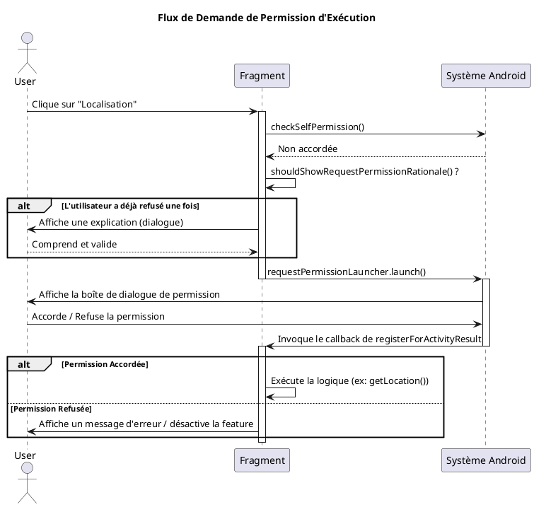

# Module 19 : Gestion des Permissions et Données Sensibles

### Objectifs pédagogiques

À la fin de ce module, vous serez capable de :

* Comprendre la différence entre les permissions d'installation et les permissions d'exécution (dangereuses).
* Déclarer les permissions nécessaires dans l'`AndroidManifest.xml`.
* Implémenter le flux standard de demande de permission d'exécution.
* Gérer les différents résultats de la demande (accordée, refusée, refusée définitivement).
* Utiliser les bonnes pratiques pour expliquer à l'utilisateur pourquoi une permission est nécessaire.

### Introduction

Imaginez que vous engagez un artisan pour faire des travaux chez vous. Pour des tâches simples comme peindre un mur, il
n'a pas besoin de vous demander la permission pour chaque coup de pinceau. C'est une **permission d'installation** : en
l'engageant, vous lui donnez implicitement le droit de faire son travail de base.

Mais s'il a besoin d'accéder à votre coffre-fort pour y ranger ses outils, il est impératif qu'il vous demande votre
autorisation explicite à ce moment précis. C'est une **permission d'exécution**. L'accès à des données sensibles (votre
position, vos contacts, votre appareil photo, vos fichiers) est exactement comme l'accès à ce coffre-fort. Android
impose un dialogue direct et transparent avec l'utilisateur. En tant que développeur, vous n'êtes plus seulement un
constructeur, vous êtes aussi le garant de la confiance de l'utilisateur. Bien gérer les permissions, c'est montrer que
votre application est respectueuse et digne de confiance.

### Notions abordées

* Types de Permissions : Installation vs. Exécution
* Le Flux de Demande de Permission en 3 Étapes
* Gérer les Réponses de l'Utilisateur
* Bonnes Pratiques et Expérience Utilisateur

---

### Types de Permissions

#### Introduction à la notion

Toutes les autorisations ne se valent pas. Android classe les permissions en fonction du risque qu'elles représentent
pour la vie privée de l'utilisateur. Certaines sont accordées automatiquement, d'autres nécessitent une action explicite
de l'utilisateur.

#### Explication de la notion

**1. Permissions d'Installation (Normal Permissions)**
Ces permissions sont considérées comme peu risquées. Elles sont accordées **automatiquement** par le système au moment
de l'installation de l'application. L'utilisateur n'a pas besoin de les approuver manuellement.

* **Exemples :**
    * `android.permission.INTERNET` (Accès au réseau)
    * `android.permission.VIBRATE` (Contrôler le vibreur)
    * `android.permission.SET_WALLPAPER` (Définir le fond d'écran)
* **Votre seule responsabilité :** Les déclarer dans le `AndroidManifest.xml`.

**2. Permissions d'Exécution (Dangerous Permissions)**
Ces permissions donnent accès à des données ou des ressources sensibles. Elles doivent être **demandées explicitement à
l'utilisateur pendant que l'application est en cours d'exécution**.

* **Exemples :**
    * `android.permission.ACCESS_FINE_LOCATION` (Localisation précise)
    * `android.permission.CAMERA` (Accès à l'appareil photo)
    * `android.permission.READ_CONTACTS` (Lire les contacts)
    * `android.permission.READ_EXTERNAL_STORAGE` / `READ_MEDIA_IMAGES` (Accéder aux fichiers/photos)
* **Votre responsabilité :**
    1. Déclarer la permission dans le manifest.
    2. Vérifier si la permission a déjà été accordée.
    3. Si non, demander la permission à l'utilisateur au moment où elle est nécessaire.
    4. Gérer la réponse de l'utilisateur.

---

### Le Flux de Demande de Permission

#### Introduction à la notion {id="introduction-la-notion_1"}

Demander une permission d'exécution, c'est comme engager une conversation formelle avec l'utilisateur. Il y a un
protocole à respecter :

1. **Vérifier le statut :** A-t-on déjà la permission ?
2. **Demander l'autorisation :** Si non, présenter la demande officielle via le système.
3. **Écouter la réponse :** Attendre la décision de l'utilisateur et agir en conséquence.

Android a modernisé ce processus avec les "Activity Result APIs", qui simplifient grandement la gestion de cette
conversation.

#### Explication de la notion {id="explication-de-la-notion_1"}

Le processus moderne repose sur `registerForActivityResult`. C'est un contrat que vous établissez avec le système.

**Étape 1 : Déclarer la permission dans `AndroidManifest.xml`**
C'est la première étape, indispensable.

```xml

<manifest ...>
<uses-permission android:name="android.permission.ACCESS_FINE_LOCATION"/>
        <!-- Pour la localisation en arrière-plan (plus complexe), il faut une autre permission -->

<application ...>
        ...
        </application>
        </manifest>
```

**Étape 2 : Enregistrer un "lanceur" de demande de permission**
Dans votre Fragment ou Activity, vous déclarez un "lanceur" qui sait comment demander une permission et quoi faire avec
le résultat. Cette déclaration doit se faire **au niveau de la classe**, avant `onCreate`.

```kotlin
import androidx.activity.result.contract.ActivityResultContracts
// ...

class MyFragment : Fragment() {

    // On enregistre un contrat pour demander UNE SEULE permission.
    // Le lambda sera exécuté quand l'utilisateur répondra à la boîte de dialogue.
    private val requestPermissionLauncher =
        registerForActivityResult(
            ActivityResultContracts.RequestPermission()
        ) { isGranted: Boolean ->
            if (isGranted) {
                // La permission a été accordée.
                // On peut maintenant exécuter la logique qui en dépend.
                getLocation()
            } else {
                // La permission a été refusée.
                // On doit gérer ce cas : afficher un message, désactiver la fonctionnalité...
                Toast.makeText(context, "Permission refusée", Toast.LENGTH_SHORT).show()
            }
        }
}
```

**Étape 3 : Vérifier et lancer la demande**
Au moment où vous avez besoin de la permission (par exemple, au clic sur un bouton "Trouver ma position"), vous exécutez
le flux.

```kotlin
import androidx.core.content.ContextCompat
import android.Manifest
// ...

// Dans le onClickListener d'un bouton, par exemple
private fun onButtonClicked() {
    when {
        // 1. Vérifier si on a DÉJÀ la permission
        ContextCompat.checkSelfPermission(
            requireContext(),
            Manifest.permission.ACCESS_FINE_LOCATION
        ) == PackageManager.PERMISSION_GRANTED -> {
            // La permission est déjà accordée, on exécute la logique.
            getLocation()
        }
        // 2. (Optionnel mais recommandé) Expliquer pourquoi on a besoin de la permission
        shouldShowRequestPermissionRationale(Manifest.permission.ACCESS_FINE_LOCATION) -> {
            // L'utilisateur a déjà refusé une fois. C'est le bon moment
            // pour afficher une boîte de dialogue expliquant l'intérêt de la fonctionnalité.
            showPermissionRationaleDialog()
        }
        // 3. Demander la permission
        else -> {
            // C'est la première fois, ou l'utilisateur a coché "Ne plus demander".
            // On lance la boîte de dialogue système.
            requestPermissionLauncher.launch(Manifest.permission.ACCESS_FINE_LOCATION)
        }
    }
}
```



---

### Gérer les Réponses de l'Utilisateur

#### Introduction à la notion {id="introduction-la-notion_2"}

La réponse de l'utilisateur n'est pas simplement "oui" ou "non". Il y a une nuance importante : le "non, et ne me le
redemandez plus jamais". Savoir distinguer un simple refus d'un refus définitif est crucial pour ne pas harceler l'
utilisateur et pour l'aider s'il change d'avis.

#### Explication de la notion {id="explication-de-la-notion_2"}

Il y a trois scénarios possibles après une demande :

1. **Permission Accordée (`isGranted == true`) :** Parfait ! Vous pouvez utiliser la fonctionnalité.
2. **Permission Refusée :** L'utilisateur a cliqué sur "Refuser". La prochaine fois que vous demanderez, la boîte de
   dialogue système apparaîtra à nouveau. La méthode `shouldShowRequestPermissionRationale()` renverra `true`, vous
   indiquant que c'est le bon moment pour donner des explications.
3. **Permission Refusée et "Ne plus demander" :** L'utilisateur a cliqué sur "Refuser" et a coché la case "Ne plus
   demander".
    * Votre callback recevra `isGranted == false`.
    * `shouldShowRequestPermissionRationale()` renverra désormais `false`.
    * Tout appel futur à `requestPermissionLauncher.launch()` ne fera **plus rien**. La boîte de dialogue système
      n'apparaîtra plus.
    * **Votre seule option** est alors d'afficher un message guidant l'utilisateur vers les **paramètres de
      l'application** pour qu'il puisse accorder la permission manuellement s'il le souhaite.

---

### Bonnes Pratiques et Expérience Utilisateur

* **Demandez au bon moment :** Ne demandez pas toutes les permissions au démarrage de l'application. Attendez que
  l'utilisateur essaie d'utiliser la fonctionnalité qui en a besoin. C'est le "just-in-time permission request".
* **Soyez transparent :** Utilisez `shouldShowRequestPermissionRationale` pour expliquer **clairement et simplement**
  pourquoi vous avez besoin de la permission et quel en est le bénéfice pour l'utilisateur.
* **Gérez le refus avec élégance :** Si l'utilisateur refuse, votre application doit continuer à fonctionner. Désactivez
  simplement la fonctionnalité correspondante. Ne bloquez pas l'application.
* **Guidez l'utilisateur :** En cas de refus définitif, fournissez un bouton ou un lien qui ouvre directement les
  paramètres de votre application pour lui faciliter la tâche s'il change d'avis.
  ```kotlin
  val intent = Intent(Settings.ACTION_APPLICATION_DETAILS_SETTINGS)
  val uri = Uri.fromParts("package", requireActivity().packageName, null)
  intent.data = uri
  startActivity(intent)
  ```

#### Exercice 1 : Demander la permission d'utiliser l'appareil photo

**Énoncé :**
Créez une application avec un bouton "Prendre une photo". Au clic, l'application doit demander la permission `CAMERA`.
Affichez un `Toast` différent selon que la permission est accordée ou refusée.

**Correction exercice 1** {collapsible='true'}

**1. `AndroidManifest.xml`**

```xml
<?xml version="1.0" encoding="utf-8"?>
<manifest xmlns:android="http://schemas.android.com/apk/res/android"
          xmlns:tools="http://schemas.android.com/tools">

    <!-- On déclare l'utilisation de la caméra et la permission -->
    <uses-feature android:name="android.hardware.camera" android:required="false"/>
    <uses-permission android:name="android.permission.CAMERA"/>

    <application
    ...>
</application>
        </manifest>
```

**2. `activity_main.xml`**

```xml

<FrameLayout xmlns:android="http://schemas.android.com/apk/res/android"
             android:layout_width="match_parent"
             android:layout_height="match_parent">
    <Button
            android:id="@+id/cameraButton"
            android:layout_width="wrap_content"
            android:layout_height="wrap_content"
            android:layout_gravity="center"
            android:text="Prendre une photo"/>
</FrameLayout>
```

**3. `MainActivity.kt`**

```kotlin
package fr.formation.permissions

import android.Manifest
import android.content.pm.PackageManager
import androidx.appcompat.app.AppCompatActivity
import android.os.Bundle
import android.widget.Toast
import androidx.activity.result.contract.ActivityResultContracts
import androidx.core.content.ContextCompat
import fr.formation.permissions.databinding.ActivityMainBinding

class MainActivity : AppCompatActivity() {

    private lateinit var binding: ActivityMainBinding

    // 1. Enregistrer le contrat et le callback
    private val requestCameraPermissionLauncher =
        registerForActivityResult(ActivityResultContracts.RequestPermission()) { isGranted ->
            if (isGranted) {
                Toast.makeText(this, "Permission Caméra accordée !", Toast.LENGTH_SHORT).show()
                // Ici, on pourrait lancer l'intention pour ouvrir la caméra
            } else {
                Toast.makeText(this, "Permission Caméra refusée.", Toast.LENGTH_SHORT).show()
            }
        }

    override fun onCreate(savedInstanceState: Bundle?) {
        super.onCreate(savedInstanceState)
        binding = ActivityMainBinding.inflate(layoutInflater)
        setContentView(binding.root)

        binding.cameraButton.setOnClickListener {
            checkCameraPermissionAndLaunch()
        }
    }

    private fun checkCameraPermissionAndLaunch() {
        when {
            // 2. Vérifier si la permission est déjà accordée
            ContextCompat.checkSelfPermission(
                this, Manifest.permission.CAMERA
            ) == PackageManager.PERMISSION_GRANTED -> {
                Toast.makeText(this, "Permission déjà accordée. Lancement...", Toast.LENGTH_SHORT).show()
                // Lancer la caméra ici
            }
            // 3. (Bonus) Gérer le cas où il faut une explication
            shouldShowRequestPermissionRationale(Manifest.permission.CAMERA) -> {
                // Afficher un dialogue explicatif...
                // Pour cet exercice, on va directement à la demande
                requestCameraPermissionLauncher.launch(Manifest.permission.CAMERA)
            }
            // 4. Demander la permission
            else -> {
                requestCameraPermissionLauncher.launch(Manifest.permission.CAMERA)
            }
        }
    }
}
```

---

### TP 19 : Application de Météo Basée sur la Localisation

**Objectif :** Créer une application qui, au clic sur un bouton "Météo locale", demande la permission de localisation.
Si elle est accordée, elle affiche un message "Récupération de la météo pour votre position". Si elle est refusée, elle
affiche un message invitant l'utilisateur à accorder la permission. Si elle est refusée définitivement, elle affiche un
message avec un bouton pour ouvrir les paramètres.

<procedure>

1. **Configurez le projet :**
    * Déclarez la permission `ACCESS_FINE_LOCATION` dans le manifest.
    * Créez un layout avec un `Button` et un `TextView` pour afficher le statut.
2. **Dans `MainActivity.kt`, déclarez votre `requestPermissionLauncher`** pour `ACCESS_FINE_LOCATION`.
3. **Implémentez la logique dans le callback du launcher :**
    * Si `isGranted` est `true`, mettez à jour le `TextView` avec "Récupération de la météo...".
    * Si `isGranted` est `false`, mettez à jour le `TextView` avec "Permission refusée. La météo locale est
      indisponible.".
4. **Implémentez la logique du clic sur le bouton :**
    * Vérifiez si la permission est déjà accordée. Si oui, mettez à jour le `TextView`.
    * Vérifiez `shouldShowRequestPermissionRationale()`. Si `true`, affichez une `AlertDialog` expliquant pourquoi la
      permission est utile, avec un bouton "OK" qui lance `requestPermissionLauncher`.
    * Sinon (demande pour la première fois ou refus définitif), lancez directement `requestPermissionLauncher`.
5. **(Bonus) Gérez le refus définitif :** Après un refus dans le callback, si `shouldShowRequestPermissionRationale()`
   renvoie `false`, cela signifie un refus définitif. Affichez un message différent, comme "Permission refusée
   définitivement. Vous pouvez l'activer dans les paramètres." et ajoutez un bouton pour ouvrir les paramètres de
   l'application.

</procedure>

---

### Conclusion du module

La gestion des permissions est une danse délicate entre la fonctionnalité de votre application et le respect de la vie
privée de l'utilisateur. Vous savez maintenant comment mener cette danse avec grâce et professionnalisme. En utilisant
le flux moderne des `ActivityResultContracts`, en demandant les permissions au bon moment et en expliquant clairement
vos intentions, vous construisez des applications qui ne sont pas seulement puissantes, mais aussi dignes de confiance.

C'est une compétence essentielle qui finalise votre profil de développeur Android complet et responsable, prêt à publier
des applications de haute qualité sur le Play Store.